# 格式化表图表标题

> 原文：<https://www.tutorialgateway.org/format-tableau-chart-title/>

在本文中，我们将向您展示如何用粒子示例格式化 Tableau 图表标题。为了在 Tableau 中演示这些格式选项，我们将使用之前创建的数据源。

从下面的截图中，您可以看到，我们通过将“国家/地区”维度拖到“列”货架、“销售额”维度拖到“行”货架以及将“国家/地区”维度拖到“颜色”货架来创建柱形图。请访问【报告中的数据标签】文章了解数据源。

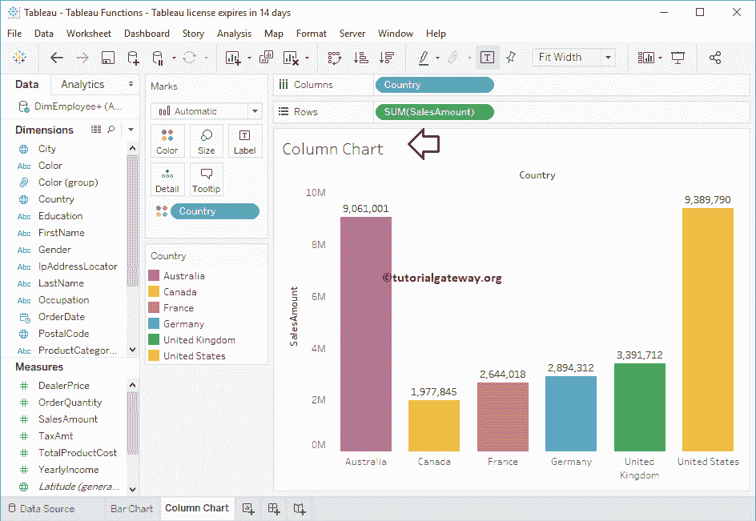

## 格式化表图表标题

要格式化 Tableau 图表标题，右键单击报告标题会显示上下文菜单。请选择“编辑标题”选项来更改标题。

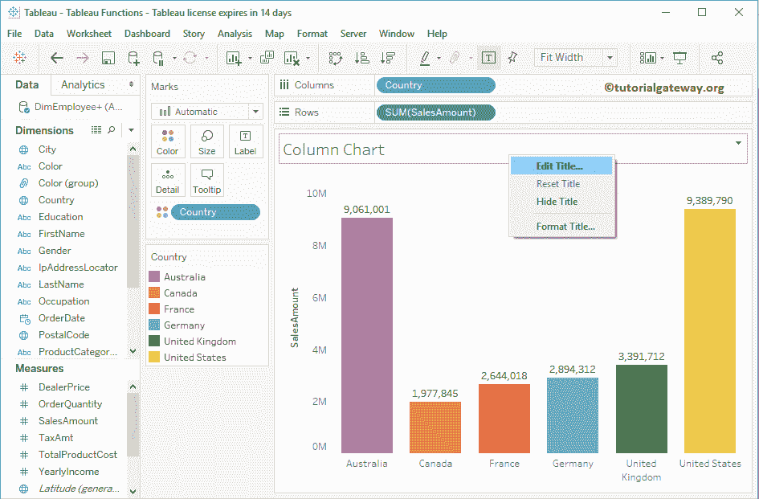

选择编辑标题选项将显示以下窗口。默认情况下，[表](https://www.tutorialgateway.org/tableau/)会将工作表名称显示为图表标题。

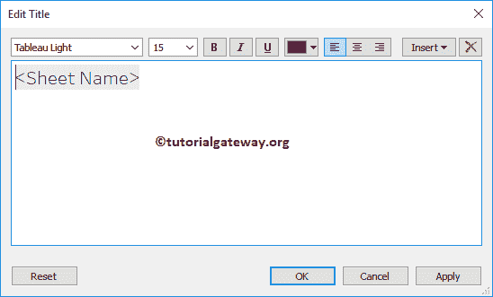

首先，我们将图表更改为欢迎来到 Tableau 教程

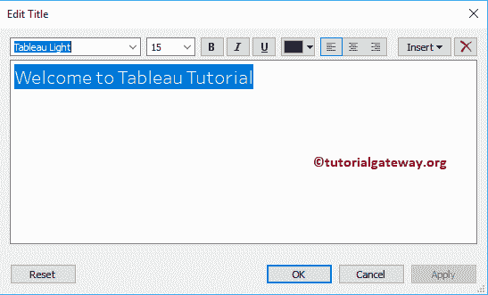

接下来，我们将字体样式改为 SimSum，字体大小改为 22，字体粗细改为粗体，文本对齐改为居中，字体颜色改为红色

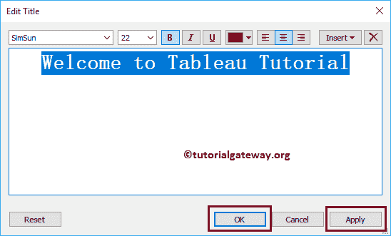

现在你可以看到格式化的 Tableau 图表标题，这是一个整洁干净的标题

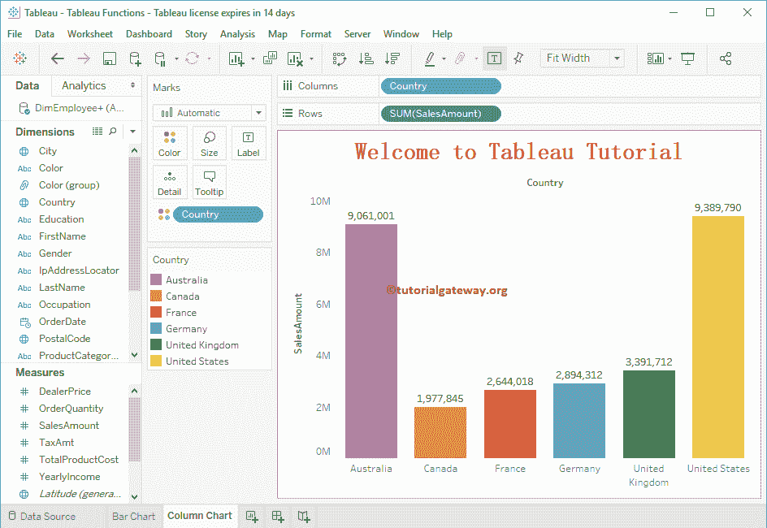

接下来，右键点击标题，这次选择【格式标题】选项

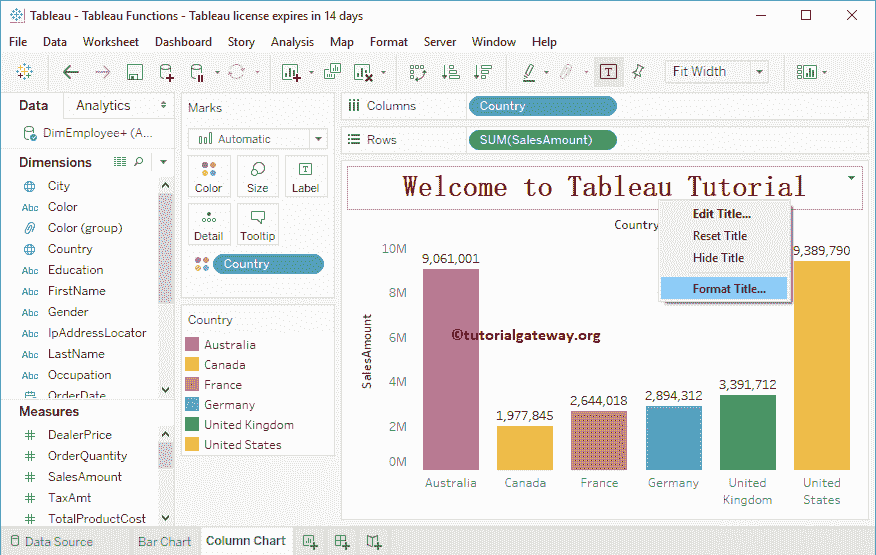

它将打开格式标题和标题窗口。

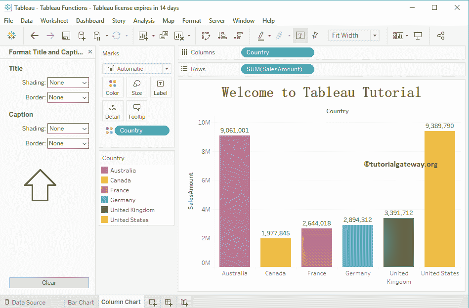

使用此窗口为标题添加背景颜色和边框样式，以及标题

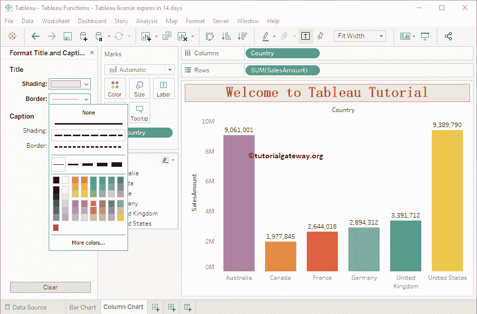

您也可以通过单击“格式”菜单，然后选择“标题和题注”子菜单来访问这些格式选项。

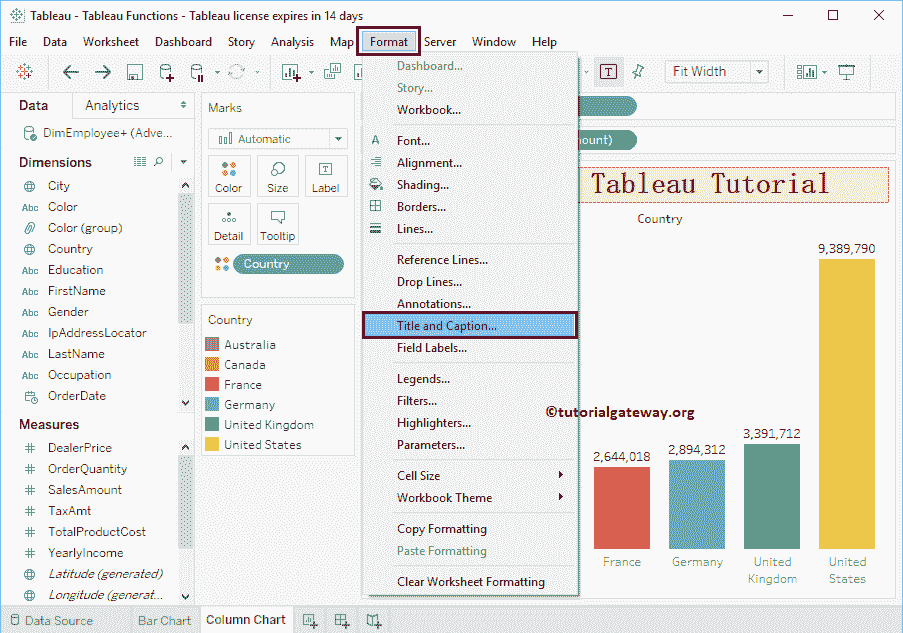

现在你可以看到格式化的图表标题

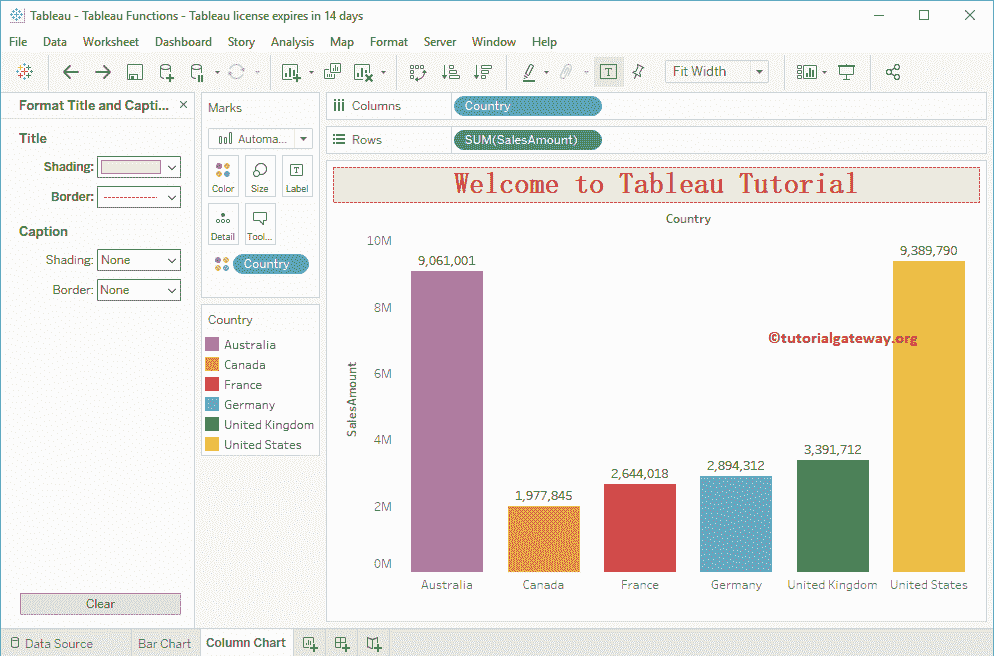