# 在 Tableau 中创建文件夹

> 原文：<https://www.tutorialgateway.org/create-folders-in-tableau/>

表中的文件夹可帮助您组织维度字段和度量字段。在本文中，我们将通过示例向您展示如何在 Tableau 报告中创建文件夹？。

在这个创建文件夹的演示中，我们使用了我们在上一篇文章中创建的数据源。请访问 Tableau 报告文章中的[数据标签了解数据源。](https://www.tutorialgateway.org/data-labels-in-tableau-reports/)

## 在表中创建文件夹

要在[表](https://www.tutorialgateway.org/tableau/)中创建文件夹，请选择并右键单击要为其创建文件夹的维度名称。接下来，从下拉菜单中选择文件夹选项，然后选择创建文件夹…选项

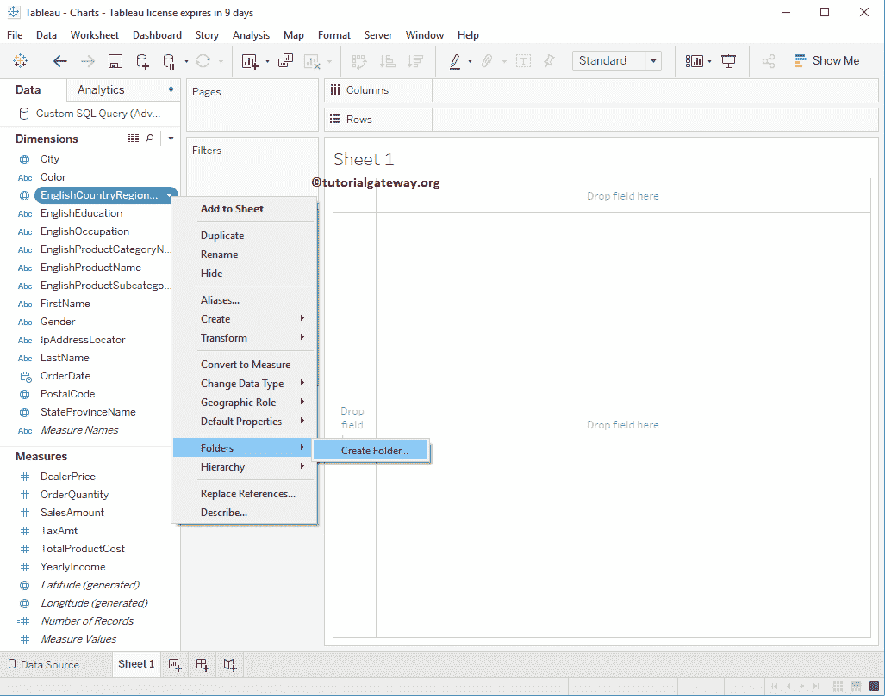

选择“创建文件夹...”选项后，将打开一个新的弹出窗口来命名文件夹。现在，我们将文件夹命名为国家，如下图所示

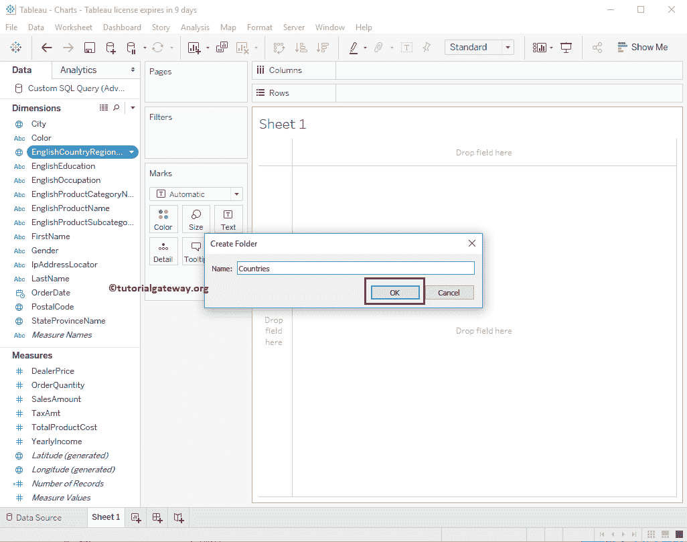

单击“确定”按钮后，您可以在表中看到新创建的带有英语国家/地区名称成员的文件夹。

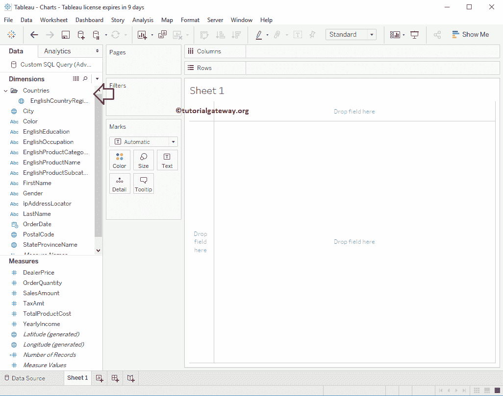

### 将成员添加到表中的文件夹

要向 Tableau 文件夹添加新成员，请将所需维度拖放到文件夹中。在本例中，我们将州省名称添加到国家文件夹

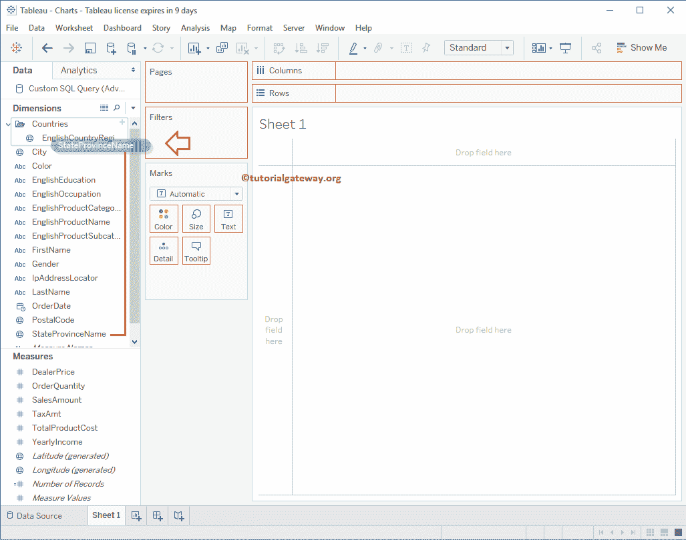

### 重命名表中的文件夹

要重命名文件夹，请右键单击现有文件夹，然后选择重命名..选项。

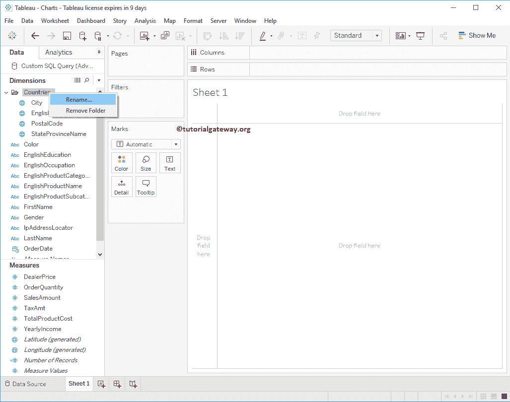

如您所见，我们将此文件夹重命名为国家列表

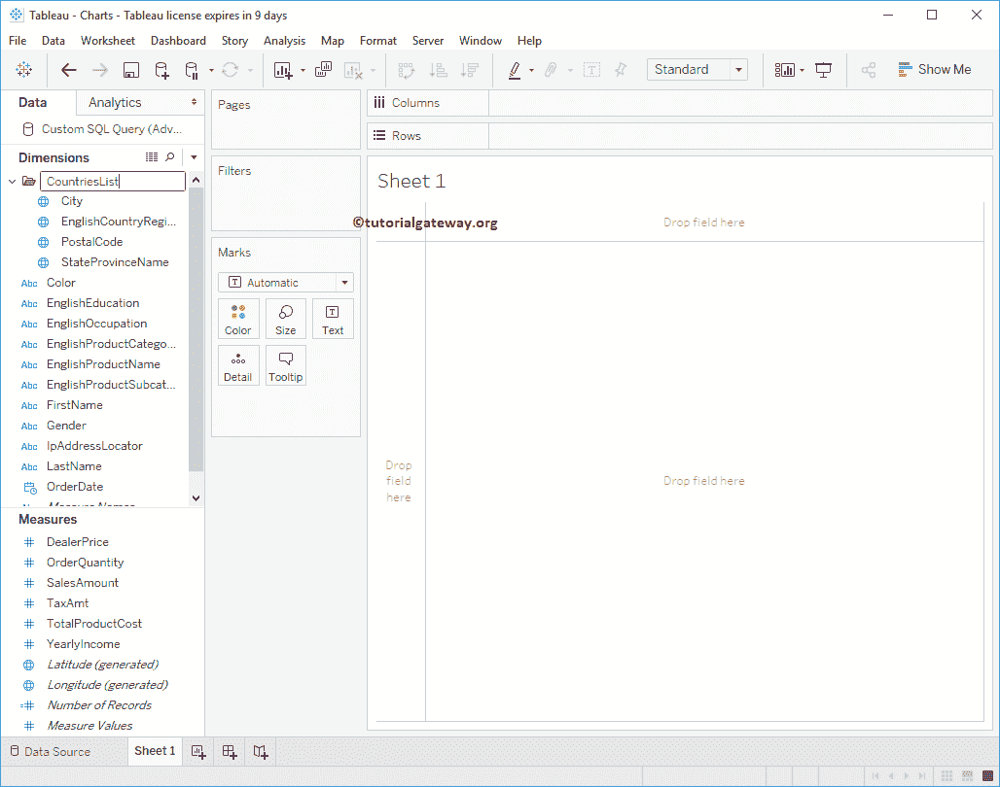

### 从表中的文件夹中删除成员

要从文件夹中删除成员，请将所需维度拖放到文件夹之外。

或者，首先，选择并右键单击维度名称。接下来，从下拉菜单中选择文件夹选项，然后选择从文件夹中删除选项。在这个例子中，我们从国家列表文件夹

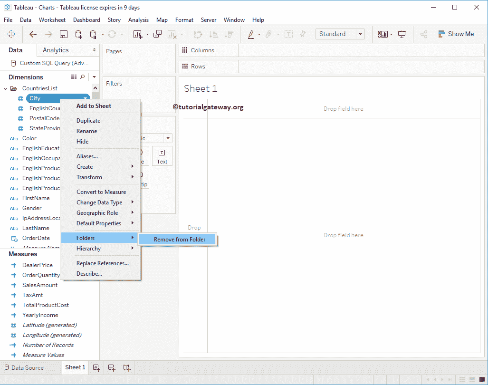

中删除城市

### 删除表中的文件夹

要删除文件夹，请右键单击现有文件夹，并从上下文菜单中选择“删除文件夹”选项。

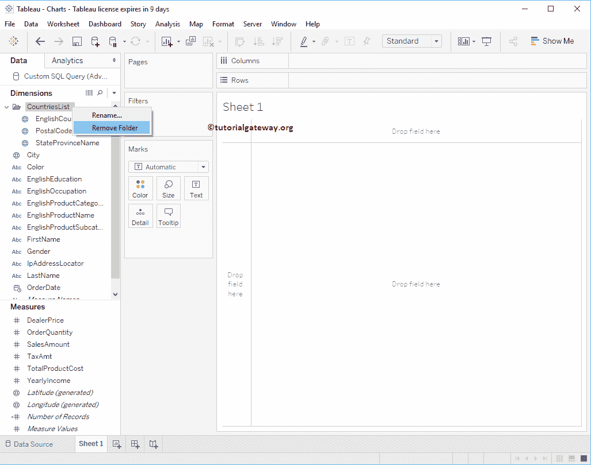

现在可以看到

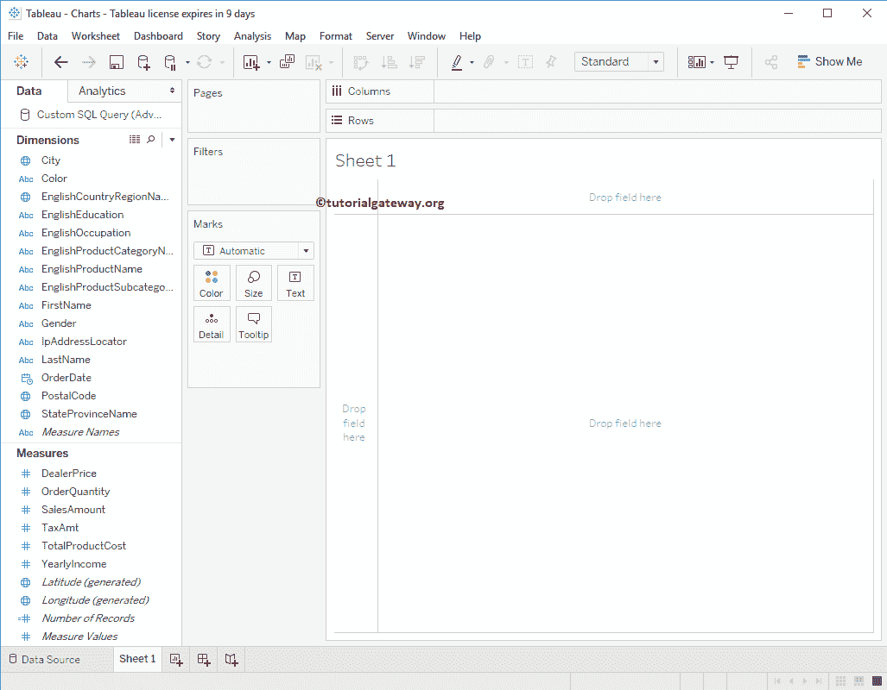

没有文件夹了

如果维度或度量架中有多个文件夹。如果你要给文件夹添加一个新项目，那么你必须选择正确的文件夹

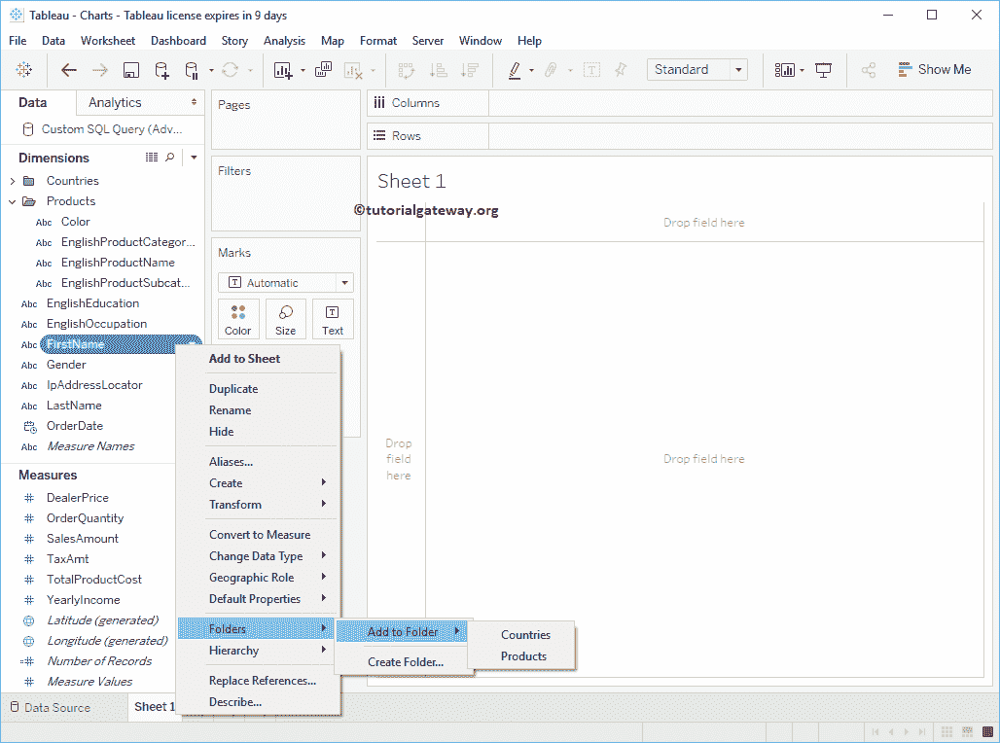

从下面的截图可以看到，我们创建了多个文件夹

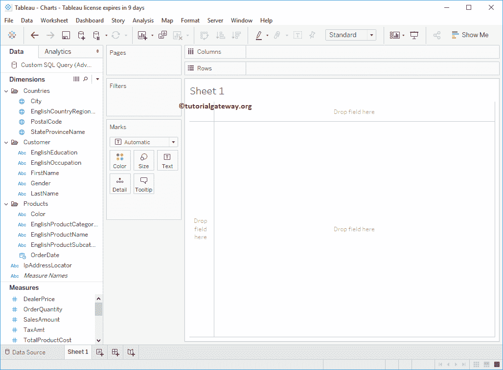