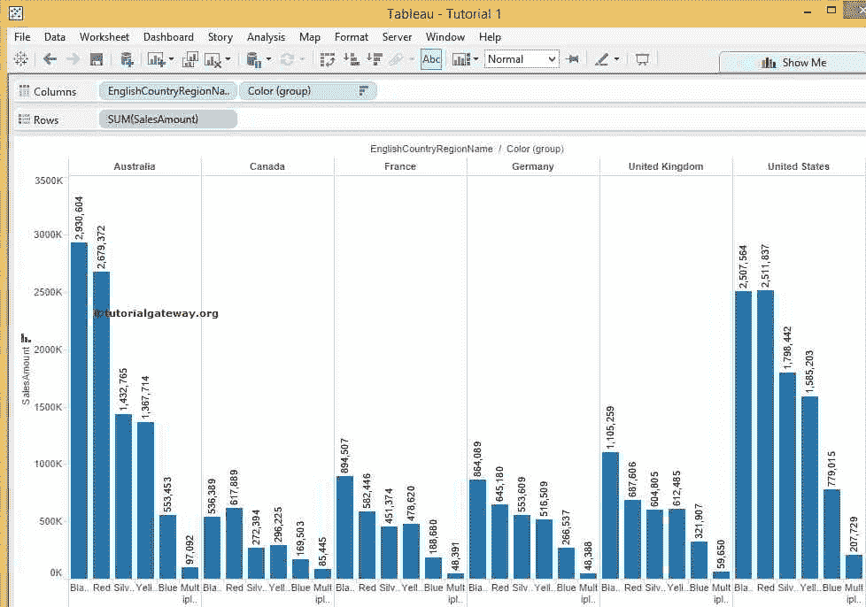

# 输出表格

> 原文：<https://www.tutorialgateway.org/tableau-sort/>

Tableau 排序是按升序或降序排列或排序数据的过程。一个 Tableau 排序的例子，当我们按地区展示产品报告时，如果我们以任何方式展示产品，这将是有帮助和实用的。

在本文中，我们将通过示例向您展示如何在 Tableau 报表中执行排序。对于这个 Tableau 排序演示，我们将使用我们在上一篇文章中创建的报告。

## 表格排序法

在 Tableau 中有多种执行排序的方法。从下面的截图中，您可以观察到，当您将鼠标悬停在销售额上时，会有一个小按钮显示在销售额附近。您可以在表格中使用此按钮，在表格中按升序或降序对销售额数据进行排序。现在，我们选择了升序。

单击该按钮后，颜色(组)数据将按其销售额按升序排序。访问表格报告中的[数据标签，了解](https://www.tutorialgateway.org/data-labels-in-tableau-reports/)[表格](https://www.tutorialgateway.org/tableau/)数据源。

## 表格排序方法 2

第二种方法，单击 Tableau 工具栏中的“排序”按钮。如您所见，当您将鼠标悬停在按钮上时，它将显示工具提示，说明它将按销售额升序

按颜色(组)排序数据

单击按钮后，颜色(组)数据将按销售额升序排序。

对于降序，单击表格工具栏中的下一个排序按钮。从下面的截图可以观察到，当你将鼠标悬停在上面时，它会显示工具提示，说明它将按照销售额

按颜色(组)降序对数据进行排序

一旦点击按钮颜色(组)数据将按其销售额降序排列如下所示

## 方法 3

选择并右键单击要对其执行 Tableau 排序的维。请选择排序..上下文菜单中的选项

单击该选项后，将打开一个新窗口来配置 Tableau 排序选项。默认情况下，数据将按照我们在数据源中指定的顺序排列。但是我们可以使用本节

中指定的选项进行更改

如果选择“按字段排序”，我们必须从下拉列表中选择字段名称。请记住，如果您在 tableau 报表中查看销售额数据，您应该在此处选择相同的字段，否则结果可能会看起来很奇怪

如果选择“表格排序方式”选项“手动”，我们可以使用上下按钮

手动更改顺序

现在，我们选择了“字段”选项，并以降序选择了“销售额”。

单击“确定”按钮后，颜色(组)数据将按其销售额降序排序。

到目前为止，在 [Tableau](https://www.tutorialgateway.org/tableau/) 上实现看起来很容易。因为我们正在对位于英语国家/地区名称中的颜色(组)执行排序操作。让我们看看如果我们在国家专栏中表演会发生什么。选择并右键单击英语国家/地区名称维度，然后选择排序..

上下文菜单中的选项

此外，我们还选择了“字段”选项，并按降序选择了“销售额”

一旦你点击确定按钮，你可能会对结果感到惊讶。如果您观察下面的截图，国家/地区按其销售额降序排序。但是你不能识别它。如果你仔细看，美国在第一位，英国在第三位。

为了更好地理解 Tableau 排序，让我们从 Columns 卡片中移除颜色(组)，并查看结果。

