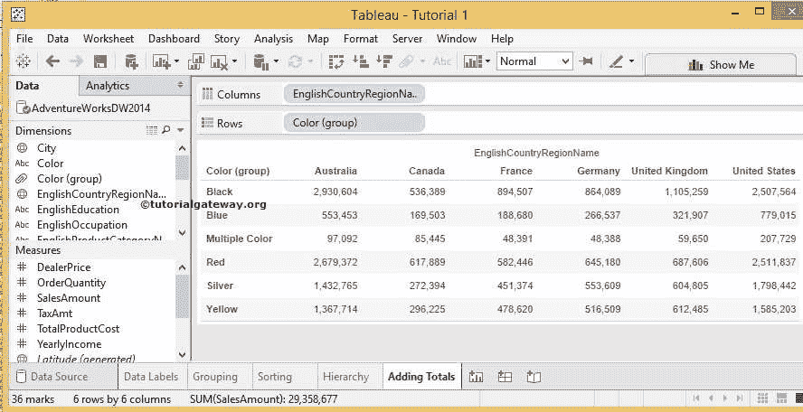
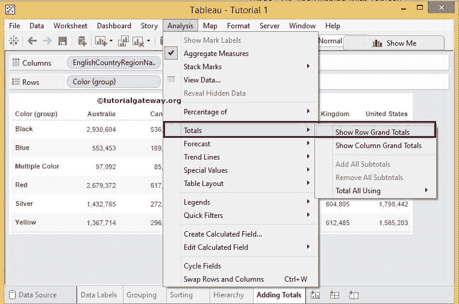
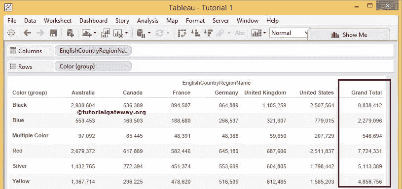
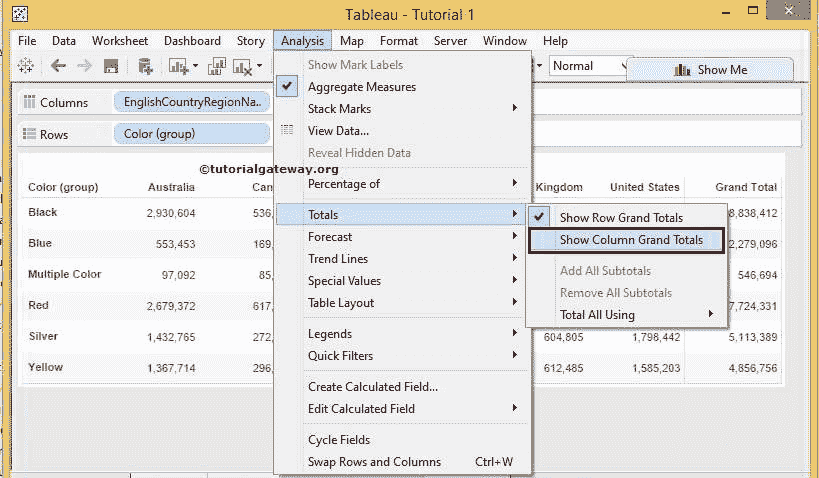
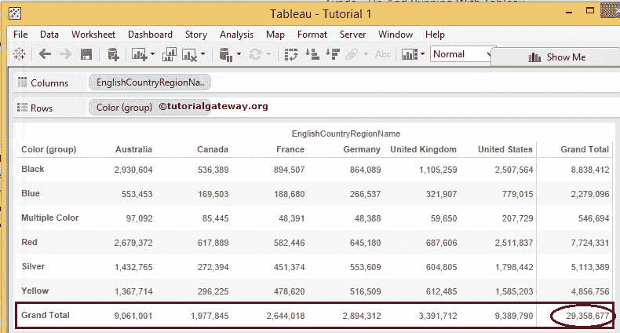
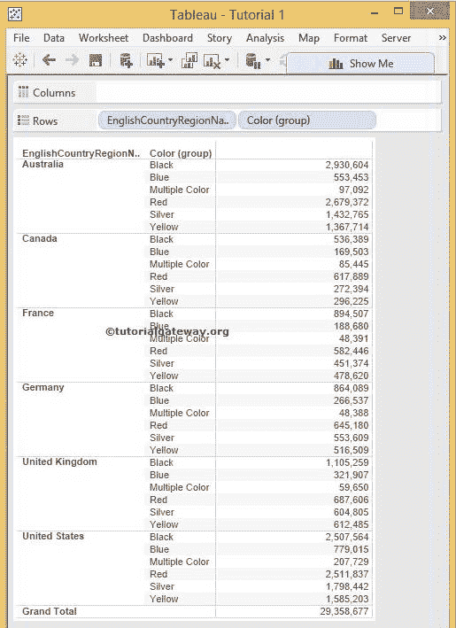
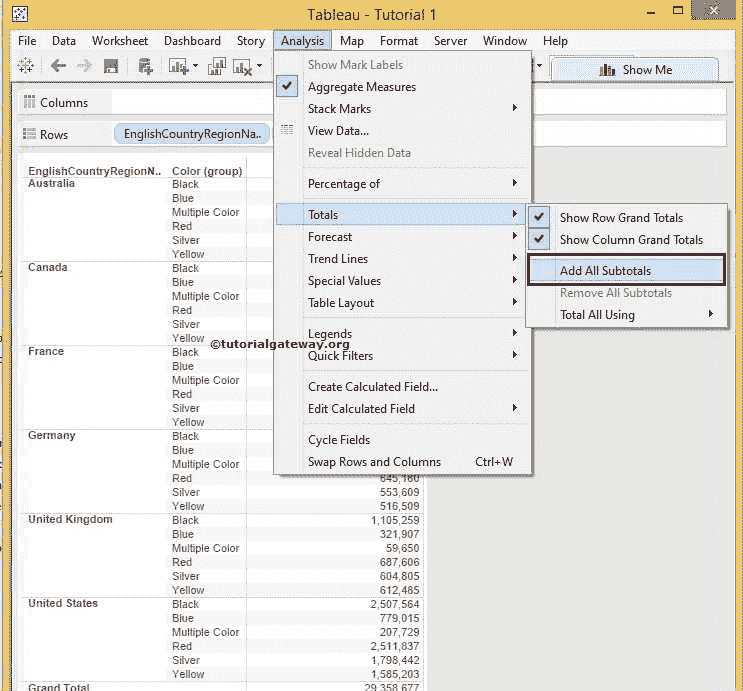
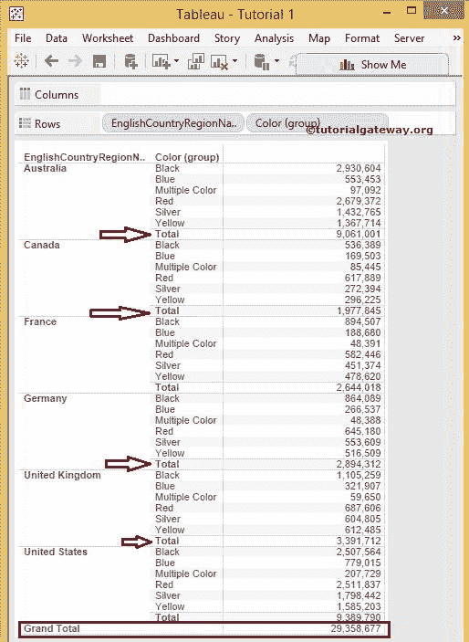
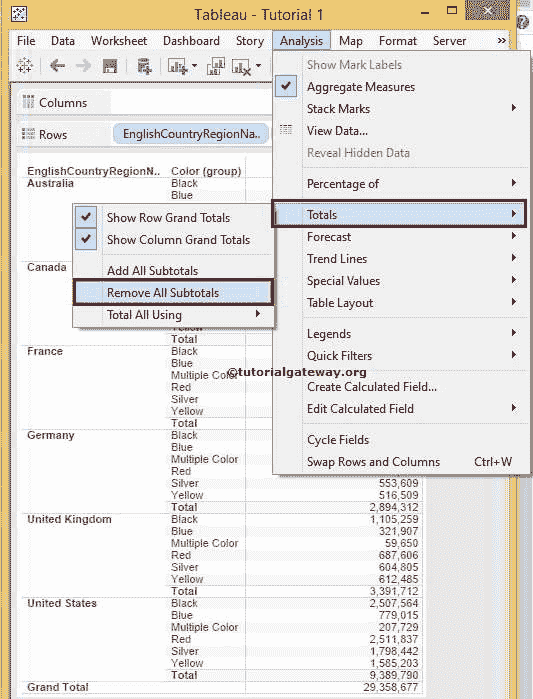

# 在 Tableau 中添加总计

> 原文：<https://www.tutorialgateway.org/add-totals-in-tableau/>

在 Tableau 中添加总计和小计是 Tableau 中最自然的事情，这只是一个复选标记的问题。在本文中，我们将展示如何在 Tableau 中添加总计。这包括添加行总计、列总计、总计和小计，并附带一个实例。

对于这个 Tableau 添加总计演示，我们将使用我们在上一篇文章中创建的数据源。因此，请访问 Tableau 报告文章中的[数据标签，了解](https://www.tutorialgateway.org/data-labels-in-tableau-reports/)[表](https://www.tutorialgateway.org/tableau/)数据源。

## 在表中添加总计的步骤

在本例中，我们将向下面显示的报告中添加总计。如果你观察下面的截图，它只是一个标准 Tableau 报告。

要在表中添加总计，请转到分析菜单，选择总计并勾选所需选项。例如，要显示行总计，我们必须选择显示行总计选项

选择“显示行总计”选项后，一个额外的总计列将与 Tableau 报告中的所有行总计相加

要显示列总计，请转到分析菜单并选择总计。接下来，勾选显示列总计选项

选择“显示列总计”选项后，一个额外的总计行将与所有列总计相加。如果你观察下面的截图，我们四舍五入到 29，358，677，因为它是所有产品的超级总计。

现在，让我们看看如何在 tableau 中添加小计，或者嵌套区域的总计。为了解释这一点，我们从列卡中删除了国家名称，并将其添加到行卡

### 在表中添加小计

要在表中添加分类汇总，请转到分析菜单。选择总计，勾选添加所有小计选项

选择“添加所有分类汇总选项”后，将在嵌套区域中添加一个带有“合计”的额外行，以显示列合计。是 Tableau 报表

中的小计

### 删除表中的总计和小计

要删除表中的行总计和列总计，请转到分析菜单并选择总计，然后取消选中相应的选项。要删除表中的小计，我们必须选择删除所有小计选项

