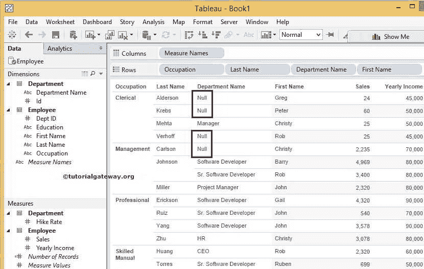
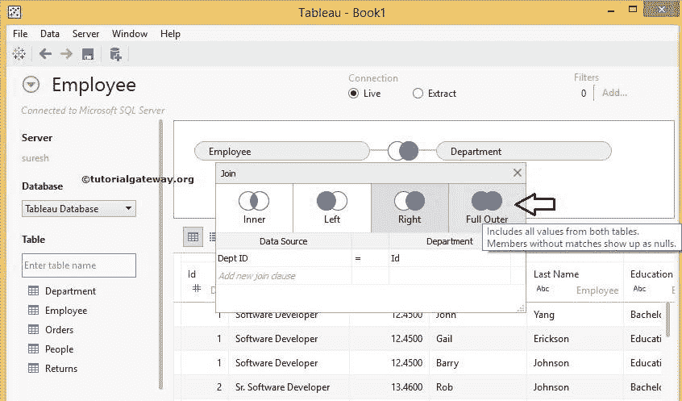

# 如何在 Tableau 中连接数据

> 原文：<https://www.tutorialgateway.org/how-to-join-data-in-tableau/>

Tableau 中的联接在设计报告时起着至关重要的作用。在实时中，我们通常使用数据库或数据仓库创建报告，我们都知道数据库中的数据是以规范化的形式存在的。因此，我们不能使用单个表生成报告(根据业务角度，大多数情况下不会)。

例如，如果您想为国别销售设计一个 Tableau 报告，国别信息将在“地理”或“区域”表中，而“销售”将在“销售”表中。在这些情况下，我们可以使用 Tableau 连接来连接地理表和销售表。

## Tableau 连接示例

下面的截图将显示 Tableau 中可用的连接来连接数据

1.  内部:如果列之间至少有一个匹配，则返回两个表中存在的记录(或行)。请参考 [SQL Inner](https://www.tutorialgateway.org/sql-inner-join/) 文章更好理解
2.  左:这个 [Tableau](https://www.tutorialgateway.org/tableau/) Join 返回左表中存在的所有记录(或行)以及从右开始的匹配行。请参考 [SQL Left](https://www.tutorialgateway.org/sql-left-join/) 文章。
3.  右:它返回右表中的所有记录(或行)以及左表中的匹配行。请参考 [SQL Right](https://www.tutorialgateway.org/sql-right-join/) 文章更好理解
4.  完全外部:这个 Tableau 连接返回左表和右表中的所有记录(或行)。所有不匹配的行都将填充空值。请参考 [SQL Full](https://www.tutorialgateway.org/sql-full-join/) 文章更了解

## 如何在 Tableau 中连接数据？

在本文中，我们将通过一个实例向您展示如何在 Tableau 中连接数据。对于这个 Tableau Join，我们将使用 [SQL Server](https://www.tutorialgateway.org/sql/) 中的数据，因此，请参考[连接到 SQL Server](https://www.tutorialgateway.org/connecting-tableau-to-sql-server/) 了解连接设置。

员工

中的数据

数据呈现在部门

为了描述如何在 Tableau 中连接数据，我们至少需要两个表。首先，拖放第一个表或将表留在字段区域。在这个 Tableau 连接的例子中，我们使用我们的 Employee 表作为左表

接下来，将第二个表或右表拖放到字段区域。当您拖动部门时，将打开一个弹出窗口，选择加入类型和加入键，如下所示。

### Tableau 内部连接示例

这个例子展示了如何使用内部。

众所周知，员工表中的部门标识和部门表中的标识是我们要用于加入员工和部门表的关键列。首先，从员工中选择部门标识栏，如下图

接下来，从部门表中选择身份证列，如下图

我们创建了一个简单的 Tableau 报告，其中包括职业、姓氏、部门名称、行中的名字和销售额，以及列中的年收入。让我们看看内部报告预览。

从下面的截图中，您可以观察到 Inner 正在生成 10 行，其中包括来自 Employee 和 Department 表的所有匹配记录。

### 表左连接示例

这个例子展示了如何使用 Left 在 Tableau 中连接数据。为此，让我们将连接类型从内部更改为左侧

让我们看看左报告预览。从下面的截图中，您可以了解到 Left 正在生成 14 行。它包括员工的所有记录和部门的匹配记录。请记住，部门的四条不匹配记录将显示为空值

### 表右连接示例

在这个 tableau 中的右连接示例中，我们向您展示了如何使用右连接 Tableau 中的数据。让我们将连接类型从左更改为右。

让我们来看看右侧的报告预览。从下图中，您可以观察到右侧产生了 12 行。输出包括部门中的所有记录和员工表中的匹配记录。请记住，员工的两条不匹配记录将显示为空。

### Tableau 全外连接示例

此示例向您解释了如何使用完全外部或完全连接 Tableau 中的数据。为此，让我们将类型从右更改为全外。

让我们看看 Tableau 全外连接报告预览。从下面的截图中，您可以看到全外层产生 16 行。它包括来自员工的 2 条不匹配记录和来自部门的 4 条不匹配记录。

注意:使用这种方法，您可以连接两个以上的表。请小心复杂的 Tableau 连接，这将很难理解数据。