# Tableau 数据混合

> 原文：<https://www.tutorialgateway.org/data-blending-in-tableau/>

Tableau 数据混合对于连接或组合来自两个数据源的数据非常有用。例如，如果您想要使用多个或不同的数据源生成 tableau 报告，那么我们可以使用这个 Tableau 数据混合技术来连接它们。在这个 Tableau 数据混合演示中，我们使用了 Excel 工作表和 SQL Server 中的工作表。

## Tableau 数据混合方法 1

要执行 Tableau 数据混合或合并，我们需要两个数据源中至少有一个公共维度。它是整数还是字符串并不重要。为了演示 Tableau 数据混合，首先，我们连接到 Employees.xlsx 工作簿，并将雇员列表表添加到区域

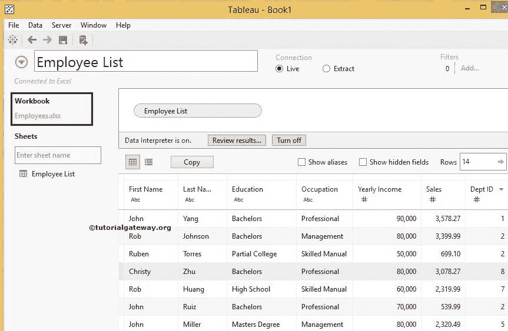

在这个 Tableau 数据混合的例子中，我们需要创建一个包含员工名字、姓氏、职业、销售额和年收入的 Tableau 报告。因此，我们创建了一个简单的 Tableau 报告，行中有职业、姓氏、名字和销售额，列中有年收入。让我们看看报告预览。

请参考[表](https://www.tutorialgateway.org/tableau/)中的[连接 Excel 文件和](https://www.tutorialgateway.org/connecting-to-excel-files-in-tableau/)[连接 SQL Server](https://www.tutorialgateway.org/connecting-tableau-to-sql-server/) 。

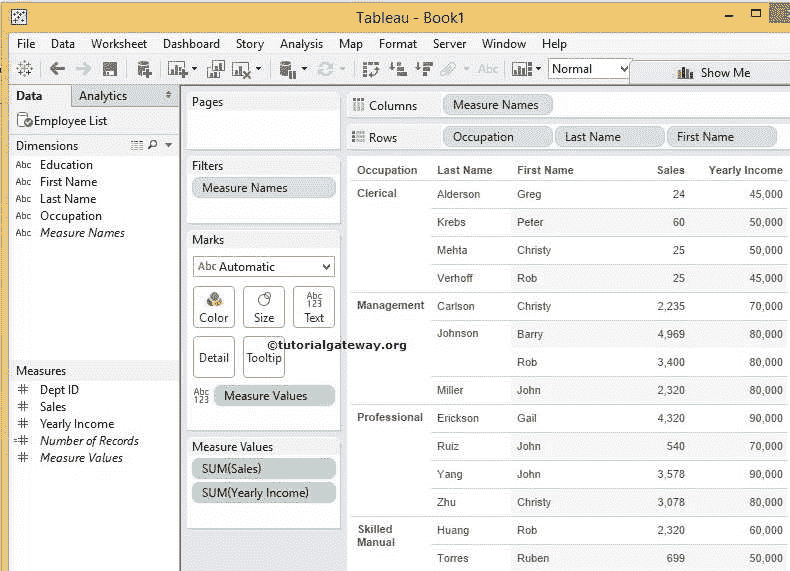

场景:突然，客户改变了要求，要求我们为每个员工添加部门和加薪百分比的详细信息。这里真正的障碍是，部门和加薪百分比列存在于主数据库中。这意味着我们必须将本地 Excel 工作表中的几列和辅助源中的记录结合起来，其他几列来自 SQL 数据库。这就是我们所说的 Tableau 数据混合

要进行主数据集和辅助数据集的 Tableau 数据混合，请导航到“数据”菜单。接下来，从菜单中选择“新建数据源”选项，或点击圆柱体符号

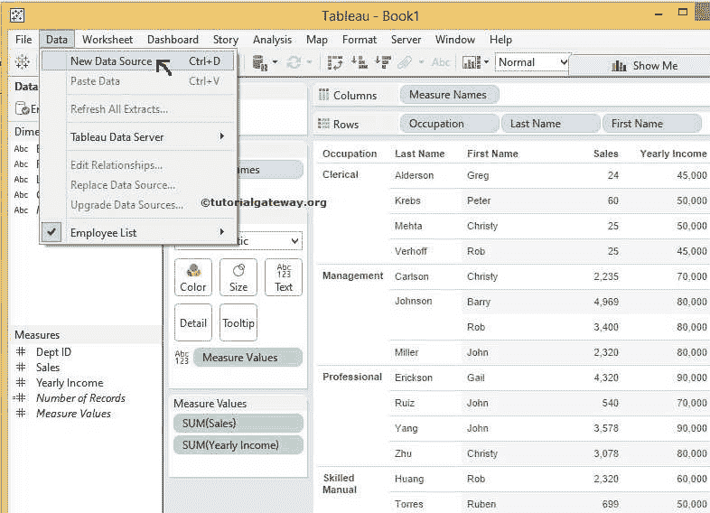

选择该选项后，下面显示的窗口将显示为“连接”。这里我们要连接 [SQL](https://www.tutorialgateway.org/sql/) 所以选择

微软 SQL Server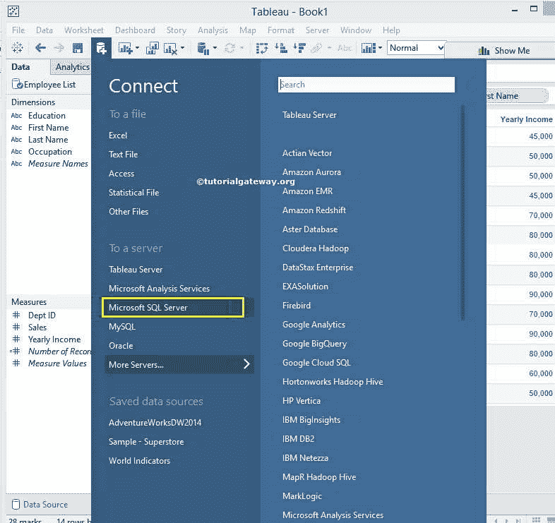T4】

我们从 Tableau 数据库

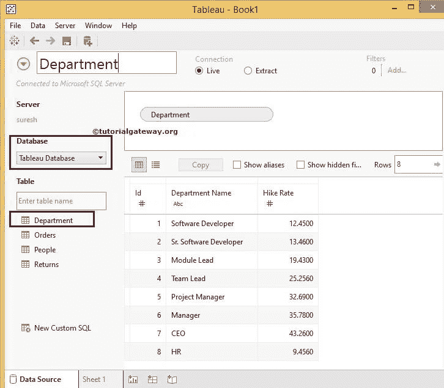

中选择了部门表

新添加的数据源(SQL)部门表，这来自辅助源。

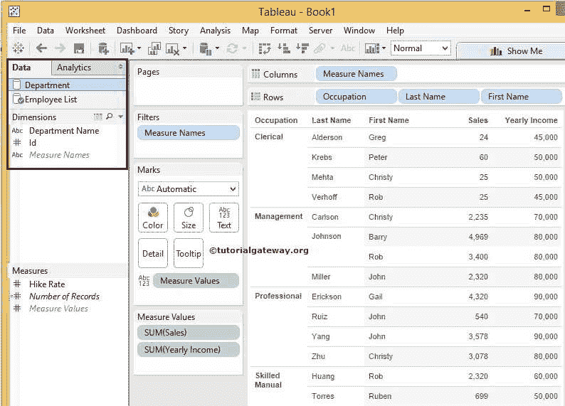

让我们将部门名称添加到行卡中。如您所见，Tableau 在部门名称处显示了一个小的橙色勾号。它还显示警告信息。

如果你看了警告信息，这是一个非常直接的信息，说员工和部门之间没有关系。这种关系在 Tableau 数据混合中非常重要。请添加连接。

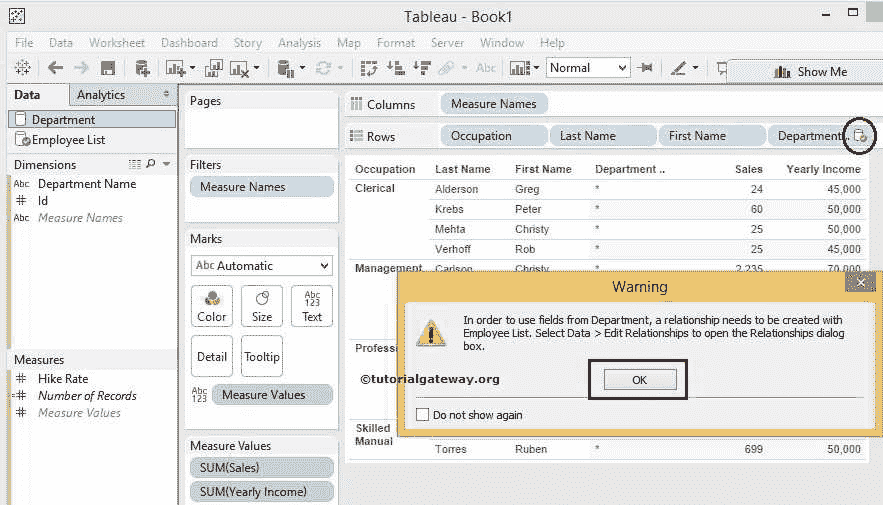

要添加关系，请转到数据菜单并选择编辑关系..选项。

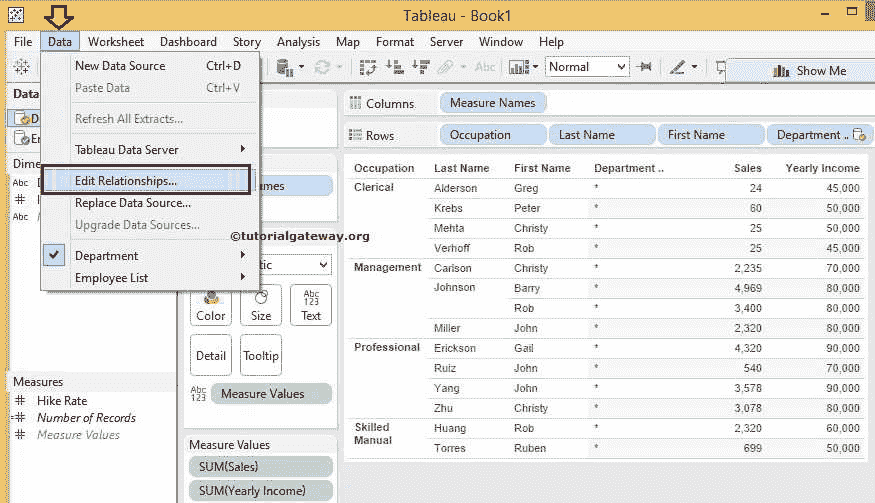

选择“编辑关系”后..选项，将会打开一个新的“关系”窗口。以下是 Tableau 数据混合的可用选项。

*   主数据源:我们首先从该数据源将字段(维度或度量)拖动到称为主数据源的报告区域中。Tableau 会在这个旁边显示一个蓝色的小勾号。
*   辅助数据源:不是主要数据源。Tableau 在辅助数据源旁边显示一个小的橙色勾号
*   自动:如果两个数据源中有任何公共维度名称，Tableau 会自动检测这两个字段之间的可能关系。
*   自定义:如果主数据源和辅助数据源中没有通用的字段名，我们必须选择自定义选项并添加它们之间的关系。目前，我们选择了这个选项

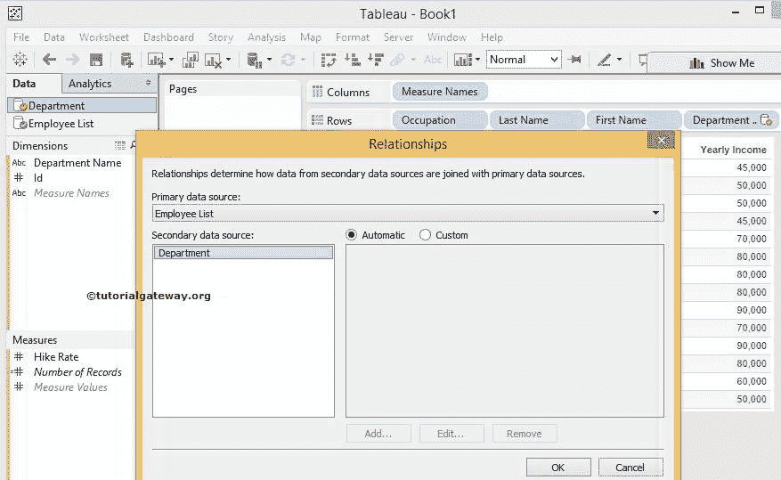

员工表中的部门标识和部门表中的标识是关键列。我们将在员工表和部门表中混合使用它们。

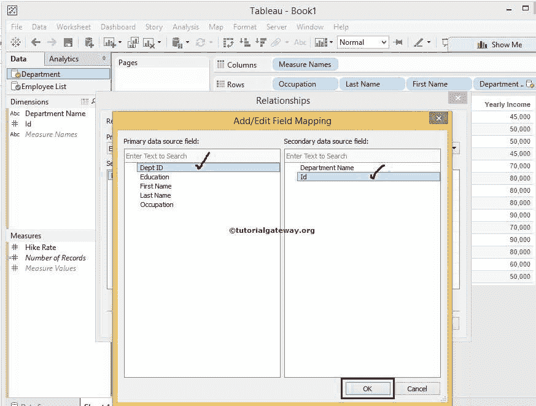

一旦您指定了关系，一个微小的网址链接将出现在标识栏旁边。从下面的截图中，当您悬停在该链接上时，将显示使用标识作为链接字段工具提示。点击链接按钮，在表

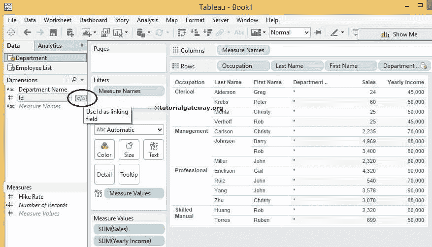

中启用数据混合

单击链接按钮时，链接按钮颜色将变为橙色，我们的部门列显示记录。请记住，如果部门中没有匹配的记录，则将显示空值。

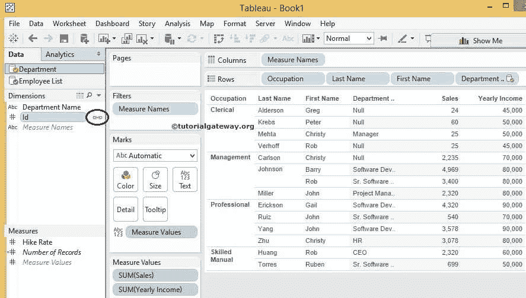

让我们添加一个加息措施，以完成我们的客户要求。

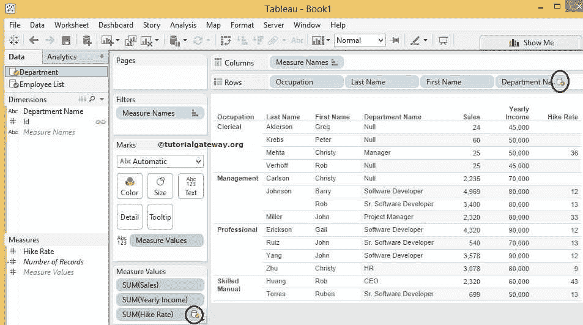

## Tableau 数据混合方法 2

Tableau 数据混合第二种方法简单明了。让我们给 tableau intelligence

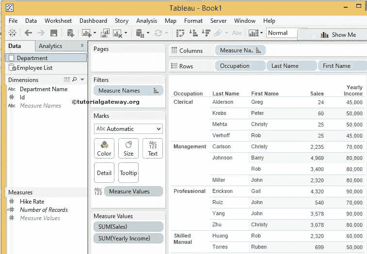

一个机会，而不是在 Id 和 Dept ID 列之间创建自定义关系

为此，请选择并右键单击标识列，然后选择别名..从中选择。

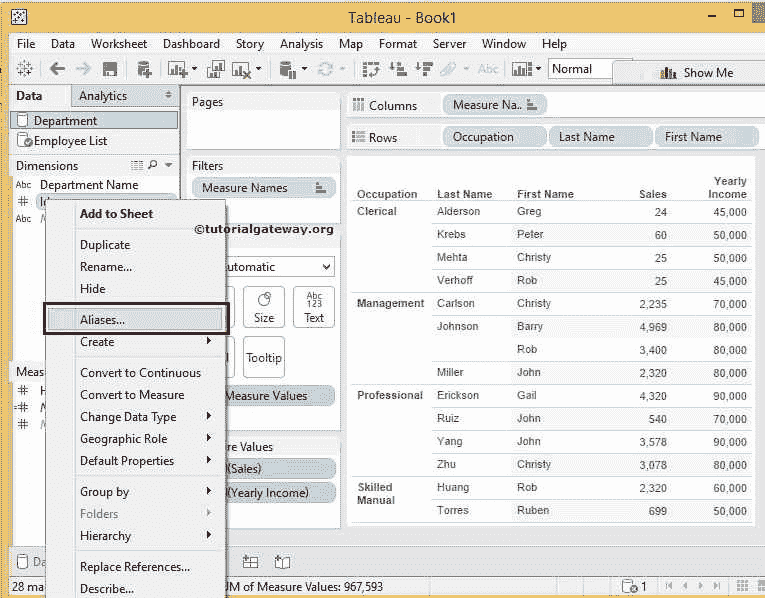

一旦你决定了别名..选项，将弹出一个新窗口来重命名该文件。让我们将 Id 列更改为部门 ID

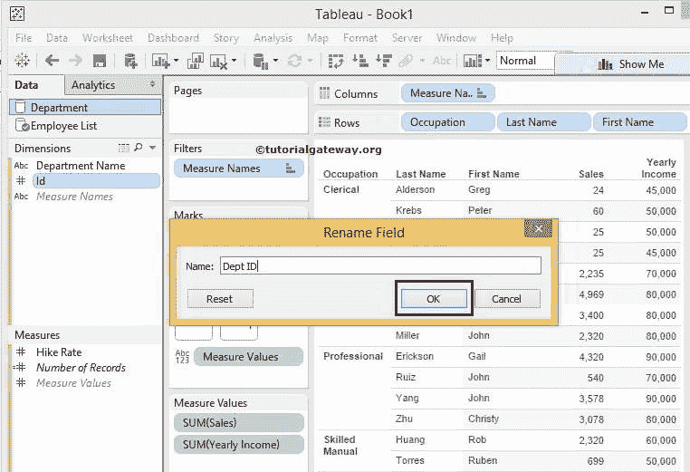

单击“确定”按钮后，Tableau 将自动检测员工表中的部门标识和部门表中的部门标识之间的关系。这意味着你不必独自创造一段关系。

您可以观察到一个微小的网址链接将出现在部门标识列的旁边。点击链接按钮启用 Tableau 数据混合

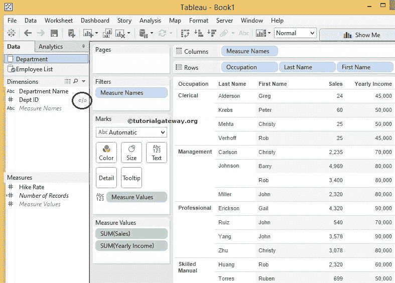

单击链接按钮后，链接按钮的颜色将变为橙色。

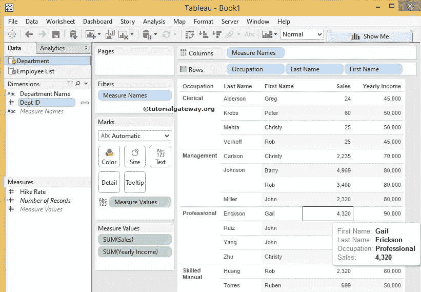

让我们添加部门名称和提价来完成业务需求。

## 删除或编辑表关系

我们向您展示了如何移除我们在 Tableau 数据混合过程中创建的关系。首先，请导航到数据菜单并选择编辑关系..选项。

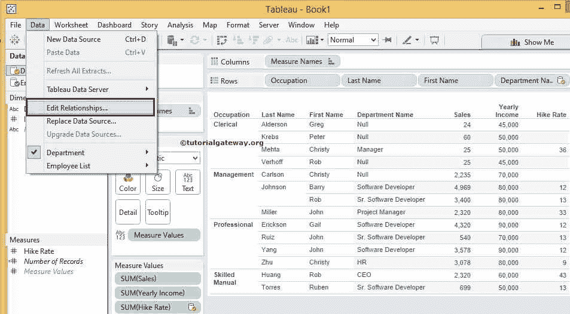

选择“编辑关系”后..选项，将会打开一个新的“关系”窗口。请选择要删除的关系，然后单击删除按钮。在这个 Tableau 数据混合的例子中，我们只有一个部门标识和标识之间的关系，所以我们选择了它并删除了它。

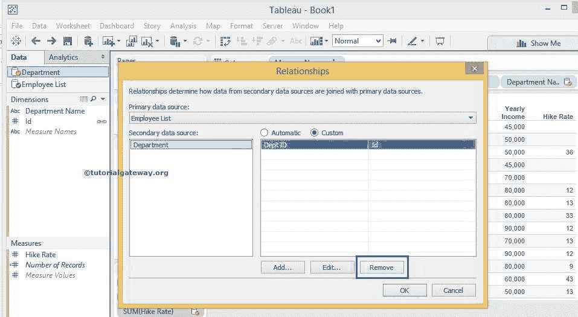

显示以下警告消息是因为我们在 Tableau 报告中使用了部门名称和提价率。

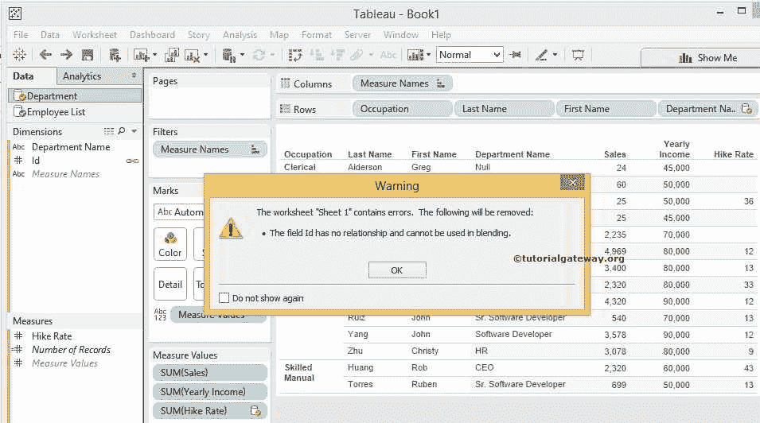

接下来，还有一个我们之前看到的警告信息。一旦你点击确定按钮，微小的网址链接将被删除除了身份证栏。

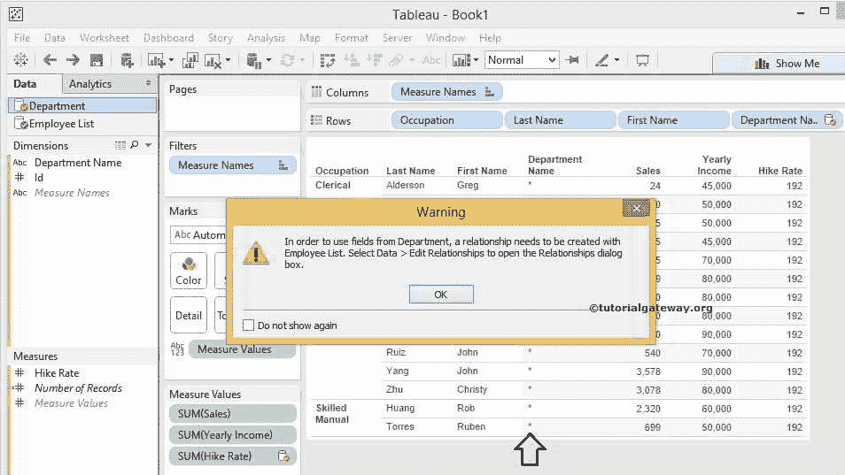

我们成功删除了 Tableau 数据混合所需的关系。