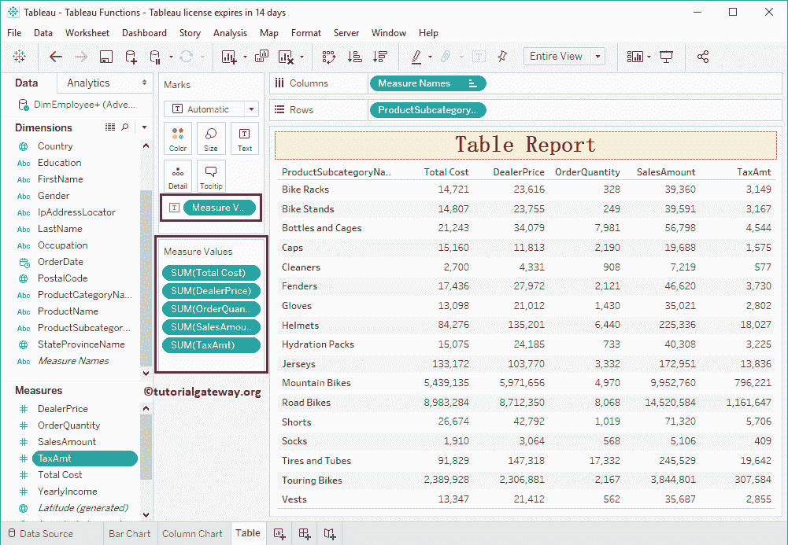

# Tableau 报表

> 原文：<https://www.tutorialgateway.org/tableau-table-report/>

Tableau 中的报表是显示数据的常见方式之一。在本文中，我们将通过一个示例向您展示如何创建报表。

为了在 Tableau 中演示这个报表，我们将使用之前创建的数据源。因此，请访问【报告中的数据标签】文章。

## 创建 Tableau 报表

在本例中，我们将创建一个表。这可以通过两种方式实现。

当您从尺寸区域中选择产品子类别名称时，Tableau 将自动为您的选择一个[文本标签](https://www.tutorialgateway.org/tableau-text-label/)。

单击文本标签将为您创建一个表。

接下来，将“销售额”从“度量区域”拖放到“标记架”中的文本字段。

现在可以看到

的报表

## 创建报表–第二种方法

将任何维度字段拖到行部分将自动为您创建一个表。让我将产品子类别名称从“维度区域”拖到“行”货架上。

可以看到[表](https://www.tutorialgateway.org/tableau/)表

报告T4】

接下来，我们将销售金额添加到该表中。

让我再添加几个衡量标准，如产品总成本、订单数量、税额。

