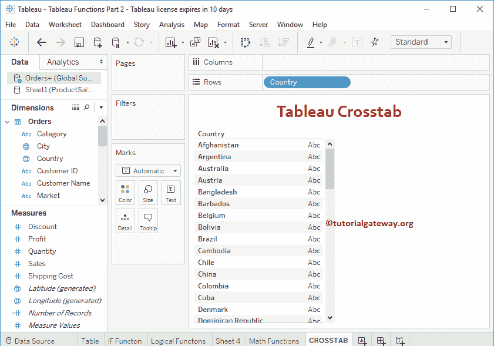
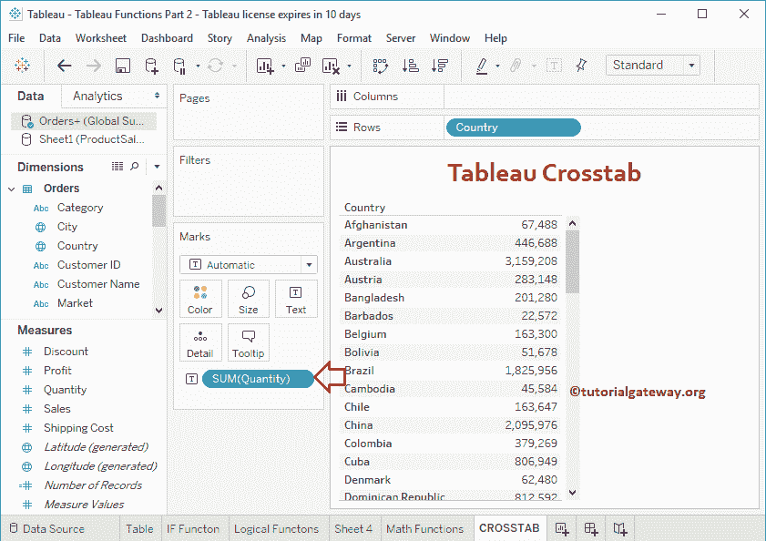
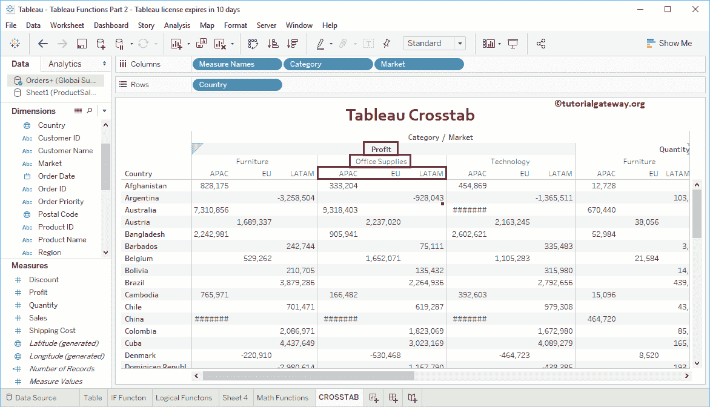

# Tableau交叉报表

> 原文：<https://www.tutorialgateway.org/tableau-crosstab-report/>

Tableau 中的Tableau交叉表是多级显示数据的最佳方式。在本文中，我们将通过一个例子向您展示如何创建 Tableau 交叉报表。

## 创建Tableau交叉报表

在这个 Tableau 交叉表演示中，我们将使用全局超级商店 Excel 工作表中的数据。所以请参考[连接 Excel 文件](https://www.tutorialgateway.org/connecting-to-excel-files-in-tableau/)一文了解连接设置。

将任何维度字段拖到行部分将自动为您创建一个表。否则，选择[文本标签](https://www.tutorialgateway.org/tableau-text-label/)就可以了。让我将“国家/地区”从“维度区域”拖到“行”货架。

接下来，将数量从[表](https://www.tutorialgateway.org/tableau/)测量区域拖放到标记架中的文本字段。现在可以看到[表](https://www.tutorialgateway.org/tableau-table-report/)

表表

让我将销售字段添加到测量货架

让我再来一个衡量标准，叫做利润。

将此表转换为矩阵。将类别字段拖放到列架

现在你可以在表

中看到矩阵或交叉表

让我在专栏货架

上再增加一个维度(市场)

您也可以在“行”货架上添加字段，对行字段

进行分组