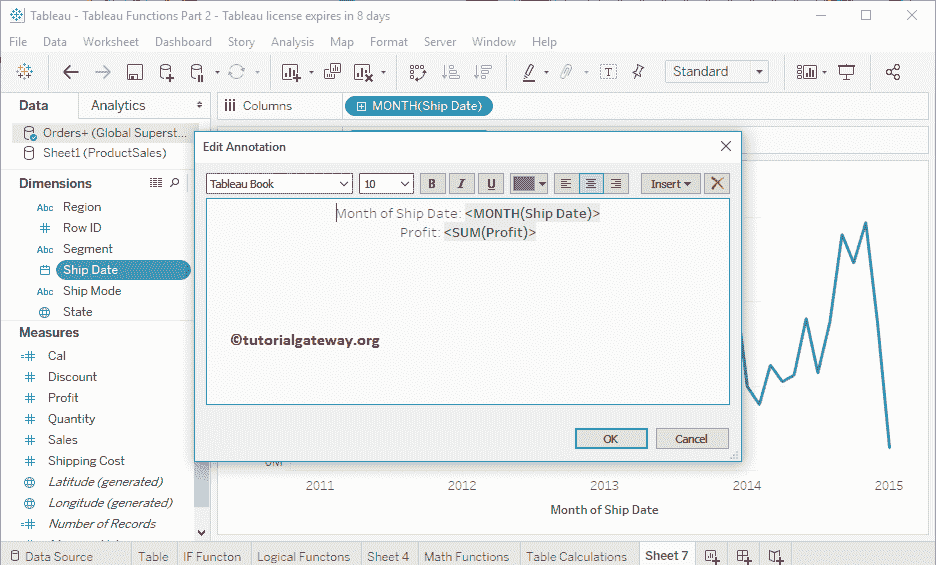

# Tableau 注解

> 原文：<https://www.tutorialgateway.org/tableau-annotations/>

在本文中，我们将通过粒子示例向您展示如何添加、编辑和删除 Tableau 注解。为了演示 Tableau 中的注解，我们将使用全局超级商店 Excel 文件。

对于这个 Tableau 注解示例，我们通过将利润拖到行架，将发货日期月份拖到列架来创建面积图。

一般来说，当您将鼠标悬停在[区域图](https://www.tutorialgateway.org/tableau-area-chart/)中的任意点上时，都会显示工具提示信息。但是，您可以添加描述该点或显示值等的 Tableau 注解。请参考[连接 Excel 文件](https://www.tutorialgateway.org/connecting-to-excel-files-in-tableau/)一文了解连接设置。

## 添加注解表

右键单击[表](https://www.tutorialgateway.org/tableau/)图表中的点或标记将打开上下文菜单。请选择注解并选择这三个选项中的任何一个。现在，让我选择

选择标记选项将显示以下窗口。默认情况下，它将在该标记处显示信息。

让我把字体样式改为牛腿，字体大小改为 12，字体颜色改为红色

现在，您可以在选定的标记

处看到工具提示

这次我们选择的是

它将在选定的点

显示 Tableau 注解

在这里，我们选择了一个随机区域，并选择了区域注解。记住，这对于披露该地区

的信息非常有用

我们正在使用一些示例文本

现在您可以看到区域标签。

## 删除“注解”(Annotations)表

右键单击要删除的消息，并从上下文菜单中选择删除选项。

## 编辑注解表

右键单击它并选择编辑..选项。

使用此窗口更改文本和格式

通过选择“格式”选项，您可以格式化外观。所以，让我选择格式选项

您可以看到“格式”窗口。使用此窗口格式化此 Tableau 注解

用你的鼠标，你可以改变它的位置。让我拖到右侧

可以看到

位置的变化