# Tableau 中的层次结构

> 原文：<https://www.tutorialgateway.org/hierarchies-in-tableau/>

Tableau 层次结构提供了对 Tableau 报表的深入操作。借助 Tableau 层次结构的微小+和–符号，我们可以从更高的层次导航到嵌套层次或更低的层次。对于这个 Tableau 层次结构示例，我们将使用我们在上一篇文章中创建的数据源。

## 如何在表中创建层次结构

选择并右键单击要在 Tableau 中创建层次结构的维名称。请选择层次选项，然后从上下文菜单

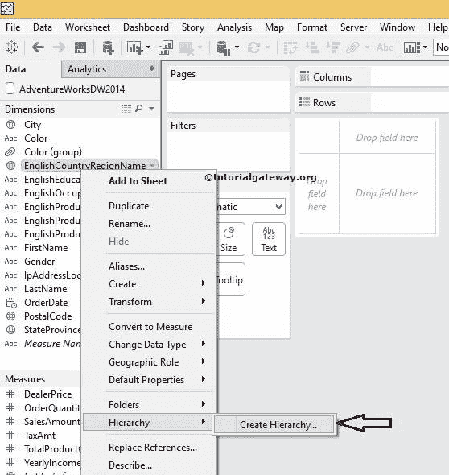

中选择创建层次选项

选择该选项后，将打开一个新的弹出窗口对其进行重命名。目前，我们将其更名为国家

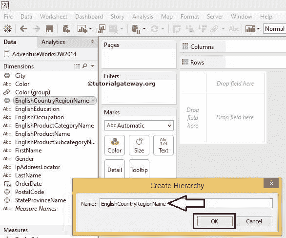

单击“确定”按钮后，您可以看到新创建的包含英语国家/地区名称成员的层次结构名称。因此，请访问Tableau 报告文章中的[数据标签，了解](https://www.tutorialgateway.org/data-labels-in-tableau-reports/)[表](https://www.tutorialgateway.org/tableau/)数据源。

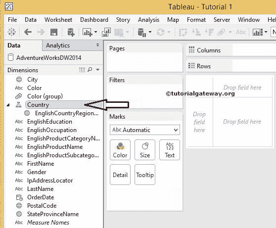

### 向 Tableau 中的层次结构添加成员的方法 1

有多种方法可以将成员添加到 tableau 的层次结构中。第一种方法，将所需的维度拖放到 Tableau 中新创建的层次结构中。放下时，它会显示一条代表成员位置的水平线。

例如，如果您将“国家”列放在“国家”名称上方，则“国家”位于第 1 级，第 2 级将是“国家”(国家将嵌套在国家内部)，这将产生一个奇怪的结果。所以，在删除成员

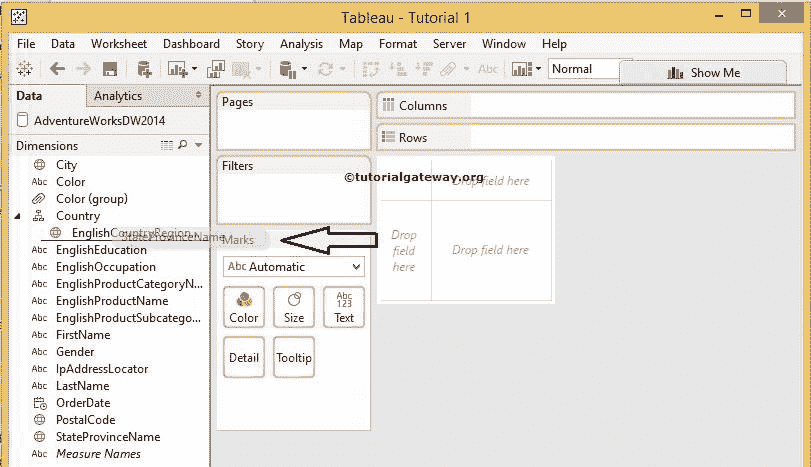

时请小心

完成后，新拖动的成员将显示在国家层级

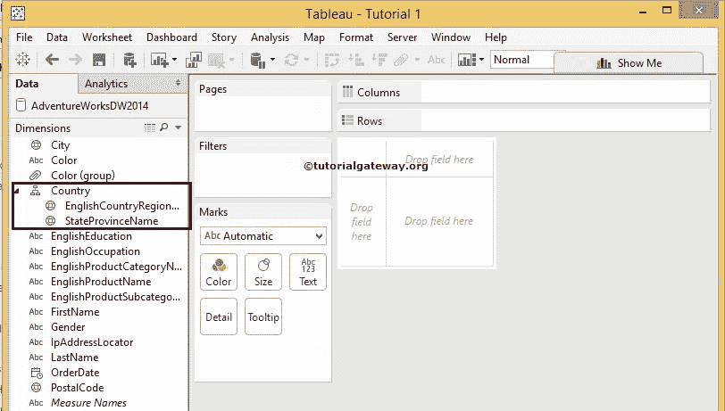

中

### 向 Tableau 中的层次结构添加成员的方法 2

选择并右键单击要添加到 Tableau 现有层次结构中的维名称。请选择层次选项，然后选择添加到层次选项，然后从上下文菜单

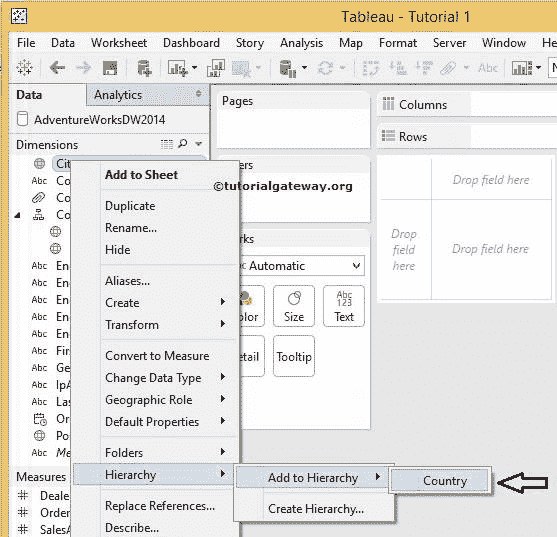

中选择名称

一旦完成，我们的维度将添加到国家。同样，我们添加了邮政编码，如下图所示

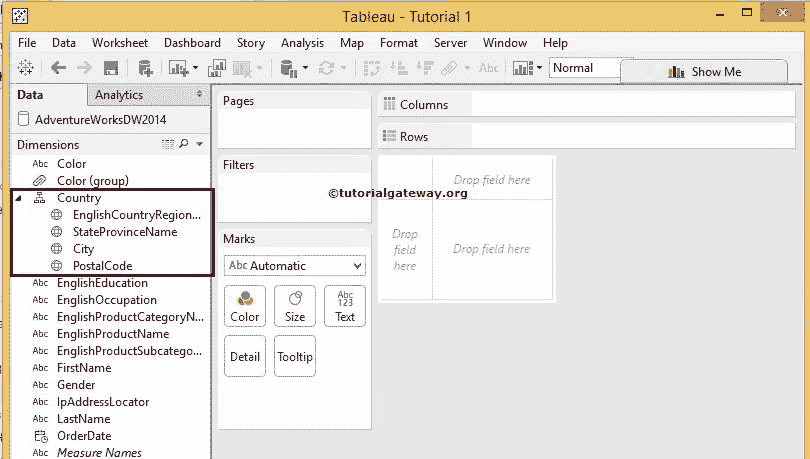

当您添加国家名称时，从下面的截图中，您可以注意到国家名称旁边的微小+符号。该符号将允许执行向下钻取操作

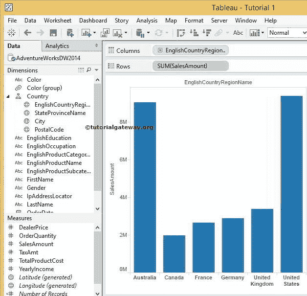

当您展开国家/地区名称时，Tableau 报告将显示国家/地区

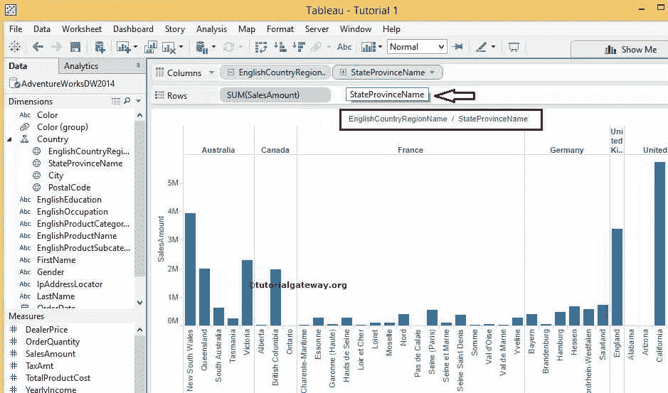

中每个州的销售金额总和

当您展开州名时，Tableau 报告将显示当前城市

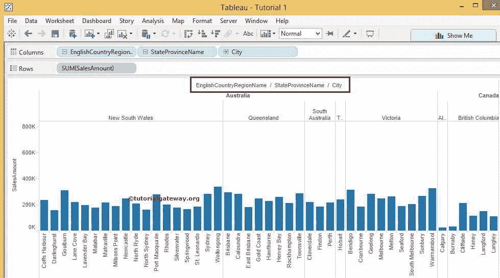

的销售金额总和

我们可以通过扩展城市来进一步深入Tableau 报告。当您展开城市名称时，Tableau 报表将显示每个邮政编码

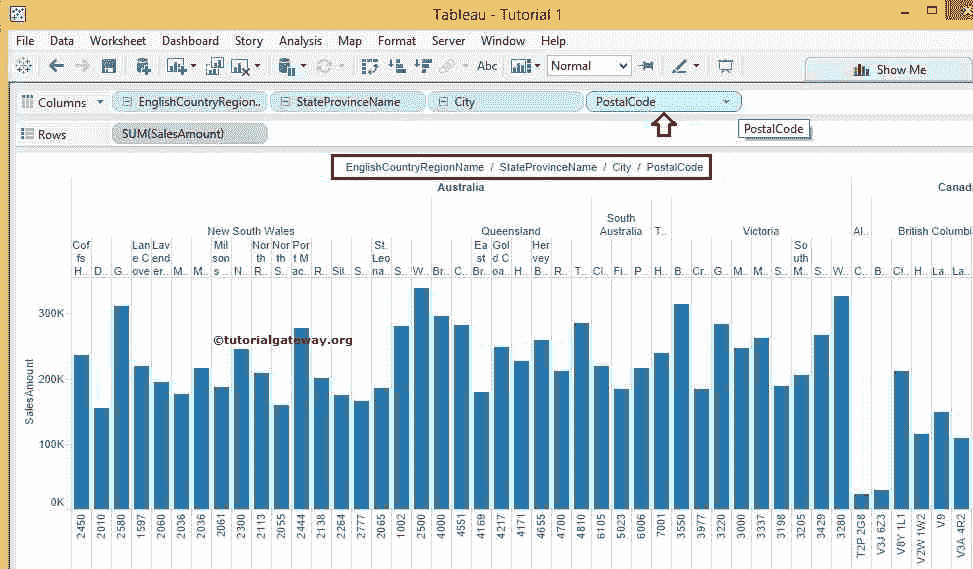

的销售金额总和

## 在 Tableau 中创建层次结构的方法 2

将一个成员拖到另一个成员上会自动在 tableau 中创建层次结构。在本例中，我们将州成员拖到国家名称上，如下所示

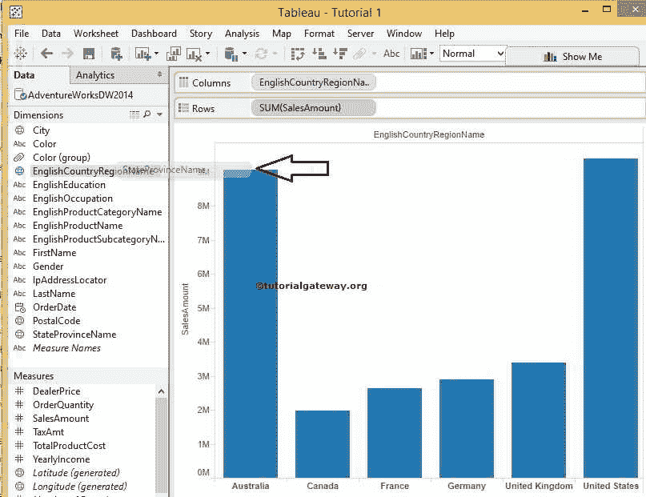

当您将州成员拖到国家名称上时，将打开一个新的弹出窗口来重命名该名称，如下所示。例如，我们将其重新命名为国家

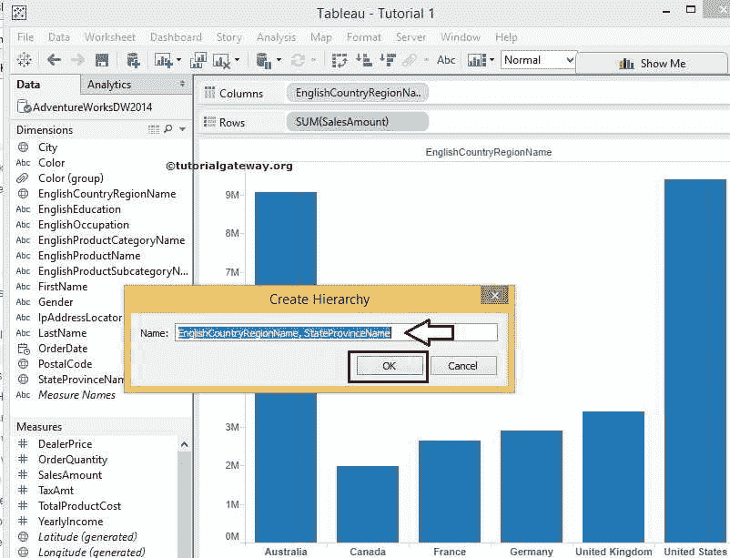

单击“确定”按钮后，您可以看到新创建的带有“国家/地区名称”、“省/市/自治区名称”成员的名称。同样，我们可以添加更多。

注意:当您在拖放时添加更多成员时，它将显示一条代表成员位置的水平线。放下成员时请小心

## 从表中的层次结构中删除成员

删除 Tableau 层次结构成员非常容易。为此，选择并右键单击要从中分离或移除的成员。请选择层次选项，然后从上下文菜单

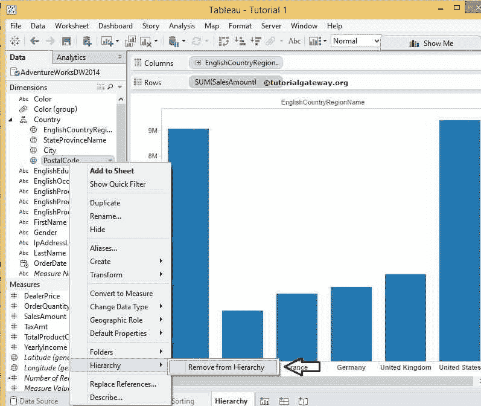

中删除选项

选择该选项后，邮政编码成员将从 Tableau 层次结构中分离或移除。

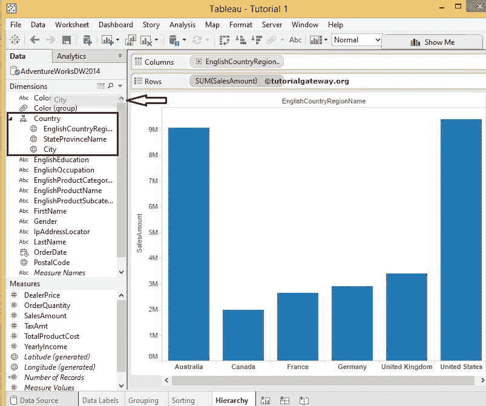

要从层次结构中删除成员，我们可以将其成员拖到维度窗格中。