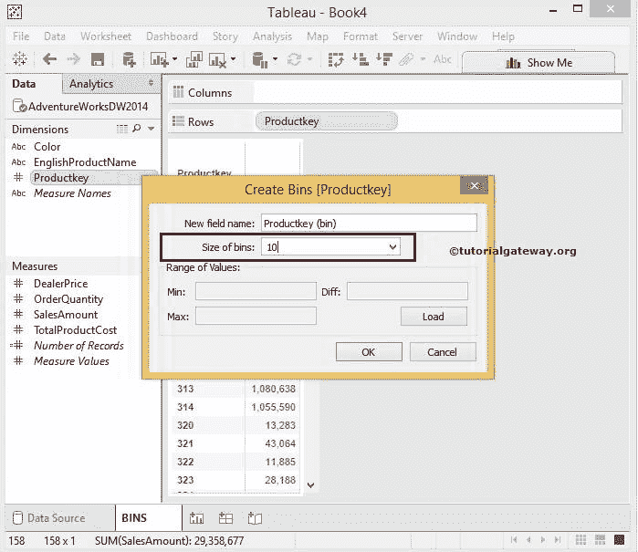

# Tableau 箱子

> 原文：<https://www.tutorialgateway.org/tableau-bins/>

Tableau 箱子对于创建数据范围非常有用，这类似于 SQL Buckets。在本文中，我们将通过一个例子向您展示如何在 Tableau 中创建箱。

为了在表中创建容器，我们将针对 SQL Server 数据源编写自定义 SQL 查询。请访问[连接 Tableau 到 SQL Server](https://www.tutorialgateway.org/connecting-tableau-to-sql-server/) 文章了解配置。自定义 [SQL](https://www.tutorialgateway.org/sql/) 查询我们将用于此 [Tableau](https://www.tutorialgateway.org/tableau/) 报表的是:

```
SELECT Prod.Productkey, 
       Prod.EnglishProductName, 
       Prod.Color, 
       Prod.DealerPrice, 
       Fact.OrderQuantity, 
       Fact.TotalProductCost, 
       Fact.SalesAmount
FROM DimProduct AS Prod 
     INNER JOIN FactInternetSales AS Fact 
       ON Prod.ProductKey = Fact.ProductKey
```

## 表箱示例

在开始在 Tableau 中创建箱之前，我们需要一份报告。首先，将产品密钥从维度区域拖放到行架。接下来，将销售额从测量区域拖放到归档区域。由于它是一个度量值，因此销售金额将合计为默认的总和。

一旦拖动它们，就会生成Tableau 报告。你可以观察到有 158 行。


### 在表中创建箱

在这个 Tableau 箱的例子中，我们将在产品键上创建箱或桶。我们知道，数字箱是一组大小相等的数据。因此，请右键单击产品密钥维度并选择创建选项，然后从上下文菜单中选择箱选项。


选择该选项后，将打开一个名为“创建媒体夹”对话框的新窗口，默认名称和媒体夹大小为 10。



如果你不知道箱子的大小，点击加载按钮。单击此按钮，Tableau 桌面将显示最小值、最大值、差值以及可能的最佳大小。


现在，我们使用静态数字 20 作为箱的大小，并单击“确定”将数据合并到组中。


显示在 Tableau 维度部分


新创建的 Bin

请将产品密钥维度替换为行架上的产品密钥箱。


从上面的 Tableau 箱子 屏幕截图中，您可以观察到产品关键数据被组织成桶，并且总行数只有 21 行。要显示每个箱中可用的产品密钥，请将产品密钥维度拖放到行架


从上面的截图中，可以看到新建的 bin 在Tableau 报告中。

### 如何删除表箱

删除 Tableau 中的垃圾箱非常简单。为此，请选择要删除的内容，然后右键单击它将打开上下文菜单。请选择删除选项。


## 使用表箱创建堆叠条形图

Tableau 允许我们在维度和度量上创建容器。在本例中，我们将根据测量值生成箱。使用该值，我们创建一个堆积条形图。下面的截图会给你看，默认条形图，行货架上有颜色维度，列货架上有销售额


右键单击销售额度量，并从菜单中选择创建仓位选项。现在，我们使用桌面生成的默认大小(即 357.598)


接下来，将新创建的销售金额箱从维度区域拖放到标记卡中的颜色选项。


完成后，可以看到[堆叠条形图](https://www.tutorialgateway.org/stacked-bar-chart-in-tableau/)。Tableau 桌面为堆叠条形图分配默认颜色，但是，您可以通过选择“编辑颜色”来编辑颜色..选项。


让我们添加数据标签，看看我们是否使用 Tableau 箱子 成功创建了堆叠条形图。

