# 表格参数

> 原文：<https://www.tutorialgateway.org/tableau-parameters/>

在本文中，我们将通过一个例子展示如何创建 Tableau 参数。表参数在创建动态报告中起着重要作用。例如，在创建过滤器时，我们可以用这个值替换常量值。这意味着 Tableau 参数允许用户根据他/她的要求动态设置过滤器值。

除此之外，在创建计算字段(或计算)时，我们可以用参数值替换常数值。表参数允许用户更改值。请记住，您可以创建一个新的，而不是编辑旧的。

## 如何在 Tableau 中创建参数？

有多种方法可以创建 Tableau 参数。此示例显示了如何创建、类型以及如何将它们用作过滤器。

首先，将产品名称从维区域拖放到行货架，将销售额度量区域拖放到列货架。默认情况下，[表格](https://www.tutorialgateway.org/tableau/)会生成[条形图](https://www.tutorialgateway.org/bar-chart-in-tableau/)。请记住，我们的[报告中有 130 行](https://www.tutorialgateway.org/tableau-reports/)

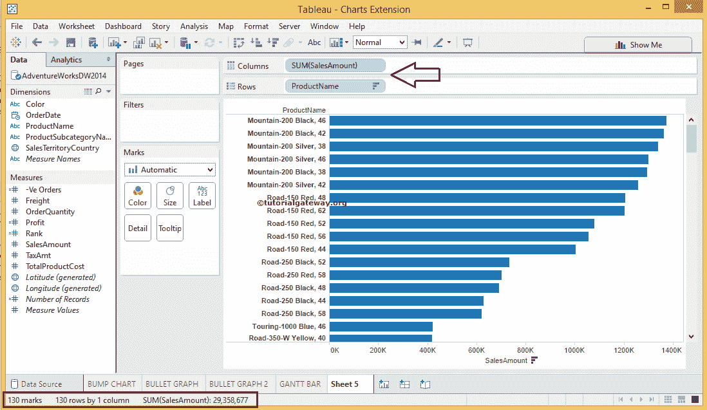

### 在 Tableau 中创建参数的第一种方法

请单击尺寸区域右上角的下拉箭头，并选择表格创建参数..选项。

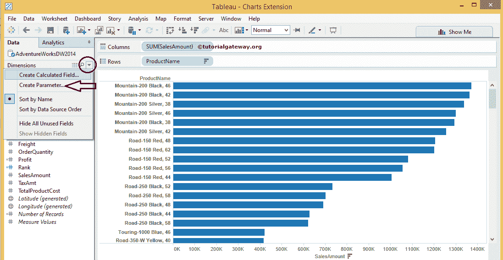

### 在 Tableau 中创建参数的第二种方法

创建这个的第二种方法是，在数据窗格中，右键单击空白区域以打开上下文菜单。请选择创建参数..选项

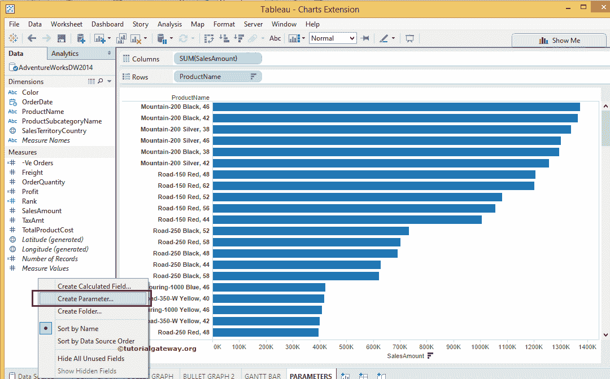

选择该选项后，将会打开一个新窗口。在名称部分，为表格参数指定一个唯一的名称，并通过点击注释按钮

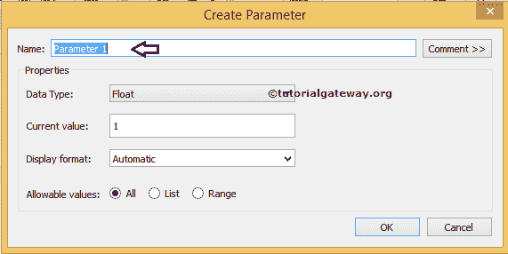

提供有效的注释

请从下拉菜单中选择有效的数据类型名称。例如，如果从列表中选择字符串数据类型，参数只能接受字符串数据。这里，我们选择的是整数数据类型

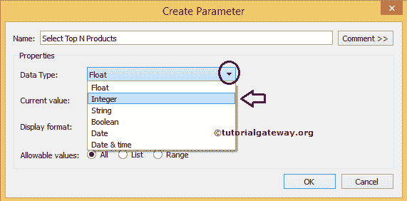

“显示格式”选项允许您格式化表格参数值。例如，如果您希望“选择前 N 名产品”参数显示 10%到 80%之间的范围，您可以使用百分比，否则，选择自动

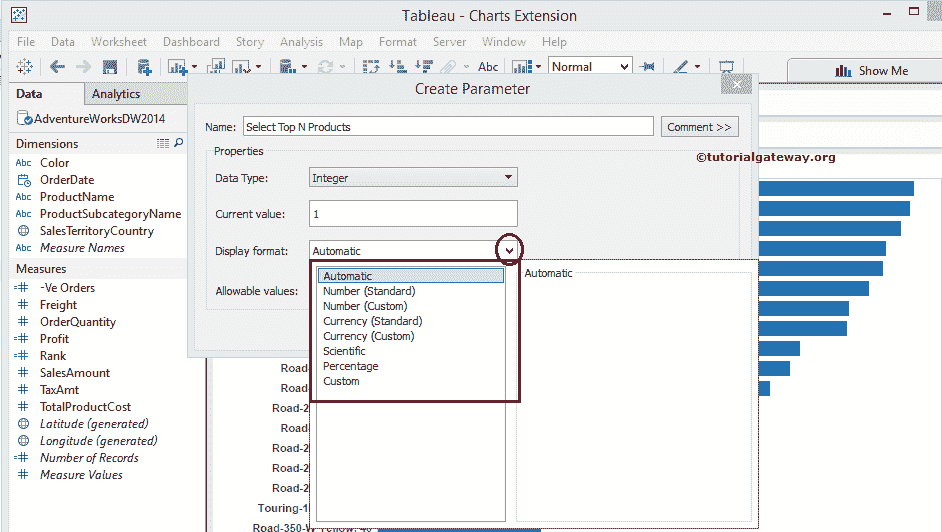

我们在允许值中有三个选项。在这个 Tableau 参数示例中，我们通过一个示例向您展示了三种可能性。首先，我们选择“全部”选项作为允许值。

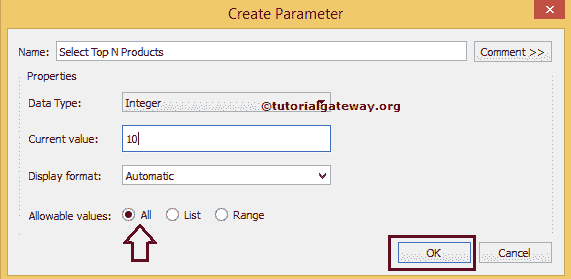

接下来，我们在产品名称上增加了[过滤](https://www.tutorialgateway.org/tableau-filters/)条件。为此，请将产品名称从维度区域拖放到过滤器架。完成后，将打开一个新窗口来写入条件。

现在，我们选择了按销售额总和排名前 N 的产品，而不是写一个常数 10，我们增加了价值。

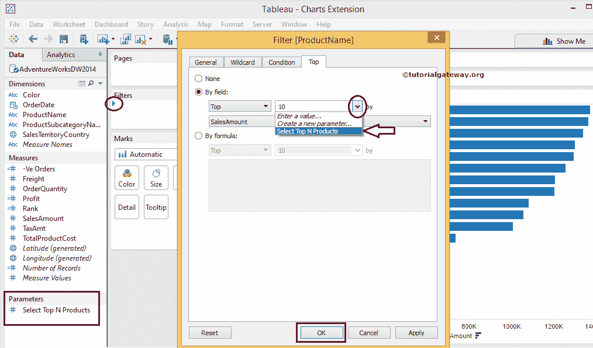

在 Tableau 的某些版本中，参数控制可能会自动显示。如果不是这样，请单击参数名称右上角的下拉箭头，并选择“显示参数控制”选项。

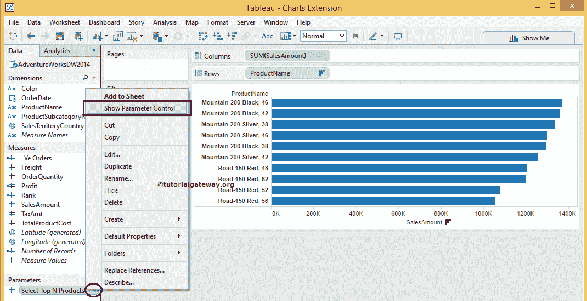

一旦我们完成，你可以看到控制。默认情况下，我们的报告将显示前 10 条记录，因为我们在创建 Tableau 参数时将当前值指定为 10。

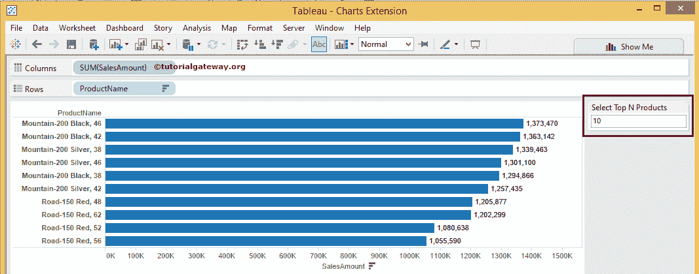

让我们把数字改为前 100 名。请注意，我们的报告根据数字显示了前 100 名产品名称。

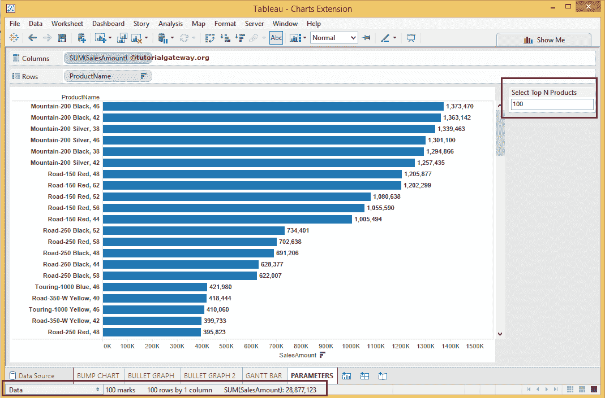

### 表范围参数

让我们看看当我们将 Tableau 参数的允许值从“全部”更改为“范围”时会发生什么。要编辑现有参数，请单击参数名称右上角的下拉箭头，然后选择编辑..选项。

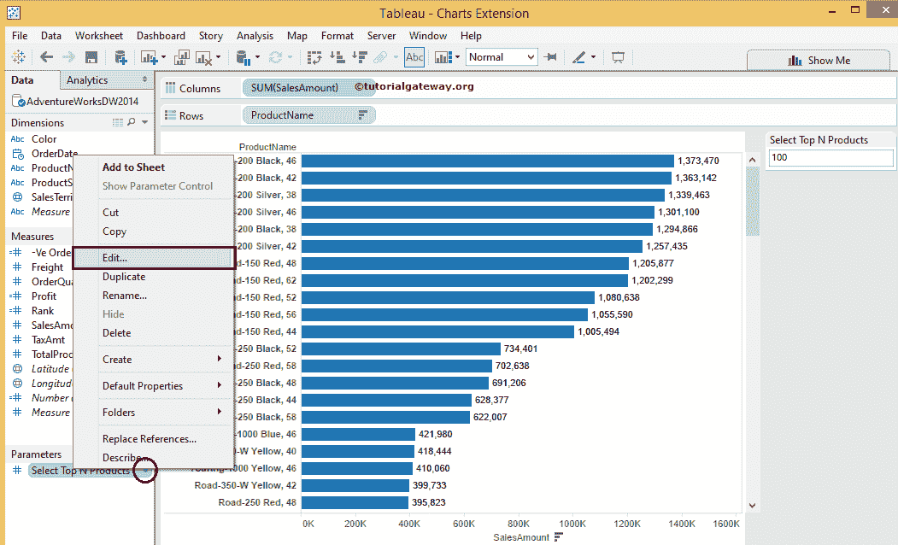

让我们将 Tableau 参数的允许值从“全部”更改为“范围”，并添加“最小值”和“最大值”。

*   最小值:请指定最小范围数。目前，我们将 2 作为最小数量。
*   最大值:指定最大范围数。我们的报告有 130 条记录，所以我们最多增加 130 条。
*   步长:缩放步长。目前，我们增加了 5 作为步长，因为我们只有 130 条记录。如果您的记录更多，请随时将这个数字更改为 50，100 或 1000。

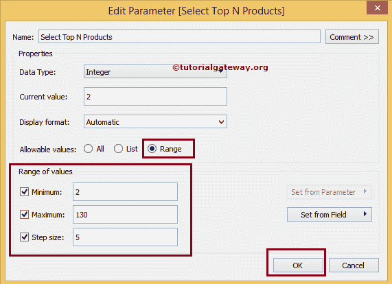

请将表格参数显示选项从输入更改为滑块。为此，请选择新创建名称右上角的下拉箭头，然后选择滑块选项。

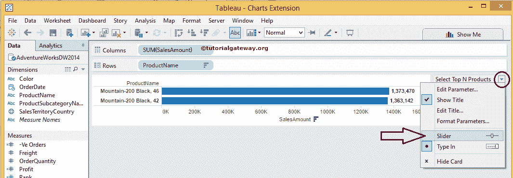

完成后，使用滑块根据参数号过滤数据。

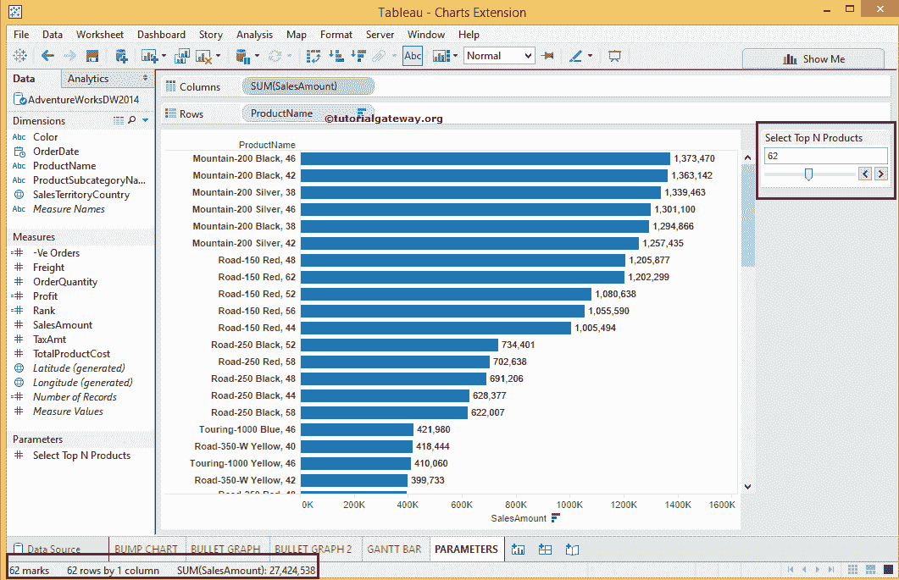

### 表格列表参数

让我们将 Tableau 参数允许值从范围更改为列表，并添加数字列表。目前，我们在列表中添加了 4 个数字。

*   值:这是用于过滤数据的数字。例如，如果我们将数字设置为 10，报告将显示前 10 条记录
*   显示为:这将是一个标签名称。如果你在这里使用更有意义的全名会有帮助

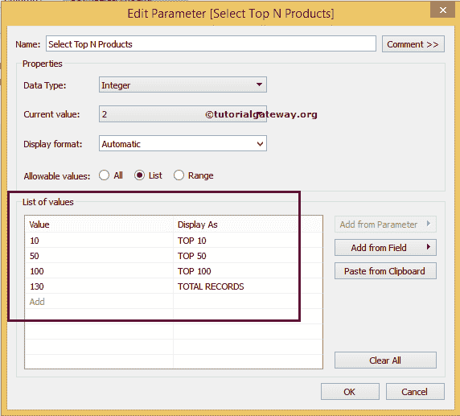

默认情况下，表格参数将显示数字 10，并标记为前 10 名。请注意，我们的报告显示了十大产品名称。

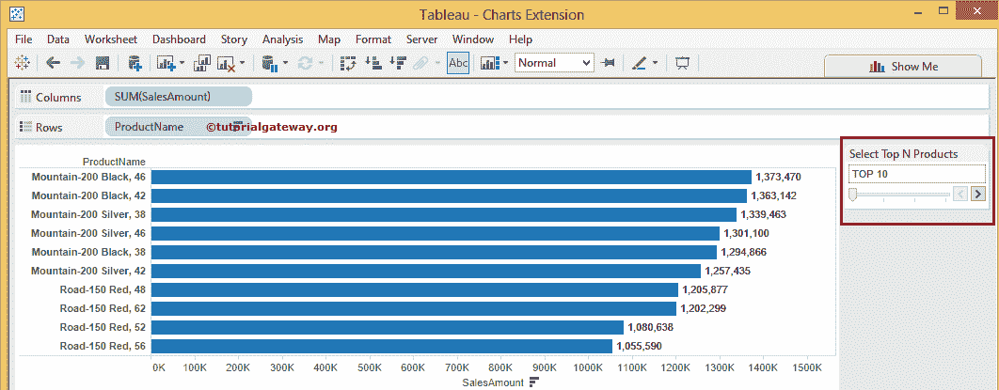

让我们把数字改为前 100 名。请注意，该报告显示了前 100 个产品名称。

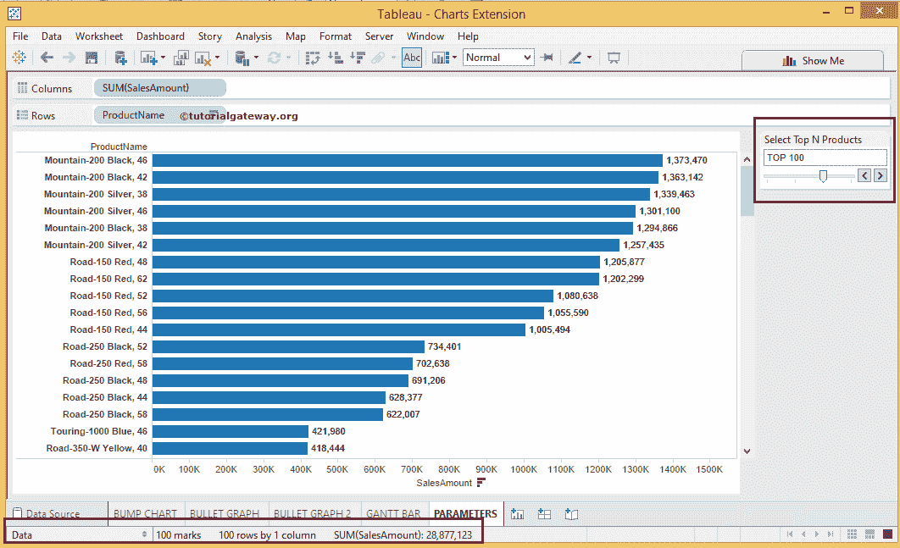