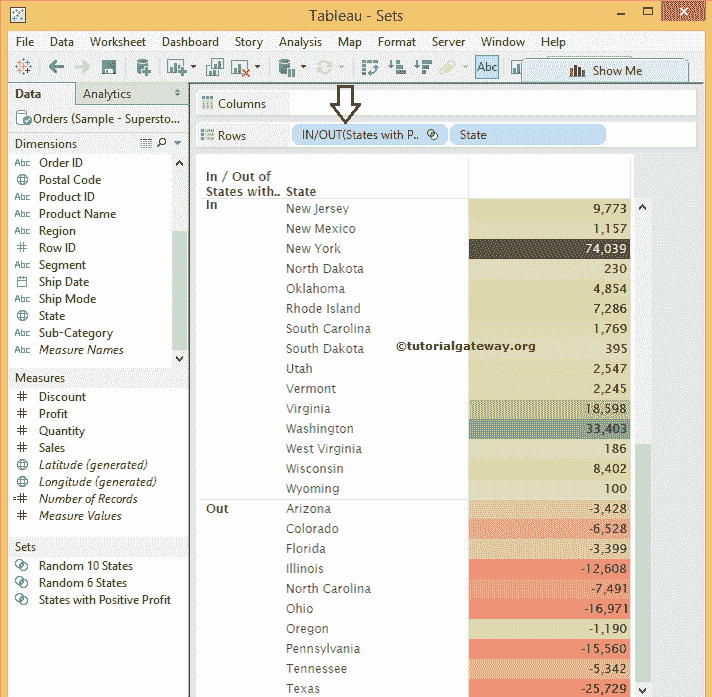

# Tableau 集合

> 原文：<https://www.tutorialgateway.org/tableau-set/>

Tableau 集合是一个自定义字段，用于保存基于某种条件的数据子集。实时地，可以通过从列表中选择成员来创建 Tableau 集。或者通过编写自定义条件或基于度量值选择顶部或底部的少数记录，等等。

Tableau 中的集合可能是有益的。例如，按利润、超过最低阈值的销售额、负利润产品等创建前 10 个州。在本文中，我们将通过一个例子向您展示如何创建 Tableau 集。

对于这个 Tableau 集合演示，我们将使用从 Tableau 网站下载的超级商店示例 excel 文件。请访问[在 Tableau](https://www.tutorialgateway.org/connecting-to-excel-files-in-tableau/) 中连接 Excel 文件文章，了解如何在 [Tableau](https://www.tutorialgateway.org/tableau/) 中连接 Excel 文件并从中提取数据。

## 表集示例

在本例中，我们将向您展示如何创建表集、常数集和计算集。首先，将州名从维区域拖放到行架，将利润从度量区域拖放到列架。

### 如何在 Tableau 中创建常量集？

Tableau 常量集成员表示固定的，一旦创建，它们就不会改变。要在 Tableau 中创建常数集，请选择要包含的成员。接下来，选择工具提示中出现的图标，然后单击创建集合…选项，如下所示。

单击该选项后，将会打开一个新窗口。

*   名称:请为此表集指定唯一的名称。请确保名称应该反映设置的功能。目前，我们将其命名为随机 10 个州
*   成员:我们在上一步中选择的成员。如果您想删除任何成员，请选择成员值并单击十字按钮
*   添加到过滤器架:如果您想将此设置添加到过滤器架，请选中此选项

单击“确定”完成第一个表集的创建。从下面的截图中，您可以观察到我们新创建的集合位于数据窗格

中

请将新创建的随机 10 个状态从集合区域拖放到行架。接下来，从行架中删除现有的州名。

从下面的截图中，您可以观察到我们的 tableau 报告仅显示输入和输出行。这是因为，默认情况下，Tableau 会将设置值显示为:

*   输入:我们选择用于创建集合的所有成员将被放入输入字段。这意味着 103，620 是我们随机选择的 10 个州的总利润
*   出局:剩余成员将进入出局区

要显示状态名称(或设置成员)，请单击行架中的输入/输出(随机 10 个状态)成员右上角的下拉箭头。接下来，从下拉菜单

中选择显示集合成员选项

现在，您可以在表集中看到州成员

如果您想检查输入字段和输出字段中的州名，请将新创建的随机 10 个产品从“器械包”部分拖放到“行货架”。接下来，将状态字段从维区域拖放到行架。

### 如何在 Tableau 中创建计算集

Tableau 计算集成员是动态的，当基础数据发生变化时，它们也会发生变化。要在表中创建计算集，请选择要在其上创建计算集的维，右键单击它将打开上下文菜单。请选择创建选项，然后选择设置..上下文菜单中的选项

选择该选项后，将打开一个名为“创建集合”的新窗口，在表中创建计算集合。我们在这个窗口中有多个选项，如下所示

*   名称:请为表集指定唯一的名称。请确保名称应该反映功能。
*   常规选项卡:使用此选项卡从可用列表中选择所需成员。
*   顶部:这是选择所有顶部和底部的少数记录。例如，基于利润的前十或后十记录。
*   条件:使用此选项卡写入自定义条件。例如，利润大于 10000 等
*   全部:这将从列表中选择所有可用成员
*   无:使用此选项取消选择所有选定的成员
*   摘要:它将显示有关器械包的信息。这包括字段名称、我们使用的条件以及我们从记录总数中选择的记录数等

#### 表集常规选项卡

在表集的“常规”选项卡中，我们还有三个选项:

*   从列表中选择:此选项允许您从可用列表中选择所需的成员。
*   自定义值列表:此选项允许您编写自定义成员。
*   全部使用:此选项允许您从列表中选择所有可用成员

表集中的自定义值列表选项–我们刚刚在这里添加了三个随机记录。实时地，你只需要写现有的值。接下来，单击“确定”完成创建我们的表集。

#### 如何编辑表集

要编辑 Tableau 中的现有集合，请单击名称右上角的下拉箭头，并从上下文菜单中选择编辑集合…选项，如下所示

选择该选项后，将打开一个新窗口来编辑现有集合。

使用表集中的所有部分选项

一旦选择该选项，您将无能为力，因为该选项将从列表

中选择所有可用成员

单击“确定”完成对现有集合的编辑。请将新创建的文件从“集”区域拖到“行架”，并将其放在“状态”字段之前，如下所示。

#### 如何删除表集

要删除 Tableau 中的现有集合，请单击集合名称右上角的下拉箭头，并从上下文菜单

中选择删除选项

#### 表集从列表中选择

在这个 tableau 集合示例中，我们将再创建一个集合，从 Tableau 中的可用状态成员中选择随机的 6 个状态。为此，请导航到“常规”选项卡，选择“从列表中选择”单选按钮，并从可用列表中选择所需的州成员。

请将新创建的随机 6 个状态从“集合”区域拖到“行架”，并将其放在“状态”字段之前。

从上面的列表中，您可以看到加利福尼亚州、特拉华州、哥伦比亚特区、佐治亚州、爱达荷州和印第安纳州都列在 in 部分，因为这些是我们在创建 Set 时选择的州。

#### 表设置条件选项卡

在本例中，我们将再创建一个集合来查找产生正利润的状态。为此，请导航到“条件”选项卡并选择“按字段”单选按钮，然后选择大于或等于 0 的利润总和。

单击“确定”在表中创建新的集合。让我们用新创建的集合替换随机 6 个状态，称为具有正利润的状态，并查看结果。

从上面的列表中，您可以看到所有将正利润放在输入字段中，将负利润放在输出字段中的州

#### 前 10 个页签的设定表

在本例中，我们将再创建一个集合来查找产生最高利润的前 10 个州。为此，请导航到顶部选项卡，选择“按字段”单选按钮，并添加常量值 10，如下所示。如果要使其动态化，请将值 10 替换为参数名称。了解参数

的创建和使用，请参考 [Tableau 参数](https://www.tutorialgateway.org/tableau-parameters/)一文

单击“确定”在表中创建新的集合。让我们用我们新创建的集合来替换具有正利润的状态，该集合被称为利润排名前 10 的状态，并查看结果。

从上面的列表中，你可以观察到加州、特拉华州、佐治亚州、印第安纳州、肯塔基州、密歇根州、明尼苏达州、纽约州、弗吉尼亚州和华盛顿按利润排名前十。请参考[组合集](https://www.tutorialgateway.org/combined-tableau-sets/)一文，了解 Tableau 中组合集的创建。