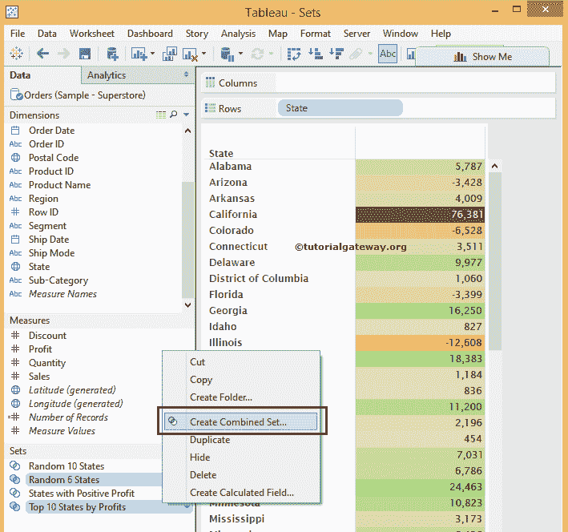

# 组合表集

> 原文：<https://www.tutorialgateway.org/combined-tableau-sets/>

Tableau 中的组合集便于比较两个现有的集合，以便进一步分析。在本文中，我们将通过一个例子向您展示如何创建组合表集。

在开始在 tableau 中创建组合集之前，我们必须了解组合 Tableau 集中存在的属性。

对于这个 Tableau 组合集示例，我们将使用从 Tableau 网站下载的超级商店示例 excel 文件。请访问[在 Tableau](https://www.tutorialgateway.org/connecting-to-excel-files-in-tableau/) 中连接 Excel 文件文章，了解如何在 [Tableau](https://www.tutorialgateway.org/tableau/) 中连接 Excel 文件并从中提取数据。

## 表组合集属性

下面的截图将向您展示用于在 Tableau 中创建组合集的窗口，它们的属性是:

*   名称:为集合指定唯一的名称。标题应该反映设置的功能。
*   集合:请从下拉菜单中选择或更改现有的集合。第一个集作为左集，第二个集作为右集
*   两个集合中的所有成员:该选项类似于 [SQL 全连接](https://www.tutorialgateway.org/sql-full-join/)。如果选择此选项，表组合集包含左集和右集的所有成员。
*   两个集合中的共享成员:该选项类似于 [SQL 内部连接](https://www.tutorialgateway.org/sql-inner-join/)。此组合集选项保存左集和右集的匹配成员。这意味着，每条记录都应该与左集合和右集合中的条件相匹配
*   除共享成员之外的左集:如果选择此选项，Tableau 组合集将保留左集的所有成员，但右集的匹配成员除外。
*   除共享成员外的右集合:此选项保存右集合中的所有成员，但左集合中的匹配成员除外。

## 创建组合表集

此示例显示了如何创建组合表集。要创建组合集，我们需要两个集。因此，我们将使用我们在上一篇文章中创建的集合。请参考 [Tableau Set 的](https://www.tutorialgateway.org/tableau-set/)部分了解 Set 的创建。

要创建组合表集，请从“集”区域选择两个集，右键单击它将打开上下文菜单。请从上下文菜单中选择“创建组合集...”选项。在本例中，我们使用了随机 6 个州和按利润排列的前 10 个州，如下所示。

选择“创建组合集...”选项后，将打开一个名为“创建集”的新窗口来配置该选项。

### 表中两个集合中的所有成员

在本例中，我们将找到随机 6 和前 10 个状态中存在的状态总数。要获取两个集合中的所有记录，我们必须选择两个集合中的所有成员选项

单击“确定”完成第一个组合表集的创建。接下来，请将新创建的集合(随机 6 和前 10 个状态中的状态)从集合区域拖到行架。并将其置于国家备案之前，如下所示。

从上面的列表中，您可以看到 tableau 报告在 in 部分显示了 12 条记录。因为在随机 6 个州(6)和按利润排名的前 10 个州(10)集合中有 16 条记录，在这 16 条记录中，有 4 条常见记录，所以它显示 12 条记录。

### 表中两个集合的共享成员

在这个 Tableau 组合集示例中，我们将找到随机 6 个状态和按利润排列的前 10 个状态集合中的公共状态总数。要从两个集合中获取公共记录，我们必须选择两个集合中的共享成员选项

单击“确定”在表中创建新的组合集。让我们用我们新创建的集合来替换随机 6 和前 10 个状态集中的状态，该集合称为随机状态前 10 个列表中的状态，并查看结果。

从上面的列表中，您可以观察到加州、特拉华州、佐治亚州和印第安纳州是随机 6 个州和按利润排名前 10 个州集合中的常见字段。

### 表组合集–除共享成员外的左集

在这个 Tableau 组合集合的例子中，我们将找到不在正确集合中的状态总数，这些状态是按利润排序的前 10 个状态。要获取随机 6 个州的所有记录，除了按利润排列的前 10 个州的记录，我们必须选择左侧集合除共享成员选项

单击“确定”完成新组合集的创建。让我们将出现在前 10 名列表中的随机状态替换为未出现在前 10 名列表中的随机 6 个状态，并查看结果

从上面的列表中，您可以看到 tableau 报告在 in 部分显示了两条记录(哥伦比亚特区和爱达荷州)。因为随机 6 个州有 6 条记录，在这 6 条记录中，随机 6 个州和按利润排列的前 10 个州有 4 条公共记录。所以它显示了 2 条记录。

### 除共享成员外的权限集

在这个 Tableau 组合集合的例子中，我们将找到左边不存在的状态总数，这是随机的 6 个状态集合。要从“按利润排列的前 10 个州”表集中获取记录，随机 6 个州的记录除外。我们必须选择除共享成员外的正确集合选项

单击“确定”在表中创建新的组合集。让我们用我们新创建的集合，称为随机 6 列表中不存在的前 10 个状态来替换随机 6 列表中不存在的前 10 个状态，并查看结果。

