# 表分组

> 原文：<https://www.tutorialgateway.org/tableau-grouping/>

Tableau Grouping 是合并或组合两个或多个值以进行进一步分析的过程。例如，当我们看到按地区划分的产品报告时，我们可能会发现一些表现不佳的产品。有时，看到所有那些表现不佳的产品可能会很烦人。因此，我们必须对这些记录执行 Tableau 分组(组合这些记录)，并在 Tableau 报告中将它们显示为一个产品。

在本文中，我们将通过示例向您展示如何在 Tableau 报表中执行分组？。对于这个 Tableau 分组演示，我们将使用我们在上一篇文章中创建的报告。

请访问 Tableau Reports 文章中的[数据标签，了解数据源和](https://www.tutorialgateway.org/data-labels-in-tableau-reports/) [Tableau](https://www.tutorialgateway.org/tableau/) 报告。下面截图会给大家展示

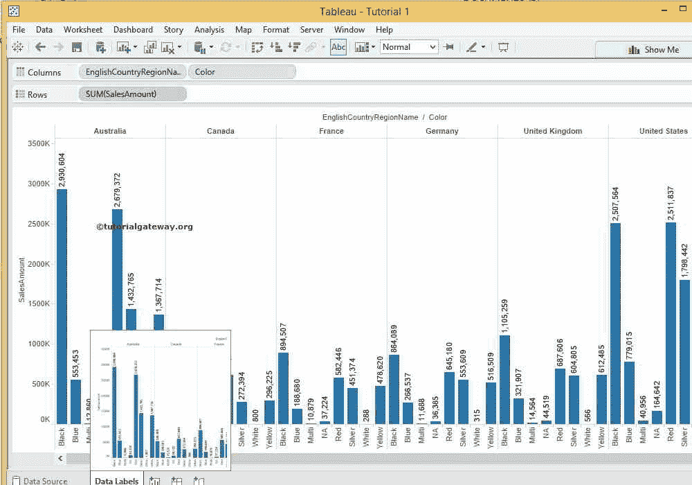

的报表预览

如果您观察下面的截图，我们强调的数据，如多、北美和白色产品，在所有国家/地区的表现都不好。所以，让我们团结他们

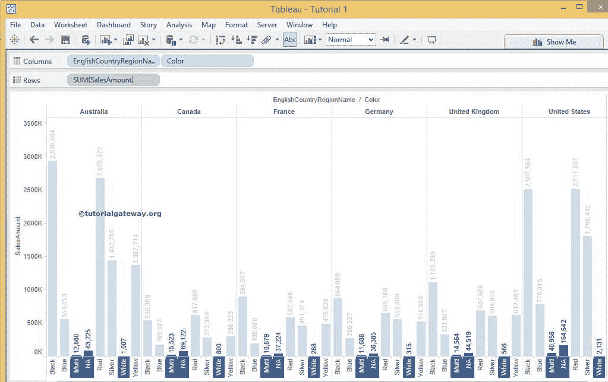

## 表分组法

我们可以用多种方式执行 Tableau 分组。第一种方法，当您从 Tableau 报告中选择各种记录或值时，将显示一个类似窗口的工具提示。请点击下方截图

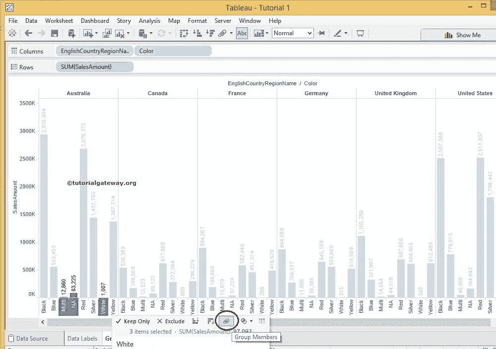

中的群组成员按钮

点击按钮后，tableau 会自动将这些项目分组。就这样。我们做到了。在这里，我们无法看到轴标签，因此，让我们翻转或旋转图表

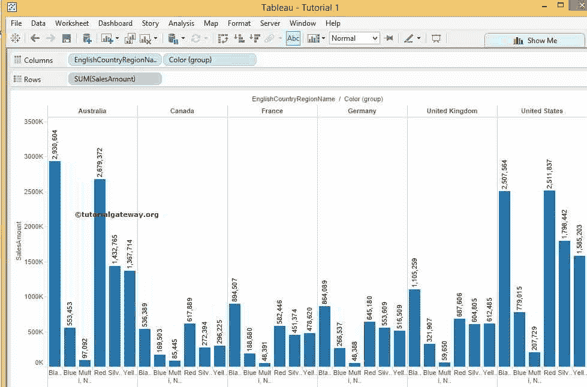

可以看到

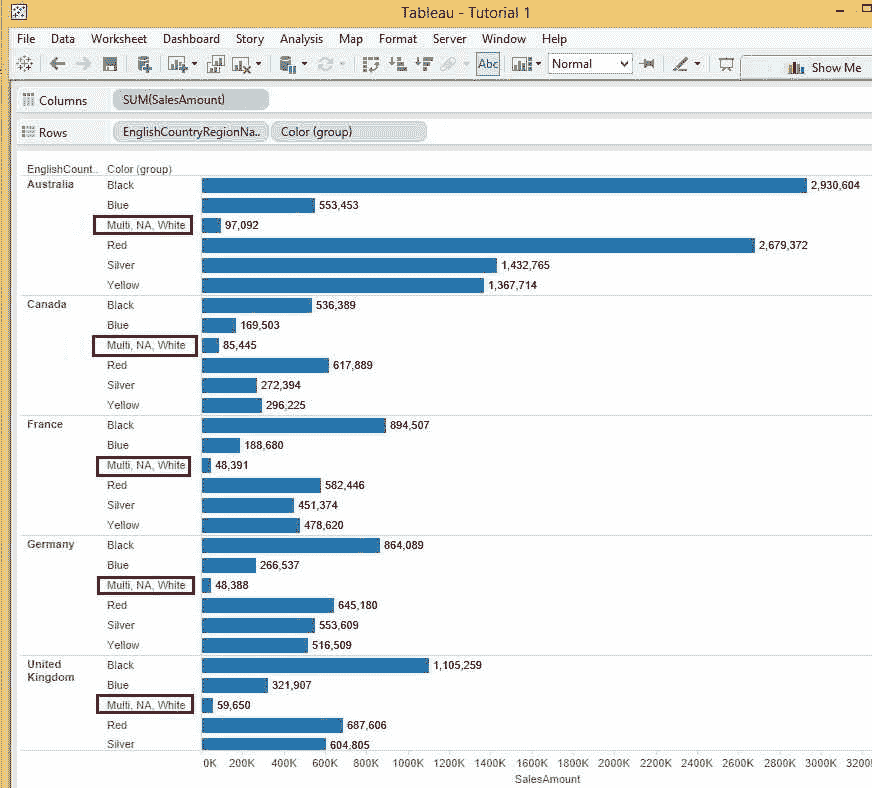

的产品

## 表分组方法 2

Tableau 分组的第二种方法是使用工具栏选项。选择要合并的列，然后单击 Tableau 工具栏中的“组”按钮。从下面的截图中，你可以观察到当你悬停在按钮上时，它会显示工具提示。

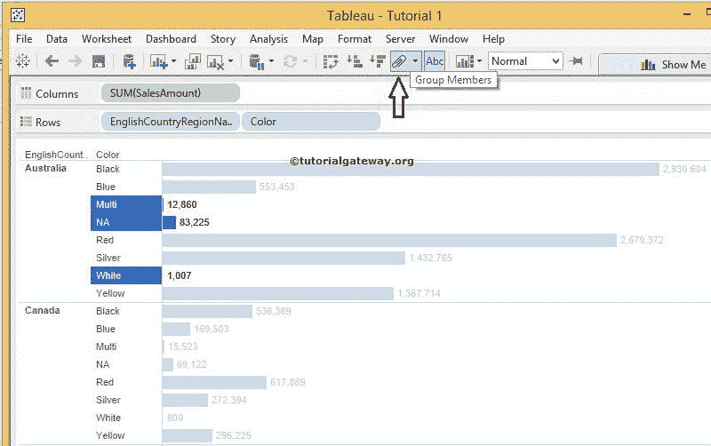

一旦你点击按钮，它会显示你将创建一个新的组颜色。从下面的截图中，您可以观察到我们成功创建了颜色组。你可以在“行卡”

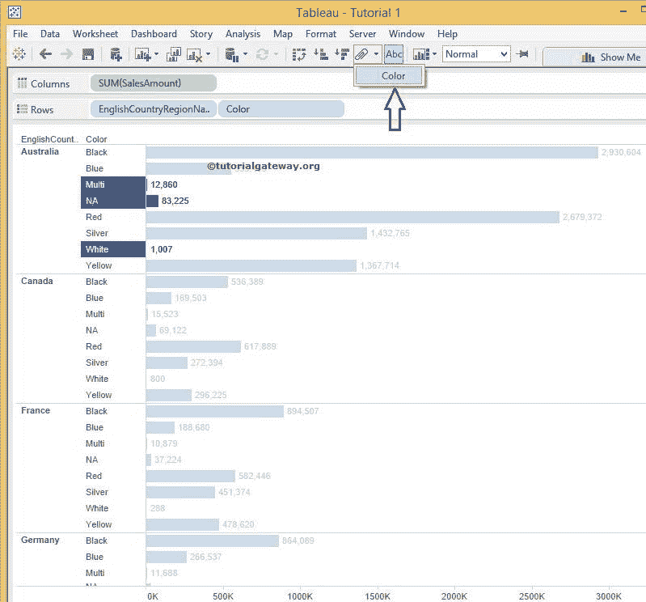

中看到这个名字

### 更改表分组名称

在轴栏中，右键单击新创建的成员并选择编辑别名..上下文菜单中的选项

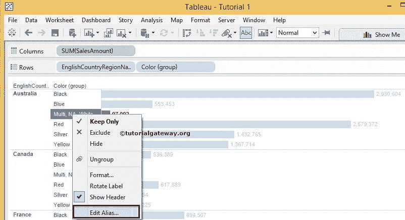

选择编辑轴后..选项，将打开以下窗口更改或更改 Tableau 组名称

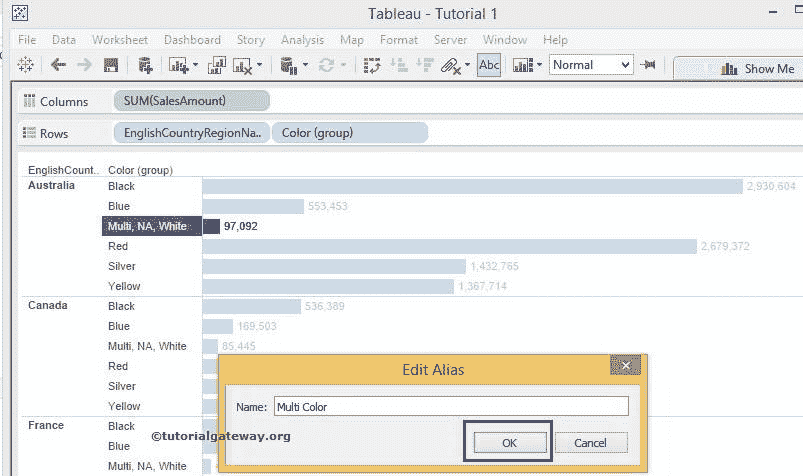

## 方法 3

选择并右键单击要对其执行分组的维。请选择创建，然后选择分组..选项

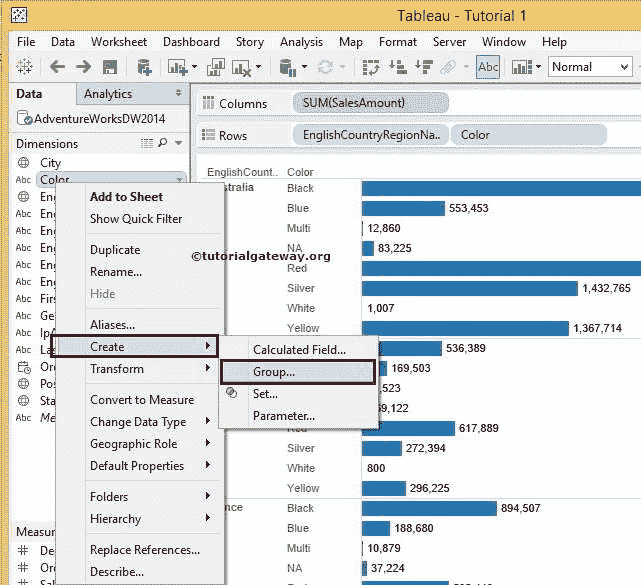

选择该选项后，将打开“创建组”窗口，其中显示该维度中的可用记录。你可以注意到我们只有 8 条不同的记录。请选择要合并的记录。在本例中，我们将对多色、北美和白色产品进行分组。所以，选择他们，点击

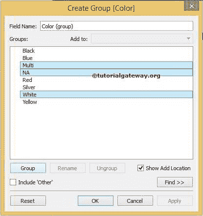

分组按钮

接下来，编辑名称。这里我们改成了多色，点击

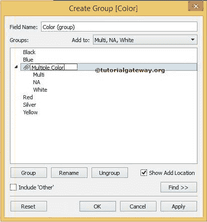

确定按钮

虽然我们对多产品、北美产品和白色产品进行了分组。下面的截图显示的是单个产品，而不是联合产品。因为我们没有改变“行卡”的颜色。

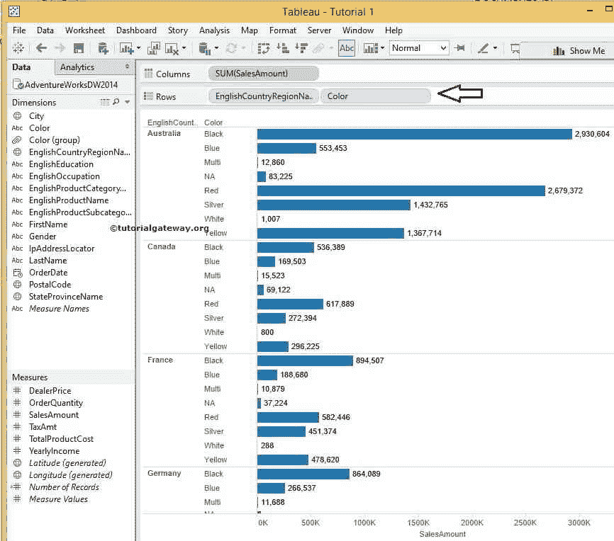

一旦使用颜色组更改颜色维度，Tableau 将更新报告，如下图所示

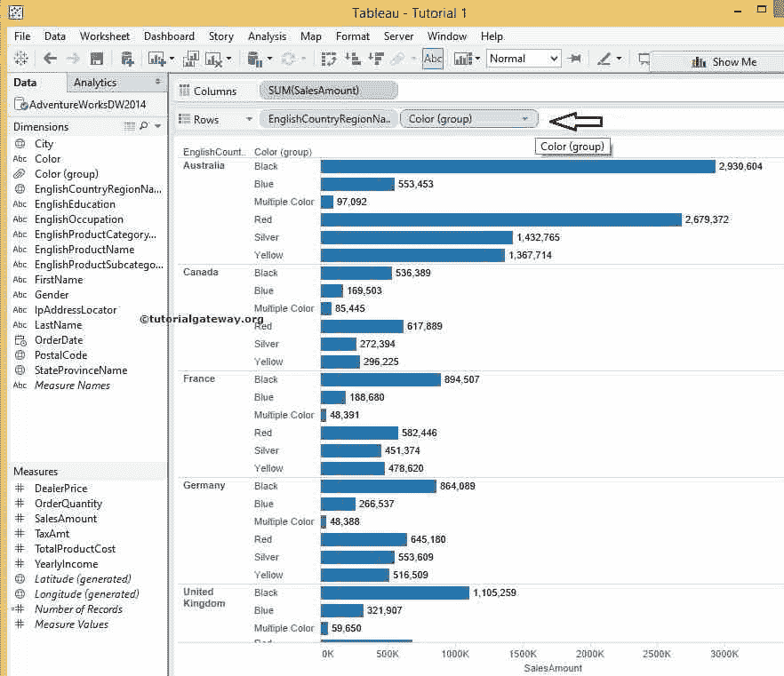

## 删除表分组

要删除 Tableau 中的分组，选择并右键单击要删除的名称将打开上下文菜单。请选择删除选项。

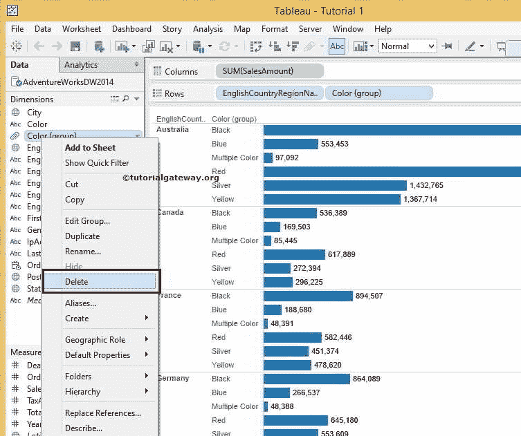

由于我们在报告中使用了颜色分组，它会显示以下错误。我们点击了“否”按钮，因为我们不想删除它

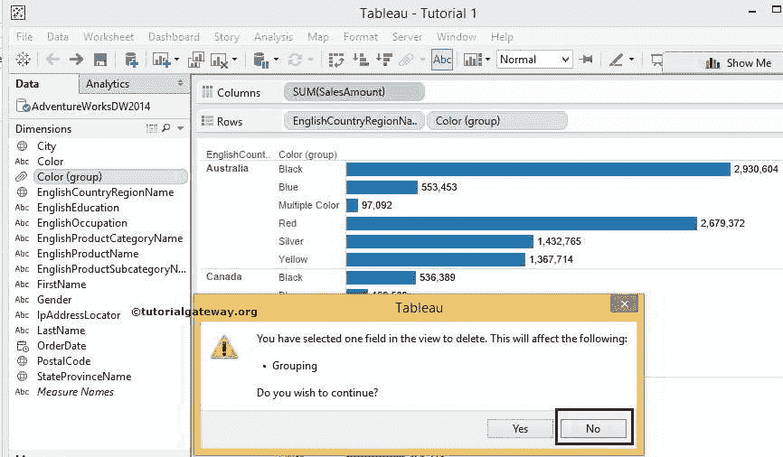