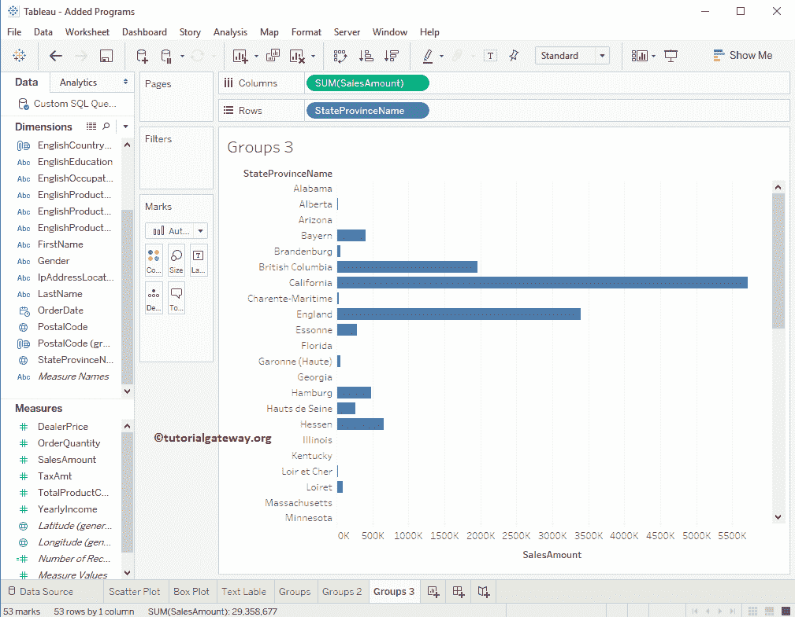

# Tableau 组

> 原文：<https://www.tutorialgateway.org/tableau-group/>

在本文中，我们将通过一个例子向您展示如何创建 Tableau 组。对于这个 Tableau 组演示，我们将针对 SQL Server 数据源编写自定义 SQL 查询。

建议大家参考[连接 Tableau 到 SQL Server](https://www.tutorialgateway.org/connecting-tableau-to-sql-server/) 文章，了解 [Tableau](https://www.tutorialgateway.org/tableau/) 配置。我们将用于此 Tableau 组报告的自定义 [SQL](https://www.tutorialgateway.org/sql/) 查询是:

```
SELECT ProdCat.EnglishProductCategoryName, 
       ProdSubCat.EnglishProductSubcategoryName, 
       Geo.EnglishCountryRegionName, 
       Geo.StateProvinceName, 
       Geo.City, 
       Geo.PostalCode, 
       Geo.IpAddressLocator, 
       Prod.EnglishProductName, 
       Prod.Color, 
       Prod.DealerPrice, 
       Cust.FirstName, 
       Cust.LastName, 
       Cust.Gender, 
       Cust.YearlyIncome, 
       Cust.EnglishEducation, 
       Cust.EnglishOccupation, 
       Fact.OrderQuantity, 
       Fact.TotalProductCost, 
       Fact.SalesAmount, 
       Fact.TaxAmt, 
       Fact.OrderDate
FROM DimProductSubcategory AS ProdSubCat
   INNER JOIN
     DimProduct AS Prod ON ProdSubCat.ProductSubcategoryKey = Prod.ProductSubcategoryKey 
   INNER JOIN
     DimProductCategory  AS ProdCat ON ProdSubCat.ProductCategoryKey = ProdCat.ProductCategoryKey 
   INNER JOIN
     FactInternetSales AS Fact ON Prod.ProductKey = Fact.ProductKey 
   INNER JOIN
     DimCustomer AS Cust ON Fact.CustomerKey = Cust.CustomerKey
   INNER JOIN
     DimGeography AS Geo ON Cust.GeographyKey = Geo.GeographyKey
```

## 创建Tableau 组

在本例中，我们将展示如何创建 Tableau 组。为此，首先将颜色从维区域拖放到行货架，将销售额从度量区域拖放到列货架。


从上面的截图可以看到，Tableau 智能已经画出了条形图。让我们将标签添加到每个栏中，这样我们就可以看到每种颜色的总销售额。为此，请将“度量中的销售”区域拖放到标记架中的标签字段。


### 创建 Tableau 组的第一种方法

从上面的截图中，您可以观察到 Multi、NA 和 White 彩色产品的销售额非常少，所以让我们将这些低性能产品合并为一个。要在表中创建组，请选择要包含在您的类别中的成员。接下来，选择工具提示中代Tableau 组成员选项的图标。


### 创建 Tableau 组的第二种方法

请按住 CTRL 或 SHIFT 键选择要包含在集合中的成员，右键单击它们将打开上下文菜单。请选择“组”选项。


现在你可以在 Tableau 设计区


看到我们新创建的群

## 从形状创建Tableau 组

在前面的例子中，我们向您展示了创建简单集合的步骤。此示例显示如何从形状生成 tableau 组。为此，我们使用了我们在上一篇文章中创建的散点图。如果您观察该图，我们已经在“标记货架”中添加了“列货架的销售额”、“行货架的订单数量”和“详细信息的邮政编码”字段。


请按住 CTRL 或 SHIFT 键选择要包含在集合中的成员，并在工具提示中选择图标，如下所示。


现在，您可以在维度窗格中看到我们新创建的维度。


### 从代表多个维度的标记创建Tableau 组

在前面的例子中，我们向您展示了使用标记创建类别的步骤。在某些情况下，每个标记代表多个维度。在本例中，我们解释了如何从表示多个维度的标记创建 tableau 组。在这个演示中，我们使用了我们在上一篇文章中创建的散点图。

如果您观察该图，我们已经在“标记货架”中添加了“列货架的销售额”、“行货架的订单数量”、“彩色字段的英文国家/地区名称”和“详细信息的邮政编码”字段。


请按住“控制”或“移位”按钮，选择您想要包含在集合中的成员。这里，每个标记都代表英语国家名称和邮政编码(多维度)。这就是为什么工具提示中的图标为您提供了选择选项的选项。现在，我们正在选择英语国家地区名称


现在你可以看到英文国家地区名称组


让我把选项改为后一个


下面的截图将向您展示[散点图](https://www.tutorialgateway.org/tableau-scatter-plot/)按邮政编码和国家名称分组。


将鼠标悬停在任何组项目上将打开一个工具提示，其中包含详细信息


## 从维窗格创建Tableau 组

在本例中，我们将向您展示如何从维度窗格创建 Tableau 组。为此，请将省/自治区名称从维区域拖放到行架，将销售额从度量区域拖放到列架。



要从维窗格创建Tableau 组，请选择要在其上创建组的维，然后右键单击它将打开上下文菜单。请选择创建选项，然后选择组..选项。


选择该选项后，将会打开一个新窗口

*   字段名称:请指定类别的唯一名称，或保留默认名称。确保，并且名称应该反映设置的功能。
*   添加到:这将显示现有的。您可以使用此功能将项目添加到现有集合中。


我们正在选择一些随机的低性能状态。请不要忘记点击


群组按钮

一旦你点击按钮，一个随机名字的新组将被创建。您可以使用重命名按钮根据您的规格


更改名称

接下来，单击应用，然后单击确定按钮关闭窗口。就是这样；我们成功地从维度窗格创建了我们的 Tableau 组。让我们用州省名称组替换行架中的州省名称。


它将在 Tableau 报告中显示新创建和添加的组。


### 删除Tableau 组

右键单击该名称以打开上下文菜单，用于删除 Tableau 中的现有组。请选择删除选项。

