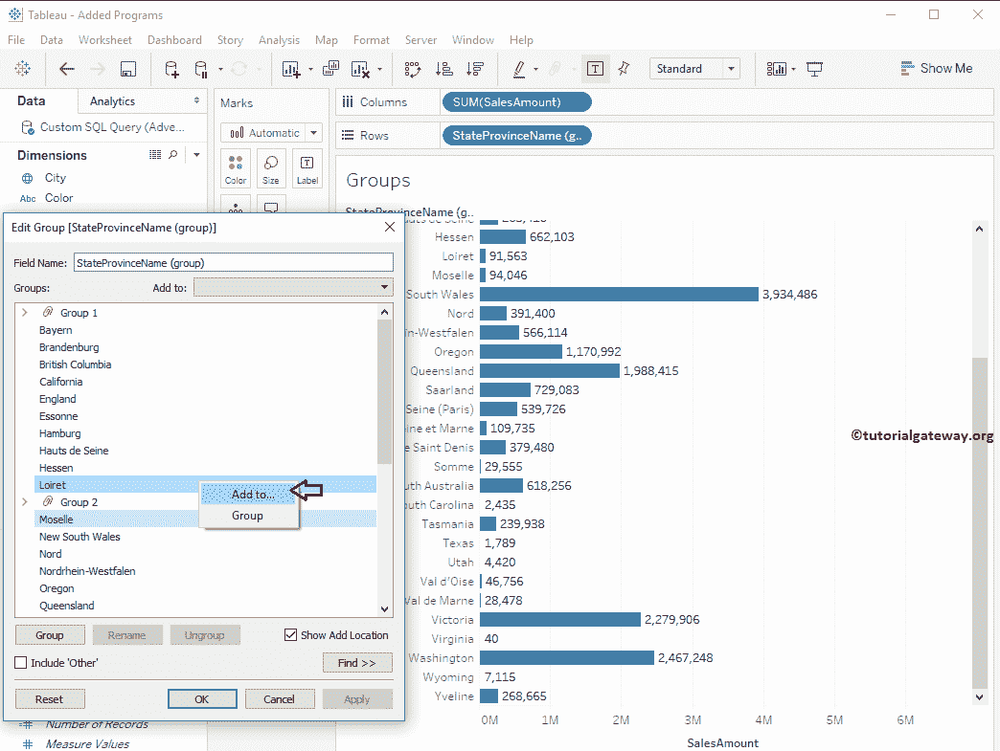
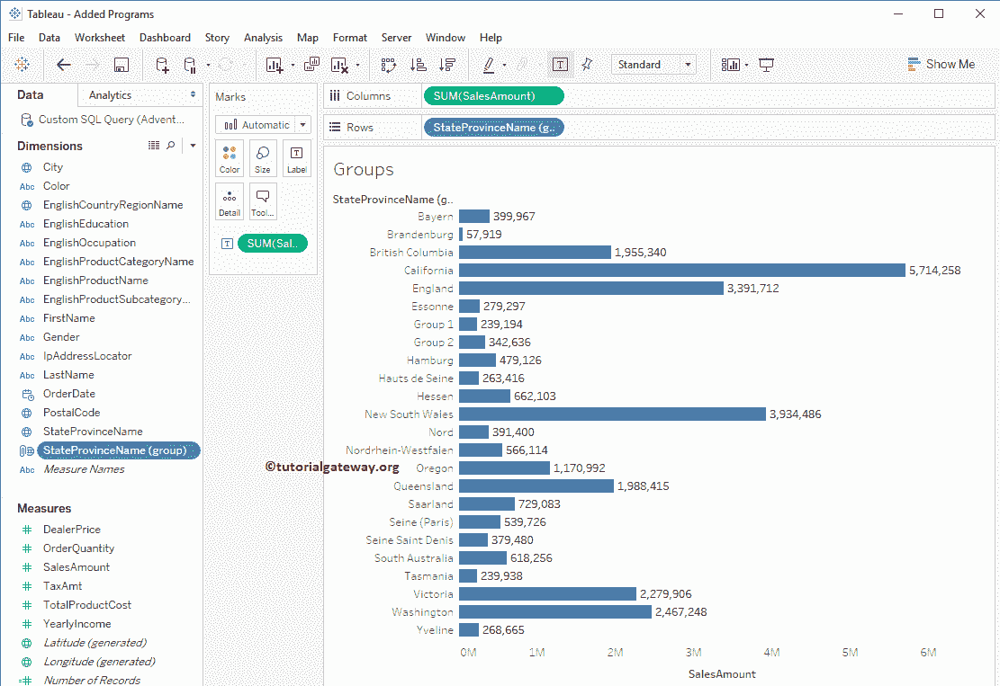

# 如何编辑Tableau 组

> 原文：<https://www.tutorialgateway.org/how-to-edit-tableau-group/>

在本文中，我们将通过一个例子向您展示如何更改或编辑 Tableau 组。为此，我们将使用我们在上一篇文章中创建的 Tableau 表。

从下面的截图中，您可以观察到我们还有几个州以最少的销售额运行。因此，我们的任务是将这些状态添加到现有组或创建一个新组。建议大家参考 [Tableau 组](https://www.tutorialgateway.org/tableau-group/)文章了解 [Tableau](https://www.tutorialgateway.org/tableau/) 配置。

## 编辑Tableau 组

要编辑现有组，请选择要更改的组，然后右键单击它将打开上下文菜单。请选择编辑组..选项

选择“组”后..选项，一个名为【编辑组】的新窗口将打开

### 添加新Tableau 组

在这里，我们将创建一个新的组。从下面的截图中，你可以观察到我们正在选择低性能状态，并点击了

组按钮

现在，您可以看到新的组以及我们在 [Tableau 组](https://www.tutorialgateway.org/tableau-group/)文章中创建的旧组。

接下来，我们使用重命名按钮将组名更改为组 1 和组 2。我建议你按照你的要求改名字(有意义的名字)。

接下来，单击应用，然后单击确定按钮关闭窗口。从下面的截图可以看到我们新创建的群

### 向 Tableau 组添加成员的第一种方法

请选择您想要添加的成员，右键单击它将打开包含两个选项的上下文菜单。请选择添加到..选项将成员添加到现有组，或选择“组”选项创建新组。从下面的截图中你可以观察到我们选择的是 Loiret 状态

选择“添加到”后..选项，将打开一个名为“添加到组”的新窗口，其中包含现有的组名。请选择要添加到的组名。

### 向 Tableau 组添加成员的第二种方法

请选择您要添加的成员，并从添加到下拉列表中选择组名，如下图所示

下面的截图将显示我们新添加的状态。

### 向 Tableau 组添加成员的第三种方法

将成员拖放到您要添加的组中

### 将一个组的成员添加到另一个组

请选择您要添加的成员，然后将该成员拖到另一个组

下面的截图将向您展示我们编辑的群组。

