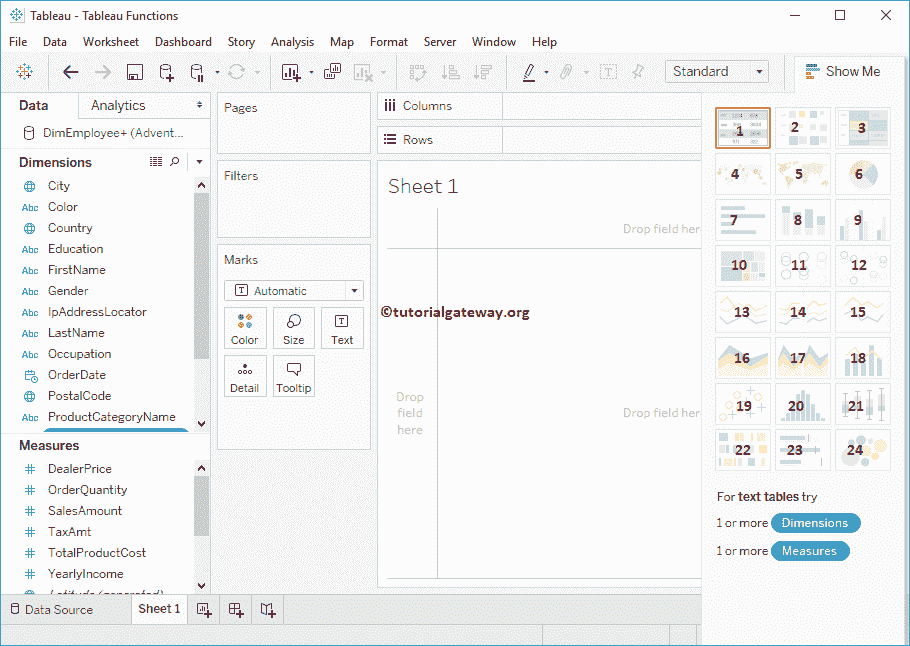

# Tableau 图表

> 原文：<https://www.tutorialgateway.org/tableau-charts/>

Tableau 图表有助于根据业务需求分析数据。为了分析数据，一些公司可能对表感兴趣，其他公司可能对条形图、地图、趋势等感兴趣。Tableau 中有各种内置图表来可视化记录。在本文中，我们将向您展示可用的 Tableau 图表列表。

## 图表类型表

Tableau 是所有关于创建一个充满活力和用户友好的报告使用各种各样的数据源。可用的 Tableau 图表类型列表。

Tableau 桌面中图表的详细列表如下所示。下面指定的标题是超链接，所以点击它将向您展示特定的例子。

1.  [文本标签](https://www.tutorialgateway.org/tableau-text-label/):使用该文本标签创建透视数据(也称为交叉表)
2.  [热图](https://www.tutorialgateway.org/tableau-heat-map/):显示条纹和颜色。
3.  [突出显示表](https://www.tutorialgateway.org/highlight-table-in-tableau/):这种类型的[表](https://www.tutorialgateway.org/tableau/)图表将帮助您使用颜色来比较分类数据。
4.  [符号地图](https://www.tutorialgateway.org/how-to-create-a-map-in-tableau/):使用气泡可视化地理信息。
5.  [地图](https://www.tutorialgateway.org/maps-in-tableau/):可视化地理信息。
6.  [派](https://www.tutorialgateway.org/pie-chart-in-tableau/):显示高级数据集很方便。例如，按国家、地区等进行销售。
7.  [横条](https://www.tutorialgateway.org/bar-chart-in-tableau/):这个表图比较方便。例如，用这个来比较今年和往年的销售额。
8.  [堆积横条](https://www.tutorialgateway.org/stacked-bar-chart-in-tableau/):此图有助于进一步划分[横条](https://www.tutorialgateway.org/bar-chart-in-tableau/)
9.  [并排条形图](https://www.tutorialgateway.org/grouped-bar-chart-in-tableau/):也称为分组条形图。用它来直观地并排比较记录。
10.  [树形图](https://www.tutorialgateway.org/tableau-treemap/):该图显示矩形框中的记录。
11.  [圆形视图](https://www.tutorialgateway.org/circle-views-in-tableau/):以圆形显示数值。
12.  [并排圆形视图](https://www.tutorialgateway.org/circle-views-in-tableau/):此 Tableau 图表显示多个测量的圆形
13.  [行](https://www.tutorialgateway.org/tableau-line-chart/):用这个显示趋势。例如，连续期间的温度、销售趋势等。
14.  [离散线](https://www.tutorialgateway.org/tableau-line-chart/):显示离散线
15.  [双线](https://www.tutorialgateway.org/dual-lines-chart-in-tableau/):有助于多项指标趋势对比。
16.  [区域图](https://www.tutorialgateway.org/tableau-area-chart/):用于图形化表示定量数据。
17.  [离散区域](https://www.tutorialgateway.org/tableau-area-chart/):用于创建定量数据的离散区域图。
18.  [双重组合](https://www.tutorialgateway.org/tableau-dual-combination-chart/):帮助您将一个衡量标准与其他衡量标准进行比较。
19.  [散点图](https://www.tutorialgateway.org/tableau-scatter-plot/):表中的散点图对于可视化任意两组数据之间的关系非常有用
20.  [直方图](https://www.tutorialgateway.org/tableau-histogram/):可视化用户指定范围内的统计信息。
21.  [方框和触须图](https://www.tutorialgateway.org/tableau-box-plot/):使用该方框和触须图，通过对特定数据进行分组，以图形方式可视化数值数据。
22.  [甘特图](https://www.tutorialgateway.org/gantt-chart-in-tableau/):可视化事件或活动的持续时间。
23.  [靶心图](https://www.tutorialgateway.org/tableau-bullet-graph/):使用此 Tableau 图表显示三维数据。
24.  [打包气泡图](https://www.tutorialgateway.org/tableau-bubble-chart/):显示气泡中的数据