# Tableau 区域图

> 原文：<https://www.tutorialgateway.org/tableau-area-chart/>

Tableau 区域图是一种折线图，其中轴和线之间的区域用颜色填充。在本文中，我们将通过一个例子向您展示如何创建区域图。在这个 Tableau 区域图演示中，我们将使用样本-超级商场数据源。

## Tableau 区域图示例

要首先创建 Tableau 区域图，请将数量从度量区域拖放到行架。由于它是一个度量值，因此数量将聚合为默认的总和。一旦您拖动它们，条形图将生成。

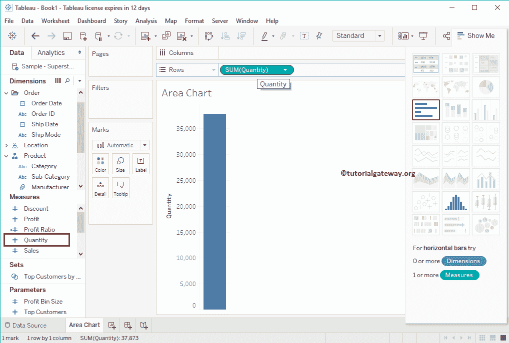

接下来，将年从维区域拖放到[表](https://www.tutorialgateway.org/tableau/)列架。一旦拖动它们，将生成 Tableau [折线图](https://www.tutorialgateway.org/tableau-line-chart/)。

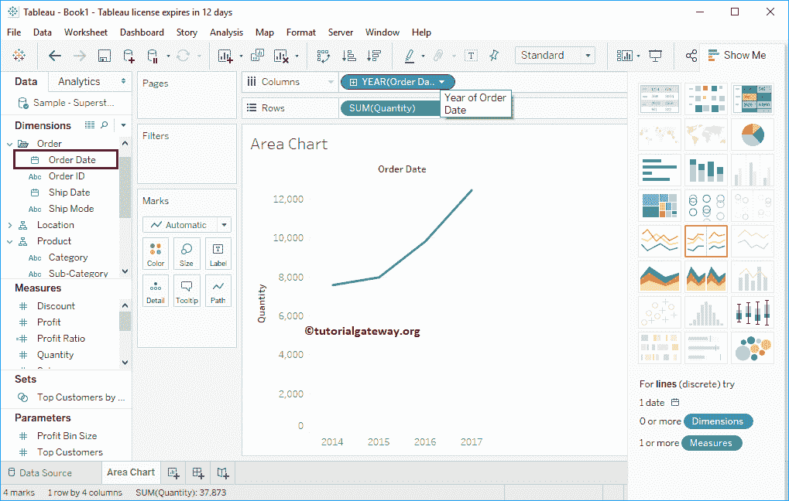

让我们将值从年更改为每年的所有月份，以查看详细的月度信息(趋势)

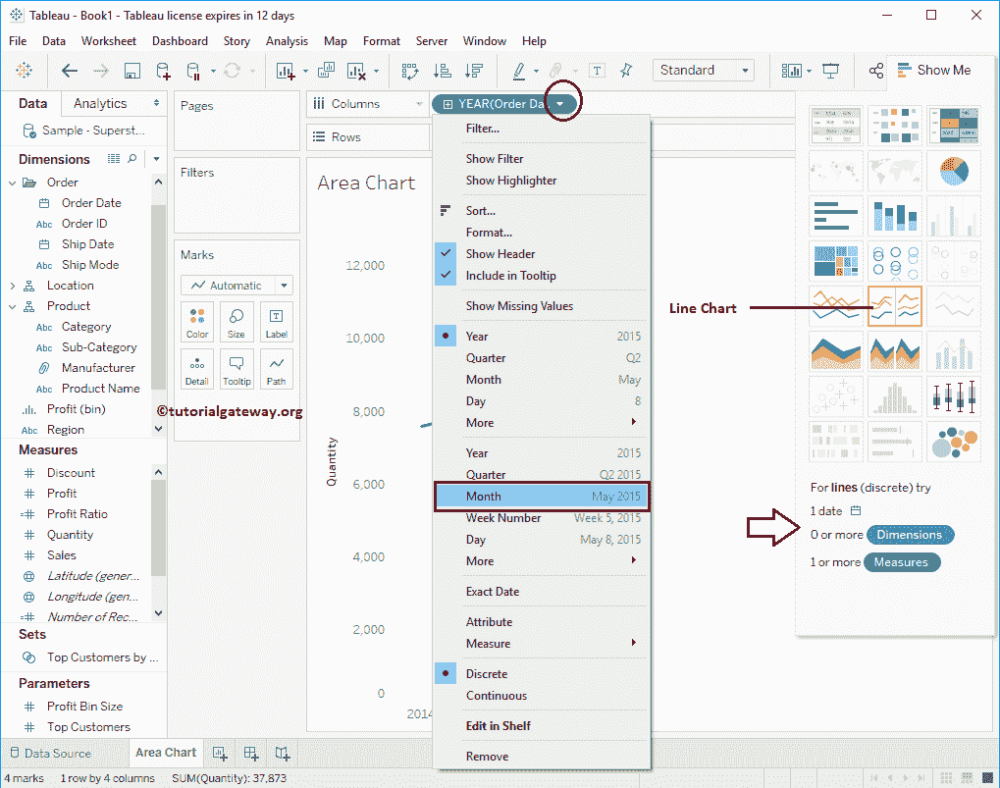

现在，您可以看到 2014 年、2015 年、2016 年、2017 年和 2018 年每个月的详细折线图

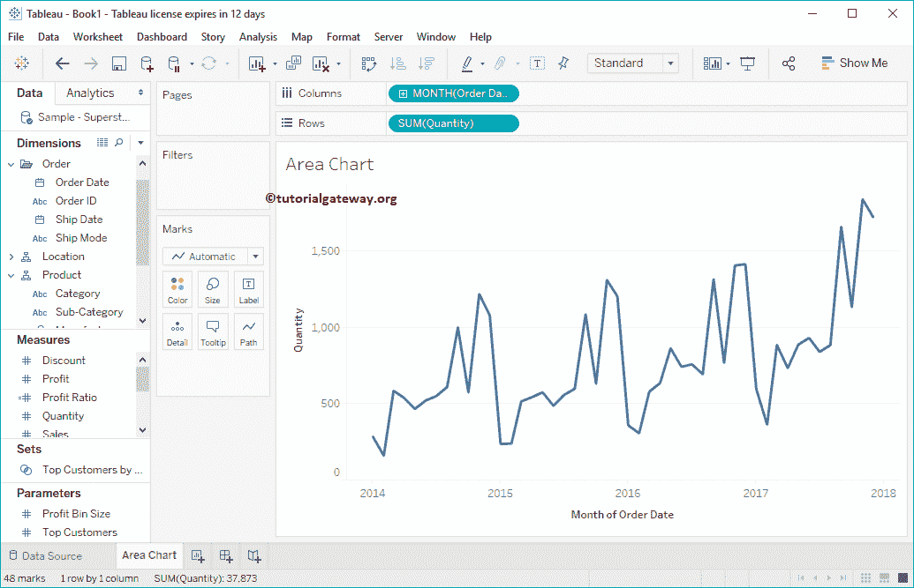

让我比较一下每个类别的趋势。为此，请将类别从维度区域拖放到标记架中的颜色字段。

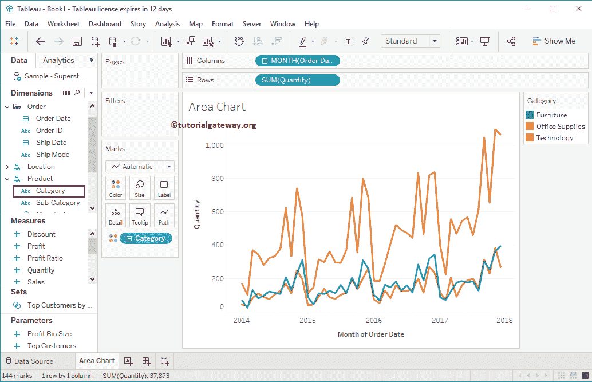

现在，您可以看到每个类别的趋势。要将折线图转换为区域图，请将标记类型从自动更改为 Tableau 区域图。或者，从“演示”窗口中选择区域图。

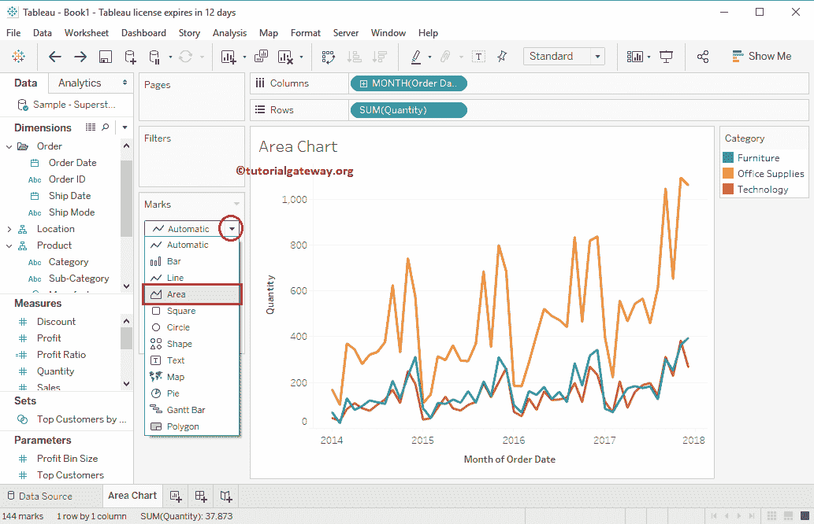

现在你可以看到区域图

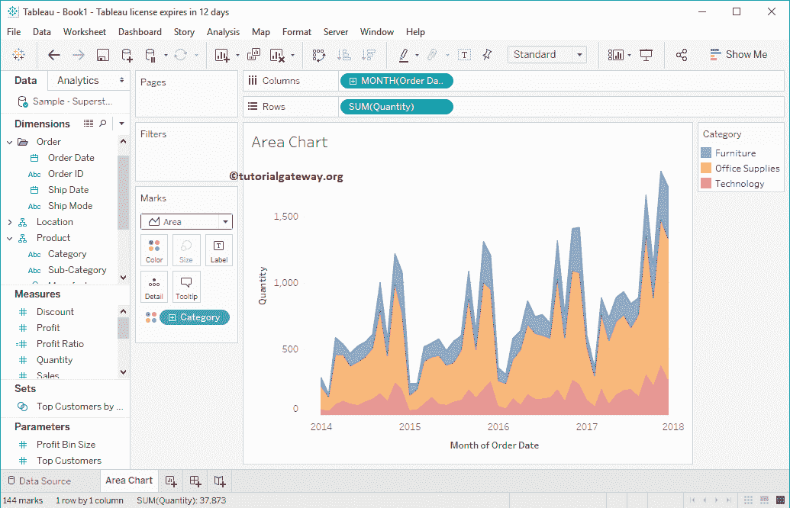

让我更改类别位置

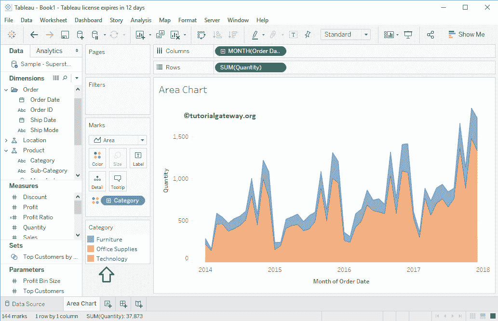

### 向 Tableau 区域图添加标签

将类别从维度区域拖放到标记架中的文本或标签字段。正如你在区域图上看到的类别名称。

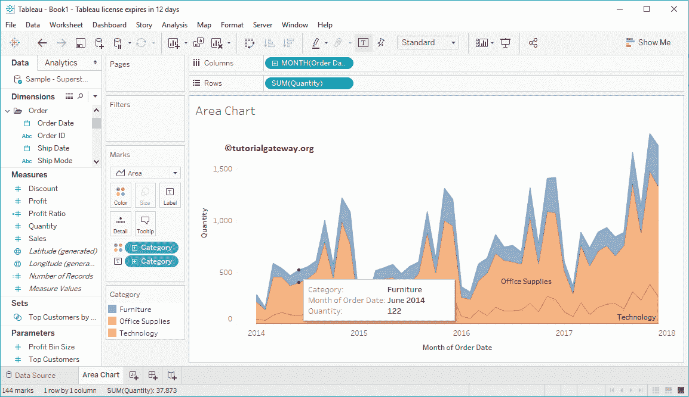

### 详细区域图

让我展开类别来显示每个子类别

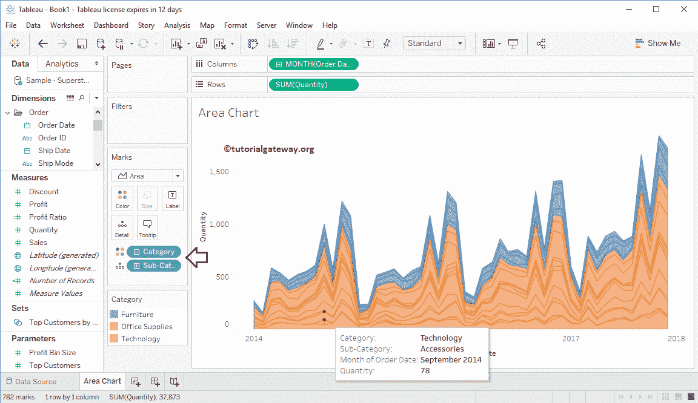

的区域图

我们根据产品名称

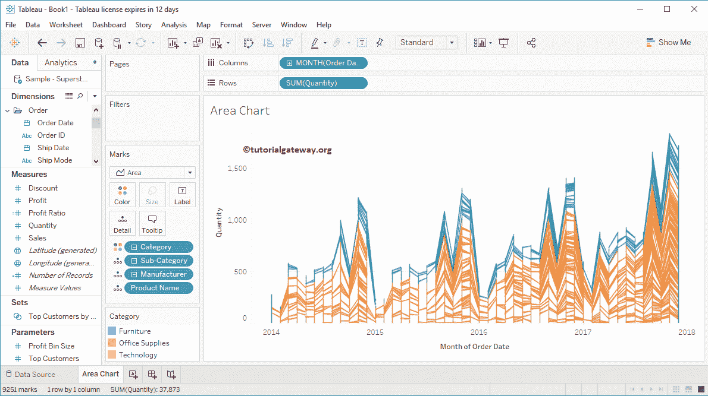

进一步划分了区域图

选择任何特定的区域将向您显示该特定点的信息。

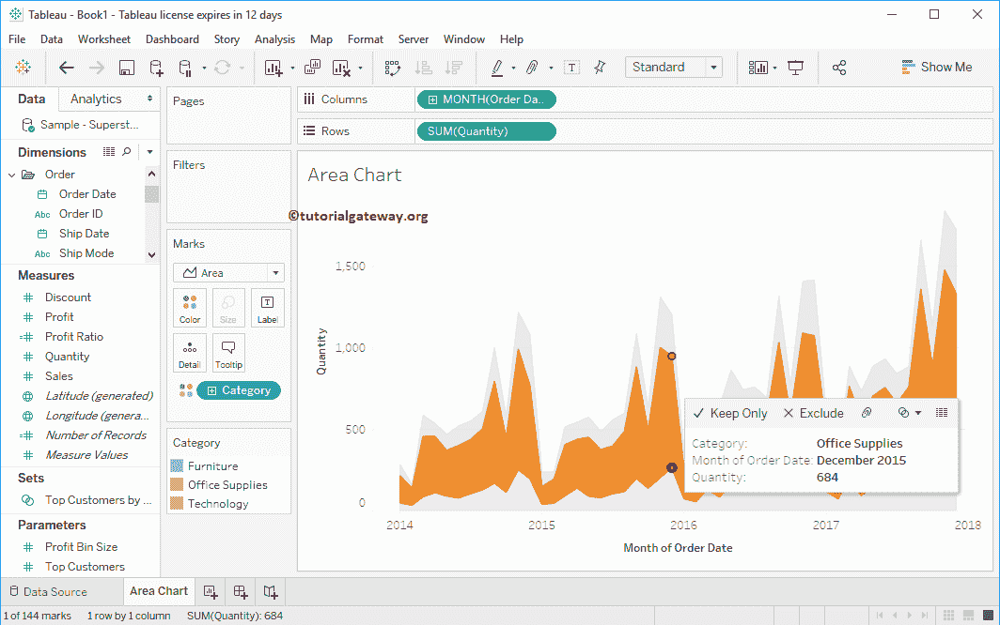

### 表中的离散区域图

演示在表中还有一个名为“离散区域图”的选项。让我从展示

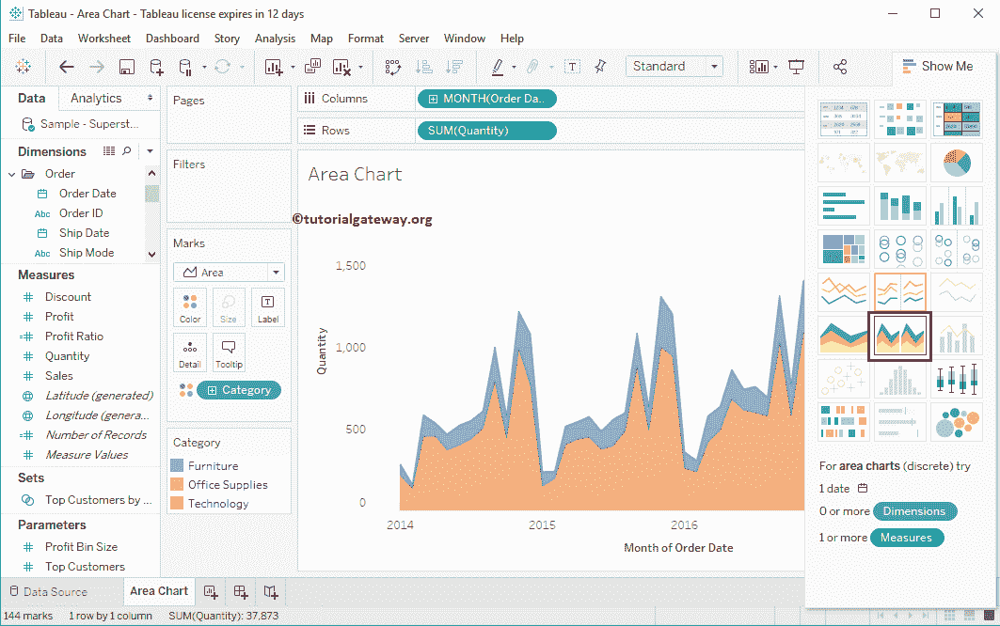

中选择相同的

现在，您可以在表中看到每个类别的离散区域图。

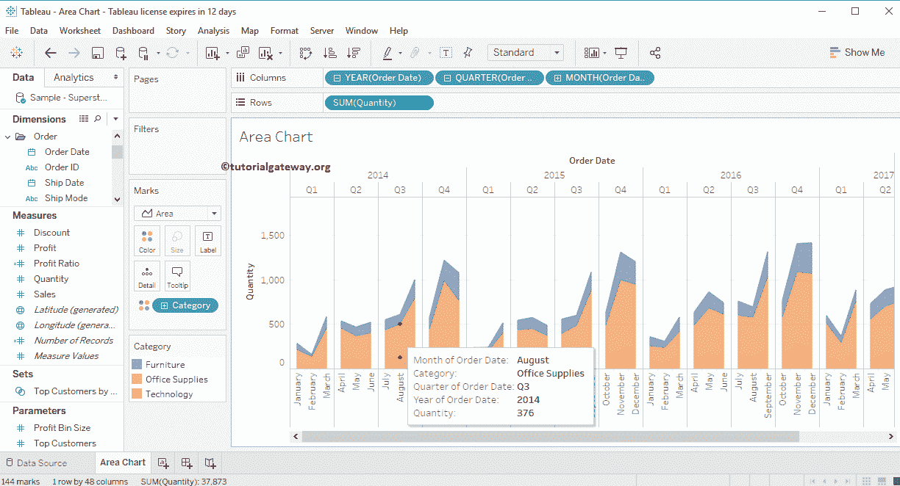