# Bar chart(条形图)

> 原文：<https://www.tutorialgateway.org/bar-chart-in-tableau/>

Tableau 中的条形图便于直观地比较数据。例如，如果我们想按颜色检查销售额，我们可以使用这个。通过查看这个 Tableau 条形图，可以了解哪种颜色的产品与其他产品相比表现更好。

在 Tableau 桌面中创建条形图非常容易。如果将度量值拖到列卡，将维度拖到行卡，它将自动生成条形图。在本文中，我们将向您展示如何在 Tableau 和 Stacked 中创建条形图。

## 在表中创建条形图示例

要创建这个，首先，在标记卡中拖放颜色维度到行架和销售额到文本选项。由于“销售额”是一个度量值，因此它将聚合为默认的“总和”。

接下来，我们必须使用“演示”选项将表报告更改为表条形图。请展开“演示”窗口，并从中选择显示的选项

请访问【报告中的数据标签】文章，了解[表](https://www.tutorialgateway.org/tableau/)数据源。

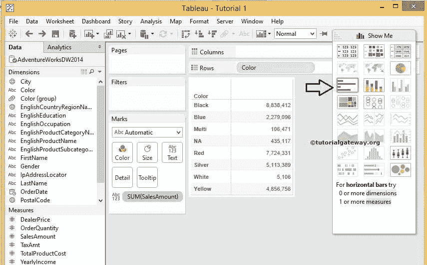

从“演示”窗口中选择该选项后，将显示条形图。

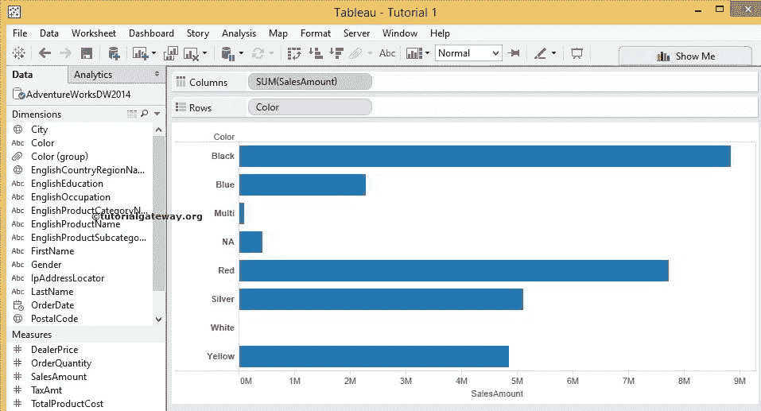

Tableau 允许我们将水平条形图转换为垂直柱形图。为此，请单击表工具栏中的交换选项。

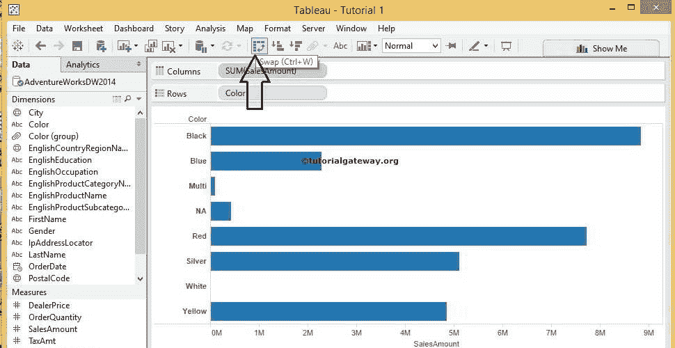

一旦你点击交换选项，我们的水平转换为垂直列。

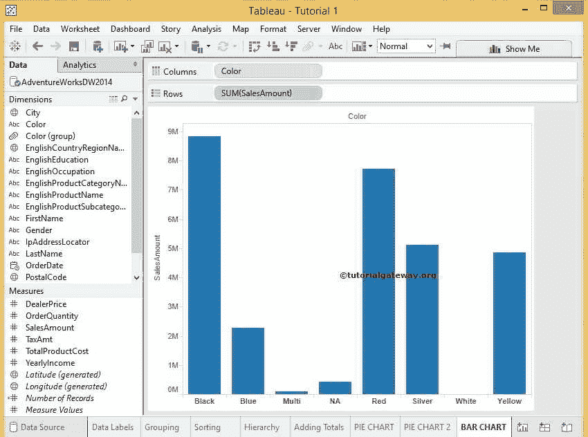

如果你观察上面的截图，它提供了一个完美的结果，但是我们无法确定每种颜色的确切销售额。为了解决这些情况，我们必须显示数据标签。

### 向表中的条形图添加数据标签

要添加数据标签，请将数据标签值从维度或度量窗格拖放到标记卡中的标签选项。在本例中，我们希望将销售金额显示为数据标签，因此，将销售金额从测量区域拖放到标签选项

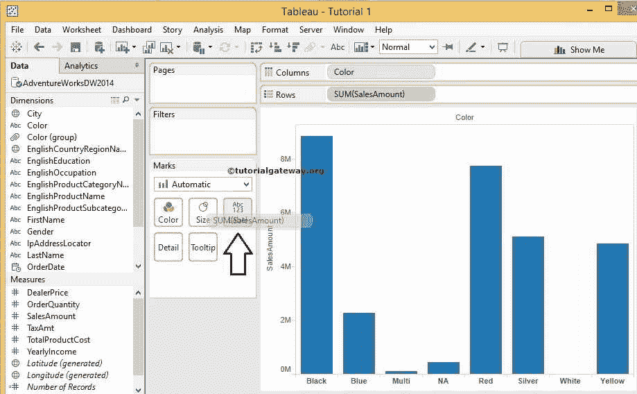

完成后，您可以在表报告

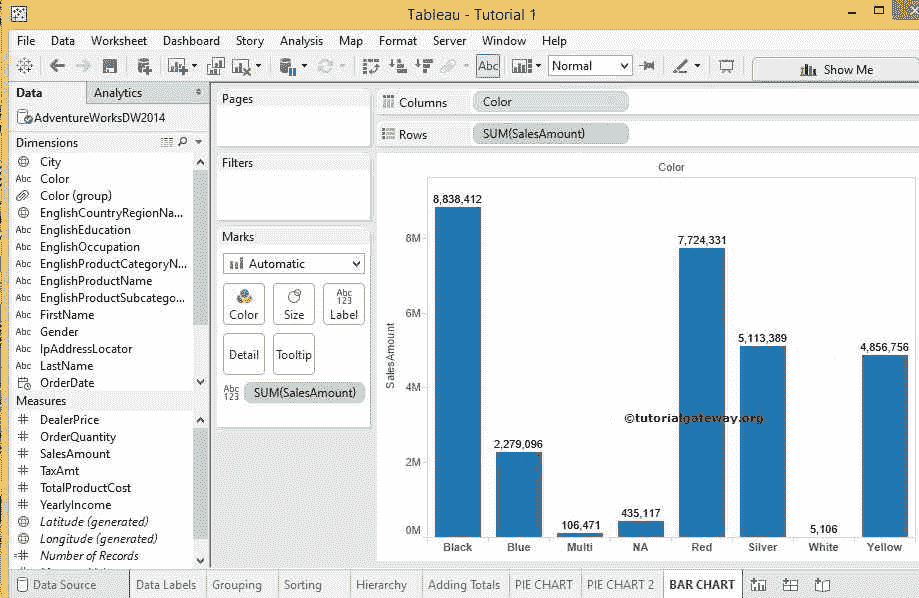

中看到数据标签

## 表中的堆叠条形图

与任何其他商业智能工具相比，创建堆叠非常容易。在这个例子中，我们想通过国家区域来显示，所以，我们将英语国家区域名称从维度区域拖动到标记卡

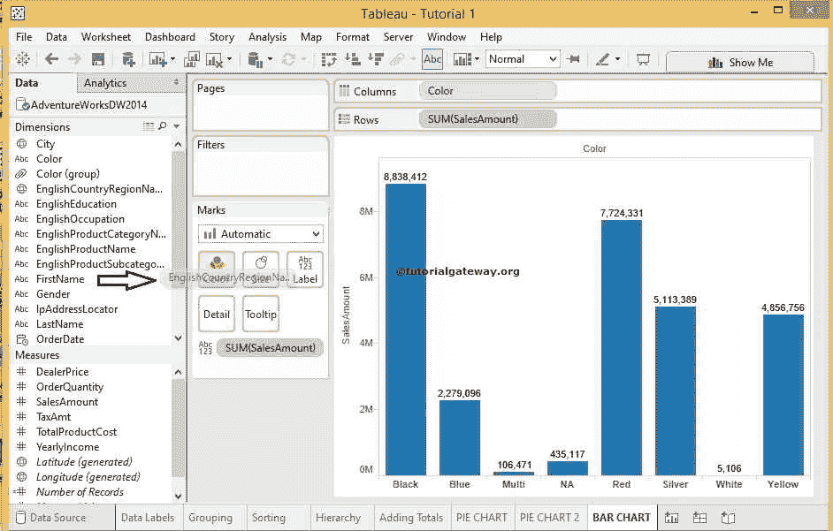

中的颜色选项

完成后，您可以看到堆叠条形图。Tableau 桌面为每个区域分配默认颜色，但是在“标记区域”中，您可以通过选择“编辑颜色”来编辑颜色..选项。

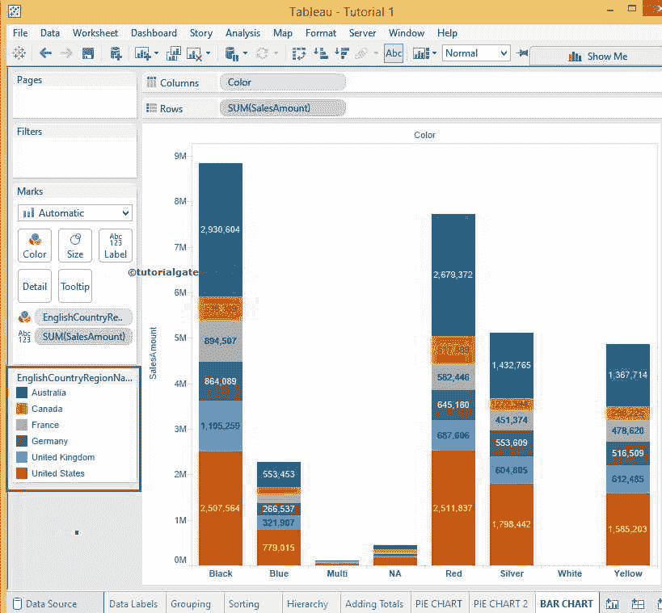

## 方法 2

请从标记卡

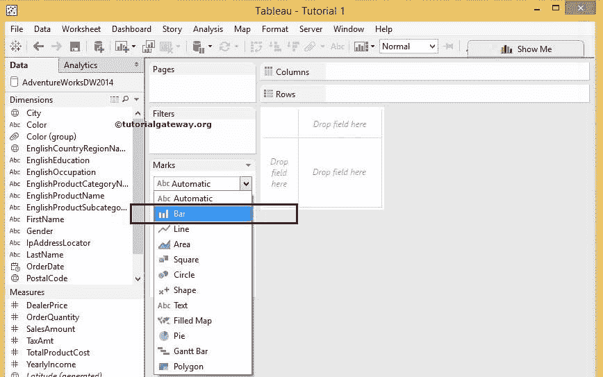

的下拉列表中选择条形选项

接下来，将颜色从维度区域拖放到行架

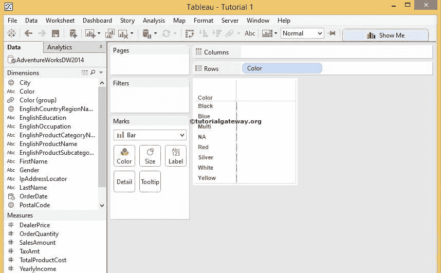

接下来，将销售额从测量区域拖放到归档区域。由于它是一个度量值，因此销售金额将合计为默认的总和。你可以看到表条形图

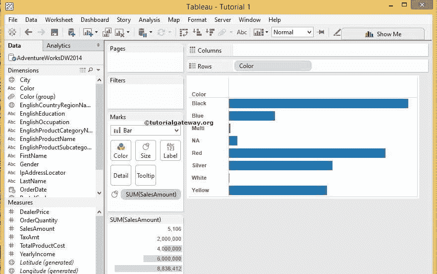