# Tableau 方框图

> 原文：<https://www.tutorialgateway.org/tableau-box-plot/>

Tableau 方框图对于以图形方式可视化数字数据(按特定数据分组)非常有用。让我们通过一个例子来看看如何在 Tableau 中创建一个箱线图。

## 如何创建Tableau 方框图

在这个例子中，我们将在 Tableau 中创建一个盒子图。为此，首先将“销售金额”从“度量”区域拖放到“行”货架，将“颜色”从“维度”区域拖放到“标记”货架中的“详细信息”字段。

[表](https://www.tutorialgateway.org/tableau/)智能自动创建[条形图](https://www.tutorialgateway.org/bar-chart-in-tableau/)，但我们想创建一个方框图。因此，请从“演示”窗口中选择方框图选项。

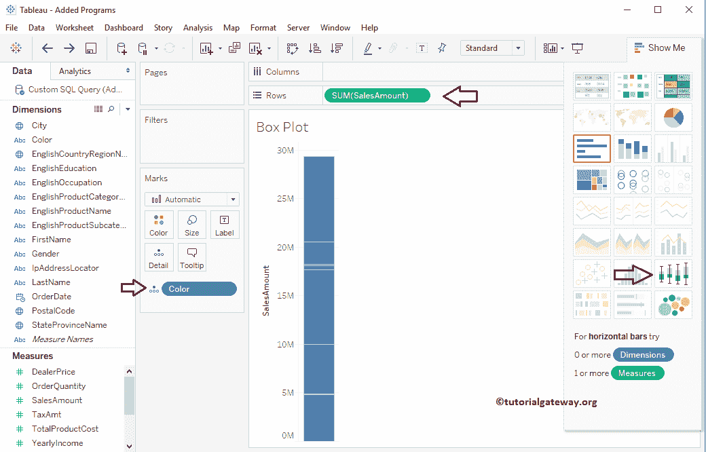

从下面的截图中，你可以看到 Tableau Boxplot。

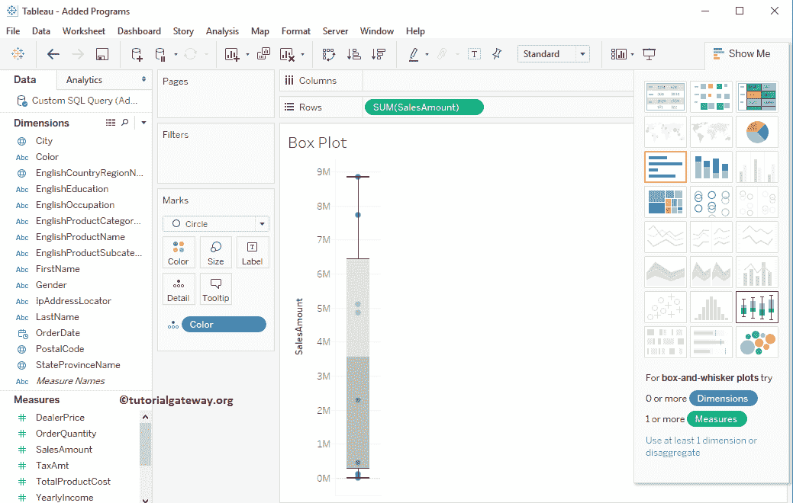

让我将英文国家/地区名称从“维度”拖到“栏”架。它将为每个国家

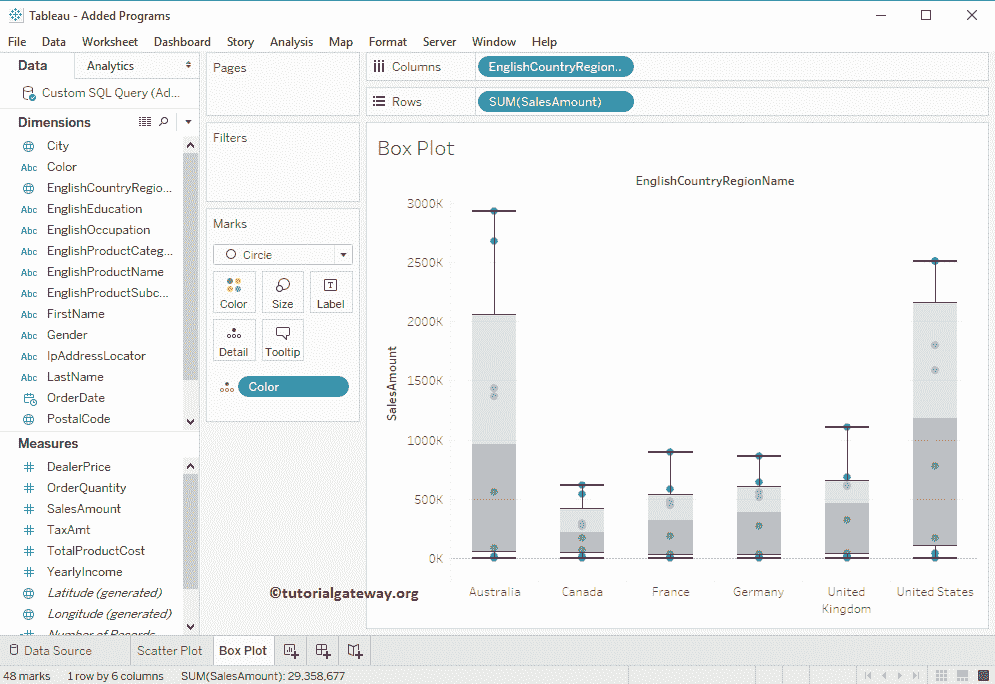

创建一个方框图

您可以将鼠标悬停在方框图上，查看中位数、上四分位数、下四分位数和触须值。

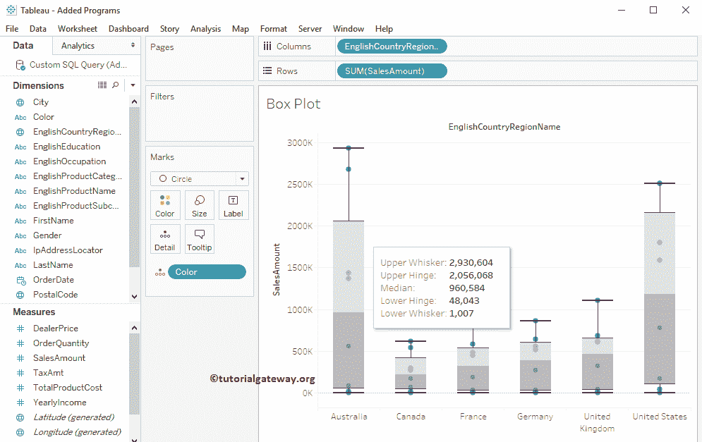

## 更改表框绘图的颜色

我们将向您展示如何更改 Tableau Boxplot 框的颜色。我们有两种不同的方法来创建它。

第一种方法:请右键单击方框图并选择编辑..选项。

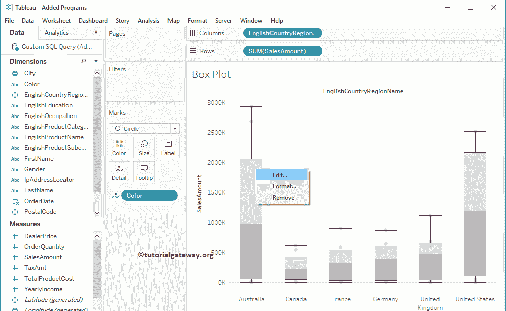

选择编辑后..选项时，将打开一个名为“编辑参考线”或“标注栏”的新窗口来设置 Tableau 框绘图的样式。

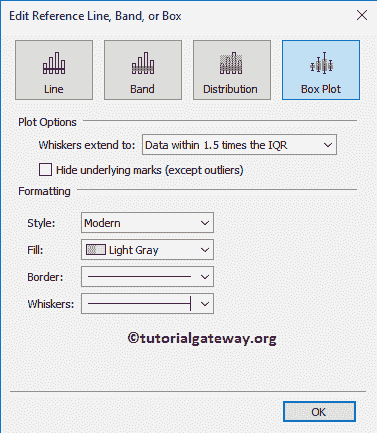

第二种方法:转到格式菜单，选择参考线…将打开格式参考线标签。

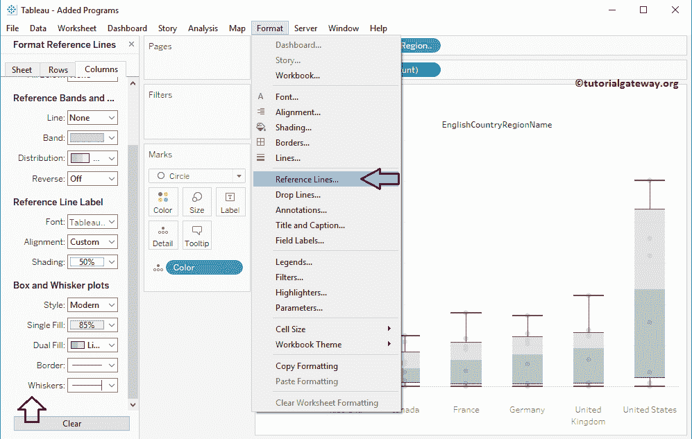

让我将填充颜色更改为红色托盘。

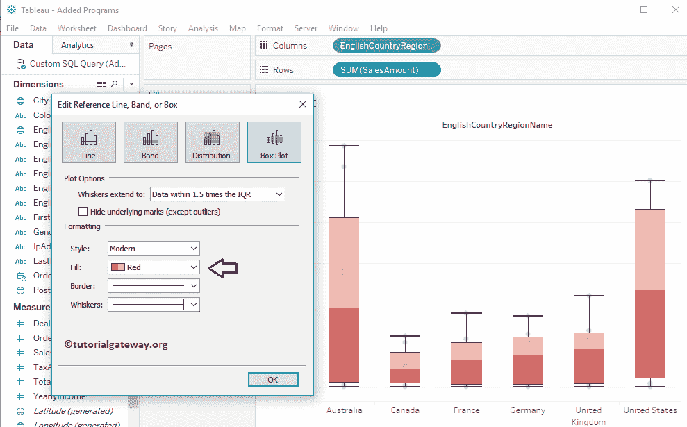

接下来，我们将更改 Tableau boxplot

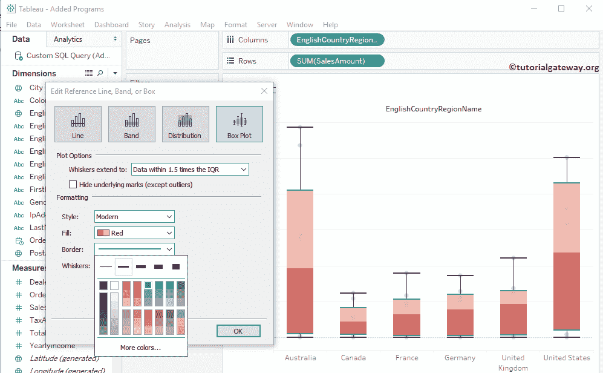

的边框宽度和边框颜色

最后，我们正在改变胡须的宽度和颜色

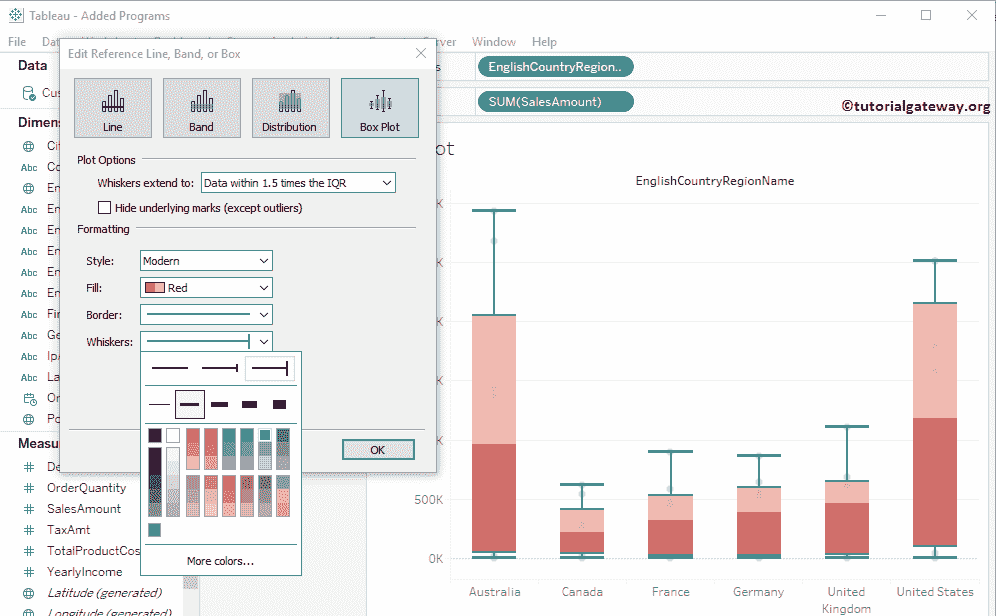

### 改变 Tableau 盒子和触须图中点的颜色

本示例说明如何为 Tableau 方框图中的点添加颜色。为此，请将英文国家/地区名称从“尺寸区域”拖放到“标记架”中的“颜色”字段，如下所示。意思是每个国家都有自己的颜色

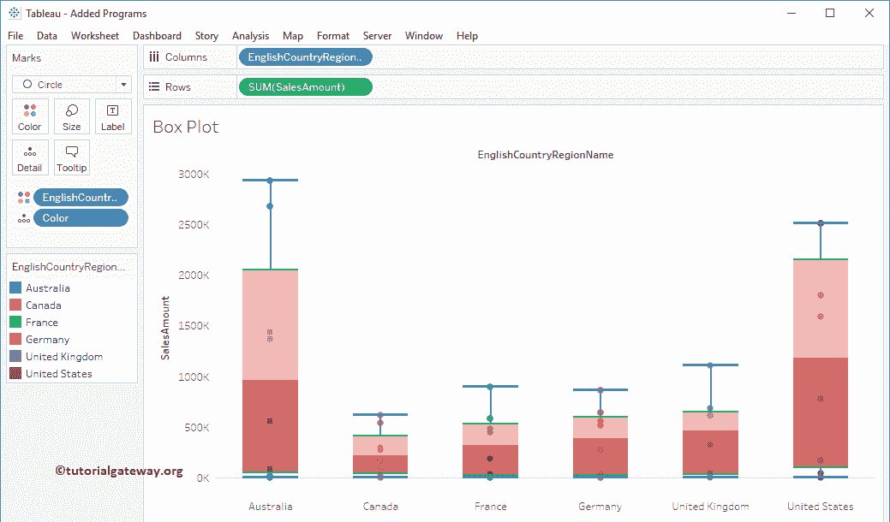

### 更改表框图中点的大小

在本例中，我们将向您展示如何更改箱线图中圆点的大小。为此，请将订单数量从“测量区域”拖到“标记货架”中的“尺寸”字段。

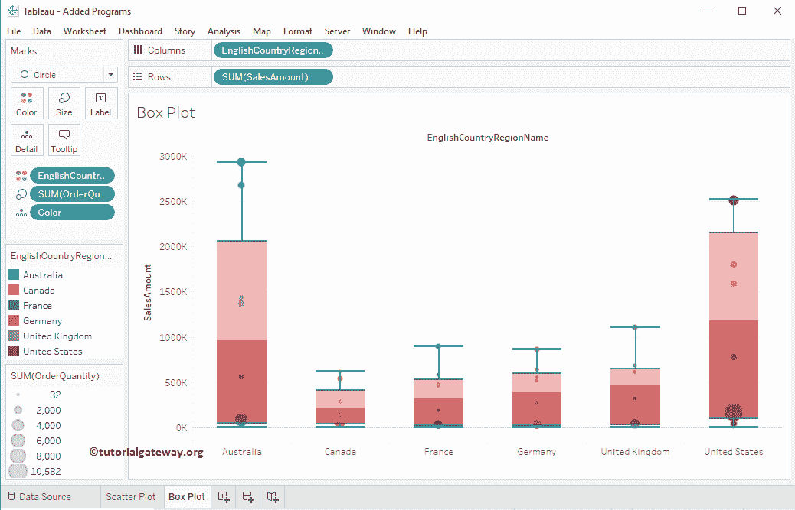

## 在表中创建分类方框图

在这里，我们展示了如何在 Tableau 中为一个区域内的每种颜色创建一个方框图。为此，请将“颜色”从“尺寸区域”拖放到“柱架”中。

默认情况下，箱线图显示水平线(或点)，它们是压缩的箱线图。因为很难绘制聚合数据的箱线图，所以，让我们通过取消选中分析菜单中可用的聚合度量来移除聚合度量。

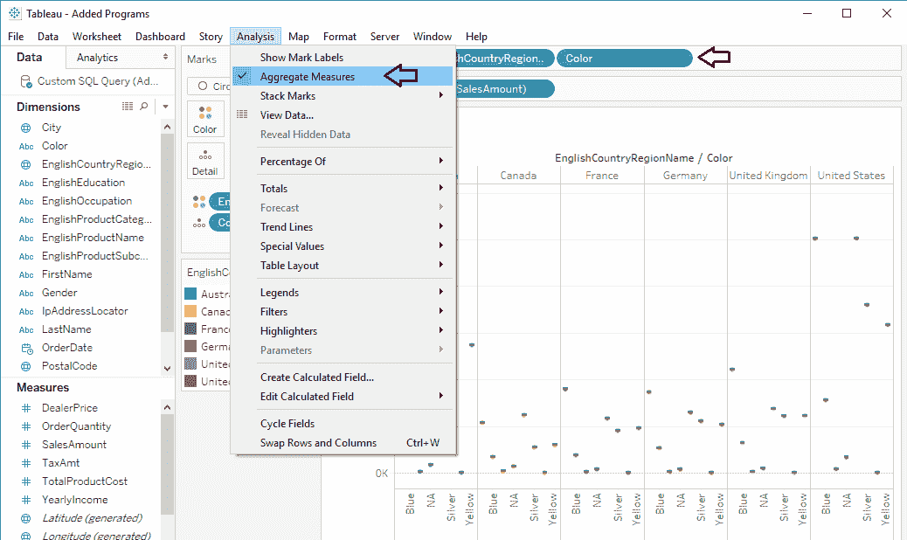

现在，您可以看到区域中每种颜色的方框图。

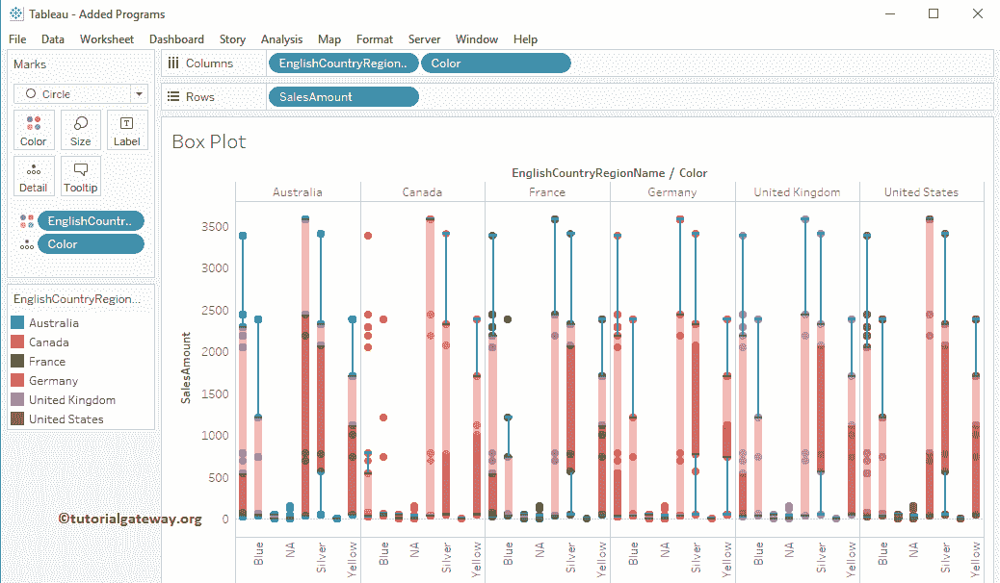

## 水平 Tableau 盒子和触须图

通过交换行和列，将默认的垂直箱线图更改为水平箱线图。

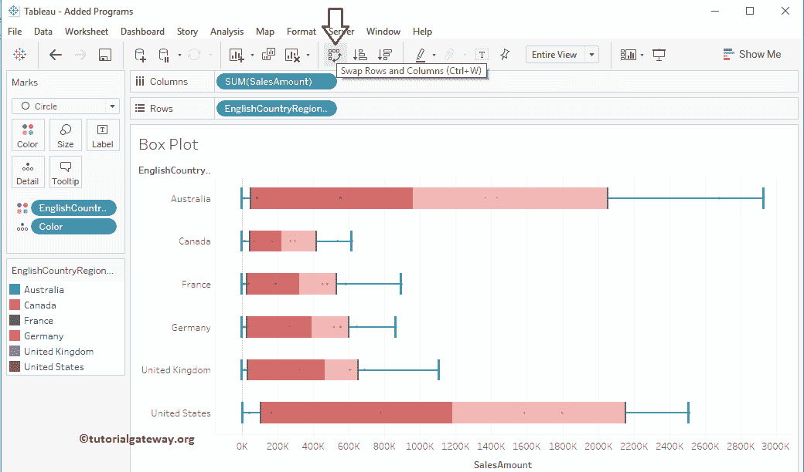