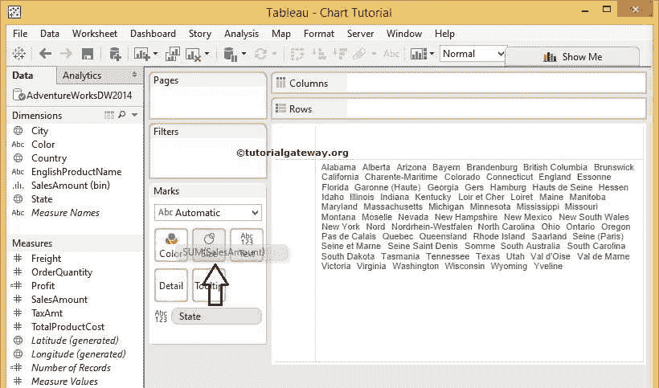
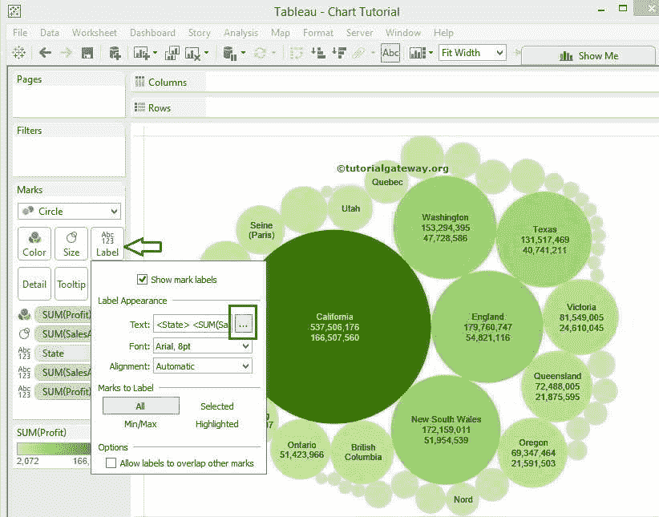
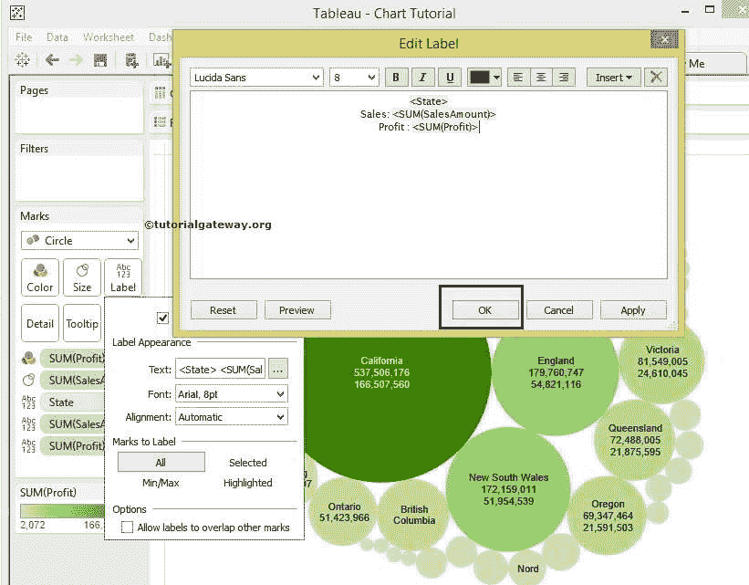
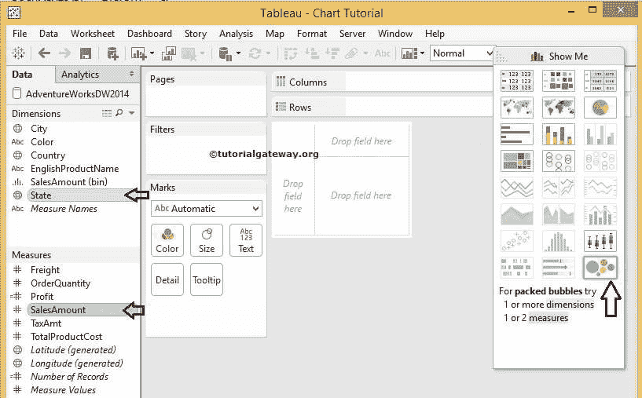

# Tableau 气泡图

> 原文：<https://www.tutorialgateway.org/tableau-bubble-chart/>

Tableau 气泡图用于以圆形显示数据。我们可以使用任何维度成员和“度量值”大小来定义每个气泡。

Tableau 中的气泡图在创建地图时发挥了重要作用。例如，我们可以使用地图顶部的气泡来显示邮政编码销售等。在本文中，我们将展示如何使用自定义 [SQL](https://www.tutorialgateway.org/sql/) 查询创建 Tableau 气泡图。因此，请访问[连接 Tableau 到 SQL Server](https://www.tutorialgateway.org/connecting-tableau-to-sql-server/) 文章。

```
SELECT Geo.EnglishCountryRegionName, 
       Geo.StateProvinceName, 
       Geo.City, 
       Prod.EnglishProductName, 
       Prod.Color, 
       Fact.OrderQuantity, 
       Fact.TotalProductCost, 
       Fact.SalesAmount, 
       Fact.TaxAmt, 
       Fact.[Freight]
FROM DimProduct AS Prod 
   INNER JOIN FactInternetSales AS Fact 
      ON Prod.ProductKey = Fact.ProductKey 
   INNER JOIN DimSalesTerritory AS Terry 
      ON Terry.[SalesTerritoryKey] = Fact.[SalesTerritoryKey] 
   INNER JOIN DimGeography AS Geo 
      ON Geo.[SalesTerritoryKey] = Terry.[SalesTerritoryKey]
```

## 创建Tableau 气泡图的第一种方法

在本例中，我们将根据销售额大小为州维创建一个Tableau 气泡图。首先，将状态维度从维度区域拖放到标记架中的文本字段。从下面的截图中，您可以在 Tableau 报告


中看到可用的州名

接下来，将销售金额从测量区域拖放到[表](https://www.tutorialgateway.org/tableau/)标记货架中的尺寸字段。



拖动它们后，将显示以下屏幕截图。默认情况下，Tableau 桌面显示的是树图


要在表中将默认树形图更改为气泡图，我们必须更改标记架中的默认自动选项。请展开下拉列表，并将自动更改为圆形。


更改后，Tableau 气泡图将显示，州名作为文本字段，销售额总和作为气泡大小。从下面的截图中，你可以看到一个加州的泡泡大小比其余的州大，因为销售额比其他州高。


让我们也将销售金额添加到文本字段中。由此，我们可以看到州名和销售额。为此，请将“销售额”从“度量”区域拖到“标记货架”


中的文本字段

让我们为我们的 Tableau 气泡图添加颜色。我们可以通过将“计算利润”字段拖到“标记货架”的“颜色”字段来完成。


完成后，将显示以下屏幕截图。销售额最高的州名用深绿色填写，销售额最低的州名用浅绿色填写


### 排序Tableau 气泡图

Tableau 气泡图也允许我们对气泡进行分类。因此，请点击 Tableau 工具栏


中的降序排序按钮

你可以看到我们的泡泡图是按照


降序排列的

### 设置文本格式

要格式化Tableau 气泡图数据标签，请单击标记框内的文本字段。点击后，将显示以下窗口。现在，我们正在进行基本的格式化，点击文本



旁边的按钮

在这里，我们在< SUM(SalesAmount) >和< SUM(Profit) >旁边增加了额外的文本【销售、利润】，并将字体样式更改为



参见我们的 Tableau 气泡图


中的格式化文本

## 创建气泡图的第二种方法

这种创建 Tableau 气泡图的方法非常简单明了。请按住控制键，然后从相应的区域中选择尺寸、度量，并从“演示”窗口



中选择包装气泡图

一旦你这样做了，桌面将在 Tableau 中创建一个气泡图。

