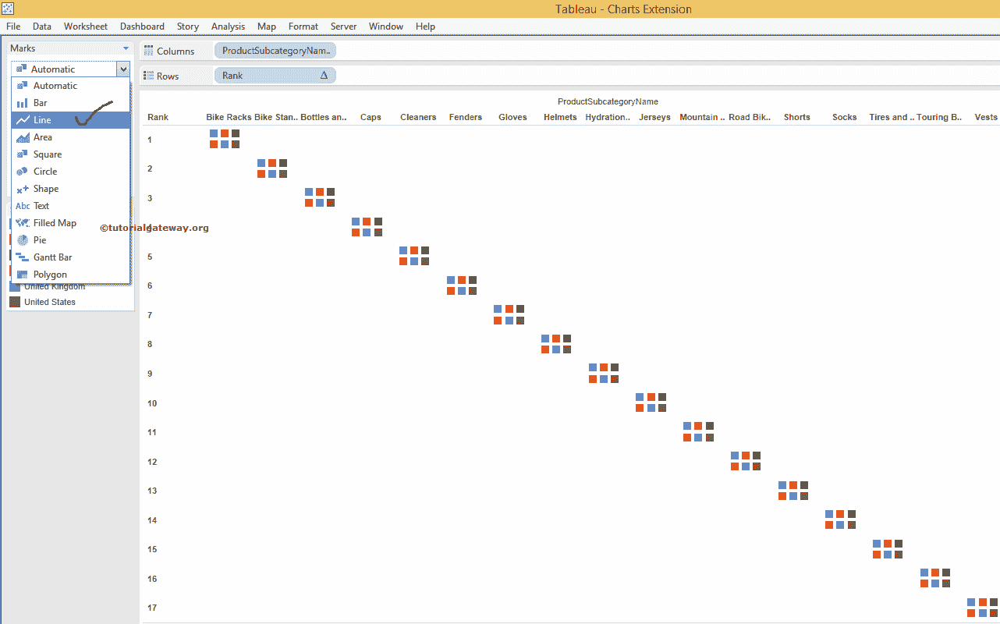

# Tableau 凹凸图

> 原文：<https://www.tutorialgateway.org/tableau-bump-chart/>

Tableau 凹凸图使用一个测量值将一个尺寸与另一个尺寸进行比较。Tableau 中的凹凸图对于探索等级在某个时间或区域等的变化非常有用。

## 创建 Tableau 凹凸图

在开始在 Tableau 中创建凹凸图之前，让我们创建一个计算字段，根据度量值对维成员进行排序。为此，请从分析菜单

中选择创建计算字段选项

选择“创建计算字段”选项后，将打开一个新窗口来编写自定义表达式。现在，我们使用名为 INDEX()的内置函数，并将其命名为 Rank

接下来，我们通过右键单击等级字段将新创建的计算字段转换为离散字段，并选择转换为离散选项

要创建 Tableau 凹凸图，请将产品子类别名称从维度区域拖放到列架。接下来，在标记卡中显示销售区域国家/地区到颜色列。

接下来，将新创建的[表](https://www.tutorialgateway.org/tableau/)计算的字段等级从测量区域拖放到行架

从上面的 Tableau 凹凸图截图中，你可以看到 Rank 列的排名是先到先得。表示第一个产品标记为 1，第二个产品标记为 2，最后一个产品标记为 17。因为默认情况下，排名字段使用跨表选项进行计算。

然而，我们的目的是使用销售额衡量标准将产品子类别名称与国家/地区名称进行排名。在开始更改计算字段之前，让我们将标记类型从自动更改为[线图](https://www.tutorialgateway.org/tableau-line-chart/)

完成后，以下 Tableau 凹凸图截图将出现

要更改字段的表计算，请单击列架上的等级字段，并选择编辑表计算..

选择“编辑表计算”后..选项，将会打开一个新窗口。从下面的截图中，您可以看到该字段正在使用表(跨)选项计算排名。这就是为什么第一个产品标记为 1，第二个产品标记为 2，以此类推。

在此 Tableau 凹凸图示例中，我们的目的是按销售额对该字段进行排名。为了达到同样的目的，请从使用下拉菜单

的计算中选择高级选项

选择“高级”选项后，会打开一个新窗口。请将“产品子类别名称”和“销售区域国家”列从“分区”窗格转移到“寻址”窗格。接下来，将排序选项从“自动”更改为“已归档”。接下来，从下拉菜单中选择文件名和聚合字段。

在这个 Tableau 凹凸图示例中，我们希望按照销售额对字段进行排名。因此，我们选择“销售额”作为“域名”，“总和”作为“汇总”字段，而“排序顺序”作为“降序”。

单击“确定”，并将“每次重新启动”选项从“无”更改为“产品子类别名称”。这意味着，表计算将检查每一个新产品，并使用其销售额对它们进行排名。然后，单击“确定”完成将表计算分配给我们的 Tableau 凹凸图。

让我们看看我们最后的 Tableau 凹凸图预览

如果您对单独行中的字段不满意。请单击列架上的等级字段，并从下拉菜单中取消选中显示标题选项。

我们成功创建了 Tableau 凹凸图

