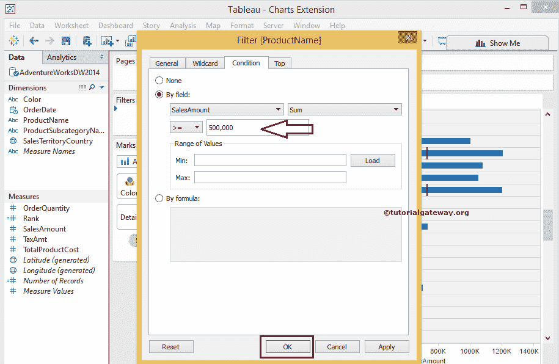
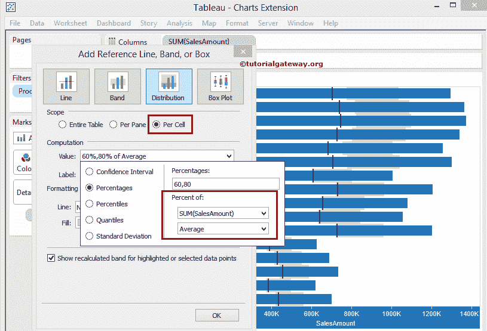

# 表项目符号图

> 原文：<https://www.tutorialgateway.org/tableau-bullet-graph/>

表项目符号图类似于条形图。表中的项目符号图有助于将一个度量与其他度量进行比较，并可视化结果。例如，比较今年和去年的销售额等。桌面允许我们以多种方式创建 Tableau 项目符号图。

在本文中，我们将向您展示如何创建 Tableau 项目符号图。在这个演示中，我们使用了 Sql adventure works dw。

## 创建表项目符号图表

这种在 Tableau 中创建项目符号图的方法非常简单明了。请按住控制键，然后从相应区域中选择尺寸、度量，并从“演示”窗口中选择项目符号图。

对于此表项目符号图示例，我们选择产品名称维度、销售金额、产品总成本度量，并选择显示的选项。

完成后，桌面将为您创建一个项目符号图表。让我们对 [Tableau](https://www.tutorialgateway.org/tableau/) 做一些格式化，过滤表现不佳的产品。

我们在“产品名称”维度上应用了过滤器，条件如下。意思是，Tableau 子弹图将显示销售额大于等于 50 万的产品

单击确定关闭过滤器窗口，查看我们新创建的表项目符号图

## 如何在不显示的情况下创建 Tableau 项目符号图？

这种创建 Tableau 项目符号图表的方法不是直接的方法。但是，您可以控制参考线和分布。有利于数据的实时分析。

首先，将英文产品名称从维区域拖放到行货架，将销售额从度量区域拖放到列货架。默认情况下，Tableau 会生成[条形图](https://www.tutorialgateway.org/bar-chart-in-tableau/)

注:我们还在产品名称

上应用了上述过滤器

接下来，将总产品成本从测量区域拖放到标记架

中的详细程度标记

要将此条形图转换为 Tableau 中的项目符号图，我们必须添加[参考线](https://www.tutorialgateway.org/add-reference-lines-in-tableau/)和[分布](https://www.tutorialgateway.org/add-reference-distributions-in-tableau/)。为此，请右键单击销售金额轴并选择添加参考线选项。

一旦您选择了添加参考线选项，一个名为添加参考线、带或框的新窗口将打开

默认情况下，范围为每个窗格，因此请将其更改为每个单元格，并将值从销售额更改为产品总成本

以下是我们对该参考线选项所做的更改，以便在 Tableau 中构建项目符号图。

1.  范围:请将默认的每个窗格选项更改为每个单元格。如果要添加直线或静态参考线，可以使用默认的“每窗格”选项
2.  值:默认情况下，将选择行或列架内的测量值，但您可以根据需要进行更改。这里我们用产品总成本的总和来代替销售金额的总和。聚合值:请从下拉列表中选择聚合函数
3.  标签:如果要显示标签，则选择标签值，否则选择无
4.  线条:请指定线条宽度、样式和颜色

如你所见，我们离图表更近了。让我们再添加一条参考线来显示分布。要添加，请右键单击销售金额轴并选择添加参考线选项。

转到“分发”选项卡，查看默认配置设置。

默认情况下，范围将是每个窗格。因此，请将其更改为每个单元格，并将计算值从销售额转换为产品总成本。如果要更改聚合值，请从下拉列表

中选择聚合函数

我们对这个 Tableau 项目符号图所做的更改引用了分布

1.  范围:请将默认的每个窗格选项更改为每个单元格。
2.  价值:这里我们用产品总成本的总和代替销售金额的总和。聚合值:请从下拉列表中选择聚合函数
3.  标签:如果要在 Tableau 项目符号图中显示标签，选择标签值；否则，选择无
4.  线条:请指定线条宽度、样式和颜色。这里我们选择无选项
5.  填充:指定分布的图案和颜色
6.  请通过选择字段来指定是否要填充条形图上方和下方的分布

单击“确定”完成分发配置。我们得到了我们的表子弹图

为了清楚地看到分布，让我们使用标记架

中的尺寸字段来减小条形图的尺寸

我们成功地创建了一个 Tableau 项目符号图。

