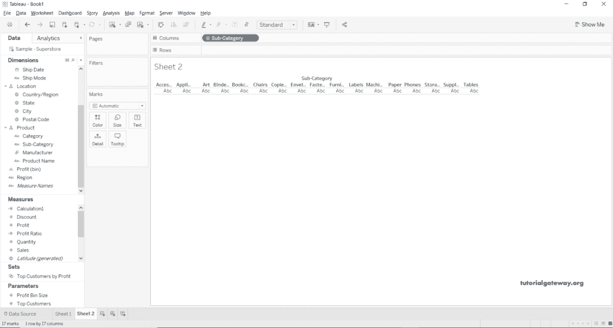
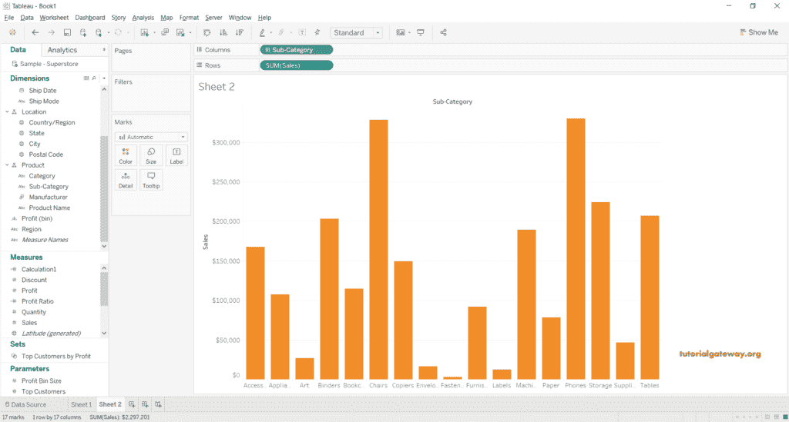
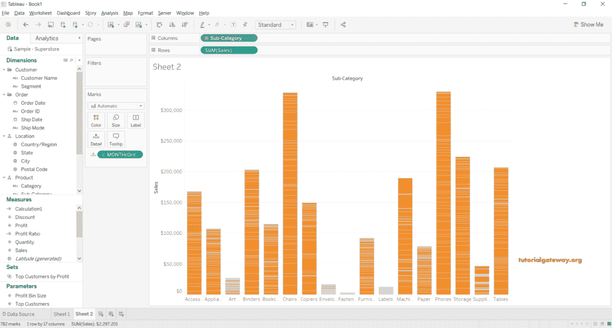
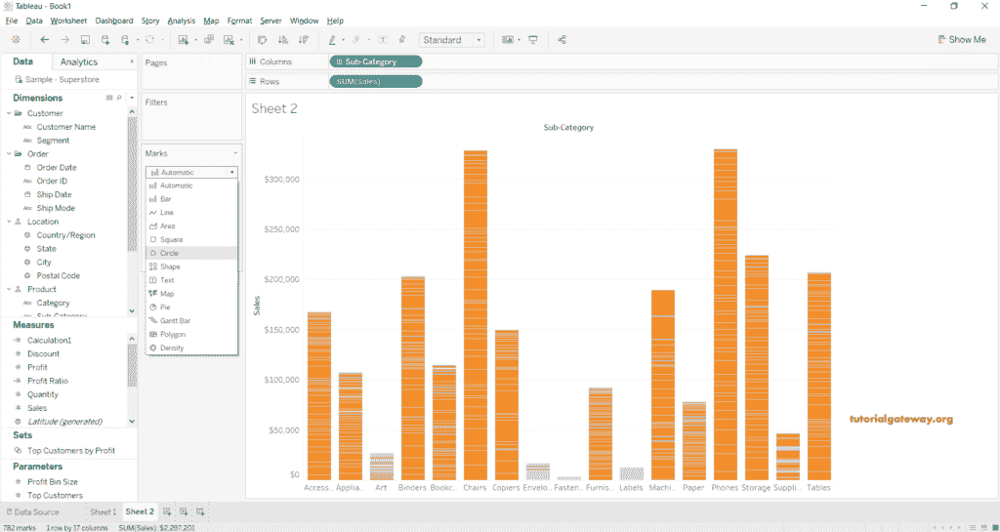
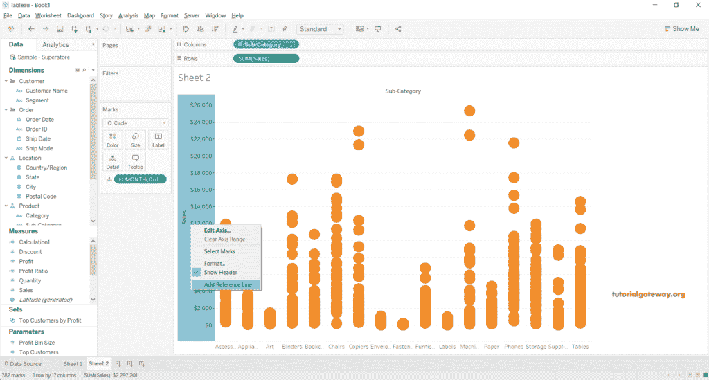
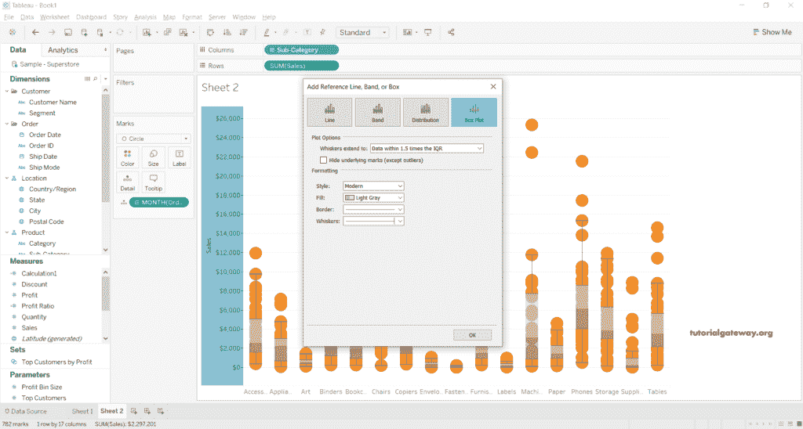
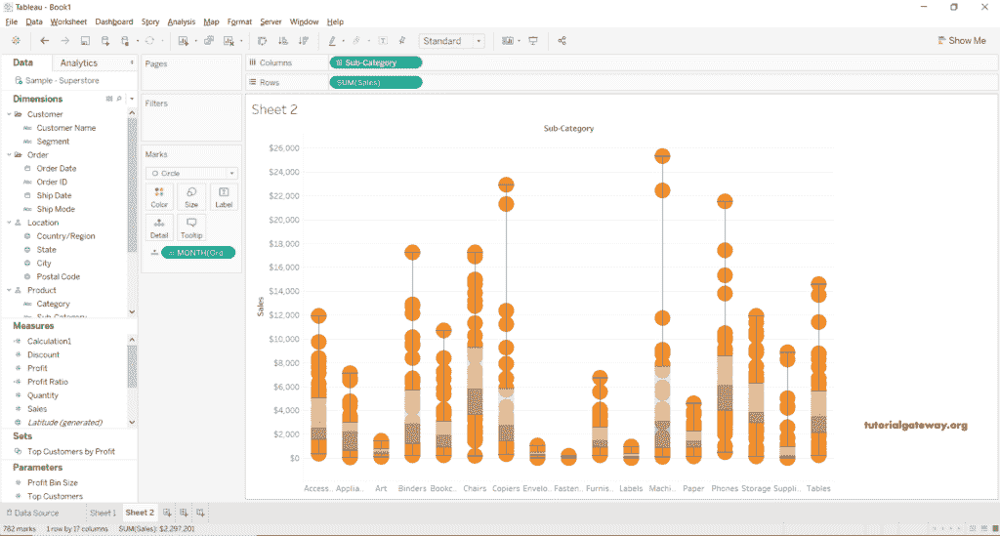

# Tableau 盒子和触须图

> 原文：<https://www.tutorialgateway.org/tableau-box-and-whisker-plot/>

Tableau 盒子和触须图有助于显示数值沿轴的分布。在 Tableau Box 和 beash 图中，Box 代表中间数据，即第一个四分位数、第二个四分位数(中位数)和第三个四分位数之间的值。触须称为线，显示最低第一个四分位数值和最高上四分位数值之间的所有点。

在本文中，我们使用超市 excel 文件来构建 Tableau Box 和晶须图。

## 创建 Tableau 盒子和触须图示例

将“子类别”维度拖放到“列”架上。

接下来，将“销售额”度量放入行货架。默认情况下，聚合总和是根据数据指定的，并显示条形图。

将订单数据从订单部分拖到详细信息部分。在这里，你必须选择月份。

让我将条形图转换为 Tableau 盒子和触须图。为此，请从标记部分选择圆。

我们离盒子和触须的剧情又近了一步。

右键单击销售 Y 轴，选择添加参考线选项至[表](https://www.tutorialgateway.org/tableau/)添加[参考线](https://www.tutorialgateway.org/add-reference-lines-in-tableau/)。

它会打开“添加参考线、标注栏或框”窗口。请选择方框图选项卡，保留默认设置，然后单击确定按钮。如果要格式化填充颜色、边界线大小或须线，请使用格式化部分。

现在，您可以看到 Tableau Box 和晶须图。

