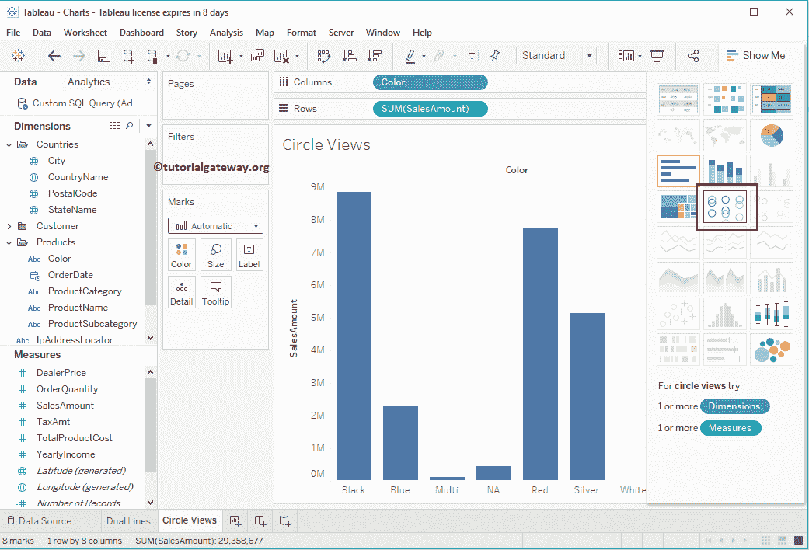

# 表中的圆形视图

> 原文：<https://www.tutorialgateway.org/circle-views-in-tableau/>

在本文中，我们将通过一个例子展示如何在 Tableau 中创建圆视图。为此，我们将使用我们在上一篇文章中创建的数据源。

请访问Tableau 报告文章中的[数据标签了解数据源。](https://www.tutorialgateway.org/data-labels-in-tableau-reports/)

## 在表中创建圆形视图示例

要首先创建表圆形视图图表，请将销售额从度量区域拖放到行架。由于它是一个度量值，因此销售金额将合计为默认的总和。一旦拖动它们，就会生成[条形图](https://www.tutorialgateway.org/bar-chart-in-tableau/)，如下图所示。

接下来，将颜色从维度区域拖放到列架。拖动颜色维度后，将生成一个合适的条形图，如下所示。

### 在表方法 1 中创建圆形视图

在表中创建圆形视图图表有多种方法。首先，请把条形图改成这个。为此，请展开“演示”窗口并从中选择圆视图图表

从“演示”窗口选择此选项后，将显示圆视图图表，如下图所示

让我将国家名称添加到栏架中。现在你可以看到合适的了。

### 在表方法 2 中创建圆形视图

将销售额从度量区域拖放到行架，将颜色从维区域拖放到列架。

在标记栏中，请将标记栏从自动(条形)更改为形状

这将为你创造它。

将“颜色”从“尺寸区域”拖放到“标记”卡中的“颜色”字段，如下所示。

### 在表方法 3 中创建圆形视图

首先，将销售额从度量区域拖放到行架。接下来，将“颜色”和“国家/地区名称”字段从“维度区域”拖放到“分栏架”中。

现在，您必须使用“演示”窗口中的“圆形视图”选项

这将为您创建一个圆形视图图表

### 向表中的圆形视图添加数据标签

要将数据标签添加到表圆形视图图表中，请单击工具栏中的显示标记标签按钮。或者您可以将销售金额从测量区域拖放到标记架

中的标签字段

现在您可以看到每个点的销售额。

### 更改圆形的大小

在本例中，我们将向您展示如何更改圆形的大小。为此，请将“销售额”字段从“度量区域”拖放到“标记货架”的“大小”字段中。

完成后，您可以看到不同尺寸的轮次，如下所示。这里，规模完全取决于销售金额

之和

您可以点击尺寸字段，并使用滑块更改圆形尺寸

## 在表中创建并排圆形视图

让我把它改成并排圆形视图图表。为此，请展开演示窗口并从中选择并排选项

一旦您从“演示”窗口中选择并排圆形视图，它将并排显示，如下截图所示

让我来格式化我们在上面的例子中指定的这个图表。

