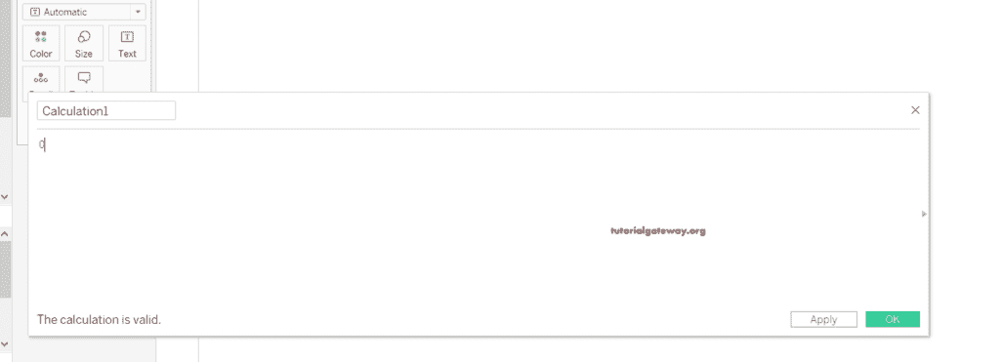

# 甜甜圈图表

> 原文：<https://www.tutorialgateway.org/tableau-donut-chart/>

在本文中，我们将向您展示如何在 Tableau 中创建一个包含详细信息的圆环图。对于这个 Tableau 圆环图的创建，我们使用了超市 excel 文件。

## 创建表格圆环图

首先，我们用默认名称创建了一个计算字段，并指定零作为值。

将 [Tableau](https://www.tutorialgateway.org/tableau/) 计算字段多次拖动到行架子上，这将把工作表分成两部分。例如，如果您观察标记卡部分，我们有“全部”、“总和(计算 1)”和“总和(计算 1)”部分，其中“全部”属于这两个字段。但是，您可以选择特定的[计算字段](https://www.tutorialgateway.org/calculated-field-tableau/)与他们一起工作。

首先，从标记卡架中选择 SUM(计算 2)，并将类别维度拖放到颜色架中。并且，您可以看到第二个字段的类别。

从标记卡中选择全部(应用于两个字段)，并将销售度量添加到标签。默认情况下，度量值聚合为 SUM，并应用于两个部分。所以，如果你观察 Tableau 甜甜圈图表，它会显示上半年的销售总额。然而，我们需要在第二节中稍微展示一下。

让我将标记卡从自动更改为[饼图](https://www.tutorialgateway.org/pie-chart-in-tableau/)，显示两个饼图。第一个是销售总额，第二个是分类销售。

我们已经将这两个饼图转换成了 Tableau 圆环图。为此，从标记框中选择第二个 SUM(计算 1)，并增加细节或缩放它将创建一个圆环。

现在，你可以看到甜甜圈图。但是，首先，让我通过将不透明度增加到 100%来更改中间区域的颜色，以改善您的体验。

以及表圈图的最终输出。

创建 Tableau 圆环图的第二种方法是双轴图。与其增加细节，不如选择尺寸，点击双轴就可以了。在这里，我们右键单击第二个计算并选择双轴选项。

桌面将立即创建一个甜甜圈。

