# Tableau 双组合图

> 原文：<https://www.tutorialgateway.org/tableau-dual-combination-chart/>

Tableau 双组合图表便于直观地将一个度量与其他度量进行比较。在本文中，我们将通过一个例子向您展示如何在 Tableau 中创建双组合图表。

对于这个双组合图表演示，我们将使用我们在上一篇文章中创建的数据源。请访问Tableau 报告文章中的[数据标签，了解](https://www.tutorialgateway.org/data-labels-in-tableau-reports/)[表](https://www.tutorialgateway.org/tableau/)数据源。

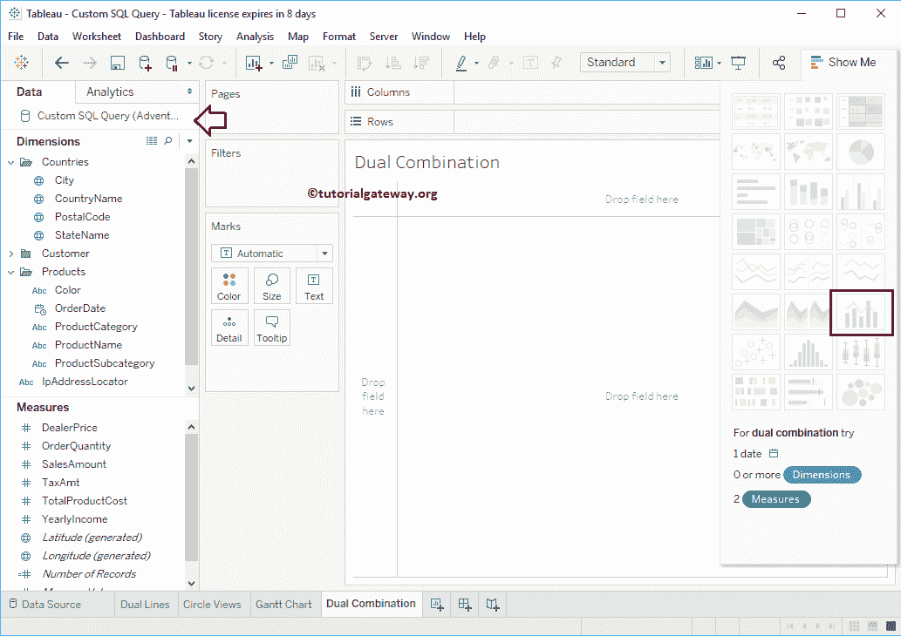

## Tableau 双组合图表示例

要首先创建 Tableau 双组合图表，请将订单日期从维度区域拖放到列架。

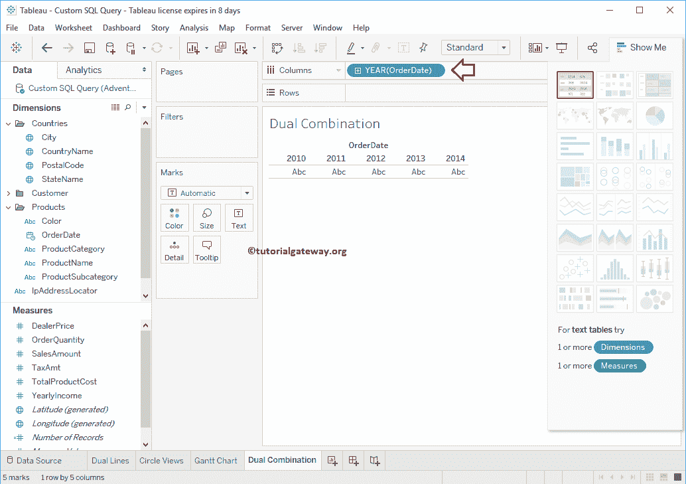

接下来，将销售金额和产品总成本从度量区域拖放到行架。因为它们是度量值，所以“销售额”和“产品总成本”值将合计为默认总和。一旦你拖动它们，[折线图](https://www.tutorialgateway.org/tableau-line-chart/)将会生成，如下图所示。

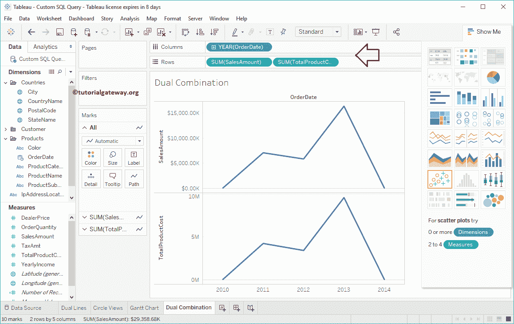

让我把这个改成双重组合图。为此，请展开“演示”窗口并从中选择双重组合图表

提示:我们已经在 [Tableau 双轴](https://www.tutorialgateway.org/tableau-dual-axis/)文章中解释了创建双组合图表的手动过程。所以请参考同样的。

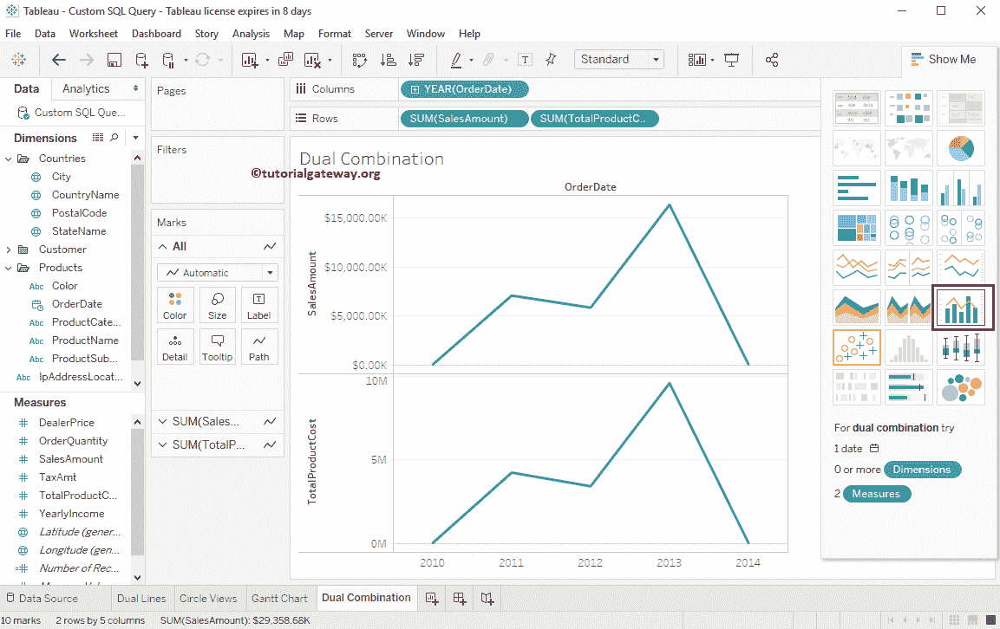

从“演示”窗口中选择双重组合后，将显示双重组合图表，如下图所示。

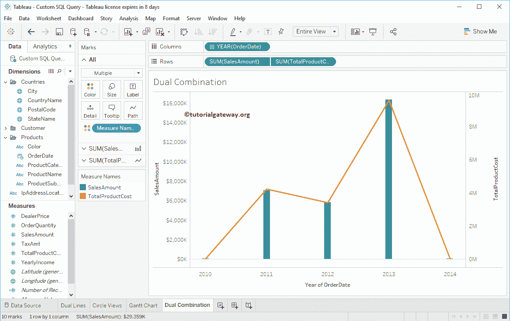

您可以展开这些卡片，将“销售金额”更改为“行”，将“产品成本”更改为“栏”，依此类推。

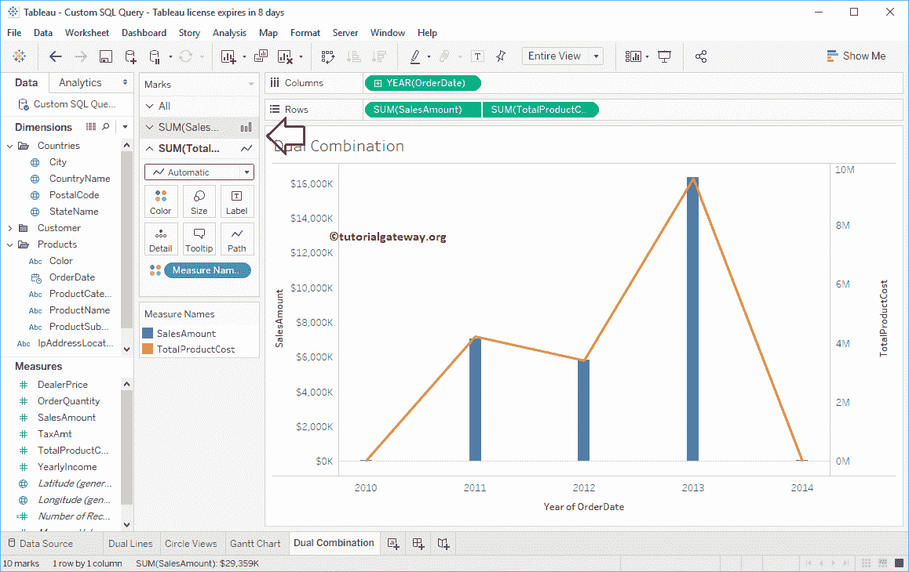

让我将订单日期值从年更改为每年的所有月份，以查看更多[条](https://www.tutorialgateway.org/bar-chart-in-tableau/)和详细趋势

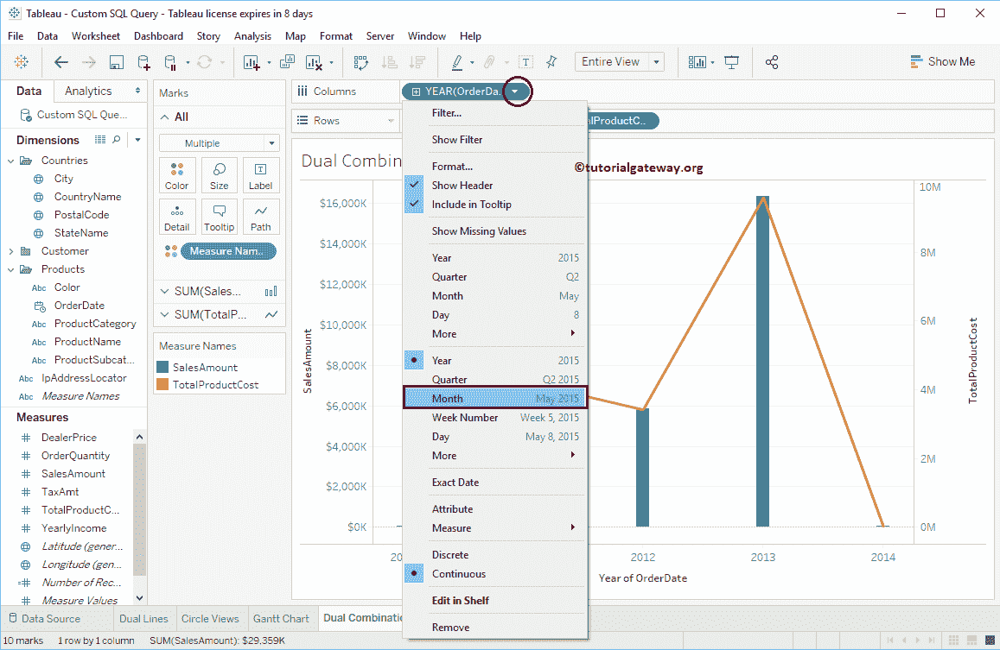

虽然看起来不错。但是，如果您仔细观察，销售金额的最大轴值为 1800，000，而总产品成本为 1000，000。

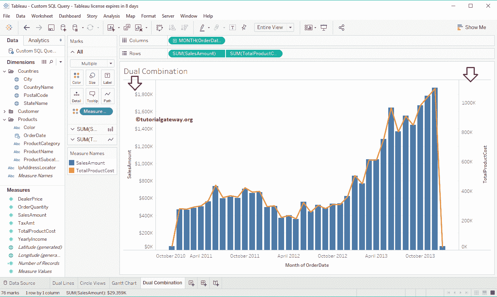

如果没有问题，请保持原样，否则，请选择产品总成本并选择同步轴..上下文菜单中的选项

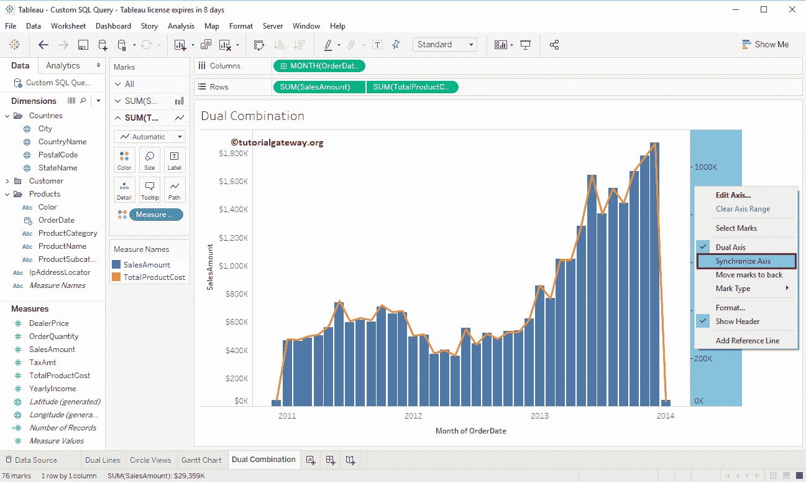

现在，您可以看到带有同步轴的双组合图表。您也可以移除一个轴

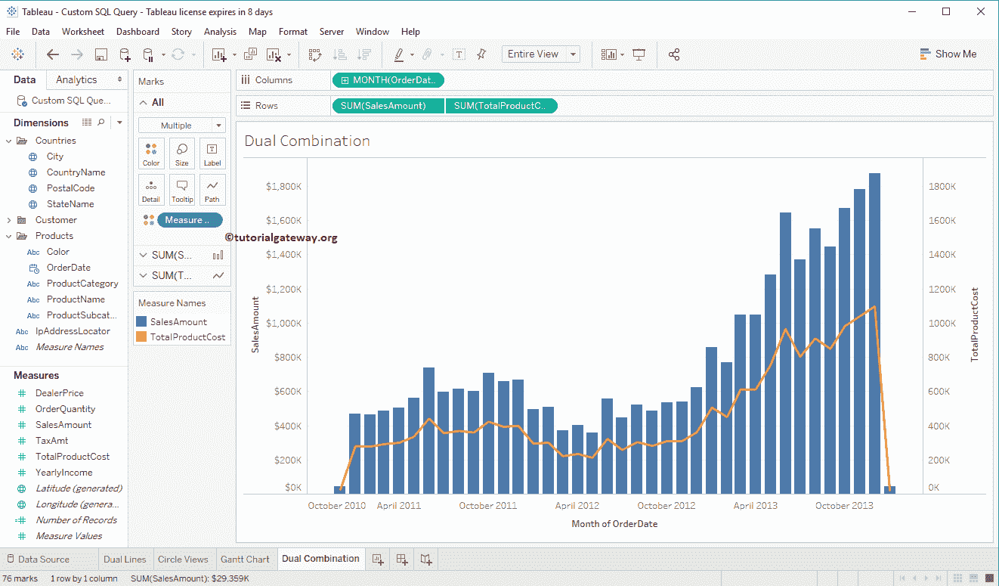

### 向双重组合图表添加数据标签

要向双组合图表添加数据标签，请单击工具栏中的显示标记标签按钮。

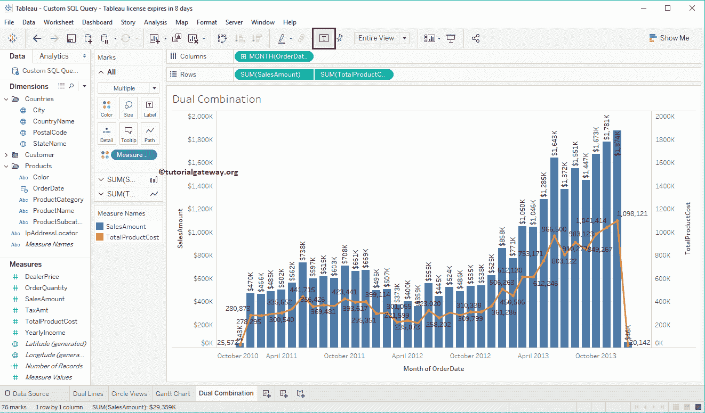

### Tableau 双组合图表-堆叠

您可以将现有的双组合图转换为[堆叠](https://www.tutorialgateway.org/stacked-bar-chart-in-tableau/)双组合图。让我将国家名称添加到颜色货架

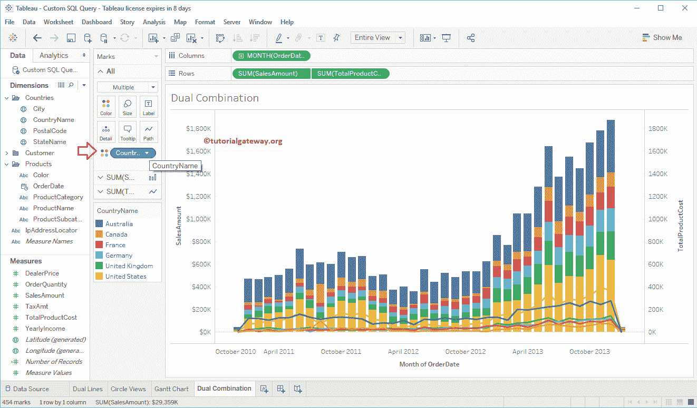

突出显示任何块将向您显示该特定切片的信息。

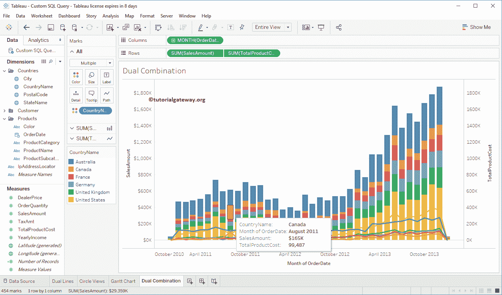