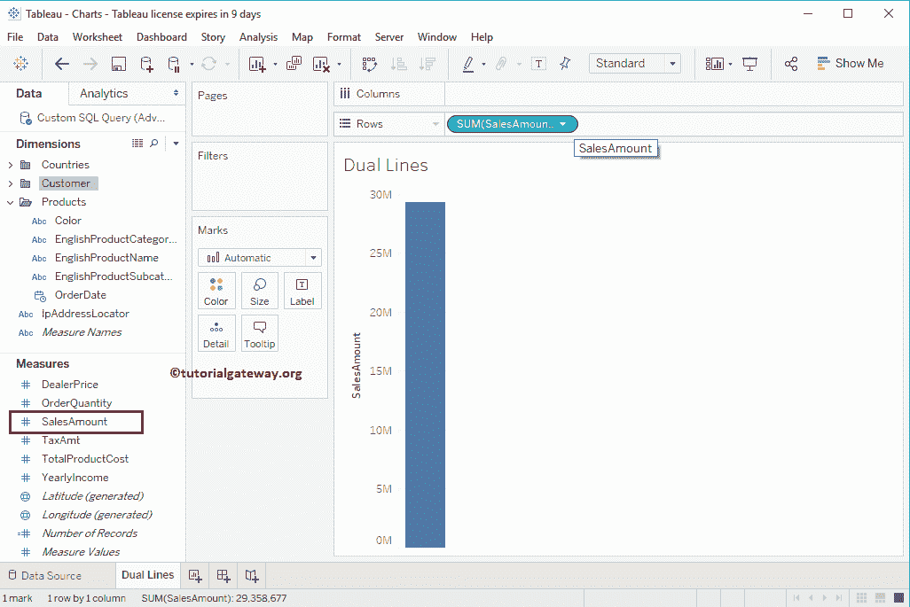
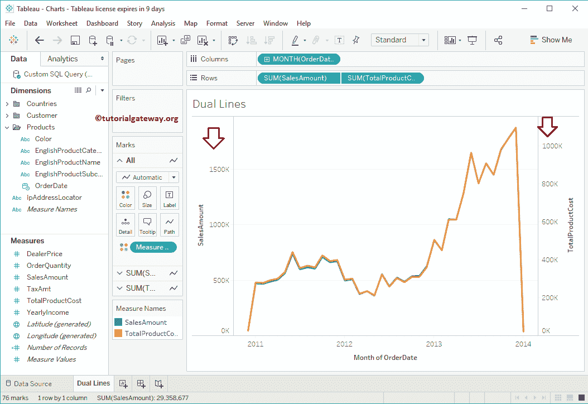
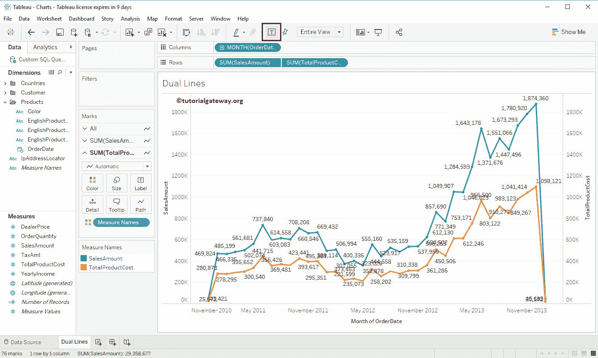

# Tableau 双折线图

> 原文：<https://www.tutorialgateway.org/dual-lines-chart-in-tableau/>

Tableau 双折线图表有助于直观地比较多个指标的趋势。在本文中，我们将通过一个例子向您展示如何在 Tableau 中创建双折线图表。

对于这个 Tableau 双折线图表演示，我们将使用我们在上一篇文章中创建的数据源。请访问[表](https://www.tutorialgateway.org/tableau/)中 Tableau 报告文章中的[数据标签了解数据源。](https://www.tutorialgateway.org/data-labels-in-tableau-reports/)

## 表示例中的双折线图表

要首先创建 Tableau 双折线图表，请将销售额从度量区域拖放到行架。因为它是一个度量值，所以销售金额汇总为默认的总和。一旦拖动它们，就会生成[条形图](https://www.tutorialgateway.org/bar-chart-in-tableau/)。

接下来，将订单日期从维区域拖放到列架。拖动订单日期后，会生成[折线图](https://www.tutorialgateway.org/tableau-line-chart/)。

让我将订单日期值从年更改为每年的所有月份，以查看详细的月度信息(趋势线)

现在可以看到 2014 年、2015 年、2016 年、2017 年、2018 年

各月的详细折线图

### 创建双折线图表方法 1

在 Tableau 中创建双折线图表有多种方法。将产品总成本从测量区域拖放到右侧轴

这将自动为您创建一个双折线图表

### 在表方法 2 中创建双折线图表

让我取消上面的步骤。接下来，将产品总成本从度量区域拖放到行架。由于它是一个度量值，产品总销售额合计为默认总和。一旦您拖动它们，将为总产品成本生成另一个折线图，如下所示。

让我把这个改成双折线图表。为此，请展开“演示”窗口并从中选择双折线图表

从“演示”窗口中选择双线后，将显示双折线图表。虽然从下面的截图看起来不错，但是你可以观察到销售金额的最大轴值是 150 万，而产品总成本是 100 万。

如果没有问题，请保持原样，否则，请选择产品总成本并选择同步轴..上下文菜单中的选项

现在，您可以看到带有同步轴的双折线图表。您也可以移除一个轴

### 向双折线图表添加数据标签

要向双折线图表添加数据标签，请单击工具栏中的显示标记标签按钮。虽然看起来很奇怪，但你会想到添加数据标签。

### 将预测添加到 Tableau 双折线图

将预测从分析选项卡拖放到双折线图表中。

现在你也可以看到预报了。

