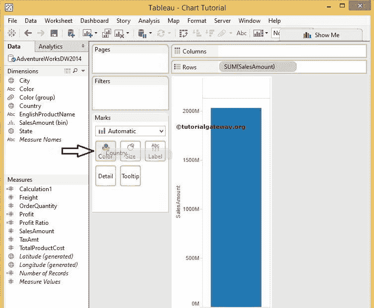
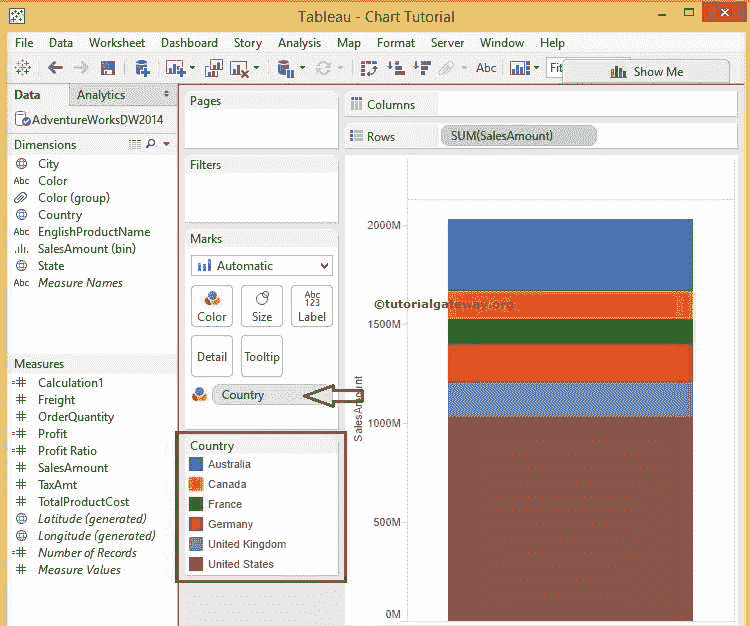
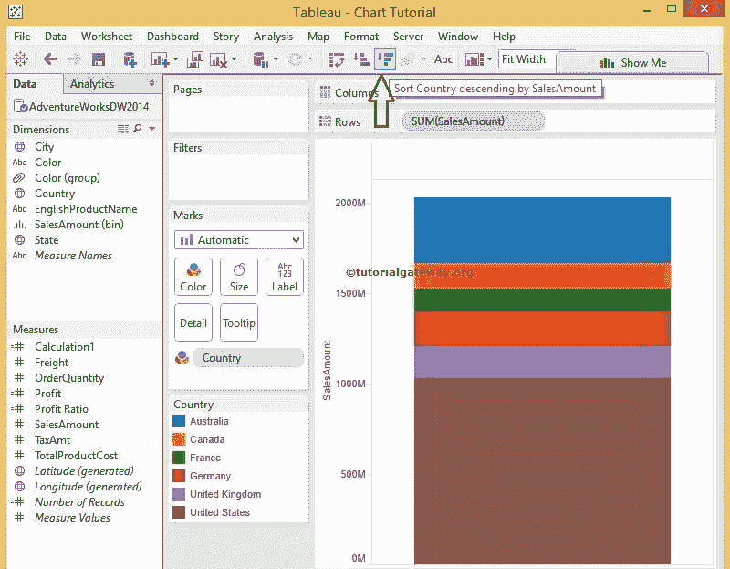
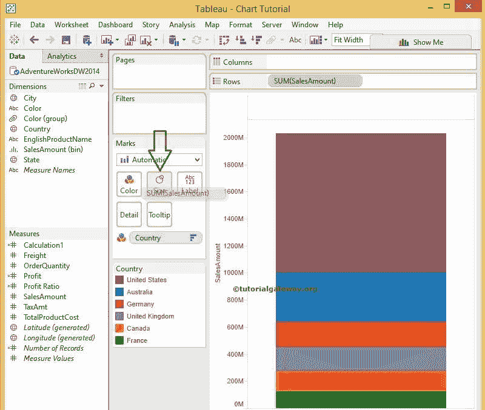
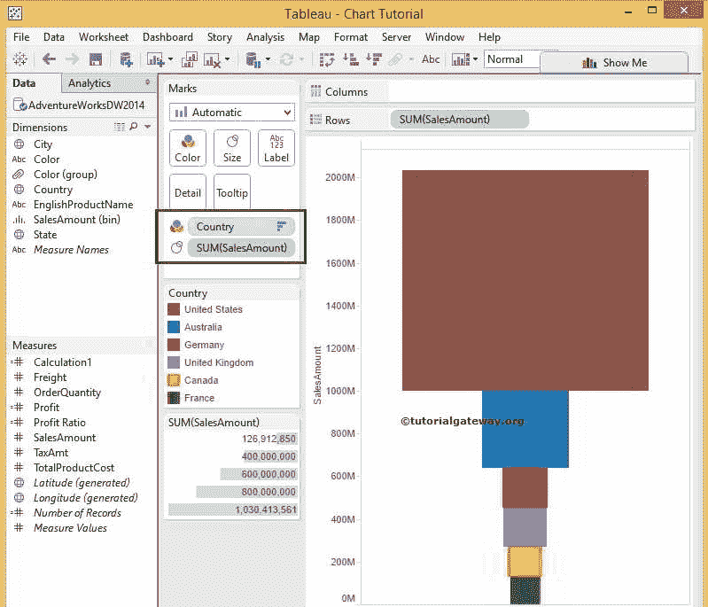
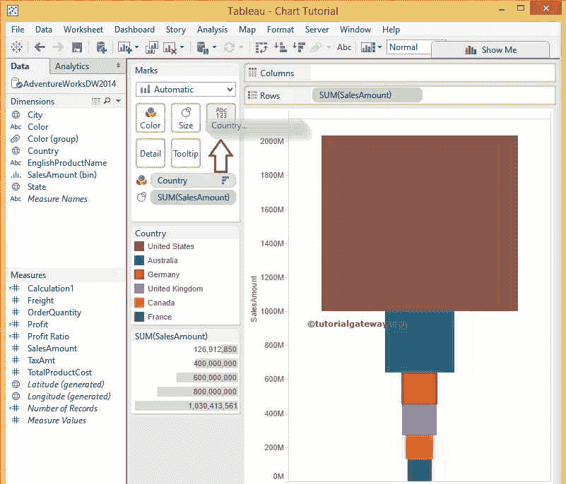
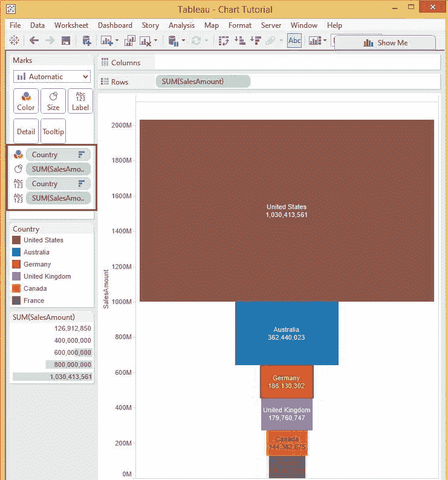
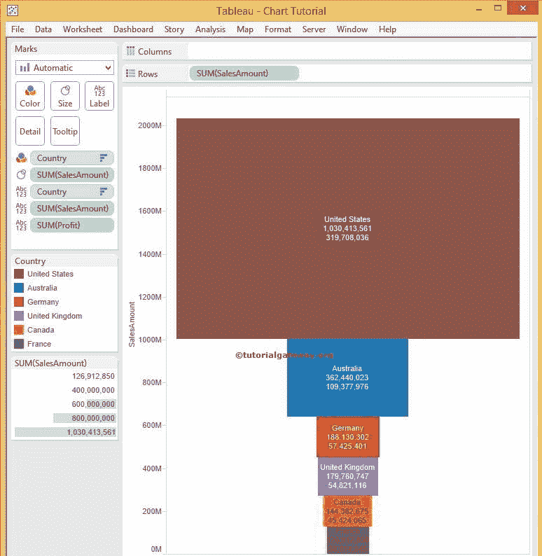
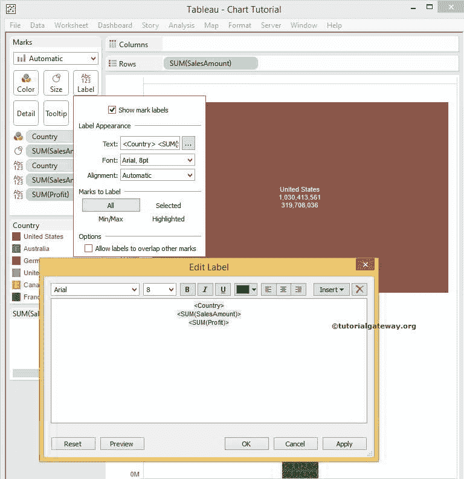

# Tableau 漏斗图

> 原文：<https://www.tutorialgateway.org/tableau-funnel-chart/>

Tableau 漏斗图有助于按阶段可视化数据。例如，我们可以使用 Tableau 漏斗图来可视化生产成本、浪费百分比或我们在产品开发的每个阶段使用的资源数量。

Tableau 支持两种类型的漏斗图，它们是传统的和高级的。本文通过一个例子展示了如何创建一个高级漏斗图。

## 创建 Tableau 漏斗图

在本例中，我们将根据销售额大小为国家维度创建漏斗图。首先，将销售额从度量区域拖放到行架。其次，将国家维度从维度区域拖放到标记架内的颜色字段。请参考[传统漏斗、](https://www.tutorialgateway.org/traditional-funnel-chart-in-tableau/) [连接 SQL Server](https://www.tutorialgateway.org/connecting-tableau-to-sql-server/) 、 [SQL](https://www.tutorialgateway.org/sql/) 和 [Tableau](https://www.tutorialgateway.org/tableau/) 文章。

拖动它们后，将显示以下屏幕截图。

第三，我们必须按降序对数据进行排序。为此，请点击表工具栏

中的“降序排序”选项

接下来，将销售金额从测量区域拖放到标记架中的尺寸字段，如下所示

拖动后，桌面将显示漏斗图。

### 向漏斗图添加数据标签

在我们结束之前，让我们添加国家名称和销售金额作为数据标签。为此，请将“国家/地区名称”维度和“销售额”从相应地区的“度量”拖到“标记”框中的“文本”字段。

现在你可以在 Tableau 漏斗图

中看到国家和销售额

让我们将利润衡量值添加到数据标签中，以查看每个国家的销售和利润

### 文本格式

要格式化 Tableau 漏斗图中的数据标签，请单击标记架内的文本字段。点击后，将显示以下窗口。点击…文本旁边的按钮将打开编辑标签窗口来格式化文本

