# Tableau 传统漏斗图

> 原文：<https://www.tutorialgateway.org/traditional-funnel-chart-in-tableau/>

在本文中，我们将通过一个例子展示如何在 Tableau 中创建传统的漏斗图。在这个 Tableau 传统漏斗图演示中，我们对来自 Tableau 的 SQL Server 数据源使用了自定义 SQL 查询。

```
SELECT Geo.EnglishCountryRegionName, 
       Geo.StateProvinceName, 
       Geo.City, 
       Prod.EnglishProductName, 
       Prod.Color, 
       Fact.OrderQuantity, 
       Fact.TotalProductCost, 
       Fact.SalesAmount, 
       Fact.TaxAmt, 
       Fact.[Freight]
FROM DimProduct AS Prod 
   INNER JOIN FactInternetSales AS Fact 
      ON Prod.ProductKey = Fact.ProductKey 
   INNER JOIN DimSalesTerritory AS Terry 
      ON Terry.[SalesTerritoryKey] = Fact.[SalesTerritoryKey] 
   INNER JOIN DimGeography AS Geo 
      ON Geo.[SalesTerritoryKey] = Terry.[SalesTerritoryKey]
```

提示:请参考 [Tableau 漏斗图](https://www.tutorialgateway.org/tableau-funnel-chart/)文章，了解 [Tableau](https://www.tutorialgateway.org/tableau/) 高级漏斗图的创建

## 在表中创建传统漏斗图

在本例中，我们将根据销售额大小为国家维度创建一个 Tableau 传统漏斗图。首先，将销售额从度量区域拖放到列架，将国家/地区名称从维区域拖放到行架。默认情况下，Tableau 会显示[条形图](https://www.tutorialgateway.org/bar-chart-in-tableau/)。

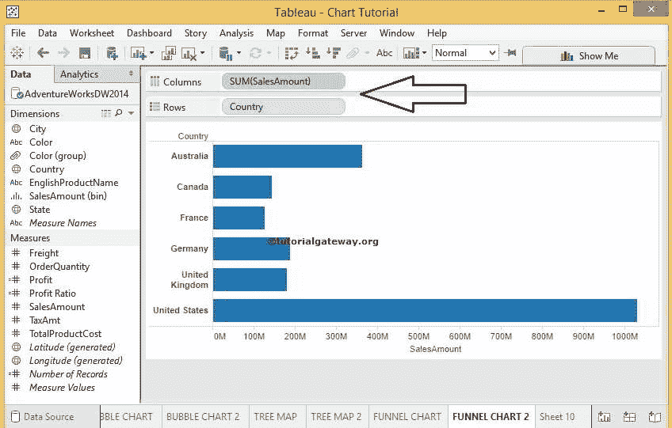

接下来，我们必须按降序对数据进行排序。为此，点击表工具栏

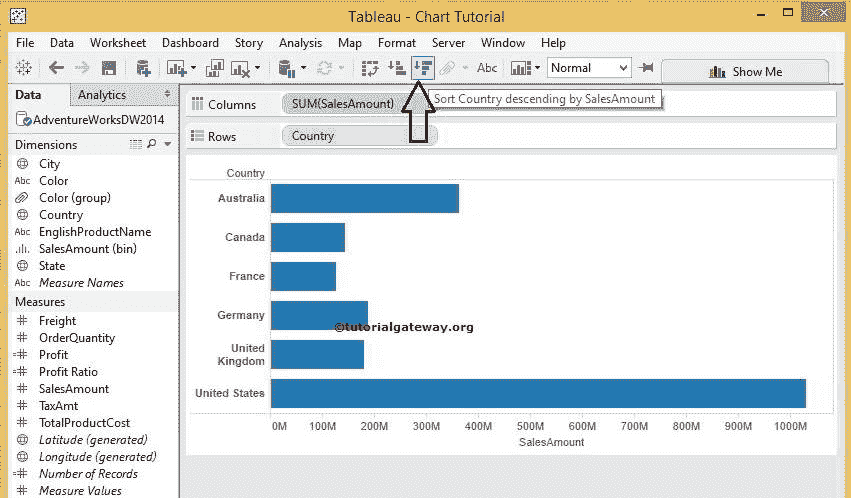

中的降序排序选项

现在，我们必须将标记类型从自动更改为区域，如下所示

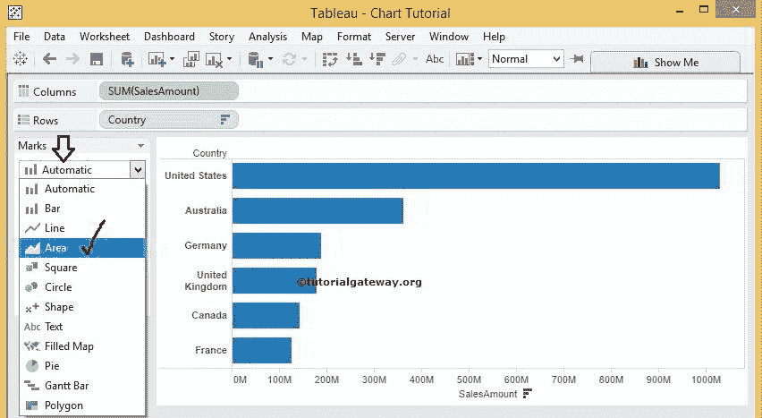

完成后，将显示以下屏幕截图。看起来像是完成了传统漏斗图的一半

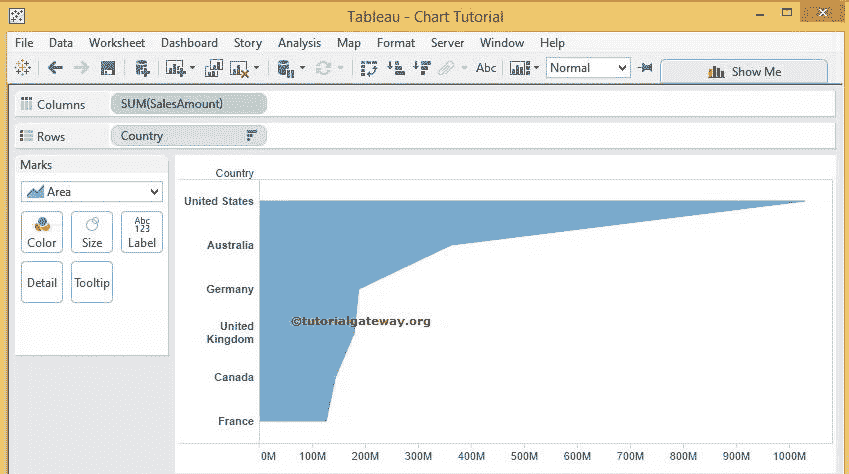

接下来，我们将为销售额度量的负值创建一个计算字段。我们可以通过多种方式创建计算字段，目前，我们正在分析菜单

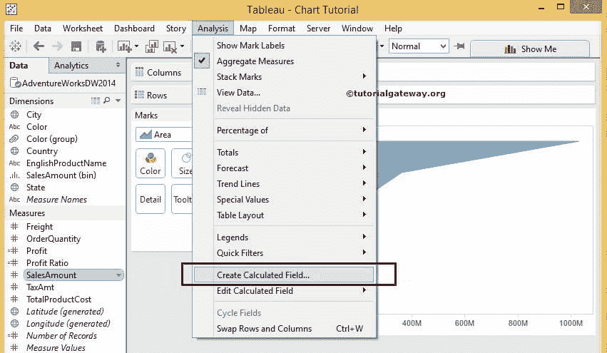

中选择创建计算字段选项

选择“创建计算字段”选项后，将打开一个新窗口来创建新的计算字段。让我们在该区域添加–(销售金额)代码。

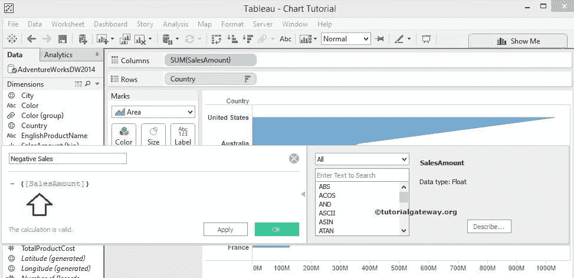

下面的截图将向您展示我们测量区域

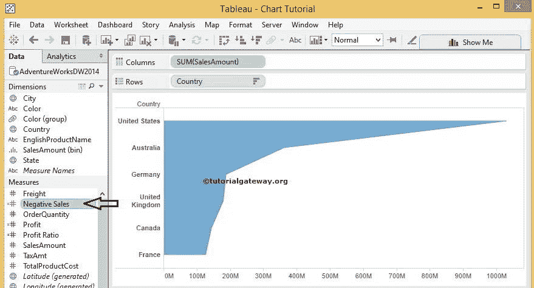

中新创建的计算字段

现在，将新创建的计算字段(销售额为负数)从度量区域拖放到列自身。并将其放在销售额衡量标准之前。完成后，您可以看到传统漏斗图

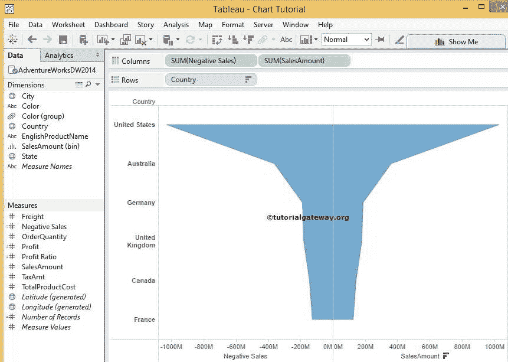

在我们完成此 Tableau 传统漏斗图之前，让我们添加利润衡量值作为数据标签。为此，请将“从计量中获利”区域拖至“标记货架”中销售金额计量的“标签”字段

提示:如果要将数据标签添加到两个度量中，请选择标记架中的所有度量并放置度量值。否则，选择单独测量并放置测量值。

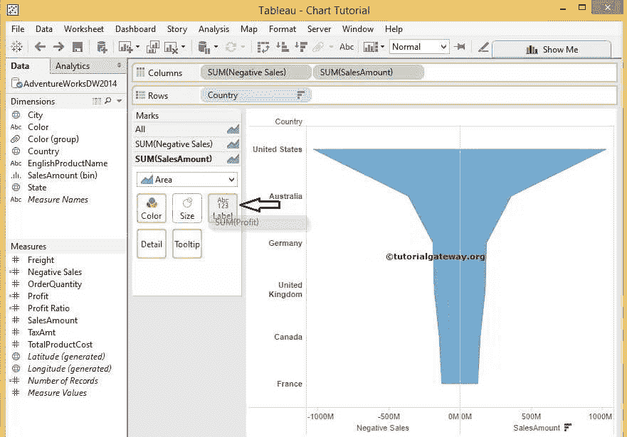

### 表中传统漏斗图的格式颜色

表允许我们格式化区域颜色。要更改颜色，请单击标记架内的颜色字段。点击后，将显示以下窗口。点击你感兴趣的颜色。现在，我们选择绿色表示正销售额

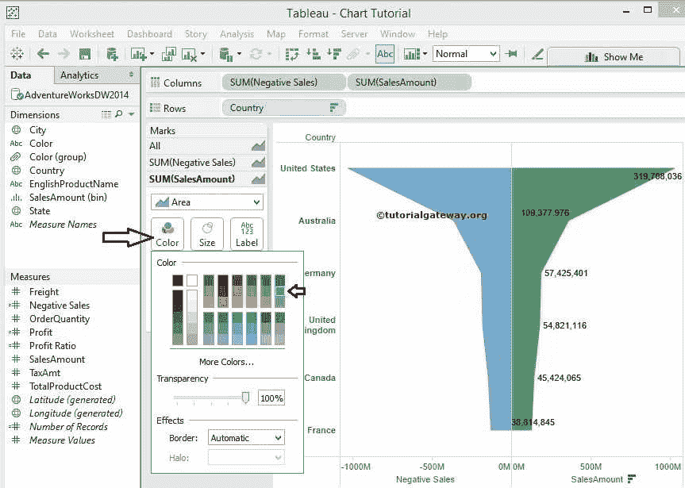

下面的截图将向您展示最终输出，这是我们在 Tableau 中的传统漏斗图。

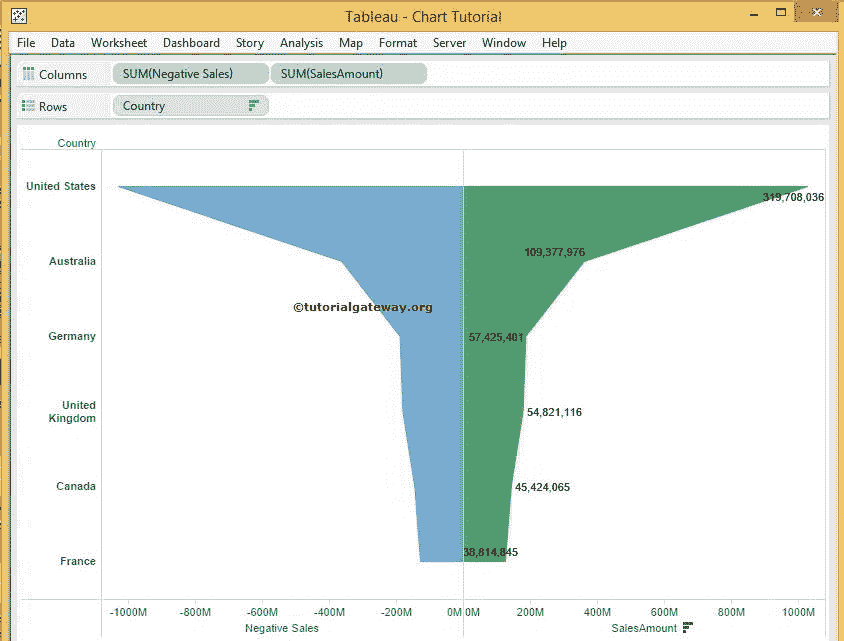