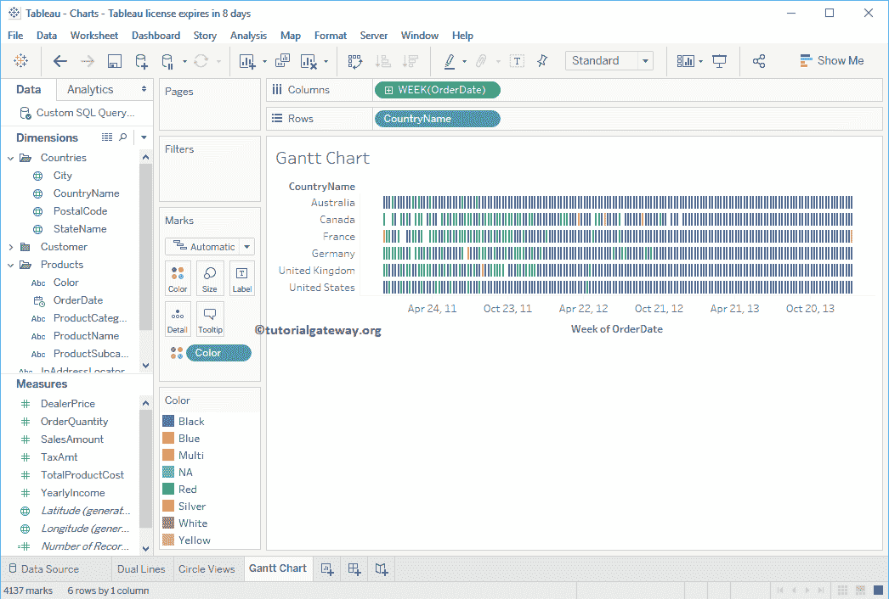

# Tableau 甘特图

> 原文：<https://www.tutorialgateway.org/gantt-chart-in-tableau/>

Tableau 甘特图用于直观地显示活动或事件的持续时间。在本文中，我们将通过一个例子向您展示如何在 Tableau 中创建甘特图。

## 在表中创建甘特图示例

在 Tableau 中创建甘特图有多种方法。在这个演示中，我们将使用我们在上一篇文章中创建的数据源。

要首先创建甘特图，请将“国家/地区名称”和“颜色”字段从“维度区域”拖放到“行”框中。访问【报告中的数据标签】文章，了解[表](https://www.tutorialgateway.org/tableau/)数据源。

接下来，将订单日期从维区域拖放到列架。

让我把这个[文字标签](https://www.tutorialgateway.org/tableau-text-label/)改成这个。为此，请展开“演示”窗口，并从中选择“图 Tableau 甘特图”

从“演示”窗口中选择后，开始日期和结束日期的甘特图将显示在数据窗格中，如下图所示。

让我将订单日期值从年更改为每年的周数，以查看详细信息

现在你可以看到它正在显示周信息

接下来，我们必须指定 Tableau 甘特图的大小。因此，将“订单数量”从“测量”区域拖放到“标记”卡中的“尺寸”货架上。

现在你可以看到甘特条形图(我是说，真正的甘特条形图)

### 在表中创建甘特图示例 2

将“国家/地区名称”、“颜色”字段从“维度”拖放到“行”框，将“维度”部分中的“订购日期”拖放到“列”框。接下来，让我将订单日期值从年更改为每年的周数，以查看详细信息

它会自动为您生成一个甘特图。

如果不是这样，请将标记类型从自动更改为 Tableau 甘特条形图标记。

接下来，让我将颜色尺寸添加到色卡，将订单数量添加到尺寸货架。

通常，我们使用订单数量的计数函数。让我将默认总和更改为计数。为此，单击总和(订单数量)的向下箭头打开下拉菜单。在这里，选择测量(总和)，然后选择计数

通过突出显示特定的区块将向您显示该区块的信息

这次我们添加[表计算](https://www.tutorialgateway.org/tableau-table-calculations/)，计算订单数量差异。要添加，请点击订单数量，选择快速表计算选项，然后选择差额，如下图

你可以看到这个 Tableau 甘特条形图的结果。

将鼠标悬停在一个块上以查看信息。

