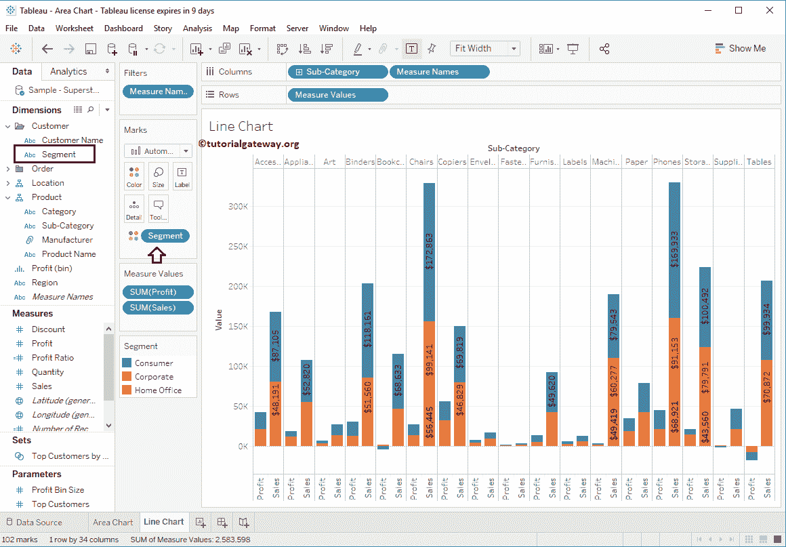

# Tableau 分组条形图

> 原文：<https://www.tutorialgateway.org/grouped-bar-chart-in-tableau/>

Tableau 分组条形图，也称为并排条形图，对于直观地并排比较数据非常有用。在本文中，我们将通过一个例子向您展示如何在 Tableau 中创建分组条形图。

在这个表分组条形图演示中，我们将使用样本-超级商场数据源。

## Tableau 分组条形图示例

要首先创建分组条形图，请将利润从度量拖放到行架。由于它是一个度量值，利润将合计为默认的总和。一旦拖动它们，[条形图](https://www.tutorialgateway.org/bar-chart-in-tableau/)将由[表](https://www.tutorialgateway.org/tableau/)生成。

接下来，将段从维区域拖放到列架。一旦您拖动它们，将生成适当的条形图，如下所示。

在本例中，我们希望按细分对子类别进行分组。因此，我们将子类别从维度区域拖到列架。现在，您可以看到分组条形图。让我把它改成一个合适的分组条形图。

为此，请展开“演示”窗口，并从中选择并排条形图

一旦从展示窗口中选择并排条形图，将显示分组条形图，如下图所示

## 在表中创建分组条形图示例 2

在本例中，我们希望使用并排的条形图来比较销售额和利润。因此，将子类别从维度区域拖放到列架，将销售额从度量区域拖放到行架。

接下来，再拖放一个度量值，即从度量区域到行架的利润。因为它是一个度量值，所以利润合计为默认总和。

要创建分组条形图，请展开“演示”窗口并从中选择并排条形图

现在，您可以看到分组条形图比较两种度量

### 向分组条形图添加数据标签

要向 Tableau 分组条形图添加数据标签，请点击工具栏

中的“显示标记标签”按钮

### 分组堆叠条形图

您可以将现有的分组条形图转换为[堆叠](https://www.tutorialgateway.org/stacked-bar-chart-in-tableau/)组。让我将线段添加到颜色货架。

