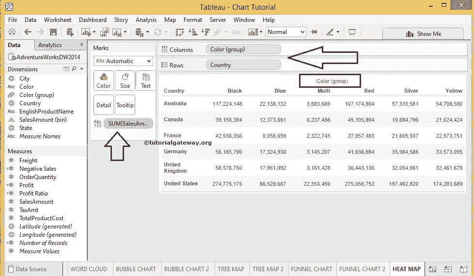
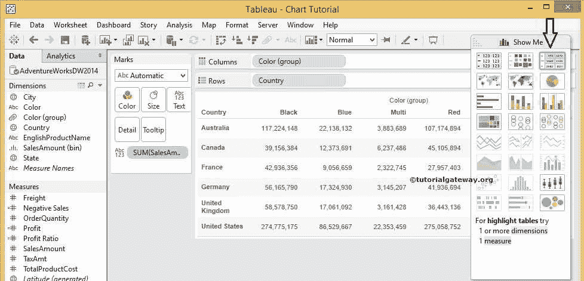
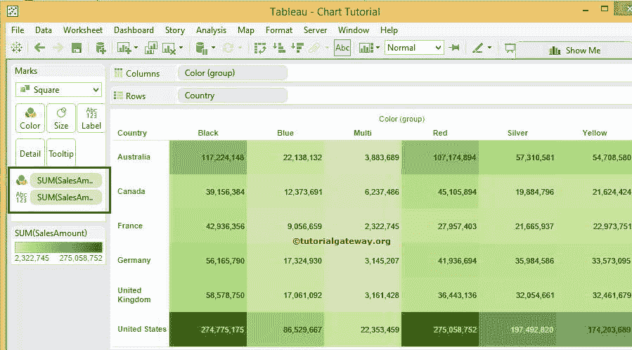
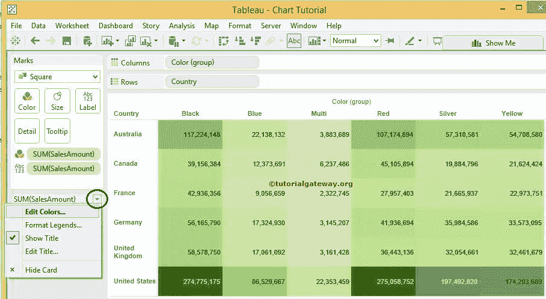
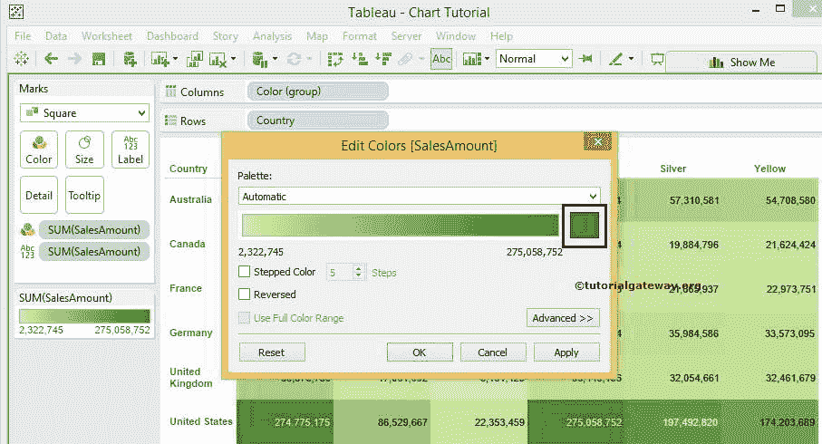
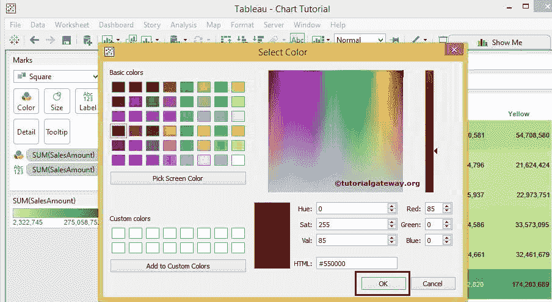
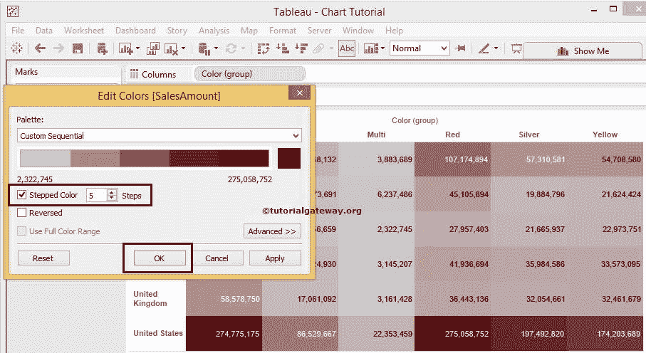
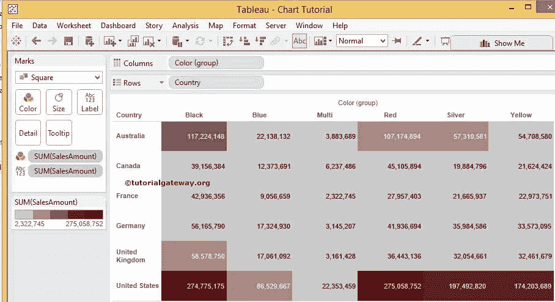
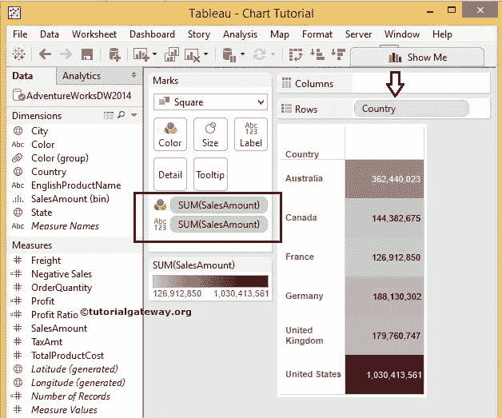

# Tableau 热图

> 原文：<https://www.tutorialgateway.org/tableau-heat-map/>

Tableau 热图用于显示数据和颜色。我们可以使用一个或多个维度成员和度量值来创建热图。Tableau 中的热图将有助于按颜色比较数据。比如有多少产品达不到要求，有多少产品超出我们的预期等等。

在本文中，我们将通过一个例子向您展示如何创建 Tableau 热图。请访问[连接 Tableau 到 SQL Server](https://www.tutorialgateway.org/connecting-tableau-to-sql-server/) 文章了解配置。对于这个 Tableau 热图报告，我们将使用的自定义 [SQL](https://www.tutorialgateway.org/sql/) 查询是:

```
SELECT Geo.EnglishCountryRegionName, 
       Geo.StateProvinceName, 
       Geo.City, 
       Prod.EnglishProductName, 
       Prod.Color, 
       Fact.OrderQuantity, 
       Fact.TotalProductCost, 
       Fact.SalesAmount, 
       Fact.TaxAmt, 
       Fact.[Freight]
FROM DimProduct AS Prod 
   INNER JOIN FactInternetSales AS Fact 
      ON Prod.ProductKey = Fact.ProductKey 
   INNER JOIN DimSalesTerritory AS Terry 
      ON Terry.[SalesTerritoryKey] = Fact.[SalesTerritoryKey] 
   INNER JOIN DimGeography AS Geo 
      ON Geo.[SalesTerritoryKey] = Terry.[SalesTerritoryKey]
```

## 创建 Tableau 热图

在本例中，我们将在矩阵报告或交叉选项卡报告上创建 Tableau 热图。首先，将颜色组(我们在[表分组](https://www.tutorialgateway.org/tableau-grouping/)文章中创建的)从维度区域拖放到列架，并将国家/地区名称从维度区域拖放到行架。

接下来，将销售金额从测量区域拖放到标记卡中的文本字段，如下所示



接下来，请从“演示”窗口中选择 Tableau 热图。



完成后，将显示以下 [Tableau](https://www.tutorialgateway.org/tableau/) 高亮表截图，并带有默认颜色编码。颜色的密度代表数值。



从上面的截图中，您可以看到我们成功创建了 Tableau 热图

### 格式热图表

Tableau 允许我们格式化或编辑热图中的默认颜色。要格式化默认密度标记颜色，请单击如下所示的向下箭头，并选择编辑颜色..选项从下拉菜单



#### 更改热图颜色

请单击“颜色”按钮，为您的 Tableau 热图报告选择所需的颜色。



一旦你点击按钮，一个新的窗口将会打开来编辑或选择一种新的颜色。目前，我们正在随机选择一些。



在“编辑颜色”窗口中，您可以单击“应用”按钮来查看实时预览，如下所示。如果您对颜色组合不满意，可以编辑并重新应用。是 Tableau 桌面的主要优势。

如果选择“步进颜色”选项，调色板将把颜色分成在“步进”框中指定的间隔。默认为五个间隔，但您可以根据报告要求



进行更改

查看我们的 Tableau 热图颜色的最终输出。



让我们将矩阵更改为常规表，以便进行数据可视化。为此，请从柱架上移除颜色组，并查看 Tableau 热图颜色以获得详细了解

