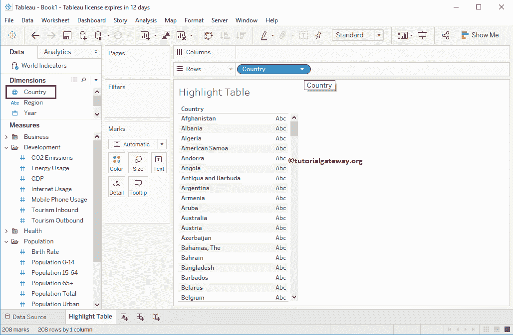

# 突出显示表中的表

> 原文：<https://www.tutorialgateway.org/highlight-table-in-tableau/>

表高亮表帮助您使用颜色比较分类数据。在本文中，我们将通过一个例子向您展示如何在 Tableau 中创建高亮表。为了演示，我们使用世界指标数据源。

## 在表示例中突出显示表

要在表中创建高亮表，首先，将国家字段从维度区域拖放到行架。拖动它们后，将生成文本标签，如下所示。

接下来，将年从维度区域拖放到[表](https://www.tutorialgateway.org/tableau/)列架。参考[文字标签](https://www.tutorialgateway.org/tableau-text-label/)。

接下来，将“手机使用情况”字段从“测量区域”拖放到“标记架”中的“颜色”字段。从下面的截图中，您可以看到高亮显示表。

让我更改颜色调整字段位置

### 更改表中高亮显示表的颜色

上面的截图显示了带有默认颜色的 Tableau 高亮显示表。但是，您可以选择更改默认颜色。

为此，请单击 SUM(移动电话用户)颜色图例旁边的下拉菜单，或者右键单击颜色栏。两者都将打开下面显示的上下文菜单。请选择编辑颜色…选项

选择编辑选项将打开以下窗口。您可以看到，它选择了自动托盘作为颜色模式。

单击调色板下的下拉箭头，并根据您的要求选择颜色。目前，我们选择红绿金分叉。

通过单击“高级”按钮，您还可以指定起点、终点和中心。

现在，您可以看到具有不同颜色组合的 Tableau 高光表。尽管如此，让我排除 2000 年到 2005 年的年份看起来还是不错的，因为我们没有太多那个时期的数据可以显示。

我们对年份档案进行了过滤。请参考[过滤器](https://www.tutorialgateway.org/tableau-filters/)概念理解相同。

突出显示任何块将向您显示该特定点的信息。

### 更改高亮显示表的块大小

我们可以调整大小，而不是用颜色填充整个块。为此，请将“总人口”从“测量区域”拖到“标记架”中的“大小”字段。如您所见，每个块的大小都是基于人口显示的。

让我增加尺寸

选择任何特定的块将向您显示该特定点的信息。

通过在文本标签中放置移动电话使用测量，将把它和颜色一起转换成一个标准表。

## 使用演示创建表高亮显示表

[显示](https://www.tutorialgateway.org/tableau-show-me/)窗口向您显示可用图表列表，您可以使用度量和维度字段制作这些图表。让我选择高亮表

现在，您可以看到由“展示我”

创建的 Tableau 高光表