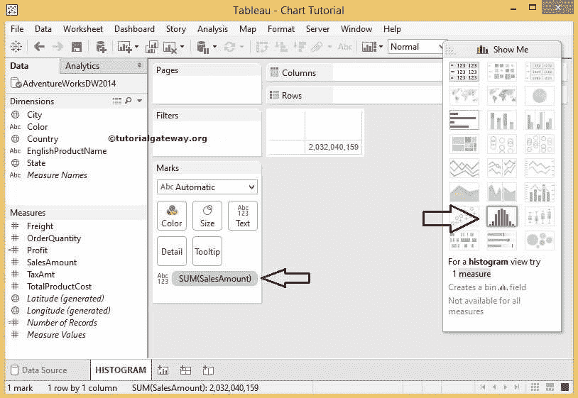
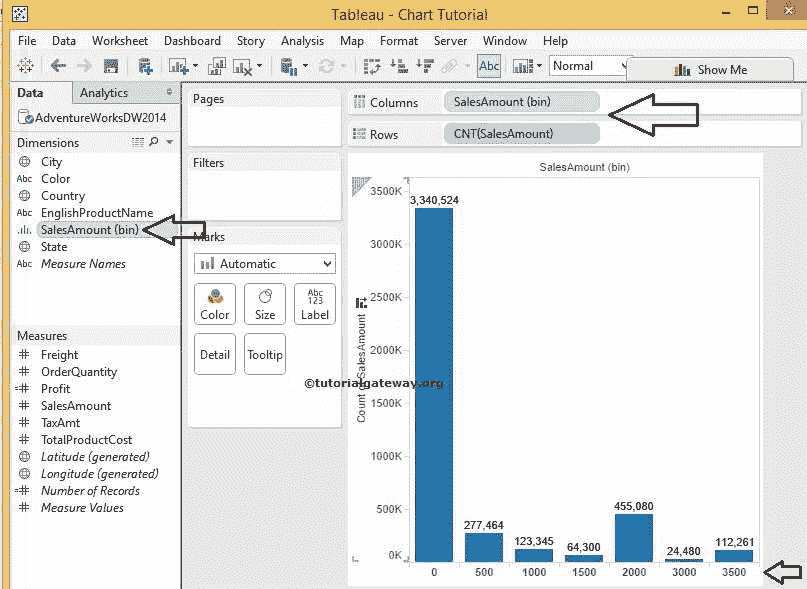
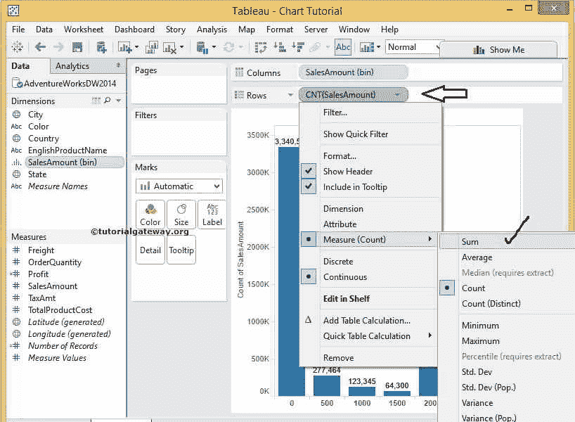
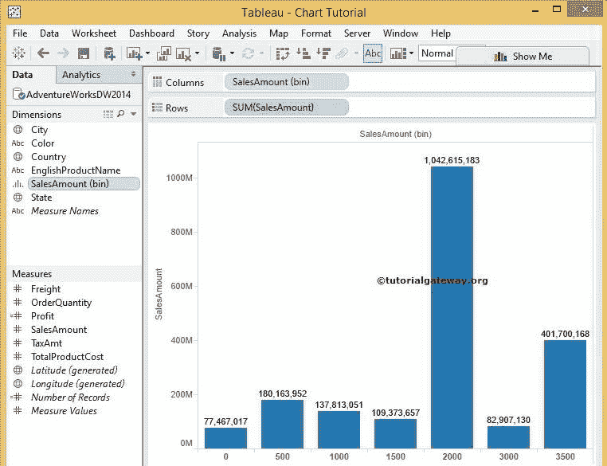
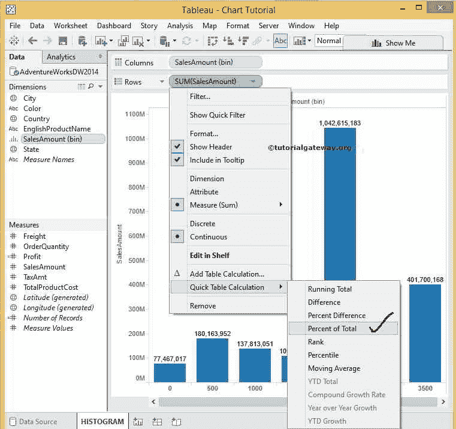
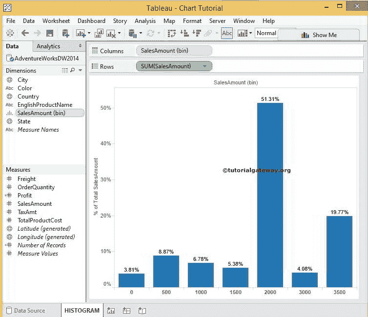
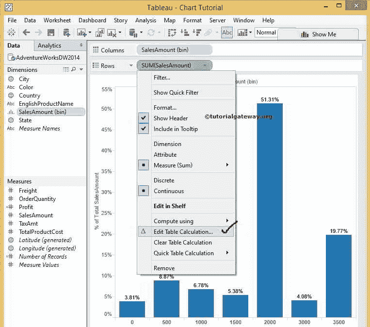
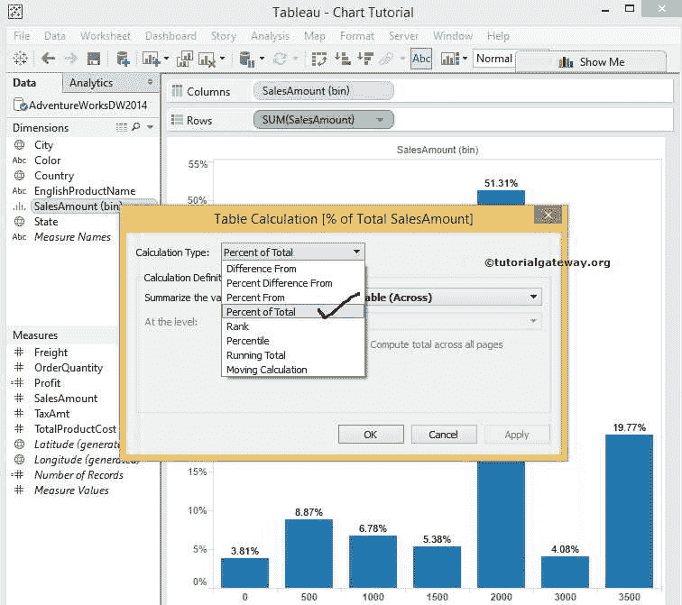

# Tableau 直方图

> 原文：<https://www.tutorialgateway.org/tableau-histogram/>

Tableau 直方图有助于可视化在用户指定范围内组织的统计信息。虽然看起来像条形图，但 Tableau 中的直方图以相等的间隔显示数据。

本节通过一个示例展示了如何创建 Tableau 直方图。对于 tableau 演示中的直方图，我们使用了一个针对 SQL Server 的自定义查询。

```
SELECT Geo.EnglishCountryRegionName, 
       Geo.StateProvinceName, 
       Geo.City, 
       Prod.EnglishProductName, 
       Prod.Color, 
       Fact.OrderQuantity, 
       Fact.TotalProductCost, 
       Fact.SalesAmount, 
       Fact.TaxAmt, 
       Fact.[Freight]
FROM DimProduct AS Prod 
   INNER JOIN FactInternetSales AS Fact 
      ON Prod.ProductKey = Fact.ProductKey 
   INNER JOIN DimSalesTerritory AS Terry 
      ON Terry.[SalesTerritoryKey] = Fact.[SalesTerritoryKey] 
   INNER JOIN DimGeography AS Geo 
      ON Geo.[SalesTerritoryKey] = Terry.[SalesTerritoryKey]
```

## 创建 Tableau 直方图的步骤

以下是在 Tableau 桌面中创建直方图的步骤。

“演示”按钮:要创建 Tableau 直方图，请将销售额从度量区域拖放到标记卡中的文本字段。接下来，从“演示”窗口中选择显示的选项。



添加销售箱维度以创建图表:选择直方图选项后，将在销售金额上创建一个新的箱。Tableau 直方图将自动添加“列”货架上的“销售额”箱维度和“行”货架上的“销售额”度量。如您所见，默认的同等大小的箱是 500。但是您可以通过编辑来更改数据的范围分布或调整仓位大小。



更改聚合函数:从上面的数据可视化中，可以看到“行”货架上的销售额是通过计数而不是总和进行聚合的。要更改聚合函数，请单击度量旁边的向下箭头，并将度量值从计数更改为总和。请参考[表箱](https://www.tutorialgateway.org/tableau-bins/)了解创建箱和编辑箱。另请参考[表](https://www.tutorialgateway.org/tableau/)中的[连接到 SQL Server](https://www.tutorialgateway.org/connecting-tableau-to-sql-server/) 和[条形图](https://www.tutorialgateway.org/pie-chart-in-tableau/)。



选择“总和”选项后，表中的直方图将显示销售金额与销售金额箱的总和。



在柱状图中显示百分比:我们的任务是显示总百分比。为此，请从菜单中选择“快速表计算”选项，然后选择“合计百分比”。



完成后，它将显示销售额占销售额箱的总百分比。



### 如何编辑表计算

如果要编辑 Tableau 直方图的[表计算](https://www.tutorialgateway.org/tableau-table-calculations/)，请选择编辑表计算..



选择“编辑表计算”后..选项，将打开一个名为“表计算”的新窗口来更改计算类型。从该下拉列表中，选择所需的计算。

