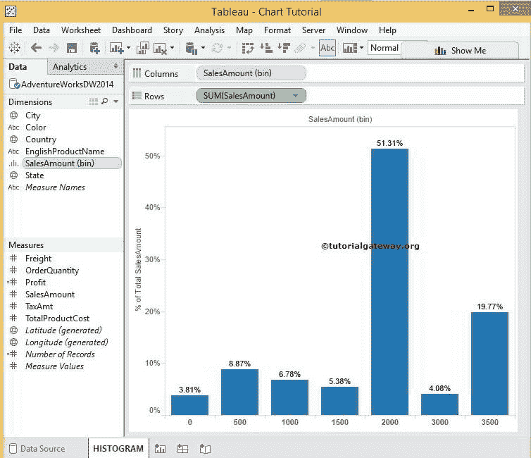
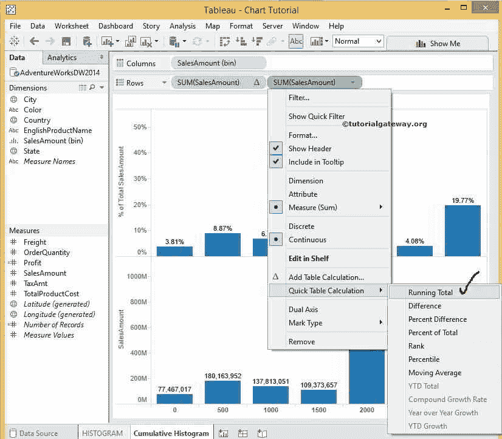

# Tableau 累积直方图

> 原文：<https://www.tutorialgateway.org/cumulative-histogram-in-tableau/>

在本文中，我们将通过一个例子向您展示如何在 Tableau 中创建累积直方图。

是 [Tableau 直方图](https://www.tutorialgateway.org/tableau-histogram/)的后续文章。所以，请阅读那篇文章来理解直方图的概念。然而，如果你想从这里开始，让我们看看[表](https://www.tutorialgateway.org/tableau/)报告里面有什么。

我们有列货架上的销售金额[栏](https://www.tutorialgateway.org/tableau-bins/)，行货架上的销售金额总和测量，以及销售金额的表计算(百分比)

## Tableau 示例中的累积直方图

要创建表累计直方图，请将销售额从度量区域拖放到行架。由于它是一个度量值，因此销售金额将合计为默认的总和。

Tableau 中的累积直方图都是关于直方图的累积频率，只不过是计算运行总数。要计算累计总额，请单击销售额度量旁边的向下箭头。接下来，选择快速表计算选项，然后选择运行总数

现在，我们的数据将按运行总数排列，但我们打算使用[双轴](https://www.tutorialgateway.org/tableau-dual-axis/)概念在一个图表中显示 Tableau 累积直方图和正常直方图。在这里，我们的正常直方图显示的是总百分比，但我们的累积直方图显示的是运行总数。把它们结合起来，

*   我们必须更改其中任何一个的表计算，或者
*   您可以添加辅助计算。

我们使用的是第二种选择，比第一种选择更明智。请点击销售额度量旁边的向下箭头，选择编辑表计算选项

选择“编辑表计算”选项后，将打开以下窗口。请在结果选项上勾选“执行二次计算”。接下来，选择二级计算类型

作为合计百分比

完成后，销售金额的累计总和图表将按累计总额排列，并显示总额的百分比。如果观察销售总额轴和销售总额累计轴，两者都是这样显示百分比的，很容易创建双轴

要创建双轴报告，请选择销售金额轴的累计总和。右键单击它会打开上下文菜单。从那里，选择双轴选项

选择双轴选项后，将显示以下屏幕截图。从下Tableau 累积直方图截图中，您可以观察到我们在横轴上有范围为 500 的销售金额箱，在纵轴上有总销售金额、总销售金额累计总和(作为双轴)

从下Tableau 累积直方图截图中，您可以观察到我们为总销售额分配了条形图，为总销售金额分配了折线图。请参考 [Tableau 双轴](https://www.tutorialgateway.org/tableau-dual-axis/)了解双轴报告概念

从上面的截图可以观察到 Tableau 累积直方图看起来很完美。但是总销售额的最大轴值是 55%，而总销售金额的累计总和是 100%。为了做到这一点，我们必须使用轴的同步概念。

请参考[表双轴](https://www.tutorialgateway.org/tableau-dual-axis/)中的表双轴同步部分，了解

销售轴值的总销售额和总累计金额的同步

从上面的截图中，我们成功创建了双轴上的 Tableau 累积直方图和法线直方图