# Tableau 折线图

> 原文：<https://www.tutorialgateway.org/tableau-line-chart/>

Tableau 折线图对于连接单个点很有价值。我们可以使用折线图来检查销售趋势、预测细节等。让我们通过一个例子来看看如何在 Tableau 中创建折线图。

对于 Tableau 折线图演示，我们使用我们在上一篇文章中构建的数据源。所以，访问【报告中的数据标签】文章，了解[表](https://www.tutorialgateway.org/tableau/)数据源。

## Tableau 折线图示例

要首先创建 Tableau 折线图，请将年份从维区域拖放到列架。接下来，将销售额从度量区域拖放到行架。由于它是一个度量值，因此销售金额将合计为默认的总和。一旦你拖动它们，下面的报告就会生成。

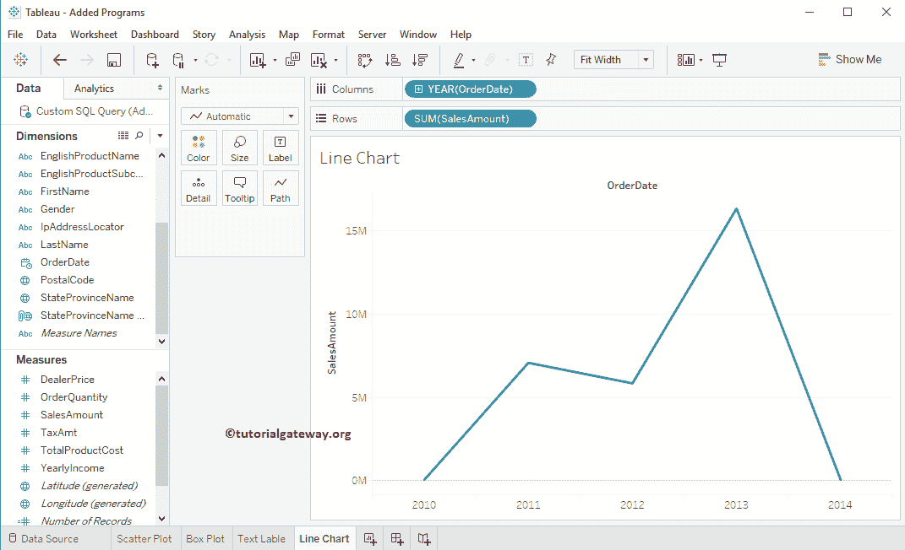

如果不是这样，请单击“演示”选项卡，并选择显示的选项。

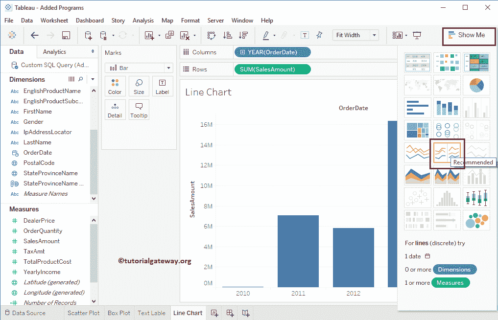

### 向 Tableau 折线图添加标签

将“销售额”从“度量区域”拖放到“标记”框中的文本字段。

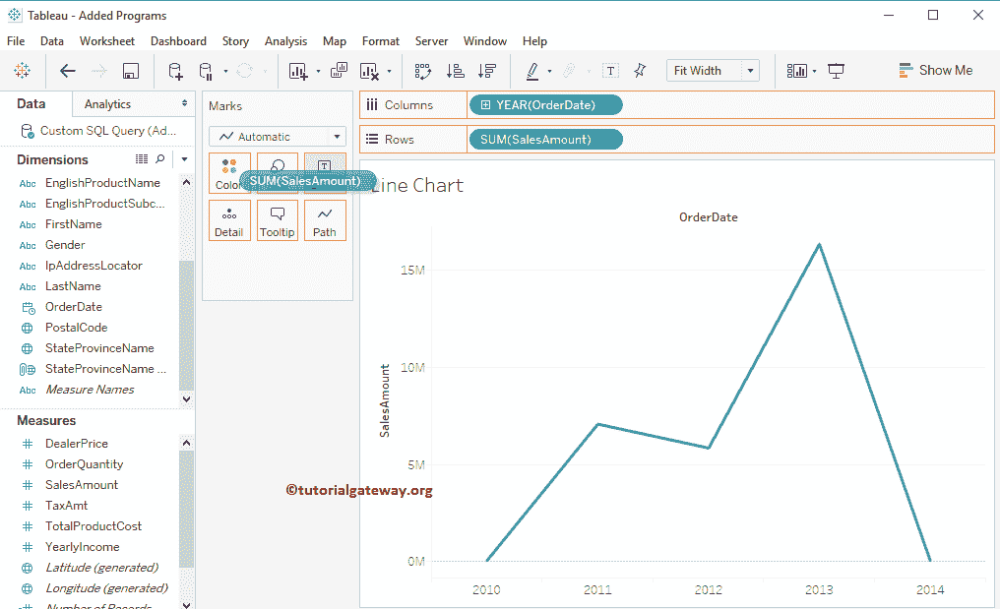

现在你可以看到每个点

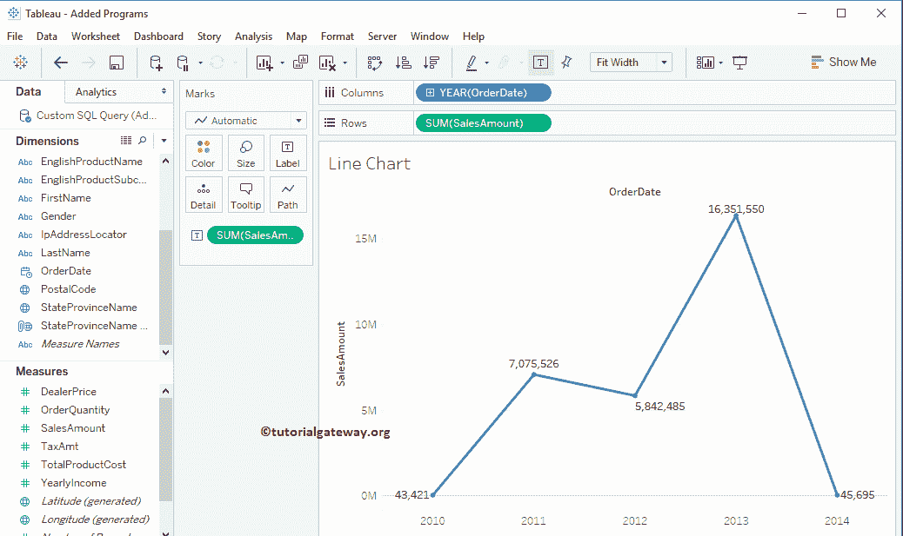

的销售金额

## 使用多种度量的 Tableau 折线图

我们也可以使用多种方法来创建它。它可以帮助我们比较销售和利润的趋势线。要首先创建 Tableau 折线图，请将产品销售总额从度量区域拖放到行架。由于它是一个度量值，产品总销售额将合计为默认总和。一旦你拖动它们，另一个将产生产品成本。

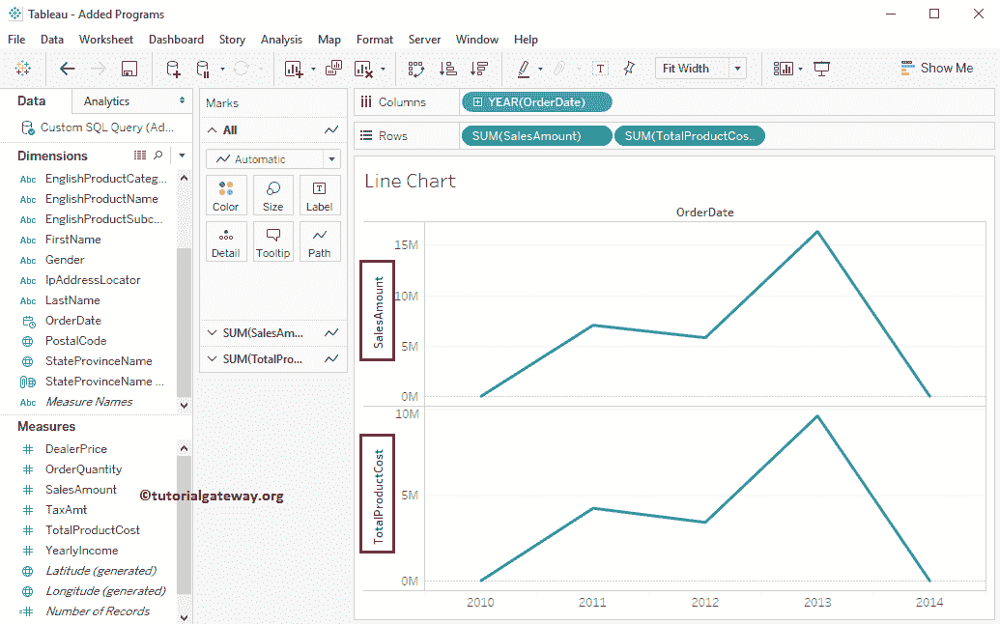

让我们将值从年更改为每年的所有月份，以查看详细的月销售额(趋势)

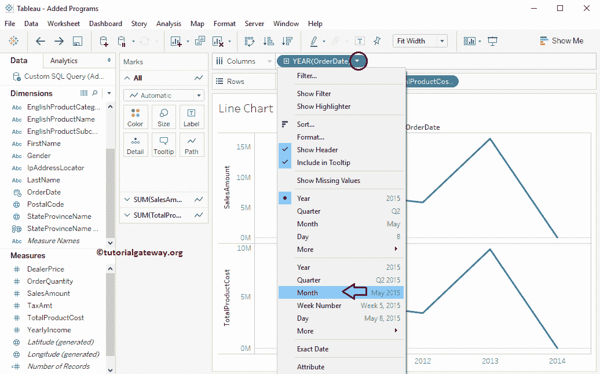

现在可以看到 2011 年、2012 年、2013 年、2014 年

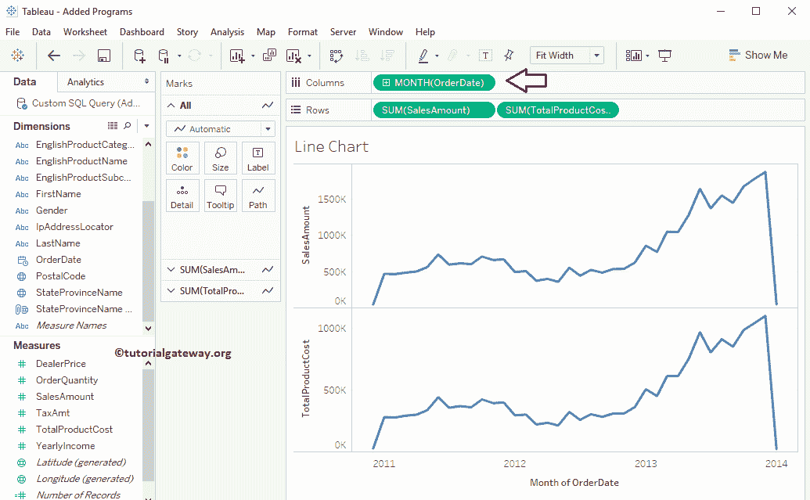

每个月的详细条

### 创建混合轴 Tableau 折线图

要创建[混合轴](https://www.tutorialgateway.org/blended-axis-in-tableau/)条，请将产品成本从行货架拖放到销售金额轴，如下图所示

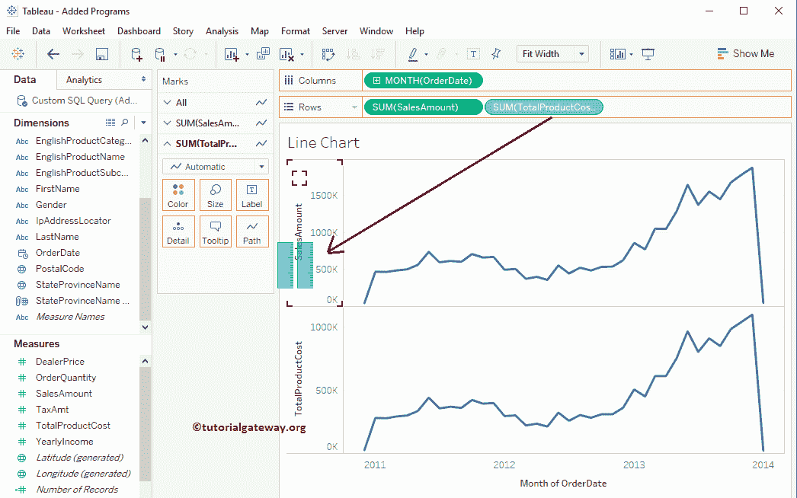

下面的截图显示了带有混合轴的折线图。

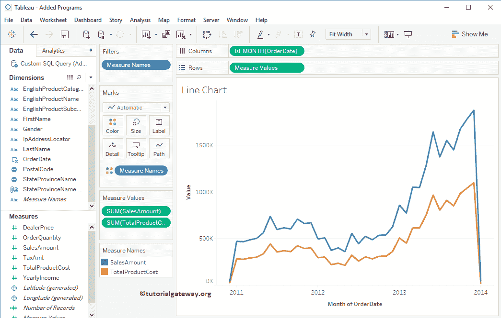

### 创建双轴 Tableau 折线图

要创建一个[表双轴](https://www.tutorialgateway.org/tableau-dual-axis/)条，请选择总产品成本轴，右键单击它将打开上下文菜单。请选择如下所示的双轴选项

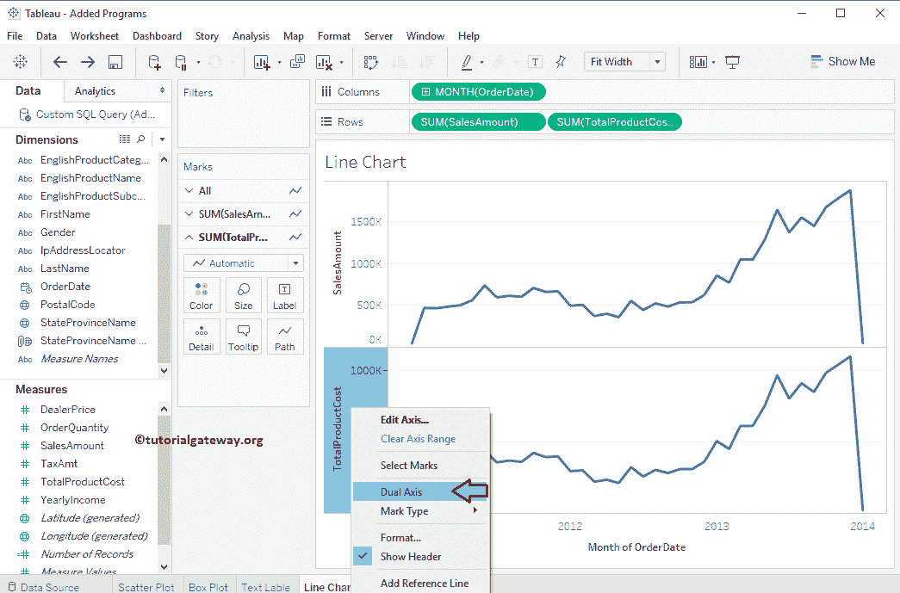

选择双轴选项后，将显示以下屏幕截图。从下图可以观察到，横轴为年，纵轴为销售金额、产品总成本(充当双轴)

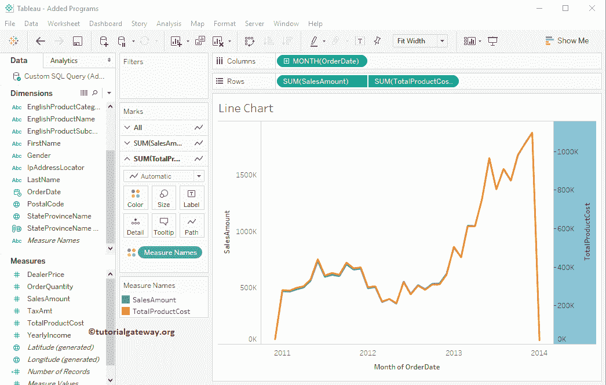

我们成功创建了双轴 Tableau 报告。但是从下面的截图中，你可以看到我们无法看到销售金额曲线。因为销售金额的最大轴值是 150 万，而产品总成本是 100 万。如果没有问题，请保持原样，否则，请选择产品总成本并选择同步轴..上下文菜单中的选项

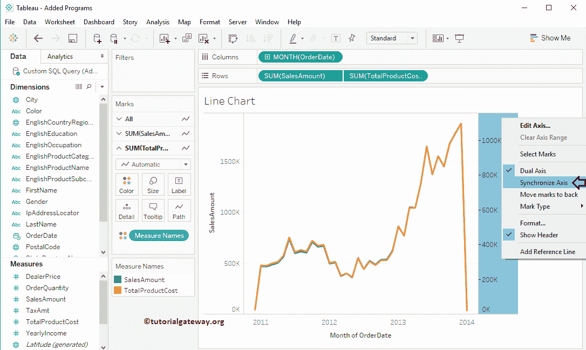

下面的截图会给你展示双轴

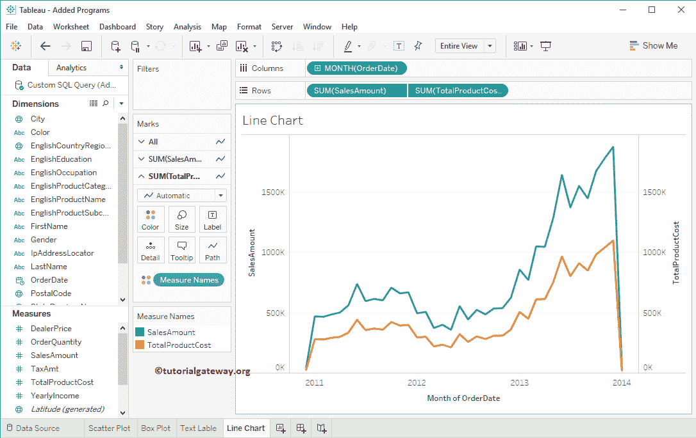

的 Tableau 折线图