# 棒棒糖图表

> 原文：<https://www.tutorialgateway.org/tableau-lollipop-chart/>

在本文中，我们将通过一个例子向您展示如何创建 Tableau 棒棒糖图表。对于这个 Tableau 棒棒糖图表演示，我们将针对 SQL Server 数据源编写自定义 SQL 查询。

请访问[连接 Tableau 到 SQL Server](https://www.tutorialgateway.org/connecting-tableau-to-sql-server/) 文章，了解 [Tableau](https://www.tutorialgateway.org/tableau/) 配置。我们将在报告中为这个 Tableau 棒棒糖图表使用的自定义 [SQL](https://www.tutorialgateway.org/sql/) 查询是:

```
SELECT ProdSubCat.EnglishProductSubcategoryName, 
       Tery.[SalesTerritoryCountry], 
       Prod.EnglishProductName, 
       Prod.Color, 
       Fact.OrderQuantity, 
       Fact.TotalProductCost, 
       Fact.SalesAmount, 
       Fact.TaxAmt, 
       Fact.OrderDate
FROM DimProductSubcategory AS ProdSubCat
   INNER JOIN
     DimProduct AS Prod 
        ON ProdSubCat.ProductSubcategoryKey = Prod.ProductSubcategoryKey 
   INNER JOIN
     FactInternetSales AS Fact 
        ON Prod.ProductKey = Fact.ProductKey 
   INNER JOIN
     [DimSalesTerritory] AS Tery 
        ON Tery.[SalesTerritoryKey] = Fact.[SalesTerritoryKey]
```

## 创建 Tableau 棒棒糖图表

在这个例子中，我们将在 Tableau 中创建一个棒棒糖图表。首先，将英文产品名称从维度区域拖放到行货架，将销售额从度量区域拖放到列货架，如下所示。默认情况下，它将生成条形图。

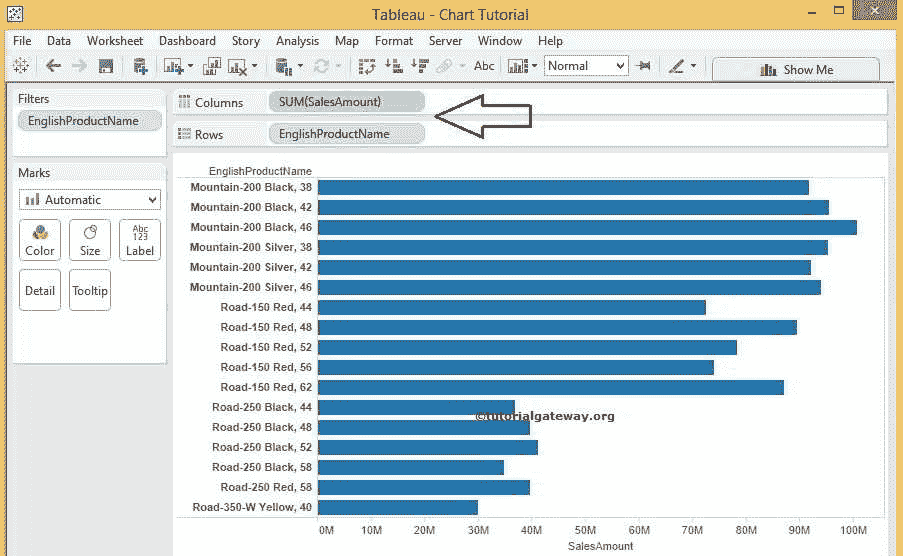

从下面的截图中，我们使用过滤器来限制[条形图](https://www.tutorialgateway.org/bar-chart-in-tableau/)返回的行数。因此，我们的报告将显示销售额大于或等于 3000 万的产品

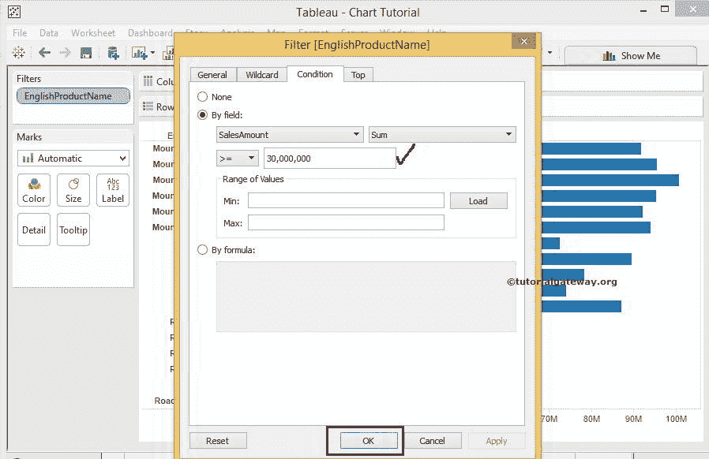

接下来，将销售金额从测量区域拖放到柱架，如下图所示

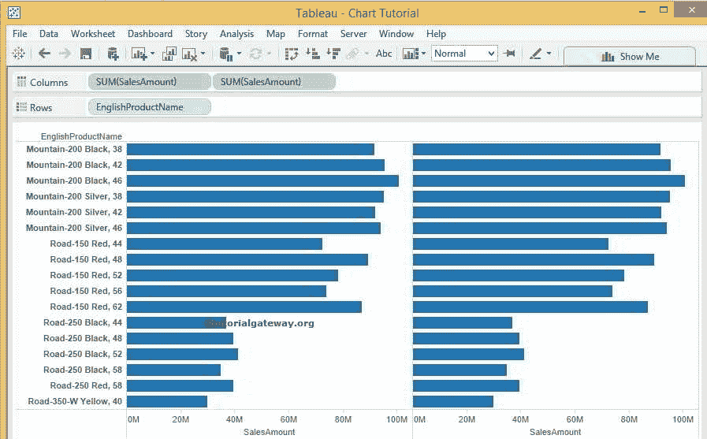

使用[双轴](https://www.tutorialgateway.org/tableau-dual-axis/)概念，请合并柱架中的措施。为此，请选择销售额，右键单击它将打开上下文菜单。请选择

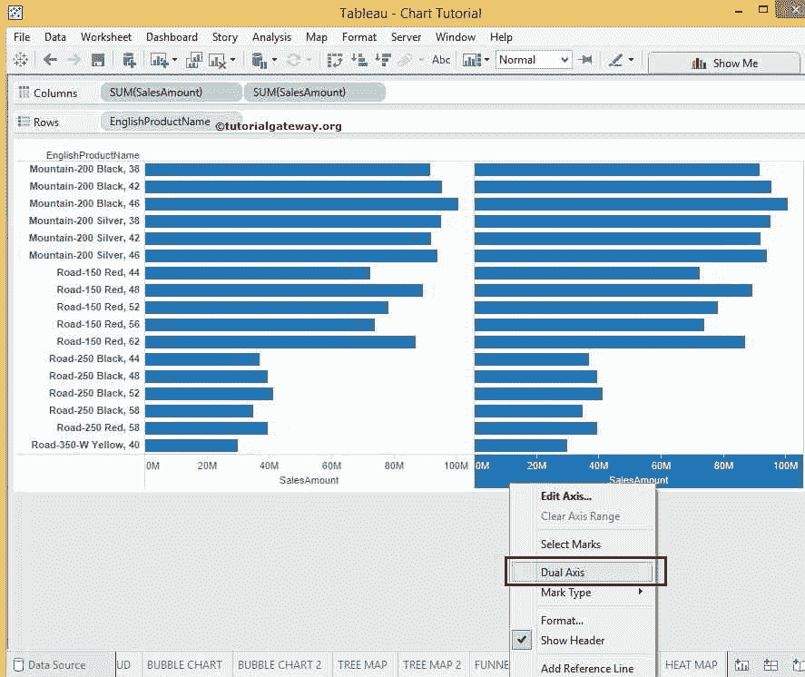

双轴选项

完成后，让我们将标记类型从自动更改为更有意义的。首先，请选择销售金额轴的标记类型选项，并选择现在的条形图

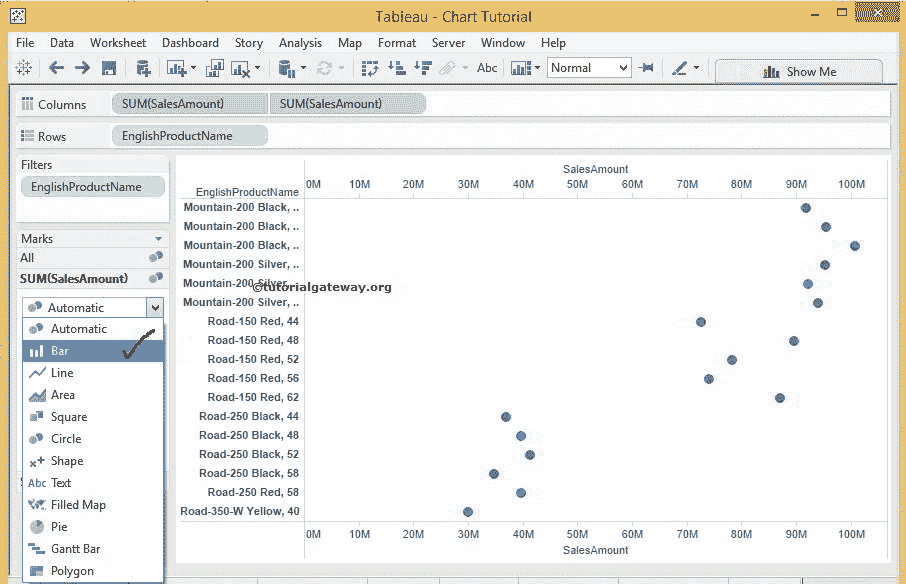

接下来，请使用标记架

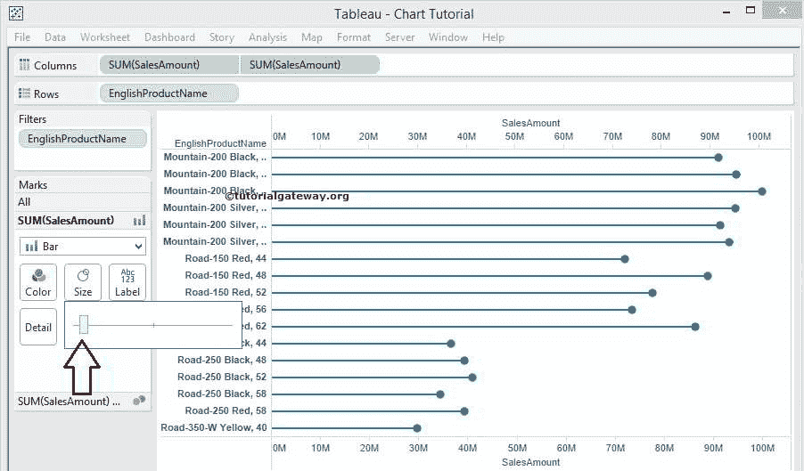

中的尺寸字段更改条形图的尺寸

然后，请使用标记架中的颜色字段更改条形图的颜色，如下所示

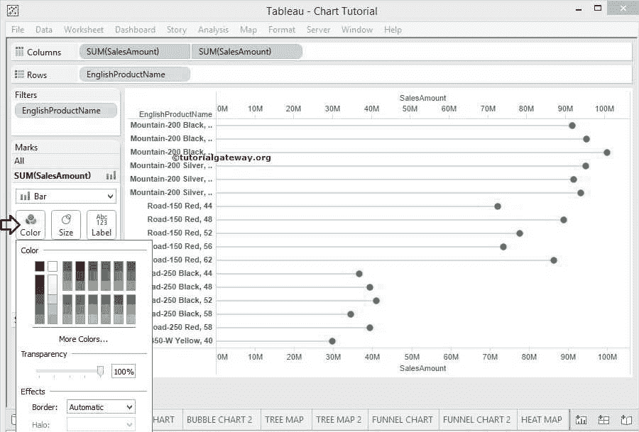

现在，我们通过使用标记架

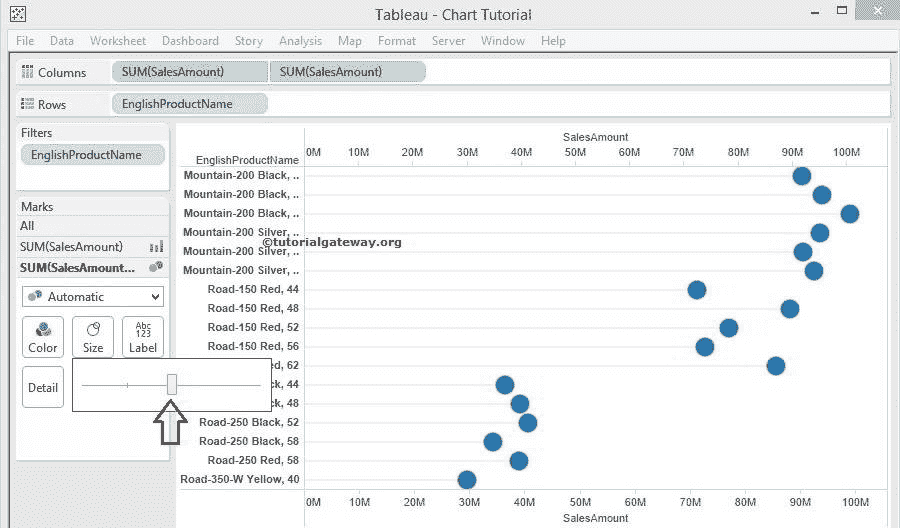

中的大小字段来增加圆圈的大小

如果您不想看到两个轴，请选择其中一个轴并取消选中显示标题选项，如下图所示

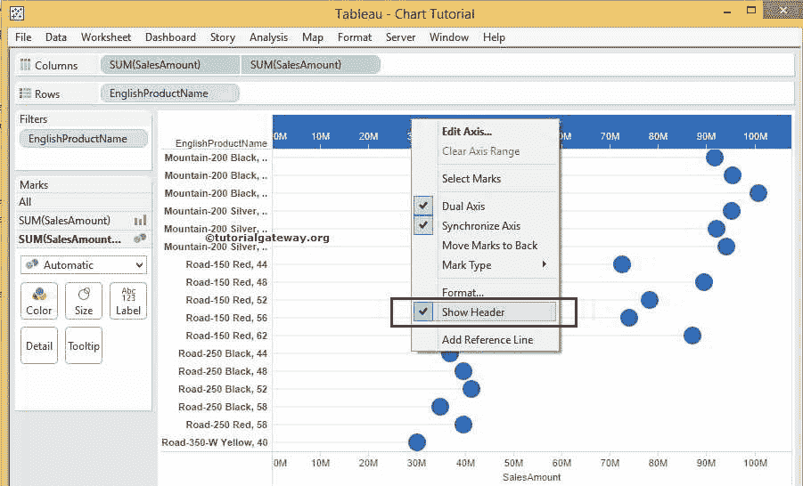

为了使我们的 Tableau 棒棒糖图表更加丰富多彩，我们在标记架

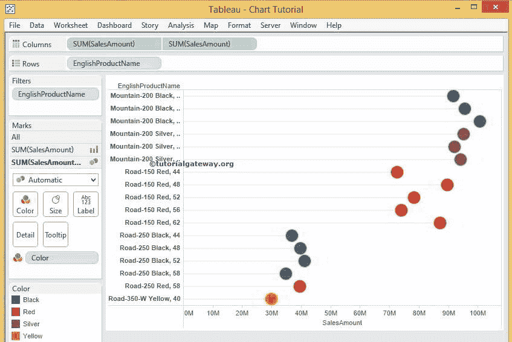

的颜色字段中添加了颜色维度

从上面的截图中，可以看到我们成功创建了棒棒糖图表

### 棒棒糖图表式

要更改 Tableau 棒棒糖图表的圆形，我们必须将标记类型从自动更改为形状，如下所示

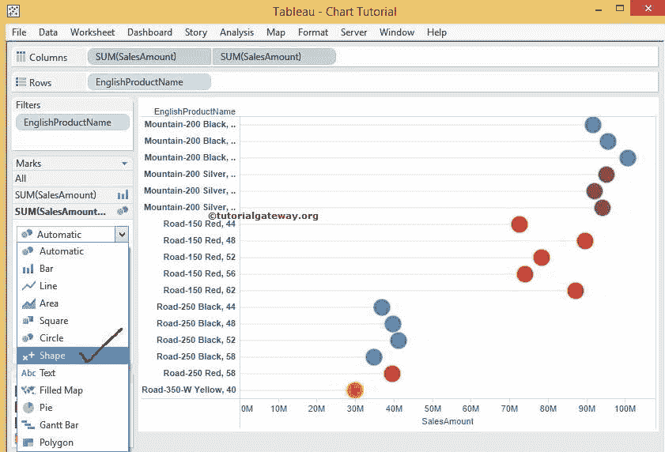

接下来，请单击形状字段，并从下拉列表中选择形状。如果您想投影更多形状，请点击更多形状选项

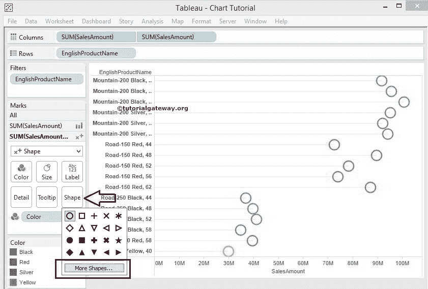

单击“更多形状”选项后，将打开一个名为“编辑形状”的新窗口。这里我们选择的是评级面板

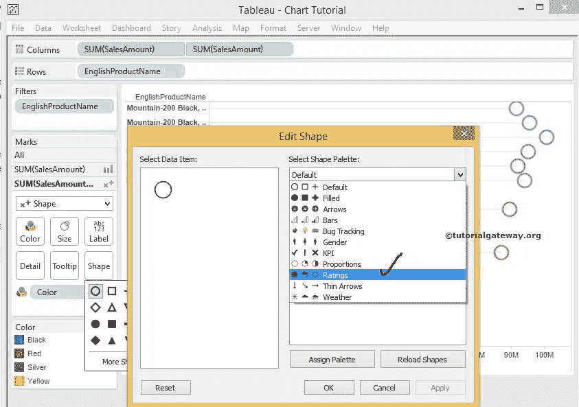

接下来，我们为本例选择了下图所示的形状

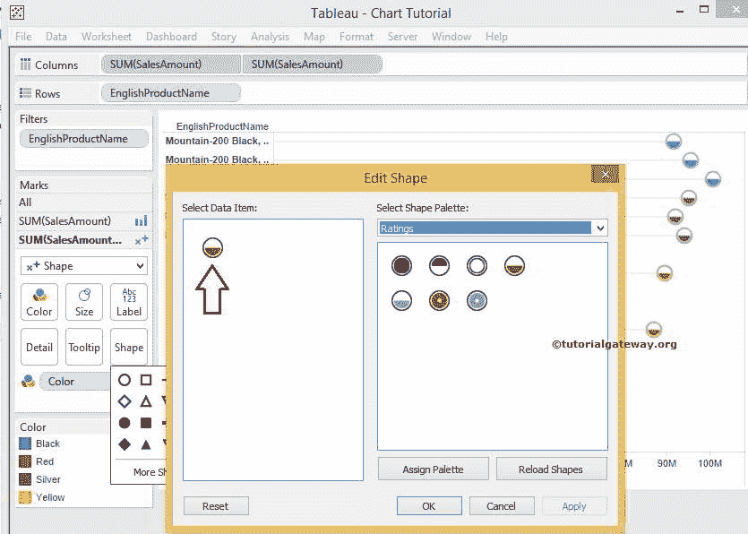

单击“确定”完成将所选形状分配给我们的 Tableau 棒棒糖图表。让我们来看看我们的最终报告预览

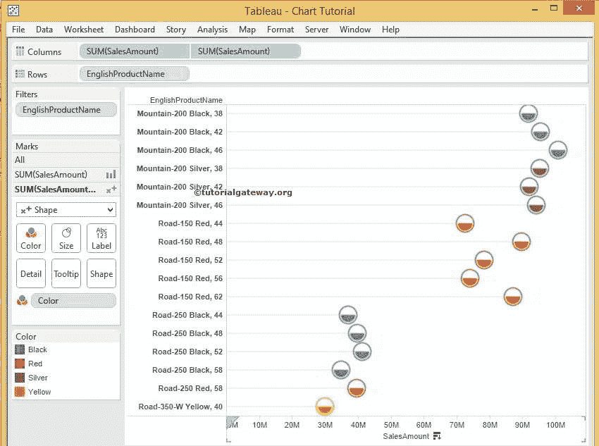