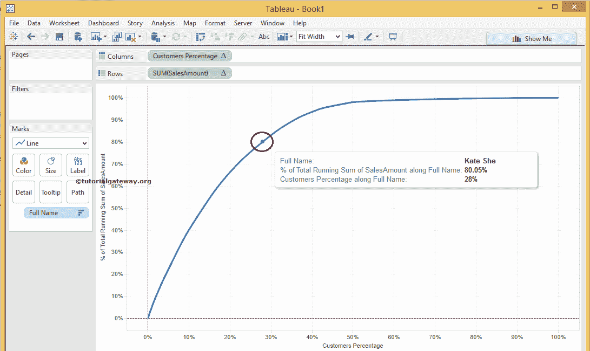

# Tableau 帕累托图

> 原文：<https://www.tutorialgateway.org/how-to-create-pareto-chart-in-tableau/>

在本文中，我们通过一个例子展示了如何在 Tableau 中创建一个 Pareto 图。Tableau 中的帕累托图便于直观地检查我们的数据是否符合帕累托规则(80–20%或 80/20 规则)。例如，

*   无论我们 80%的利润是否来自 20%的客户
*   无论我们 80%的销售额是否来自 20%的客户
*   检查我们 80%的利润是否来自 20%的产品
*   或者说，我们 80%的销售额来自 20%的产品。

在以上所有场景中，我们都可以使用 Tableau 帕累托图。

## 如何在表中创建帕累托图

在此 Tableau Pareto 图表示例中，我们将检查 80%的销售是否来自 20%的客户。首先，将客户的全名从维区域拖放到列货架，将销售额度量区域拖放到行货架。默认情况下，Tableau 将生成条形图

请访问[条形图](https://www.tutorialgateway.org/bar-chart-in-tableau/)和[连接到 SQL Server](https://www.tutorialgateway.org/connecting-tableau-to-sql-server/) 文章，了解 [Tableau](https://www.tutorialgateway.org/tableau/) 桌面配置和 [SQL](https://www.tutorialgateway.org/sql/) 查询。

请[使用](https://www.tutorialgateway.org/tableau-sort/)

[将生成的气压计按降序排序](https://www.tutorialgateway.org/tableau-sort/)

接下来，请点击“行货架销售金额测量”并选择“快速表计算”选项，然后选择“累计”来计算累计

我们已经在 Tableau 中成功创建了帕累托图。然而，我们无法核实我们 80%的销售额是否来自 20%的客户？

为了达到同样的效果，我们必须将销售金额轴从累计金额更改为总额的百分比。为此，请单击销售额度量旁边的向下箭头，并选择编辑表计算选项

选择“编辑表计算”选项后，将会打开以下“表排列图”窗口。

*   请将“沿表运行”选项从“跨表”更改为“客户全名”字段。它根据客户名称而不是表来计算累计金额。
*   请在结果选项上勾选“执行二次计算”，并将二次计算类型选择为“合计百分比”。
*   不要忘记将“从表中汇总值”选项更改为“客户全名”字段。

现在，我们可以确定 80%的销售额，但同样，我们必须与 20%的客户进行比较。为此，我们必须将轴名称从客户名称更改为百分比。为此，让我们创建一个帕雷托图表的计算字段。

右键单击表帕累托图度量区域中的空白区域。现在，请从上下文菜单中选择创建计算字段选项。

选择“创建计算字段”选项后，将打开一个新窗口来编写自定义表达式。对于这个 Tableau 帕累托图示例，我们需要客户的百分比。因此请添加以下表达式

现在，将新创建的计算字段(客户百分比)从度量区域拖放到列架。接下来，从列架中删除现有的客户名称，并将其放入标记架=

中的详细程度字段中

接下来，请将标记类型从自动更改为线型。为此，请展开下拉列表并将“自动”更改为“行”。

让我们将轴标签格式化为百分比。右键单击客户名称轴，选择格式选项

我们已经做了所有的工作来检查 80%的销售额是否来自我们 20%的客户。从下面的 Tableau 帕累托图截图中，你可以观察到这不是 20%而是 28%我们的客户

### 向Tableau 帕累托图添加参考线

如果您想将参考线添加到表帕累托图中，请遵循本节。在这个例子中，我们添加了 80%的参考线。在销售金额轴上单击鼠标右键，选择“添加参考线”选项，并将该值更改为常量 0.8(技术上是 80%)

如果您想为 20%的表帕累托图添加参考线，请右键单击客户名称轴。并选择添加参考线选项，将该值更改为常数 0.2(技术上是 20%)

我们成功地创建了我们的表帕累托图。

