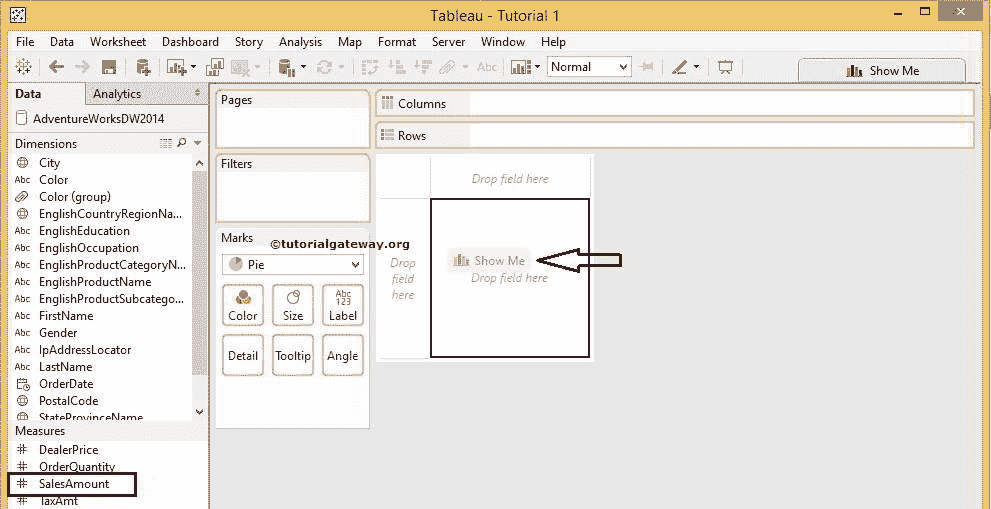

# Pie Chart(页脚图表)

> 原文：<https://www.tutorialgateway.org/pie-chart-in-tableau/>

表中的饼图有助于按地区、全国客户、按国家销售等显示销售情况。饼图在仪表板设计中也很有帮助。我们可以使用 Tableau 饼图来显示国家/地区销售情况，然后使用操作过滤器来进一步深入。

在本文中，我们通过一个例子展示了如何在 Tableau 中创建饼图。为此，我们将使用我们在上一篇文章中创建的数据源。

## 如何在 Tableau 中制作饼图？

要创建 Tableau 饼图，首先，将“销售度量”拖到“列”架子上。由于它是一个度量值，因此销售金额将合计为总和(默认值)。接下来，将英文国家/地区名称从维度区域拖放到行卡。拖动它们后，将显示以下屏幕截图。

请访问【报表中的[数据标签】](https://www.tutorialgateway.org/data-labels-in-tableau-reports/)文章，从 [SQL Server](https://www.tutorialgateway.org/sql/) 数据源

了解本报表的[表](https://www.tutorialgateway.org/tableau/)数据源

现在，我们必须使用“演示”选项将默认的[条形图](https://www.tutorialgateway.org/bar-chart-in-tableau/)更改为 Tableau 饼图。请展开[展示](https://www.tutorialgateway.org/tableau-show-me/)窗口，并从中选择按钮，如下图所示

从“演示”窗口中选择表饼图后，该图将以默认颜色

显示

请使用标记卡中的“大小”选项来展开或推卸饼图

如果你观察上面的截图，它提供了完美的结果。但是，我们无法确定法国销售和德国销售之间的区别。为了解决这些情况，我们必须显示数据标签。

### 向表饼图添加数据标签

要添加表饼图标签数据，请将数据标签值从维度或度量窗格拖放到标记卡中的标签选项。

在本例中，我们希望将销售金额显示为数据标签，因此，将销售金额从测量区域拖放到标签选项

Tableau 允许我们添加多个测量值作为数据标签。当您想要按地区比较总销售额和利润时，它会很方便。要做到这一点，使用上面的技巧放置年收入

### 设置饼图格式

任何开发人员提出的最常见的问题之一是格式化 Tableau 饼图。因为默认颜色或默认托盘可能对最终用户有吸引力，也可能没有吸引力。为此，请选择编辑颜色..选项从上下文菜单如下所示

选择编辑颜色后..选项，将打开一个名为“编辑颜色”的新窗口，为英语国家/地区名称选择调色板。出于演示目的，我们选择色盲 10

点击【应用】按钮，然后点击【确定】完成此图表的格式化

## 在表方法 2 中创建饼图

这种构建图表的方法非常简单明了。首先，请从标记卡

的下拉列表中选择饼图标记选项

接下来，将销售从测量区域拖放到归档区域。

接下来，将英文国家/地区名称从维度区域拖放到标记卡的颜色选项中。

拖动它们后，将显示以下屏幕截图。希望你明白，在 Tableau

中设计或构建一个饼图有多容易

请记住，饼图标记允许我们添加维度和度量作为数据标签。为了证明这一点，我们刚刚在标记卡

中的标签选项上放置了销售金额度量和英语国家/地区名称

在高级数据上使用 Tableau 饼图总是明智的。例如，如果您使用相同的州销售，而不是国家销售，您将得到下面的截图。如果你仔细看]，我们甚至不能确定几个地区，因为结果是一个相当小的馅饼。

