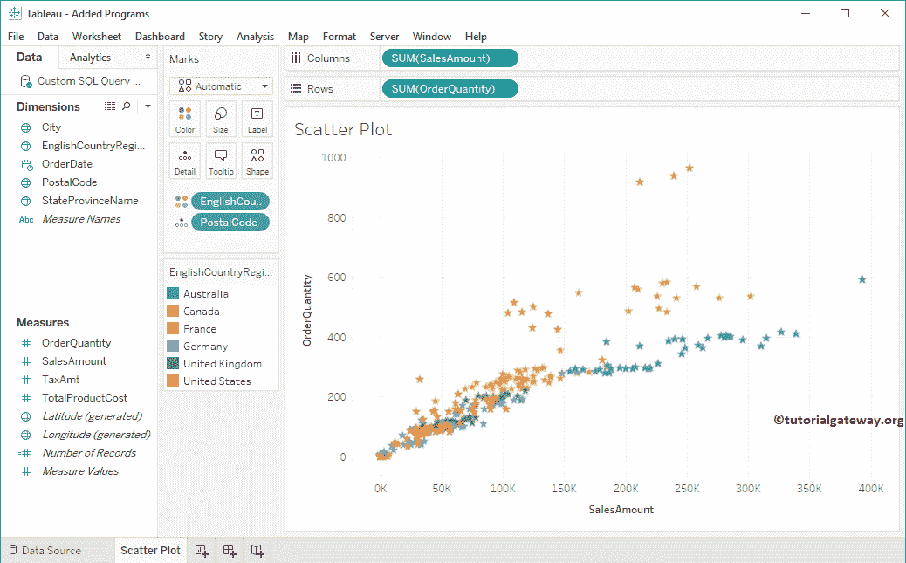

# Tableau 散点图

> 原文：<https://www.tutorialgateway.org/tableau-scatter-plot/>

Tableau 散点图对于可视化任意两组数据之间的关系非常有用。在本文中，我们将通过一个例子向您展示如何在 Tableau 中创建散点图。

## 如何在表中创建散点图

要在表中创建散点图，请将订单数量从度量区域拖放到行货架，将销售额从度量区域拖放到列货架。Tableau 智能将自动选择散点图，如果没有，请从“演示”窗口中选择以下选项。

如您所见，Tableau 散点图显示了聚合数据。但是，我们要求查看详细信息。因此，让我将邮政编码从维度区域拖放到标记卡中的详细信息字段。

## 向表中的散点图添加线性级数

散点图显示了数字变量之间的关系。此示例显示了如何将线性级数添加到散点图中。Tableau 提供了两种添加线性级数的不同方法。

第一种方法:您可以使用表中的趋势线选项来添加级数或趋势线。要访问此选项，请导航至分析选项卡。

接下来，将[表](https://www.tutorialgateway.org/tableau/)趋势线拖放到绘图区域。

第二种方法:右键单击绘图区域并选择趋势线，然后单击显示趋势线选项。

单击“显示趋势线”选项后，Tableau 散点图将显示趋势线以及置信带。

默认情况下，Tableau 会将置信带添加到趋势线，但您可以更改这些默认设置。为此，右键单击绘图区域并选择趋势线，然后单击编辑趋势线…选项。

它将打开一个名为趋势线选项的新窗口。在这里，您可以将默认的线性模型更改为对数、指数、多项式等。在这里，我们将删除信心条。为此，请取消选中“显示置信度范围”选项。

它删除了 Tableau 信心条

### 删除趋势线

右键单击设计区域将打开上下文菜单。请选择趋势线，并取消选中显示趋势线选项。

## 向散点图添加颜色

此示例显示如何向 Tableau 散点图添加颜色。为此，请将英文国家/地区名称从“标注区域”拖放到“标记”卡的“颜色”字段中。意思是每个国家都有自己的颜色

### 向表中的散点图添加多条趋势线

此示例显示了如何在散点图中添加每个区域的趋势线。右键单击绘图区域将打开上下文菜单。请选择趋势线，然后单击显示趋势线选项。

它将为每个国家创建表趋势线或参考线。

### 更改散点图的大小

让我告诉你如何改变一个点的大小。为此，请将英文国家/地区名称从标记卡中的尺寸区域拖放到尺寸字段。意思是每个国家都有自己的大小

### 更改圆环的散点图形状

要更改Tableau 散点图的默认环形，请单击标记架中的形状字段。它将打开可用形状的列表。请选择所需的形状。

我们将默认的环形改为星形

### 按类别创建

要为每个区域创建 Tableau 散点图，请将英文国家/地区名称从“维度区域”拖到“行”架。

### 向点图添加标签

它显示了如何在 Tableau 散点图中为每个点添加标签。为此，将“订单数量”从“标记”卡中的“度量区域到标签”字段拖放，以查看详细数据点的级别。

