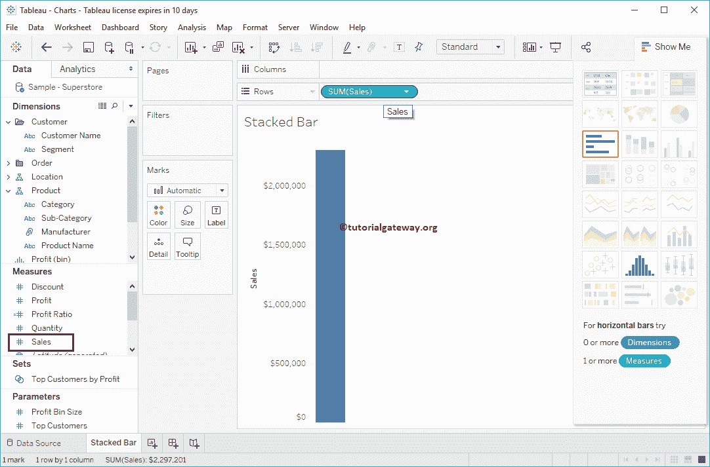
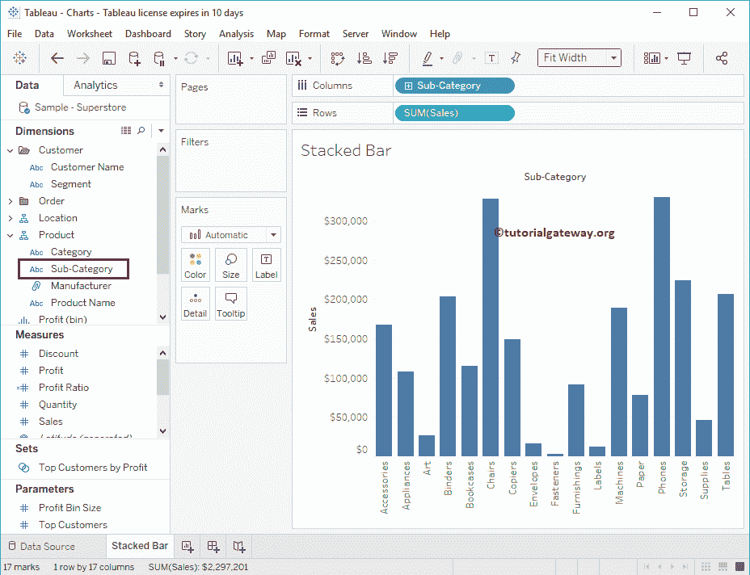
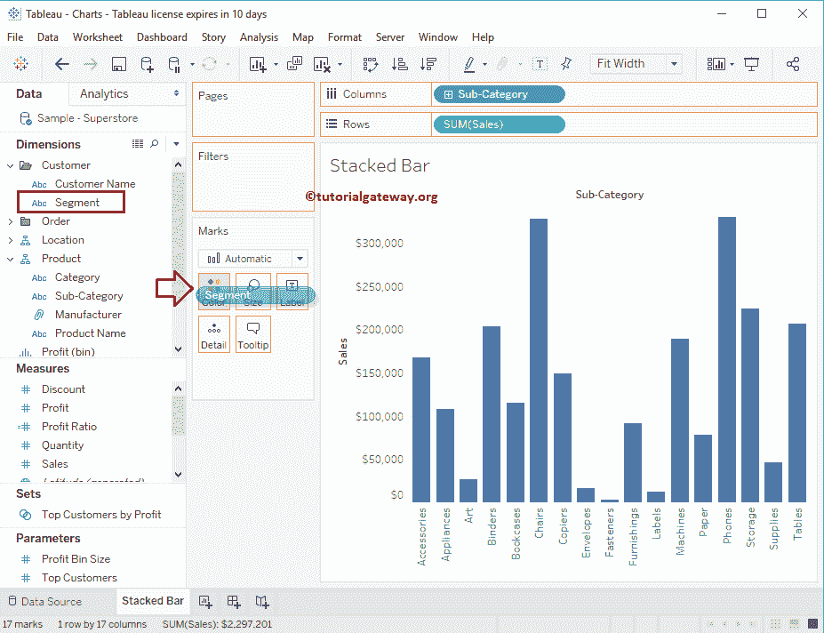
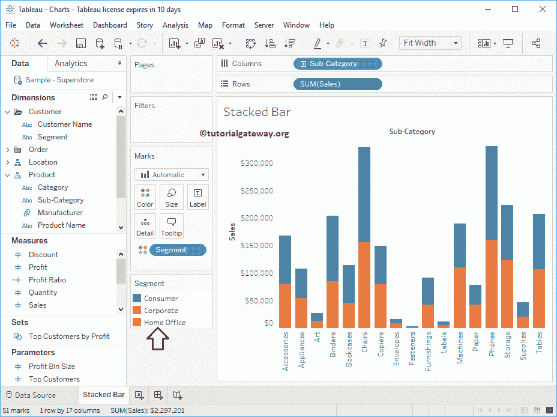
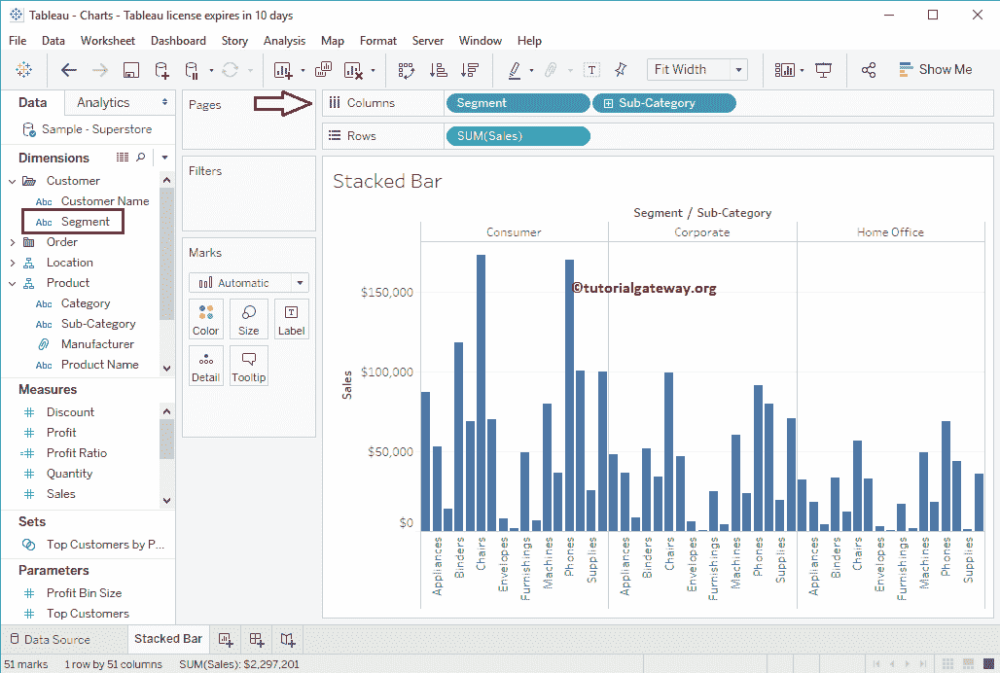
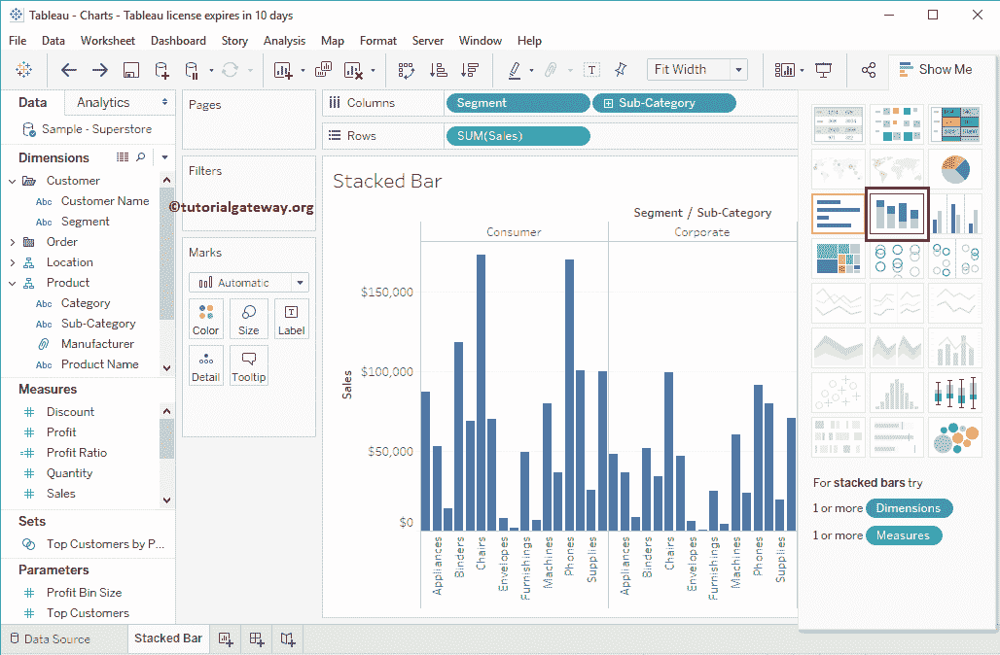
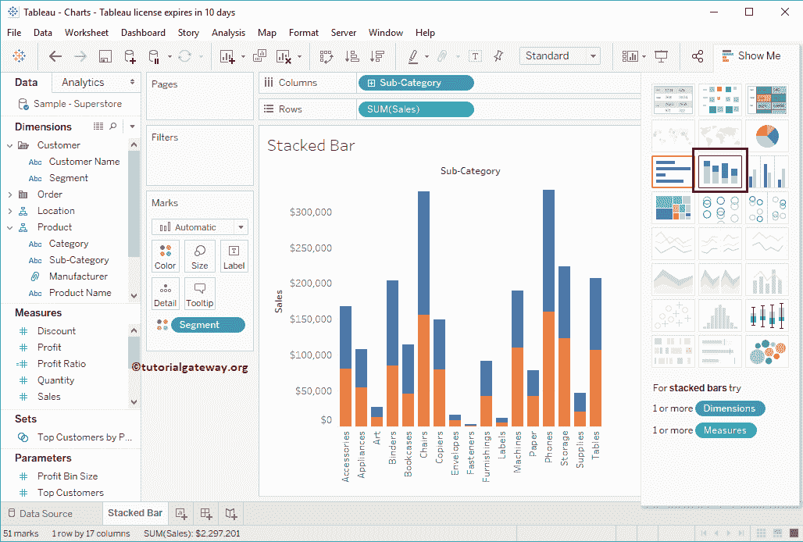
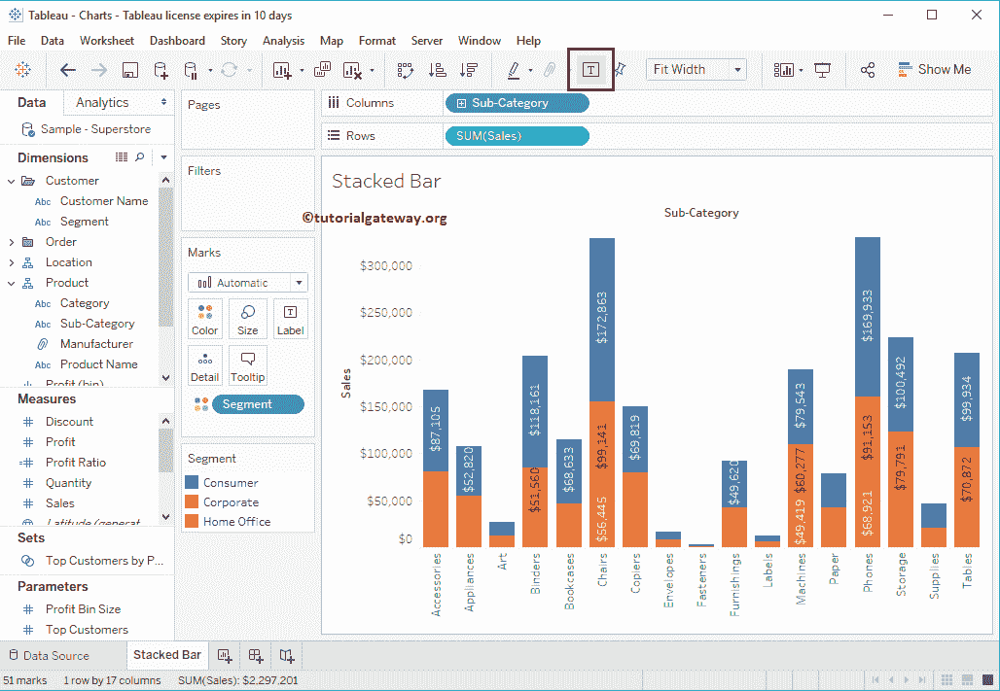
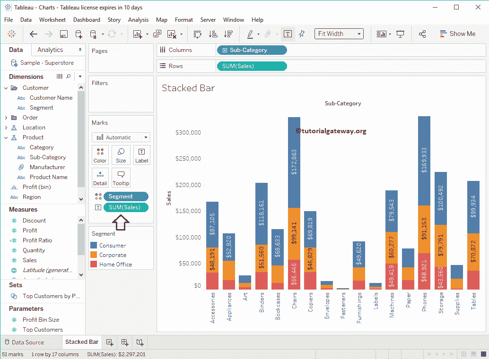
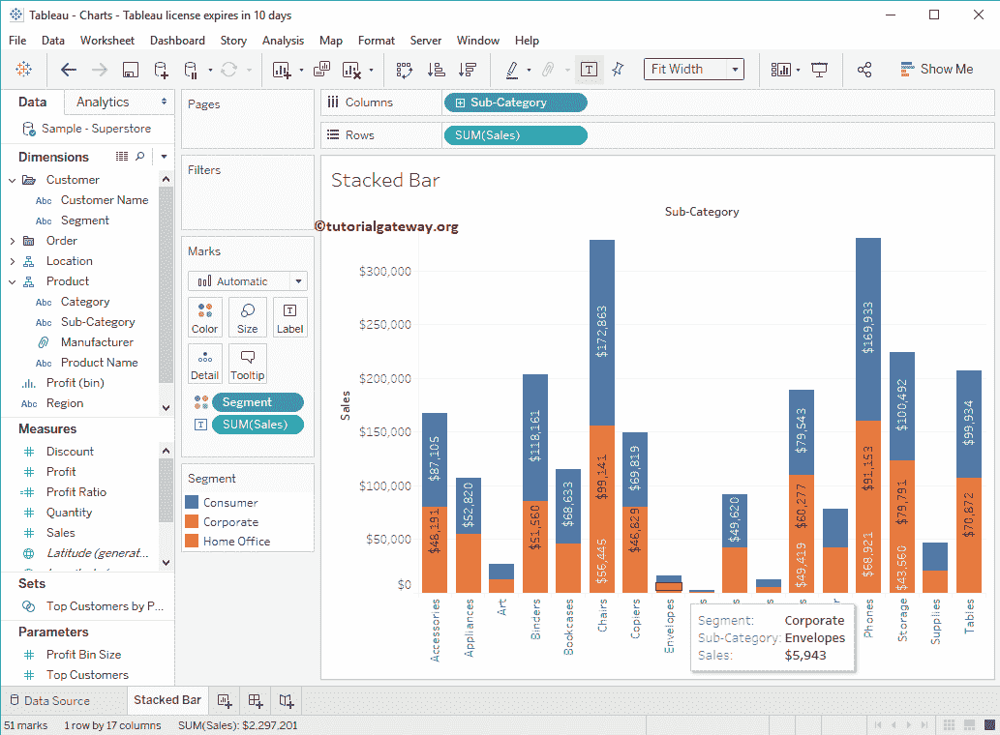

# 表格中的堆叠条形图

> 原文：<https://www.tutorialgateway.org/stacked-bar-chart-in-tableau/>

表格堆叠条形图有助于直观地比较数据。在本文中，我们将通过一个例子向您展示如何在 Tableau 中创建堆叠条形图。在本例中，我们将使用示例-超级商场数据源。

## 在表格方法 1 中创建堆叠条形图

要首先创建堆叠条形图，请将销售额从度量区域拖放到行架。由于它是一个度量值，因此销售额将合计为默认的总和。一旦拖动它们，就会生成[条形图](https://www.tutorialgateway.org/bar-chart-in-tableau/)。

接下来，将子类别从维区域拖放到列架。一旦你拖动它们，就会生成正确的[表格](https://www.tutorialgateway.org/tableau/)条形图，如下图所示。

在本例中，我们希望按段堆叠条形图。因此，我们将线段从维度区域拖动到标记卡

中的颜色架上

一旦您将“段”字段放到“颜色”货架上，您就可以看到堆叠条形图

## 在表格方法 2 中创建堆叠条形图

让我从颜色架中删除“段”字段，并将其放在“列”架中子类别的前面。

现在，我们必须使用“演示”选项将它更改为堆积条形图。请展开“演示”窗口，并从“演示”中选择下图。

从[展示](https://www.tutorialgateway.org/tableau-show-me/)窗口选择后，将显示堆积条形图，如下图截图

### 添加数据标签

要向表格堆叠条形图添加数据标签，请点击工具栏

中的显示标记标签按钮

或将数据“标签”值从“维度”或“度量”窗格拖放到标记卡中的“标签”架上。在本例中，我们希望将销售额显示为数据标签。因此，将销售从测量区域拖放到标签架

选择或突出显示任何特定的块将向您显示该特定点的信息。

