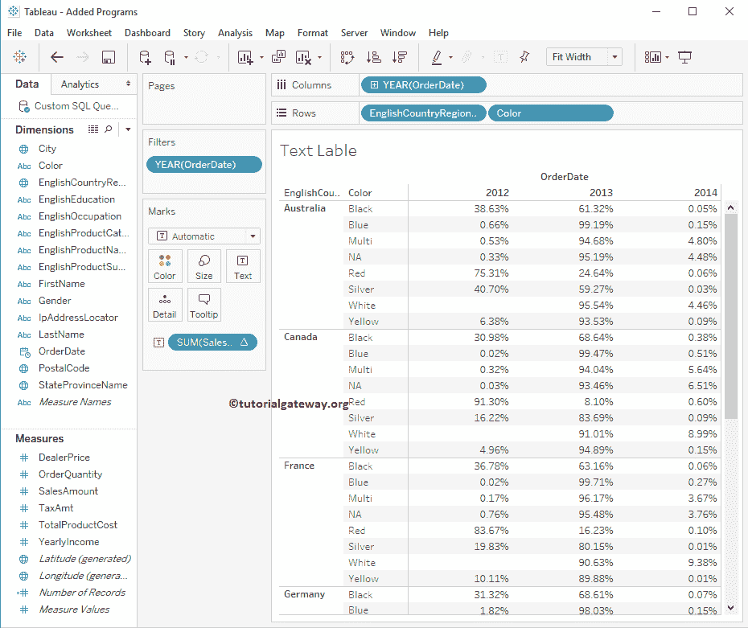

# Tableau 文本标签

> 原文：<https://www.tutorialgateway.org/tableau-text-label/>

在 Tableau 中，我们可以通过将一个维度放在列架中，将另一个维度放在行架中来创建透视数据(也称为文本标签或交叉表)。让我们通过一个例子来看看如何创建一个 Tableau 文本标签。

在这个 Tableau 文本标签演示中，我们将针对 SQL Server 数据源编写自定义 SQL 查询。建议大家参考[连接 Tableau 到 SQL Server](https://www.tutorialgateway.org/connecting-tableau-to-sql-server/) 文章，了解 [Tableau](https://www.tutorialgateway.org/tableau/) 配置。我们将在此报告中使用的自定义 [SQL](https://www.tutorialgateway.org/sql/) 查询是:

```
-- SQL Query to create a Text lable in Tableau
SELECT ProdCat.EnglishProductCategoryName, 
       ProdSubCat.EnglishProductSubcategoryName, 
       Geo.EnglishCountryRegionName, 
       Geo.StateProvinceName, 
       Geo.City, 
       Geo.PostalCode, 
       Geo.IpAddressLocator, 
       Prod.EnglishProductName, 
       Prod.Color, 
       Prod.DealerPrice, 
       Cust.FirstName, 
       Cust.LastName, 
       Cust.Gender, 
       Cust.YearlyIncome, 
       Cust.EnglishEducation, 
       Cust.EnglishOccupation, 
       Fact.OrderQuantity, 
       Fact.TotalProductCost, 
       Fact.SalesAmount, 
       Fact.TaxAmt, 
       Fact.OrderDate
FROM DimProductSubcategory AS ProdSubCat
   INNER JOIN
     DimProduct AS Prod ON ProdSubCat.ProductSubcategoryKey = Prod.ProductSubcategoryKey 
   INNER JOIN
     DimProductCategory  AS ProdCat ON ProdSubCat.ProductCategoryKey = ProdCat.ProductCategoryKey 
   INNER JOIN
     FactInternetSales AS Fact ON Prod.ProductKey = Fact.ProductKey 
   INNER JOIN
     DimCustomer AS Cust ON Fact.CustomerKey = Cust.CustomerKey
   INNER JOIN
     DimGeography AS Geo ON Cust.GeographyKey = Geo.GeographyKey
```

## 创建 Tableau 文本标签

在本例中，我们将在 Tableau 中创建一个文本标签。为此，首先将英文产品子类别名称从“维度区域”拖放到“行货架”，将“订单日期(年份)”拖放到“列货架”。


接下来，将“销售额”从“度量区域”拖放到“标记架”中的文本字段。


从上面的截图中，你可以看到我们没有太多 2010 年和 2011 年的数据。因此，我们通过在报告中选择这些列来排除这些年份，并从工具提示中选择“排除”选项。


接下来，将英文国家/地区名称从“尺寸”部分拖放到产品子类别左侧的行货架上。


上面的截图显示了完整的跨选项卡报告。让我们交换行架中尺寸的位置。


这里，我们用颜色维度


替换了行货架中的产品子类别名称

### 将表计算添加到 Tableau 文本标签

要将 Tableau 表计算添加为文本标签，请选择并右键单击销售金额度量(根据您的要求进行更改)将打开上下文菜单。在这里，您必须选择添加表计算选项，如下所示。


选择“添加表计算”选项后，将打开一个名为“表计算”的新窗口。这里我们选择“计算类型”作为“合计”和“按表计算”(交叉表)的百分比。请记住，我们将在另一篇文章中讨论[表计算](https://www.tutorialgateway.org/tableau-table-calculations/)，这里我们将只关注交叉 Tableau 报告。


下面的屏幕截图将向您显示 Tableau 交叉 Tableau 报告以及总百分比。如您所见，与 2012 年和 2014 年相比，我们在 2013 年获得了最高的销售额百分比。

