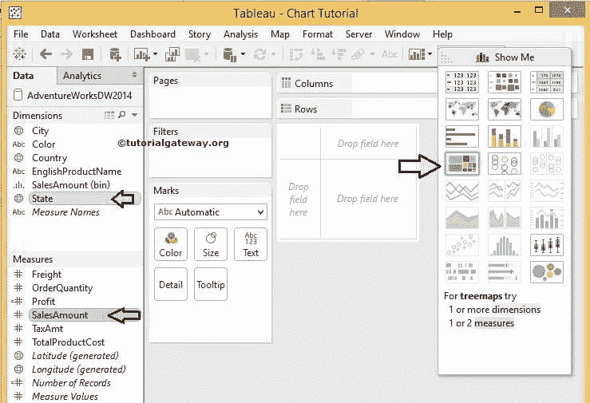

# Tableau 树形图

> 原文：<https://www.tutorialgateway.org/tableau-treemap/>

Tableau 树形图用于表示矩形框中的数据。我们可以使用任何维度成员和“度量值”框大小来确定每个矩形框。Tableau 中的树形图对于在一个小数据区域中显示最海量的数据集信息非常有用。在本文中，我们将向您展示如何创建 Tableau 树形图。此Tableau 树形图的 SQL 查询是

```
SELECT Geo.EnglishCountryRegionName, 
       Geo.StateProvinceName, 
       Geo.City, 
       Prod.EnglishProductName, 
       Prod.Color, 
       Fact.OrderQuantity, 
       Fact.TotalProductCost, 
       Fact.SalesAmount, 
       Fact.TaxAmt, 
       Fact.[Freight]
FROM DimProduct AS Prod 
   INNER JOIN FactInternetSales AS Fact 
      ON Prod.ProductKey = Fact.ProductKey 
   INNER JOIN DimSalesTerritory AS Terry 
      ON Terry.[SalesTerritoryKey] = Fact.[SalesTerritoryKey] 
   INNER JOIN DimGeography AS Geo 
      ON Geo.[SalesTerritoryKey] = Terry.[SalesTerritoryKey]
```

## 创建 Tableau 树形图的第一种方法

在本例中，我们根据销售额大小为州维创建了一个树形图。首先，将状态维度从维度区域拖放到标记卡中的文本字段。现在你可以在[表](https://www.tutorialgateway.org/tableau/)报告

T4 中看到可用的州名

接下来，将销售从测量区域拖放到标记卡中的尺寸字段。


默认情况下，Tableau 桌面显示树形图，州名为矩形文本字段，销售额总和为方框大小。正如你所看到的，加州的盒子大小比其他州大，因为销售额比其他州高。


让我们通过将计算字段利润拖到标记架


中的颜色字段来为 Tableau 树形图添加颜色

完成后，将显示以下屏幕截图。最大销售额的州名框用深绿色填写，最小销售额用浅绿色填写


让我们也将销售额和利润值添加到文本字段中。由此，您可以看到州名以及销售额和利润。为此，请将“销售和利润”从“度量”区域拖到“标记货架”


中的文本字段

### Treemap 文本格式表

要格式化表树地图数据标签，请单击标记架内的文本字段打开如下所示的窗口。现在，我们正在进行基本的格式化，点击文本


旁边的按钮

在这里，我们在< SUM(SalesAmount) >和< SUM(Profit) >旁边增加了额外的文本【销售、利润】，并将字体样式更改为


参见Tableau 树形图


中的格式化文本

## 创建 Tableau 树形图示例 2

请按住控制键，然后从相应区域选择尺寸、度量，并从“演示”窗口



中选择 Tableau Tree 地图

一旦完成，桌面将为您创建这个。

