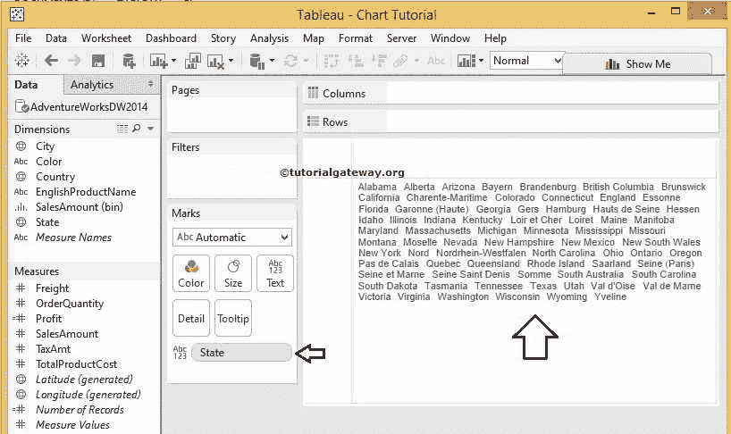
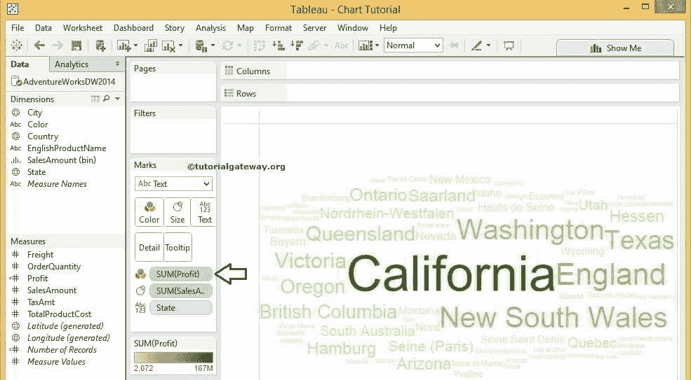

# 字云表

> 原文：<https://www.tutorialgateway.org/tableau-word-cloud/>

Tableau 单词云对于可视化文本数据非常有用。例如，如果你在推特上寻找热门标签，或者在 WordPress 或任何其他内容管理系统中寻找最常用的标签，那么你会看到一些颜色较亮的单词，一些颜色较浅，字体大小会有很大的变化。使用字云是可能的。

在本文中，我们将向您展示如何创建 Tableau 单词云。对于这个演示，我们编写了 SQL Adventures Works DW 数据源。

## 如何在 Tableau 中创建单词云？

词云通常用于描述关键字元数据标签。在本例中，我们根据销售额大小为州维度创建了一个 Tableau 单词云。

Tableau 提供了一个本地特性来创建这种图表。首先，将状态维度从维度区域拖放到标记卡中的文本字段。参见Tableau 报告

中的可用州名

接下来，将销售金额从“测量区域”字段拖放到“标记”卡中的“大小”字段。

默认情况下， [Tableau](https://www.tutorialgateway.org/tableau/) 桌面显示[树状图](https://www.tutorialgateway.org/tableau-treemap/)

要在 Tableau 中将默认树映射更改为 Word Cloud，我们必须更改标记卡上的默认自动选项。请展开下拉列表，将标记类型从自动更改为文本

更改后，表单词云将显示，其中“州名”作为文本字段，“销售额总和”作为文本大小。请注意，加利福尼亚州的字体大小比其他州大，因为销售额比其他州高。

### 向字云添加颜色

让我们为 Tableau 中的单词云添加颜色。我们可以通过将“销售额”拖到“标记”卡的“颜色”字段来实现这一点。

完成后，将显示下面的截图。最大销售额的单词或州名的频率用深绿色填充，最小销售额用浅绿色填充

我们用利润总额代替了彩色销售额。现在，Tableau Word Cloud 将显示利润最高的州名，用深绿色填充，用浅绿色填充利润最少的州名

如果我们用英文产品名称代替州名会发生什么？。如您所见，最大销售额为深绿色，最小销售额为浅绿色的英文产品名称。

