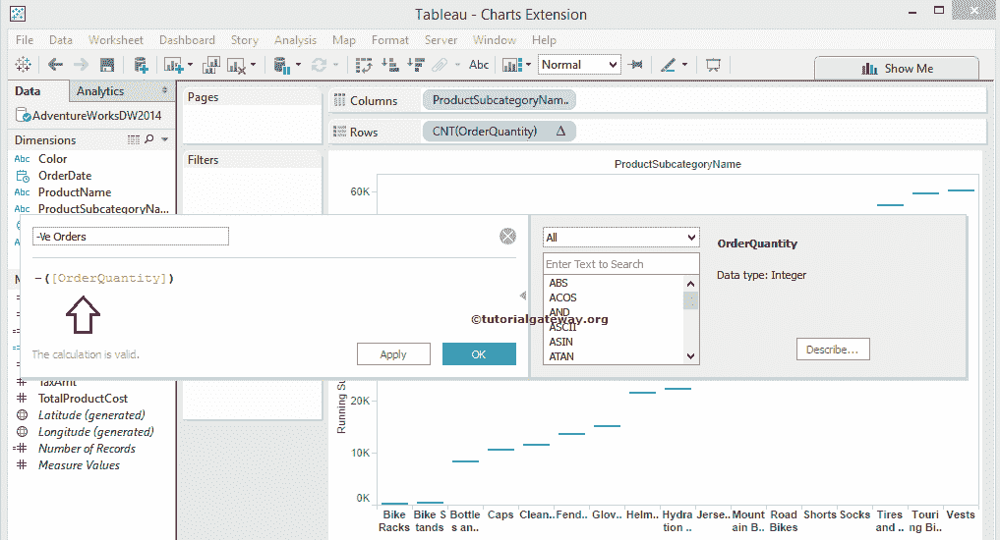
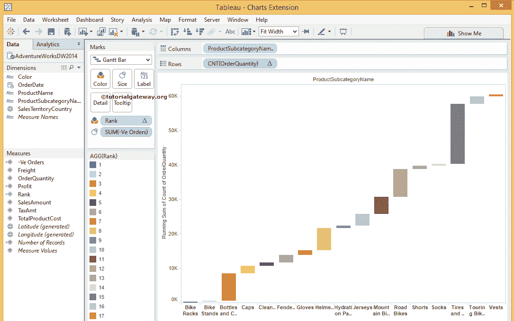

# Tableau 瀑布图

> 原文：<https://www.tutorialgateway.org/tableau-waterfall-chart/>

Tableau 瀑布图是一种数据可视化的形式，有助于可视化任何度量相对于维度的运行总和或总和。Tableau 中的瀑布图是一种甘特条形图，对于比较一段时间内的度量非常有用。

例如，使用这个 Tableau 瀑布图来可视化一个月或一年的利润(正或负)以增加或减少我们的生产(决策制定)。

## 创建 Tableau 瀑布图

要在 Tableau 中创建瀑布图，请将产品子类别名称从维区域拖放到列架，将订单数量从度量区域拖放到行架。默认情况下，tableau 生成条形图。

众所周知，Tableau 瀑布图是跑步总图的现代名称。因此，我们必须将运行总数添加到上面指定的图表中。请点击来自行货架的订单数量。接下来，选择“快速表格计算”选项，然后选择“累计”。

请访问[连接到 SQL Server](https://www.tutorialgateway.org/connecting-tableau-to-sql-server/) 、[条形图](https://www.tutorialgateway.org/bar-chart-in-tableau/)、 [SQL](https://www.tutorialgateway.org/sql/) 文章了解 [Tableau](https://www.tutorialgateway.org/tableau/) 配置。

一旦选择了选择运行总数，将显示以下屏幕截图。

现在，请将标记类型从自动更改为甘特条形图。为此，请选择订单数量的标记类型选项，并选择甘特条形图。

如你所见，我们离结果更近了。接下来，我们必须指定甘特条形图中每个单元格的大小。所以，再添加一个计算字段。从分析菜单中选择创建计算字段选项。

选择“创建计算字段”选项后，将打开一个新窗口来写入或编辑表计算。对于这个 Tableau 瀑布图的例子，我们需要负序 Quantity，所以写下下面的表达式

接下来，将新创建的计算字段(负订单)从测量区域拖放到标记卡中的大小字段。

如您所见，我们的甘特条形图单元格是根据负订单数量

来确定大小的

让我们给我们的 Tableau 瀑布图添加一些颜色。现在，我们使用我们在[凹凸图](https://www.tutorialgateway.org/tableau-bump-chart/)文章中创建的等级(计算字段)来给瀑布图着色。将等级从度量区域拖到标记卡中的颜色字段。

注意:您可以使用“利润衡量”或“关键绩效指标趋势”、“目标”来可视化它们。

默认情况下，等级字段将使用表格范围对[和](https://www.tutorialgateway.org/tableau-rank-calculation-basic/)进行等级划分。因此，请将表格计算从“表格交叉”更改为“订单数量计数和按降序排序”

我们成功创建了瀑布图

我们忘了加上总计来完成瀑布。要添加总计，请转到分析菜单。接下来，请选择总计选项，然后选择显示行总计选项。

Tableau 瀑布图的最终预览。

