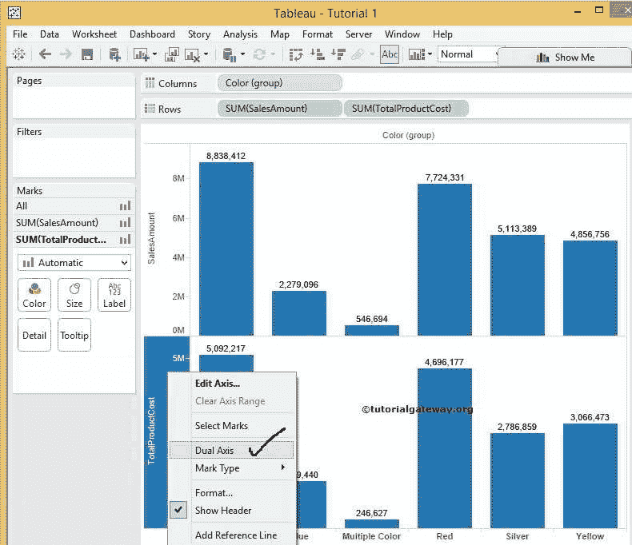
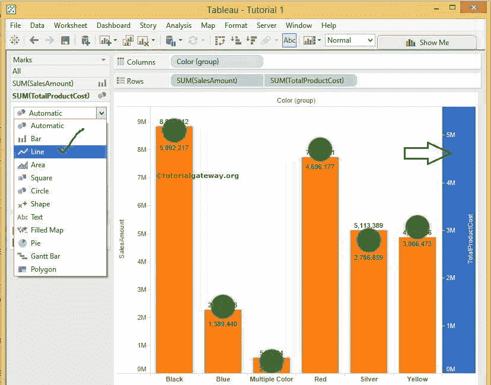

# Tableau 双轴

> 原文：<https://www.tutorialgateway.org/tableau-dual-axis/>

Tableau 双轴有助于将销售额数据与产品总成本进行比较，或者将销售额与利润进行比较等。在本文中，我们将通过一个例子向您展示如何在 Tableau 中创建双轴图表。

对于这个 Tableau 双轴报告，我们将使用我们在上一篇文章中创建的数据源。因此，请访问【报告中的数据标签】文章，了解[表](https://www.tutorialgateway.org/tableau/)数据源。

## Tableau 双轴图表示例

要创建 Tableau 双轴图表，首先，将颜色组(在 [Tableau 分组](https://www.tutorialgateway.org/tableau-grouping/)文章中创建)从维度区域拖放到列架。

接下来，将销售额从度量区域拖放到行架。因为它是一个度量值，所以销售金额将合计为默认的总和。拖动它们后，将生成以下图 Tableau 报告。

在此 Tableau 双轴组合图表示例中，我们要将销售额与产品总成本进行比较。因此，再拖放一个度量值，即从度量区域到行架的总产品成本。由于它是一个度量值，总成本将合计为默认的总和。

请点击 Tableau 工具栏

中的 Abc 标签按钮，为图表分配数据标签或数据点

要创建 Tableau 双轴图表，请在辅助轴中选择产品总成本。接下来，右键单击它将打开上下文菜单。请选择双轴选项。

选择 Tableau 双轴选项后，将显示以下屏幕截图。从下面的截图中你可以观察到，我们在水平方向有颜色组，在垂直方向有销售金额、产品总成本(充当双轴)

让我们将标记类型从自动更改为更有意义。我们可以通过两种方式做到这一点:

首先，选择销售金额轴，右键单击它将打开上下文菜单。请选择标记类型选项，并选择现在的条形图

一旦选择条形图，它将显示销售金额数据

第二种方法，选择总生产成本，然后从标记卡

中选择线类型

我们成功地创建了条形图和折线图的双轴表。但是，您可以观察到，对于红色，产品总成本值 4，696，177 大于销售金额值 7，724，331。因为销售金额的最大值是 900 万，而产品总成本是 500 万。

### Tableau 双轴同步

如果你没有问题，就按原样离开。否则，请选择产品总成本并选择编辑轴..同步选项。

选择该选项后，将打开一个新窗口来同步 Tableau 中的 Axis。因为我们的销售金额和产品总成本的合计值是相同的。我们只需勾选同步双轴选项

现在，我们得到了表轴同步的最终结果

### 同步 Tableau 双轴图表

在这个例子中，我们用订单数量的计数代替了产品总成本的总和。

由于我们的销售金额和订单数量的合计值不同，同步双轴选项会变灰，如下所示。在这些情况下，我们必须手动进行

要同步 Tableau 双轴图表，首先，选择具有最大值的轴。这里是销售额 900 万。编辑选项并选择固定选项。接下来，请从结束文本框

中复制结束值

接下来，将订单数量选项更改为固定。然后用销售金额结束值(之前复制的结束值)替换结束值。

从下面的截图中，您可以观察到销售和订单数量计数的值是相同的。在这里，订单数量的值是最少显示的。但是你可以看到底部的蓝线。希望你理解 Tableau 双轴的创建并同步双轴值。

