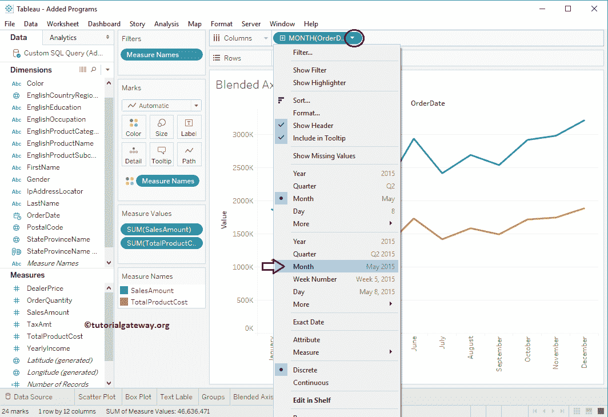

# Tableau 混合轴

> 原文：<https://www.tutorialgateway.org/blended-axis-in-tableau/>

表中的混合轴有利于将两个测量值与同一轴进行比较。在本文中，我们将通过一个例子向您展示如何在 Tableau 中创建混合轴。

对于这个混合轴演示，我们将使用我们在上一篇文章中创建的数据源。因此，请访问 Tableau 报告文章中的[数据标签，了解](https://www.tutorialgateway.org/data-labels-in-tableau-reports/)[表](https://www.tutorialgateway.org/tableau/)数据源。

## 表示例中的混合轴

若要首先在表中显示混合轴，请将年份从维区域拖放到列架。接下来，将销售额从度量区域拖放到行架。因为它是一个度量值，所以销售金额将合计为默认的总和。拖动它们后，将生成以下图 Tableau 报告。

### 在 Tableau 中创建混合轴的第一种方法

在本例中，我们希望将销售金额与产品总成本进行比较，因此，再拖放一个度量值，即从度量部分到行架的产品总成本。由于它是一个度量值，产品成本将合计为默认总和。

要在 Tableau 报告中创建混合轴，请将产品总成本从行货架拖放到销售金额轴，如下所示

下面的截图将显示混合轴后的报告。

### 创建混合轴的第二种方法

您可以直接将度量项目从度量区域拖到轴上，如下所示。

以下截图将向您展示 tableau 混合轴报告

让我们将年值更改为月以获得详细报告

现在你可以看到每个月

的混合轴报告

让我们将值从月份名称更改为每年出现的所有月份

现在可以看到 2011 年、2012 年、2013 年、2014 年

各月的详细混成轴报告

## 将分析添加到Tableau 混合轴报告

要添加分析，请导航至分析选项卡，并双击模型部分下的预测选项。

双击预测选项后，预测将添加到图表中。我希望您理解混合轴的创建和添加预测。

