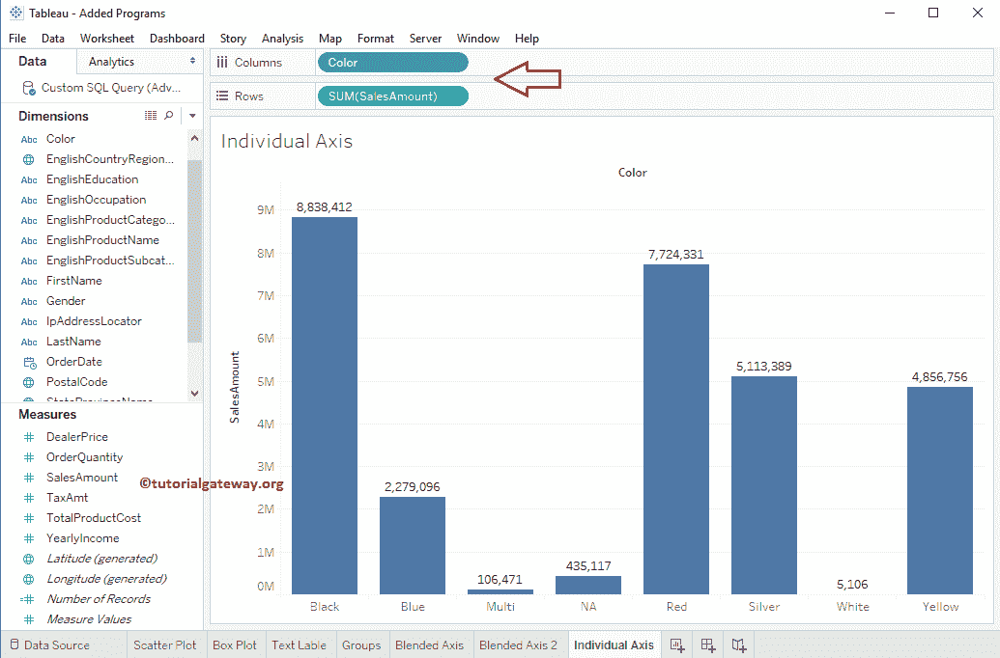
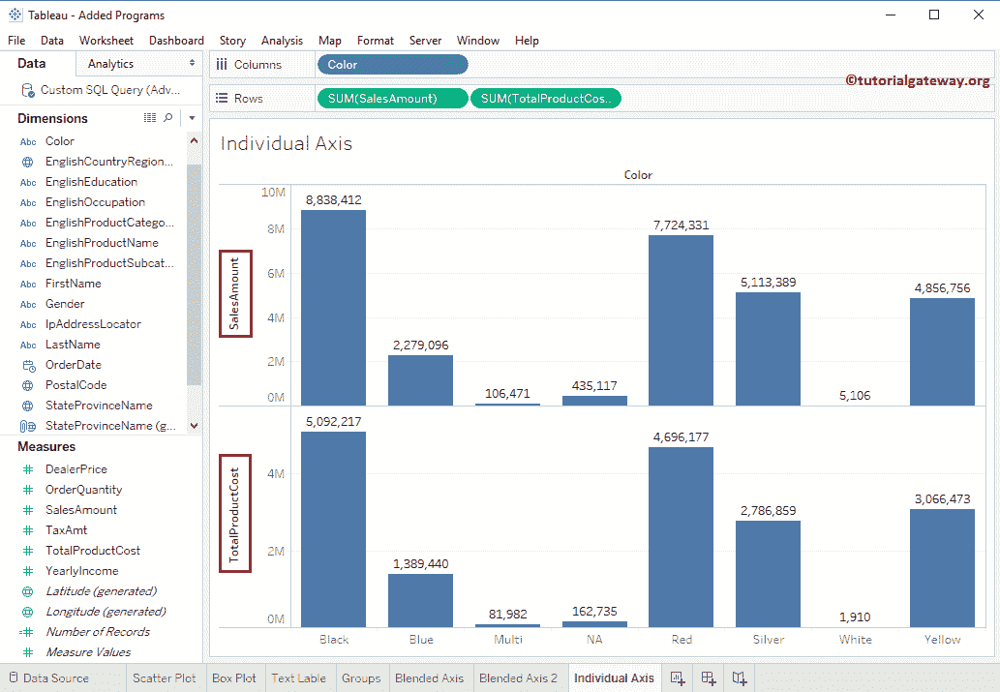
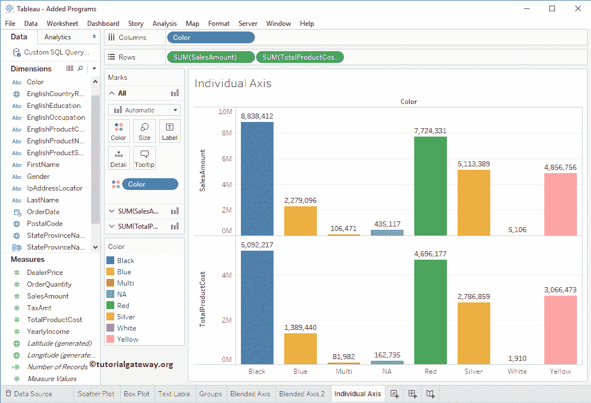
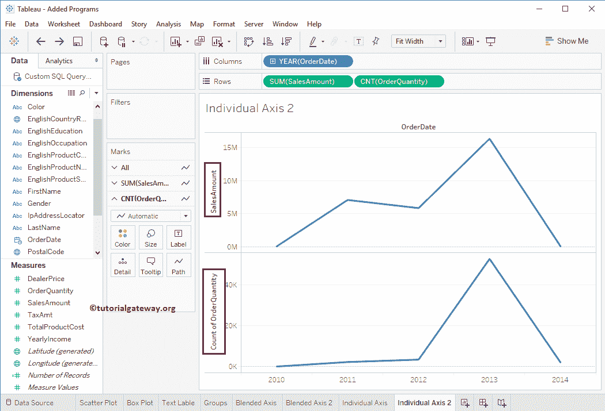
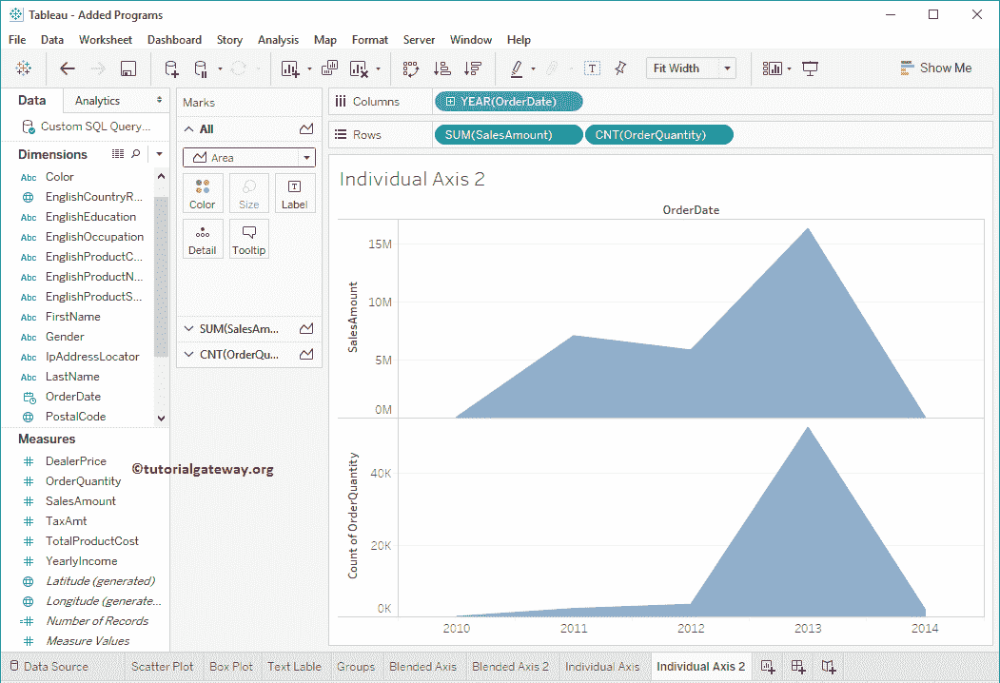

# 表中的个别轴

> 原文：<https://www.tutorialgateway.org/individual-axis-in-tableau/>

表中的单个轴是通过在行或列架中添加度量值获得的。在本文中，我们将通过一个例子向您展示如何在 Tableau 中创建一个单独的轴。

对于这个单轴演示，我们将使用我们在上一篇文章中创建的数据源。因此，请访问Tableau 报告文章中的[数据标签，了解](https://www.tutorialgateway.org/data-labels-in-tableau-reports/)[表](https://www.tutorialgateway.org/tableau/)数据源。

## 单个轴示例

要首先在表中显示单个轴，请将颜色从维度区域拖放到列架。接下来，将销售额从度量区域拖放到行架。由于它是一个度量值，因此销售金额将汇总为默认的总和。拖动它们后，将生成以下图Tableau 报告。

接下来，再拖放一个度量值，即从度量区域到行架的产品总成本。因为它是一个度量值，所以总产品成本将汇总为默认总和。从下面的截图中，您可以看到 Tableau 为每个度量创建了一个单独的轴。

我们刚刚通过将颜色维度添加到“标记”货架中的“颜色”字段中，将颜色添加到条形图中。

### 表折线图中的单个轴

在本例中，我们将“颜色”值替换为“订单日期”维度(年份)，并将“产品总成本”替换为“订单数量”。这将产生折线图。如果没有，将标记从自动更改为线型。

从下面的截图中你可以观察到我们已经将标记类型从折线图更改为区域图

